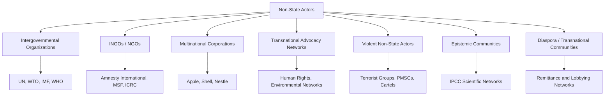

## Non-State Actors in Global Governance

### Definition and Conceptual Scope

Non-state actors (NSAs) are entities that participate in and influence international relations and global governance processes without possessing the formal sovereign authority of a nation-state. Their proliferation and growing influence since the mid-twentieth century — accelerated by globalization, communications technology, and the post-Cold War expansion of transnational governance — constitute a central challenge to the classical state-centric ("billiard ball") model of international relations associated with realist theory.

**Key Points**

- The rise of non-state actors is central to pluralist and liberal institutionalist critiques of realism, which treat states as the sole meaningful units of analysis
- NSAs do not typically possess formal legal sovereignty or a monopoly on the legitimate use of force, but they can exercise significant structural, normative, and material power
- Global governance is increasingly conceptualized as a multi-level, multi-actor system rather than a strictly interstate one

### Typology of Non-State Actors

#### Intergovernmental Organizations (IGOs)

Composed of member states but operating with degrees of independent agency, bureaucratic autonomy, and specialized expertise (e.g., the United Nations, World Bank, IMF, WTO, World Health Organization). While technically created *by* states, principal-agent theory recognizes that IGO secretariats and bureaucracies can develop preferences and exercise influence independent of their state principals.

#### International Non-Governmental Organizations (INGOs / NGOs)

Private, voluntary organizations pursuing public-interest or advocacy goals across borders, without profit motive or state authority. Examples include Amnesty International, Human Rights Watch, Médecins Sans Frontières, Oxfam, and the International Committee of the Red Cross (which holds a unique hybrid legal status under international humanitarian law).

#### Multinational Corporations (MNCs) / Transnational Corporations (TNCs)

Profit-seeking firms operating across multiple jurisdictions, wielding significant economic leverage, capable of influencing state regulatory policy through investment decisions, lobbying, and in some cases exceeding the GDP of smaller states in market capitalization.

#### Transnational Advocacy Networks (TANs)

Loose networks of activists, NGOs, and individuals connected by shared values and dense information exchanges, mobilizing around specific normative causes (human rights, environmental protection, anti-landmine campaigns), as theorized by Keck and Sikkink's *Activists Beyond Borders* (1998).

#### Violent Non-State Actors (VNSAs)

Armed groups operating outside formal state military structures, including terrorist organizations, insurgent groups, private military and security companies, and organized criminal networks (e.g., transnational drug cartels). These actors directly challenge the state's Weberian monopoly on legitimate violence.

#### Diaspora and Transnational Ethnic/Religious Communities

Cross-border communities that maintain political, financial, and cultural ties to a homeland and can influence both home- and host-country foreign policy (e.g., diaspora remittances, lobbying for kin-state interests).

#### Epistemic Communities

Networks of professionals and experts sharing technical knowledge and normative commitments who shape policy through the authority of specialized expertise (e.g., climate scientists informing the IPCC process), as conceptualized by Peter Haas (1992).

#### Global Civil Society and Social Movements

Broader, less formally structured mobilizations of citizens across borders around shared causes (e.g., the global anti-globalization movement, Fridays for Future climate protests).

### Diagram: Typology of Non-State Actors in Global Governance

### Theoretical Frameworks for Understanding NSA Influence

#### Pluralism / Liberal Institutionalism

Pluralist scholars argue that the state is not a unitary rational actor but rather one node among many competing for influence over policy outcomes, and that transnational relations (Keohane and Nye's concept, 1971) — interactions crossing state boundaries that involve at least one non-state actor — fundamentally reshape the international system beyond what state-centric models predict.

#### Transnationalism and Complex Interdependence

Keohane and Nye's *Power and Interdependence* (1977) framework identifies conditions under which NSAs gain influence: multiple channels connecting societies (not just formal diplomacy), the absence of a clear hierarchy among issues (military security no longer automatically dominates the agenda), and the diminished utility of military force in managing certain relationships — all of which expand political space for non-state actors.

#### Constructivism and Norm Diffusion

Constructivist scholars (e.g., Finnemore and Sikkink's "norm life cycle" model, 1998) emphasize that NSAs, particularly advocacy networks and epistemic communities, function as **norm entrepreneurs**, actively constructing and diffusing new international norms (e.g., the norm against landmine use, the Responsibility to Protect doctrine) through persuasion, framing, and network mobilization rather than material coercion.

#### Global Governance / Multi-Stakeholder Theory

This perspective treats governance as occurring through networked, multi-level arrangements involving states, IGOs, firms, and civil society jointly, rather than through a strict hierarchy topped by sovereign states — reflected in governance innovations such as multi-stakeholder initiatives (e.g., the Extractive Industries Transparency Initiative, the Kimberley Process, ICANN's multi-stakeholder internet governance model).

### Mechanisms of Influence

**Key Points**

- **Agenda-setting**: framing issues to attract international attention (e.g., environmental NGOs elevating climate change on the UN agenda)
- **Information provision and monitoring**: supplying technical expertise or on-the-ground reporting that states and IGOs lack capacity to generate independently (e.g., Human Rights Watch documentation used in UN Security Council deliberations)
- **Norm entrepreneurship**: constructing new standards of appropriate behavior and mobilizing shame/reputational costs against violators ("naming and shaming")
- **Material leverage**: MNCs shaping policy through investment/disinvestment threats, lobbying, and technical standard-setting
- **Direct service provision**: NGOs filling governance gaps in humanitarian response, health service delivery, or conflict-zone assistance where state capacity is absent
- **Coalition-building and boomerang patterns**: domestic NGOs unable to influence their own government appeal to transnational networks, which pressure other states or IGOs to apply external pressure back onto the target state (the "boomerang pattern," Keck and Sikkink)

### Case Studies

**Example**

The International Campaign to Ban Landmines (ICBL), a transnational advocacy network of NGOs, was instrumental in securing the 1997 Ottawa Treaty (Mine Ban Treaty) — bypassing traditional great-power-led disarmament negotiation channels (the treaty was negotiated outside the UN Conference on Disarmament, partly because major powers including the U.S., Russia, and China resisted a ban) and demonstrating how coalition-based advocacy can produce binding international law even against the preferences of powerful states. ICBL co-founder Jody Williams received the 1997 Nobel Peace Prize for this campaign.

**Example**

Multinational technology corporations increasingly function as de facto global governance actors in digital policy: platform content moderation policies (e.g., Meta's Oversight Board) and technical standard-setting bodies effectively govern cross-border information flows in ways that shape political discourse, illustrating how private firms exercise regulatory functions historically reserved to states. [Inference: the long-term durability and legitimacy of corporate self-governance mechanisms relative to state regulation remains a contested and evolving question rather than a settled feature of the governance landscape.]

### Diagram: NSA Influence Pathways on State Policy (svg_diagram)

<svg xmlns="http://www.w3.org/2000/svg" viewBox="0 0 880 400">
\<style\>
.title{font:bold 16px sans-serif;fill:#1a1a2e;}
.box{font:12px sans-serif;fill:#1a1a2e;}
.lbl{font:11px sans-serif;fill:#444;}
.node{fill:#eef3fb;stroke:#3a5a8c;stroke-width:1.5;}
.state{fill:#fff4e0;stroke:#b8860b;stroke-width:2;}
.arrow{stroke:#555;stroke-width:1.5;fill:none;marker-end:url(#arrow3);}
\</style\>
<text x="440" y="28" text-anchor="middle" class="title">Boomerang Pattern of Transnational Advocacy (svg_diagram)</text>
<rect x="40" y="180" width="160" height="55" rx="8" class="node" />
<text x="120" y="202" text-anchor="middle" class="box">Domestic NGO</text>
<text x="120" y="218" text-anchor="middle" class="box">(blocked at home)</text>
<rect x="360" y="180" width="160" height="55" rx="8" class="node" />
<text x="440" y="202" text-anchor="middle" class="box">Transnational</text>
<text x="440" y="218" text-anchor="middle" class="box">Advocacy Network</text>
<rect x="680" y="80" width="160" height="55" rx="8" class="node" />
<text x="760" y="102" text-anchor="middle" class="box">Third-Party States</text>
<text x="760" y="118" text-anchor="middle" class="box">/ IGOs</text>
<rect x="680" y="290" width="160" height="55" rx="8" class="state" />
<text x="760" y="312" text-anchor="middle" class="box">Target State</text>
<text x="760" y="328" text-anchor="middle" class="box">(policy change)</text>
<path d="M200,207 L360,207" class="arrow" />
<path d="M520,195 L680,130" class="arrow" />
<path d="M760,135 L760,290" class="arrow" />
<text x="600" y="150" text-anchor="middle" class="lbl">pressure/information</text>
<text x="800" y="215" text-anchor="middle" class="lbl">external pressure</text>
</svg>

### Critiques and Debates

- **Realist skepticism**: Realist scholars maintain that NSAs operate within state-defined legal and political boundaries, remain ultimately dependent on state consent (e.g., diplomatic recognition, operating licenses, treaty ratification), and that their influence is contingent on and bounded by great-power interests
- **Legitimacy and accountability deficits**: Unlike elected governments, NGOs, MNCs, and advocacy networks are not democratically accountable to the populations affected by their influence, raising questions about representational legitimacy in global governance
- **Uneven power distribution among NSAs**: Well-resourced Northern/Western NGOs and MNCs often dominate transnational advocacy and standard-setting relative to Southern civil society actors, reproducing global power asymmetries within ostensibly "non-state" governance arenas
- **Definitional breadth**: The category "non-state actor" spans extremely heterogeneous entities (a humanitarian NGO and a terrorist organization are both technically "non-state actors"), limiting the analytical precision of generalized claims about NSA influence
- **Instrumentalization concern**: States sometimes use nominally independent NSAs (e.g., government-organized NGOs, or "GONGOs") as extensions of state foreign policy, blurring the state/non-state distinction the category presumes

### Related Topics

- Transnational Advocacy Networks and the Boomerang Pattern
- Epistemic Communities and Expert-Driven Policy
- Global Civil Society and Social Movements
- Multinational Corporations and Global Economic Governance
- Violent Non-State Actors and Terrorism Studies
- Norm Life Cycle Theory (Finnemore and Sikkink)
- Multi-Stakeholder Governance Models
- Principal-Agent Theory and International Organizations
- Complex Interdependence Theory
- Private Military and Security Companies (PMSCs)