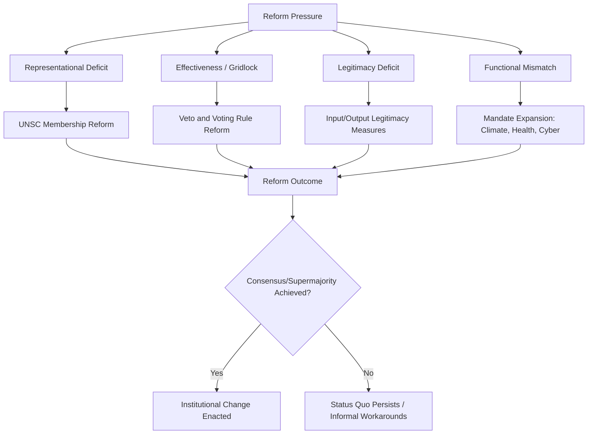

## Reforming Global Governance Institutions

### Definition and Conceptual Scope

Reforming global governance institutions refers to the sustained scholarly and policy debate over how to restructure the formal and informal architecture of international organizations — the United Nations system, Bretton Woods institutions, regional bodies, and informal groupings — to address perceived deficits in representativeness, effectiveness, legitimacy, and responsiveness to a changed distribution of global power and emergent transnational challenges.

**Key Points**

- Reform debates center on a persistent tension between institutions designed around the post-1945 power distribution and a contemporary international system characterized by multipolarity, rising powers, and non-traditional security/economic challenges
- Reform proposals span structural changes (membership, voting weights), procedural changes (decision-making rules), and functional changes (mandate expansion or contraction)
- Most major reform efforts require near-consensus or supermajority approval under existing institutional rules, creating significant status quo bias

### Core Drivers of Reform Pressure

#### Representational Deficit

Many governance bodies retain voting structures or membership configurations reflecting the power distribution of their founding moment rather than contemporary economic and demographic realities. The UN Security Council's five permanent members (P5: US, UK, France, Russia, China) reflect the victors of World War II, while major contemporary powers — India, Brazil, Germany, Japan, and the African continent collectively — hold no permanent seat.

#### Effectiveness and Gridlock

Veto mechanisms and consensus requirements, while designed to secure great-power buy-in, can produce institutional paralysis on precisely the issues requiring the most urgent collective response (e.g., UN Security Council deadlock over Syria, Ukraine).

#### Legitimacy Deficits

Perceived legitimacy depends on both **input legitimacy** (fair, inclusive participation in decision-making) and **output legitimacy** (effectiveness in delivering results). Institutions seen as dominated by a narrow set of powerful states risk eroding both forms of legitimacy among the broader membership, particularly in the Global South.

#### Functional Mismatch

Institutions designed for mid-twentieth-century challenges (interstate war, post-war reconstruction, balance-of-payments crises) face pressure to adapt mandates to contemporary transnational threats: climate change, pandemic preparedness, cyber governance, and financial instability arising from globalized capital markets not anticipated by original institutional design.

### Diagram: Drivers and Domains of Institutional Reform

### Domains of Reform

#### United Nations Security Council Reform

The most prominent and gridlocked reform debate concerns UNSC composition and veto power. Principal reform blocs include:

- **G4 nations** (Brazil, Germany, India, Japan) — advocate mutual support for permanent seats for each other
- **Uniting for Consensus (the "Coffee Club")** — led by Italy, Pakistan, Mexico, and others, opposing new permanent seats and instead favoring expanded non-permanent, longer-term, or renewable seats to avoid entrenching a new set of privileged states
- **African Union (Ezulwini Consensus)** — calls for at least two permanent seats with veto power and five non-permanent seats for Africa, reflecting the continent's total exclusion from permanent representation despite comprising over a quarter of UN membership

**Example**

Despite decades of Intergovernmental Negotiations (IGN) on Security Council reform beginning formally in 2008, no reform proposal has secured the required two-thirds General Assembly approval plus ratification by all P5 members (any of whom could veto a Charter amendment affecting their own status), illustrating how embedded veto power over the reform process itself constitutes a structural barrier to reform.

#### Bretton Woods Institutions (IMF and World Bank) Reform

Reform debates center on **quota and voting share realignment**. IMF quotas determine both financial contribution obligations and voting power, and historically over-represented European countries relative to their share of global GDP while under-representing emerging economies.

- The 2010 IMF Quota and Governance Reform (effective 2016 after U.S. congressional ratification) shifted more than 6 percent of quota share toward dynamic emerging market and developing economies, including making China the third-largest quota holder
- Ongoing debate concerns whether the U.S.'s retained veto-equivalent voting share (requiring 85 percent supermajority for major decisions, with the U.S. holding over 16 percent) remains appropriate given relative U.S. economic decline as a share of global GDP

#### World Trade Organization Reform

WTO reform debates focus on:

- **Dispute Settlement Body paralysis**: the U.S. blocked new Appellate Body judge appointments beginning in 2017 (over concerns about judicial overreach), rendering the Appellate Body non-functional since December 2019 and undermining binding dispute resolution
- **Special and Differential Treatment**: debate over which countries should retain "developing country" self-designation and associated flexibilities, given that some self-designated developing countries (e.g., China, Singapore) are major trading powers
- **Consensus-based decision-making**: the requirement for consensus among 160+ members for new agreements has slowed the negotiation of updated trade rules for e-commerce, subsidies, and other contemporary issues

#### Informal Governance and the G20

Partly in response to the gridlock of formal, universal-membership institutions, informal minilateral groupings have expanded in influence. The G20, formed in 1999 and elevated to leaders' level in 2008 in response to the global financial crisis, represents an attempt to create a more representative-but-still-manageable-sized forum (representing roughly 85 percent of global GDP) that bypasses the more cumbersome formal amendment processes of universal institutions, though it lacks the legal authority and enforcement mechanisms of treaty-based organizations.

### Theoretical Perspectives on Reform

#### Realist Perspective

Realists argue institutional design fundamentally reflects underlying power distributions, and that meaningful reform will only occur when it aligns with the interests of currently dominant states; institutions are unlikely to reform themselves against the preferences of veto-holding powers (a form of path dependency rooted in the initial bargain that created the institution).

#### Liberal Institutionalist Perspective

Liberal institutionalists emphasize that institutions, once created, generate their own stabilizing logic (reduced transaction costs, established expectations, sunk investments by member states), producing significant institutional "stickiness" — meaning reform is more often incremental and adaptive than revolutionary, occurring through internal procedural innovation rather than formal charter amendment. [Inference: this stickiness is a widely observed empirical pattern in the literature, though the precise causal weight of "sunk investment" versus veto-power dynamics in explaining any specific reform failure is not always disentangled.]

#### Constructivist Perspective

Constructivists focus on how legitimacy norms evolve and create pressure for reform independent of material power shifts — for example, growing normative expectations around gender balance in international leadership, or the increasing normative salience of "Global South" representation as a legitimacy criterion in its own right.

#### Historical Institutionalism

This perspective emphasizes **path dependency**: early institutional design choices (e.g., the P5 veto) become progressively more difficult to alter over time as actors adapt strategies and expectations around the existing rules, and as the amendment process itself is typically governed by the very rules that reform seeks to change.

### Diagram: UN Charter Amendment Pathway (svg_diagram)

<svg xmlns="http://www.w3.org/2000/svg" viewBox="0 0 880 340">
\<style\>
.title{font:bold 16px sans-serif;fill:#1a1a2e;}
.box{font:12px sans-serif;fill:#1a1a2e;}
.lbl{font:11px sans-serif;fill:#444;}
.node{fill:#eef3fb;stroke:#3a5a8c;stroke-width:1.5;}
.block{fill:#fbe9e7;stroke:#b13a2c;stroke-width:2;}
.arrow{stroke:#555;stroke-width:1.5;fill:none;marker-end:url(#arrow4);}
\</style\>
<text x="440" y="28" text-anchor="middle" class="title">UN Security Council Reform Pathway (svg_diagram)</text>
<rect x="30" y="60" width="200" height="55" rx="8" class="node" />
<text x="130" y="82" text-anchor="middle" class="box">Reform Proposal</text>
<text x="130" y="98" text-anchor="middle" class="box">(e.g., G4, Ezulwini)</text>
<rect x="330" y="60" width="220" height="55" rx="8" class="node" />
<text x="440" y="82" text-anchor="middle" class="box">General Assembly:</text>
<text x="440" y="98" text-anchor="middle" class="box">2/3 Majority Vote Required</text>
<rect x="650" y="60" width="200" height="55" rx="8" class="block" />
<text x="750" y="82" text-anchor="middle" class="box">Ratification by</text>
<text x="750" y="98" text-anchor="middle" class="box">ALL P5 Members</text>
<path d="M230,87 L330,87" class="arrow" />
<path d="M550,87 L650,87" class="arrow" />
<rect x="330" y="220" width="220" height="60" rx="8" class="block" />
<text x="440" y="245" text-anchor="middle" class="box">Any Single P5 Veto</text>
<text x="440" y="262" text-anchor="middle" class="box">Blocks Ratification</text>
<path d="M750,115 L750,180 L440,180 L440,220" class="arrow" />
<text x="600" y="200" text-anchor="middle" class="lbl">structural veto over own reform</text>
</svg>

### Contemporary Reform Proposals and Trends

- **UN80 Initiative and broader UN reform agenda**: ongoing efforts (building on earlier Secretary-General reform packages) to streamline UN bureaucracy, improve system-wide coherence, and address budgetary sustainability amid major-donor funding pressure
- **Veto restraint initiatives**: the 2022 UN General Assembly resolution requiring any P5 veto in the Security Council to trigger an automatic General Assembly debate, an incremental accountability mechanism achieved without formal Charter amendment
- **Climate finance governance reform**: proposals to reform multilateral development bank mandates and capital bases (e.g., the Bridgetown Initiative) to substantially scale up affordable climate finance for developing countries
- **AI and digital governance architecture**: emerging debate over whether existing institutions (UN, ITU) or new dedicated bodies should govern frontier AI risk and cross-border digital regulation, reflecting the "functional mismatch" driver of reform pressure

[Speculation: whether momentum around minilateral and informal governance mechanisms (G20, Bridgetown-style coalitions) will substitute for, complement, or further undermine formal universal-membership institutions over the coming decade remains an open and actively contested question among scholars and policymakers.]

### Critiques and Limitations of Reform Efforts

- **Incrementalism critique**: Reform that occurs tends to be procedural and marginal (e.g., quota adjustments, informal working groups) rather than structural (e.g., veto abolition), leading some scholars to characterize much "reform" activity as legitimation exercises that manage discontent without altering underlying power structures
- **Great power capture risk**: Reform processes controlled by existing powerful members may produce changes that entrench rather than dilute their influence
- **Coordination problems among reform advocates**: Competing reform blocs (e.g., G4 vs. Uniting for Consensus) often have mutually incompatible preferences, fragmenting reform coalitions and reducing the likelihood of any single proposal achieving the required supermajority
- **Legitimacy of the reform process itself**: Debates persist over whether reform should be negotiated primarily among states (intergovernmentalism) or should incorporate a wider set of non-state and civil society stakeholders, echoing the broader global governance legitimacy debate

### Related Topics

- United Nations Security Council Structure and Veto Power
- Bretton Woods System and IMF Quota Governance
- G20 and Informal Minilateral Governance
- Global Public Goods
- Collective Action Problems in World Politics
- Historical Institutionalism and Path Dependency
- Legitimacy in International Institutions (Input vs. Output Legitimacy)
- Rising Powers and the Multipolar Order
- WTO Dispute Settlement Crisis
- Multilateral Development Bank Reform and Climate Finance