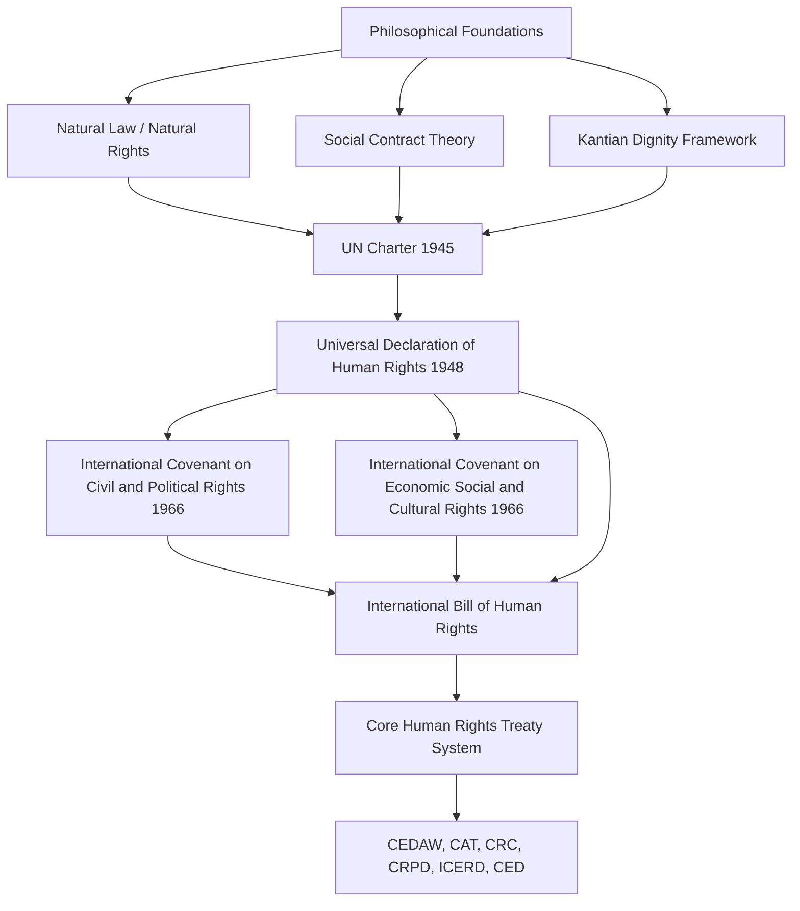

## Foundations of International Human Rights

### Definition and Conceptual Scope

International human rights refers to the body of norms, legal instruments, and institutional practices asserting that all individuals possess certain inherent entitlements by virtue of their humanity, which states and other actors are obligated to respect, protect, and fulfill. Unlike most international law, which traditionally governs relations *between* states, human rights law is distinctive in that it primarily governs the relationship *between a state and its own population*, while still being constituted and enforced through the interstate system.

**Key Points**

- Human rights are typically characterized as universal (applying to all persons), inalienable (cannot be surrendered or forfeited), and indivisible (civil, political, economic, social, and cultural rights are interdependent rather than hierarchically ranked)
- The field sits at the intersection of moral philosophy, international law, and international relations theory, with each discipline emphasizing different foundational justifications
- Contemporary international human rights law traces its institutional foundation to the post-1945 international order, though its philosophical roots are considerably older

### Philosophical Foundations

#### Natural Law and Natural Rights Traditions

Classical natural law theory (Aquinas) and Enlightenment natural rights theory (Locke, Grotius) grounded rights claims in reason, natural order, or divine law rather than positive law enacted by states. Locke's argument that individuals possess inherent rights to life, liberty, and property prior to and independent of government significantly shaped the intellectual lineage of modern human rights discourse, particularly the idea that legitimate government exists to protect pre-political rights rather than to grant them.

#### Social Contract Theory

Social contract theorists (Hobbes, Locke, Rousseau) provided a framework in which political authority derives its legitimacy from an implicit agreement to protect the fundamental interests of the governed, establishing an early conceptual basis for the claim that states can be held to account for how they treat individuals within their jurisdiction.

#### Kantian Moral Philosophy

Immanuel Kant's categorical imperative — that persons must be treated as ends in themselves and never merely as means — provided an influential philosophical grounding for the principle of inherent human dignity that underlies contemporary human rights instruments, most explicitly reflected in the opening language of the Universal Declaration of Human Rights.

#### Cultural Relativism and Its Critics

Cultural relativist critiques challenge the claim to universality, arguing that rights frameworks (particularly individualistic conceptions of rights) reflect specifically Western liberal philosophical traditions and may not adequately capture communitarian, religious, or non-Western conceptions of human dignity and social obligation. Proponents of universalism respond that cross-cultural consensus documents (e.g., near-universal UN ratification of core treaties) and independently emergent rights-protective practices across diverse traditions suggest rights claims are not merely a Western imposition. [Inference: this debate remains philosophically and politically contested rather than resolved, and characterizations of "the" relativist or universalist position necessarily simplify a heterogeneous body of scholarship.]

### Historical Development

#### Pre-1945 Antecedents

- The Magna Carta (1215) and English Bill of Rights (1689) established early precedents limiting sovereign authority relative to subjects
- The American Declaration of Independence (1776) and French Declaration of the Rights of Man and of the Citizen (1789) articulated rights claims in explicitly universal, natural-rights language
- Nineteenth-century humanitarian law developments, including the first Geneva Convention (1864), began establishing international legal constraints on state conduct even in the context of the traditionally sovereign-exclusive domain of warfare
- International labor standards developed through the International Labour Organization (founded 1919) represented an early instance of binding international standards on how states treat individuals within their own jurisdiction

#### Post-1945 Institutional Foundation

The atrocities of the Second World War, particularly the Holocaust, catalyzed the formal internationalization of human rights as a matter of international concern rather than purely domestic jurisdiction — a significant departure from the Westphalian principle of non-interference in domestic affairs.

- **UN Charter (1945)**: Articles 1, 55, and 56 committed member states to promoting "universal respect for, and observance of, human rights and fundamental freedoms," embedding human rights promotion as a foundational purpose of the United Nations
- **Universal Declaration of Human Rights (UDHR, 1948)**: adopted by the UN General Assembly without a negative vote (48 in favor, 8 abstentions, 0 against), articulating 30 articles covering civil, political, economic, social, and cultural rights; while not itself a binding treaty, the UDHR is widely regarded as having attained the status of customary international law in significant part, and served as the template for subsequent binding instruments

### Diagram: Evolution of the International Human Rights Framework

### The International Bill of Human Rights

The UDHR, together with the two 1966 covenants, forms what is collectively termed the "International Bill of Human Rights":

- **International Covenant on Civil and Political Rights (ICCPR, 1966, entered into force 1976)**: codifies rights such as freedom from torture, freedom of expression, the right to a fair trial, and political participation rights, subject to immediate implementation obligations
- **International Covenant on Economic, Social and Cultural Rights (ICESCR, 1966, entered into force 1976)**: codifies rights such as the right to work, education, health, and an adequate standard of living, subject to the principle of "progressive realization" given resource constraints

**Example**

The bifurcation of the UDHR's unified rights framework into two separate covenants reflected Cold War ideological division: Western states emphasized civil and political rights (associated with liberal democratic governance and market economies), while the Soviet bloc and many developing states emphasized economic and social rights (associated with state-directed development and redistribution), illustrating how even the "universal" foundational architecture of the regime was shaped by contemporaneous great-power ideological competition. [Inference: the degree to which this Cold War division reflects genuine philosophical disagreement versus strategic positioning is debated in the historical scholarship.]

### Core Subsequent Treaty Instruments

Building on the International Bill of Human Rights, subsequent treaties addressed specific rights-holders and rights violations:

- **International Convention on the Elimination of All Forms of Racial Discrimination (ICERD, 1965)**
- **Convention on the Elimination of All Forms of Discrimination against Women (CEDAW, 1979)**
- **Convention against Torture and Other Cruel, Inhuman or Degrading Treatment or Punishment (CAT, 1984)**
- **Convention on the Rights of the Child (CRC, 1989)** — the most widely ratified human rights treaty in history
- **International Convention for the Protection of All Persons from Enforced Disappearance (CED, 2006)**
- **Convention on the Rights of Persons with Disabilities (CRPD, 2006)**

Each treaty typically establishes a dedicated **treaty monitoring body** (a committee of independent experts) that reviews state compliance through periodic reporting, and in many cases through individual complaint mechanisms under optional protocols.

### Generational Framework of Rights

A commonly used (though contested) heuristic categorizes rights into three "generations," originally proposed by Karel Vasak:

| Generation | Rights Type | Examples |
| --- | --- | --- |
| **First** | Civil and political ("negative"/liberty rights) | Free speech, fair trial, freedom from torture |
| **Second** | Economic, social, cultural ("positive"/welfare rights) | Right to work, education, healthcare |
| **Third** | Collective/solidarity rights | Right to development, self-determination, healthy environment |

**Key Points**

- Critics of the generational framework argue it implicitly reinforces a hierarchy privileging first-generation rights, contrary to the formally stated principle of rights indivisibility affirmed in the 1993 Vienna Declaration
- Third-generation "solidarity rights" remain the most contested category, with weaker consensus on their legal status and enforceability compared to first- and second-generation rights

### IR Theoretical Perspectives on Human Rights

#### Realism

Realists are generally skeptical that human rights meaningfully constrain state behavior, viewing rights rhetoric as often instrumentalized in service of underlying strategic or power-political interests, and noting that enforcement ultimately depends on great-power willingness to act, which is itself governed by strategic calculation rather than normative commitment.

#### Liberalism

Liberal IR theory treats human rights protection as both intrinsically valuable and instrumentally connected to broader liberal goods: democratic peace theory, for instance, links domestic rights-respecting governance to more peaceful interstate behavior.

#### Constructivism

Constructivist scholarship (e.g., Finnemore and Sikkink's norm life cycle model) treats the diffusion of human rights norms as a process of norm emergence (driven by norm entrepreneurs), norm cascade (broad adoption driven by socialization and legitimacy pressures), and norm internalization (rights become taken-for-granted standards of appropriate state behavior), explaining the spread of rights commitments independent of material power calculations.

#### Critical and Postcolonial Perspectives

Critical and postcolonial scholars interrogate the human rights regime's origins in a specific historical moment dominated by Western powers, questioning whether the regime's categories and enforcement priorities reproduce rather than transcend colonial-era power hierarchies, and highlighting selective enforcement patterns in which powerful states face less scrutiny than weaker ones.

### Diagram: Rights Categories and Treaty Architecture (svg_diagram)

<svg xmlns="http://www.w3.org/2000/svg" viewBox="0 0 880 360">
\<style\>
.title{font:bold 16px sans-serif;fill:#1a1a2e;}
.box{font:12px sans-serif;fill:#1a1a2e;}
.lbl{font:11px sans-serif;fill:#444;}
.node{fill:#eef3fb;stroke:#3a5a8c;stroke-width:1.5;}
.center{fill:#fff4e0;stroke:#b8860b;stroke-width:2;}
.arrow{stroke:#555;stroke-width:1.5;fill:none;marker-end:url(#arrow5);}
\</style\>
<text x="440" y="28" text-anchor="middle" class="title">International Bill of Human Rights (svg_diagram)</text>
<rect x="340" y="50" width="200" height="55" rx="8" class="center" />
<text x="440" y="72" text-anchor="middle" class="box">UDHR (1948)</text>
<text x="440" y="88" text-anchor="middle" class="box">Foundational Declaration</text>
<rect x="120" y="200" width="220" height="60" rx="8" class="node" />
<text x="230" y="225" text-anchor="middle" class="box">ICCPR (1966)</text>
<text x="230" y="242" text-anchor="middle" class="box">Civil / Political Rights</text>
<rect x="540" y="200" width="220" height="60" rx="8" class="node" />
<text x="650" y="225" text-anchor="middle" class="box">ICESCR (1966)</text>
<text x="650" y="242" text-anchor="middle" class="box">Economic / Social / Cultural</text>
<path d="M400,105 L260,200" class="arrow" />
<path d="M480,105 L620,200" class="arrow" />
<rect x="300" y="300" width="280" height="45" rx="8" class="node" />
<text x="440" y="327" text-anchor="middle" class="box">Specialized Treaties: CEDAW, CAT, CRC, CRPD, ICERD, CED</text>
<path d="M230,260 L400,300" class="arrow" />
<path d="M650,260 L480,300" class="arrow" />
</svg>

### Critiques and Ongoing Debates

- **Sovereignty tension**: Human rights obligations sit in persistent tension with the Westphalian principle of non-interference in domestic affairs, generating recurring disputes over the legitimacy of external pressure or intervention in response to internal rights violations
- **Enforcement gap**: Unlike domestic legal systems, international human rights law lacks a centralized enforcement authority; compliance relies heavily on reporting mechanisms, reputational pressure, and voluntary state cooperation rather than binding coercive sanction in most cases
- **Selective application**: Critics across the political spectrum note that human rights concerns are frequently invoked more forcefully against geopolitical rivals or weaker states than against powerful states or allies, raising consistency and legitimacy concerns
- **Universality versus cultural sovereignty**: The relativism debate remains unresolved as a philosophical matter, even as near-universal treaty ratification suggests broad (if not unanimous or uniformly implemented) normative convergence
- **Indivisibility in practice**: Despite the formally affirmed principle that civil/political and economic/social rights are equally fundamental, resource constraints, differing enforcement mechanisms, and political priorities mean the two rights categories are frequently treated unequally in practice

### Related Topics

- International Human Rights Law and Treaty Bodies
- Universal Declaration of Human Rights: Text and Legacy
- Humanitarian Intervention and the Responsibility to Protect
- Norm Life Cycle Theory (Finnemore and Sikkink)
- Cultural Relativism versus Universalism Debate
- Economic, Social, and Cultural Rights and Progressive Realization
- Transitional Justice and Accountability Mechanisms
- Regional Human Rights Systems (European, Inter-American, African)
- Non-State Actors in Global Governance
- Critical and Postcolonial Approaches to International Law