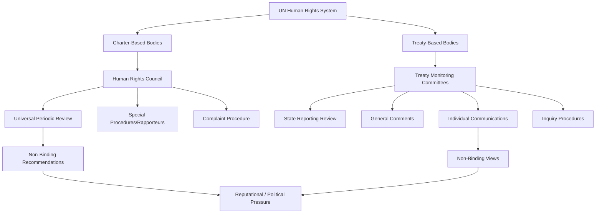

## Human Rights Institutions and Enforcement

### Definition and Conceptual Scope

Human rights institutions and enforcement refers to the architecture of bodies, procedures, and mechanisms — global, regional, and hybrid — established to monitor state compliance with human rights obligations and to provide accountability, remedy, or redress when violations occur. Because international law lacks a centralized enforcement authority analogous to domestic policing and courts, human rights enforcement operates through a heterogeneous combination of legal, political, and reputational mechanisms rather than a single unified system.

**Key Points**

- Enforcement mechanisms are generally categorized as either **judicial/quasi-judicial** (producing legally binding or authoritative findings) or **political/diplomatic** (relying on peer review, reporting, and reputational pressure)
- The "enforcement gap" — the divergence between the extensive body of codified human rights law and comparatively limited coercive enforcement capacity — is a defining structural feature of the field
- Regional human rights systems generally possess stronger enforcement mechanisms than the global UN system, reflecting greater underlying normative and political consensus within regions

### United Nations Charter-Based Bodies

#### UN Human Rights Council (UNHRC)

Established in 2006 (replacing the discredited UN Commission on Human Rights), the Human Rights Council is an intergovernmental body of 47 elected member states responsible for promoting and protecting human rights globally, addressing violations, and making recommendations.

- **Universal Periodic Review (UPR)**: a peer-review mechanism under which every UN member state's human rights record is reviewed roughly every 4.5 years by other states, producing non-binding recommendations that the reviewed state may accept or note
- **Special Procedures**: independent experts (Special Rapporteurs, Working Groups) mandated to investigate and report on either specific countries (country mandates) or specific thematic issues (e.g., torture, freedom of expression, extrajudicial executions)
- **Complaint Procedure**: a confidential mechanism allowing individuals and groups to bring communications regarding consistent patterns of gross violations to the Council's attention

**Example**

The Universal Periodic Review's design — universal application to all 193 UN member states regardless of power or treaty ratification status — was intended to address the selectivity criticism that plagued its predecessor body, though critics note that recommendation acceptance and implementation remain voluntary and highly uneven across states. [Inference: assessments of UPR's overall effectiveness vary substantially in the scholarly literature depending on whether "success" is measured by participation rates, recommendation acceptance, or actual on-the-ground implementation.]

#### Office of the UN High Commissioner for Human Rights (OHCHR)

The principal UN entity responsible for human rights promotion and protection, providing technical assistance to states, supporting treaty bodies and special procedures, and conducting human rights monitoring and reporting, including in conflict and crisis settings.

### UN Treaty-Based Bodies

Each of the nine core UN human rights treaties establishes a dedicated **treaty monitoring body** (committee of independent experts) that performs several enforcement-adjacent functions:

- **State reporting review**: states parties submit periodic reports on implementation, which the committee examines and responds to with "concluding observations"
- **General comments**: authoritative interpretive guidance on the meaning and scope of treaty provisions
- **Individual communications (complaints)**: under optional protocols, individuals may bring complaints alleging treaty violations, with committees issuing "views" — influential but not legally binding in the same manner as a court judgment
- **Inquiry procedures**: some treaties permit committees to conduct inquiries into serious or systematic violations, in certain cases including state visits

Principal treaty bodies include the Human Rights Committee (ICCPR), the Committee on Economic, Social and Cultural Rights (ICESCR), the Committee against Torture (CAT), the Committee on the Elimination of Discrimination against Women (CEDAW), and the Committee on the Rights of the Child (CRC).

### Diagram: UN Human Rights Enforcement Architecture

### Regional Human Rights Systems

Regional systems generally provide the strongest enforcement mechanisms in international human rights law, benefiting from deeper regional normative consensus and, in some cases, binding judicial authority.

#### European System

- **European Court of Human Rights (ECtHR)**, established under the European Convention on Human Rights (1950, Council of Europe), issues legally binding judgments on individual applications against the 46 Council of Europe member states, with the Committee of Ministers supervising execution of judgments
- Widely regarded as the most developed and effective international human rights judicial mechanism, with individuals able to bring cases directly after exhausting domestic remedies

#### Inter-American System

- **Inter-American Commission on Human Rights** conducts investigations, receives petitions, and can refer cases to the **Inter-American Court of Human Rights**, whose judgments are binding on states that have accepted its contentious jurisdiction
- Has issued significant rulings on enforced disappearance, indigenous rights, and transitional justice, though compliance with judgments varies significantly across member states

#### African System

- **African Commission on Human and Peoples' Rights** monitors implementation of the African Charter on Human and Peoples' Rights (1981, "Banjul Charter") and can refer cases to the **African Court on Human and Peoples' Rights**
- The African Court's jurisdiction over individual and NGO complaints depends on a separate declaration by each state, which most African Union member states have not made, significantly limiting direct individual access

#### Absence of a Comparable Asian or Middle Eastern System

No binding regional human rights court exists for Asia or the broader Middle East, though sub-regional mechanisms exist (e.g., the ASEAN Intergovernmental Commission on Human Rights, which is explicitly non-judicial and consultative in nature, and the Arab Charter on Human Rights, which lacks a court with binding jurisdiction comparable to the European or Inter-American systems).

### International Criminal Enforcement Mechanisms

#### International Criminal Court (ICC)

Established by the Rome Statute (1998, entered into force 2002), the ICC prosecutes individuals (not states) for genocide, crimes against humanity, war crimes, and the crime of aggression, operating under the **principle of complementarity** — the ICC only exercises jurisdiction when national judicial systems are unwilling or genuinely unable to prosecute.

**Key Points**

- The ICC has jurisdiction over crimes committed on the territory of states parties or by nationals of states parties, or in situations referred by the UN Security Council (which can extend jurisdiction to non-states-parties)
- Major powers including the United States, Russia, China, and India are not states parties to the Rome Statute, significantly limiting the Court's universal reach and generating ongoing debate about selective jurisdiction
- The ICC lacks its own enforcement/police mechanism and depends entirely on state cooperation for arrests, evidence-gathering, and enforcement of its warrants

#### Ad Hoc and Hybrid Tribunals

Prior to and alongside the ICC, ad hoc tribunals were established for specific conflicts, including the International Criminal Tribunal for the former Yugoslavia (ICTY, 1993–2017) and the International Criminal Tribunal for Rwanda (ICTR, 1994–2015), both established by UN Security Council resolution. Hybrid tribunals combining international and domestic law/personnel (e.g., the Special Court for Sierra Leone, Extraordinary Chambers in the Courts of Cambodia) represent an intermediate model.

#### International Court of Justice (ICJ)

While primarily a forum for interstate disputes rather than individual criminal accountability, the ICJ has adjudicated significant human-rights-adjacent cases (e.g., genocide claims under the Genocide Convention), issuing binding judgments on states, though enforcement still depends on UN Security Council action for compliance, which is itself subject to P5 veto.

### Political and Diplomatic Enforcement Mechanisms

Beyond judicial and quasi-judicial bodies, enforcement also operates through:

- **Naming and shaming**: NGO reporting (Amnesty International, Human Rights Watch) and treaty body/special procedure findings that generate reputational costs for violating states
- **Conditionality**: linking trade preferences, development aid, or diplomatic relations to human rights performance (e.g., EU human rights clauses in trade agreements)
- **Targeted sanctions**: asset freezes and travel bans against individual officials responsible for violations (e.g., Magnitsky-style sanctions regimes adopted by multiple states)
- **Universal jurisdiction**: the principle that certain crimes (genocide, torture, crimes against humanity) are so severe that any state's domestic courts may prosecute perpetrators regardless of where the crime occurred or the nationality of perpetrator/victim, though its practical invocation remains relatively rare and politically contentious

### Diagram: Comparative Enforcement Strength by Mechanism Type (svg_diagram)

<svg xmlns="http://www.w3.org/2000/svg" viewBox="0 0 880 380">
\<style\>
.title{font:bold 16px sans-serif;fill:#1a1a2e;}
.box{font:12px sans-serif;fill:#1a1a2e;}
.lbl{font:11px sans-serif;fill:#444;}
.axis{stroke:#888;stroke-width:1;}
.bar1{fill:#3a5a8c;}
.bar2{fill:#6b9ac4;}
.bar3{fill:#b8860b;}
.bar4{fill:#c9a86a;}
\</style\>
<text x="440" y="28" text-anchor="middle" class="title">Relative Enforcement Strength by Mechanism (svg_diagram)</text>
<line x1="120" y1="320" x2="820" y2="320" class="axis" />
<line x1="120" y1="60" x2="120" y2="320" class="axis" />
<rect x="160" y="90" width="70" height="230" class="bar1" />
<text x="195" y="340" text-anchor="middle" class="box">ECtHR</text>
<text x="195" y="80" text-anchor="middle" class="lbl">Binding</text>
<rect x="280" y="140" width="70" height="180" class="bar1" />
<text x="315" y="340" text-anchor="middle" class="box">IACtHR</text>
<text x="315" y="130" text-anchor="middle" class="lbl">Binding</text>
<rect x="400" y="180" width="70" height="140" class="bar2" />
<text x="435" y="340" text-anchor="middle" class="box">ICC</text>
<text x="435" y="170" text-anchor="middle" class="lbl">Binding, weak enforcement</text>
<rect x="520" y="220" width="70" height="100" class="bar3" />
<text x="555" y="340" text-anchor="middle" class="box">Treaty Bodies</text>
<text x="555" y="210" text-anchor="middle" class="lbl">Non-binding views</text>
<rect x="640" y="250" width="70" height="70" class="bar4" />
<text x="675" y="340" text-anchor="middle" class="box">UPR</text>
<text x="675" y="240" text-anchor="middle" class="lbl">Peer review</text>

<text x="70" y="195" text-anchor="middle" class="lbl" transform="rotate(-90 70 195)">Enforcement Strength</text>

</svg>

### Structural Limitations on Enforcement

- **Absence of centralized coercive authority**: no international body possesses an independent police force or automatic enforcement mechanism; compliance ultimately depends on state cooperation
- **State consent basis**: most mechanisms (individual complaint procedures, ICC jurisdiction, regional court jurisdiction) require affirmative state consent, allowing states most likely to violate rights to opt out of the most robust accountability mechanisms
- **Security Council veto interaction**: UN Security Council referral or enforcement action on human-rights-related matters (e.g., ICC referrals, sanctions) remains subject to P5 veto, creating a structural chokepoint tied to great-power politics rather than the merits of a given situation
- **Resource and capacity constraints**: treaty bodies and special procedures often operate with limited staff and funding relative to the scope of their monitoring mandates, resulting in significant reporting backlogs
- **Compliance pull versus formal obligation**: even binding judgments (e.g., from regional courts) depend on domestic political will for implementation, and mechanisms for compelling compliance (e.g., Council of Europe suspension) are themselves limited and rarely invoked short of extreme cases

### Related Topics

- Foundations of International Human Rights
- International Criminal Court and the Rome Statute
- Universal Periodic Review Process
- Regional Human Rights Courts (European, Inter-American, African)
- Universal Jurisdiction and Domestic Prosecution of International Crimes
- Transitional Justice and Accountability Mechanisms
- UN Security Council Veto Power and Human Rights Referrals
- Naming and Shaming and Transnational Advocacy Networks
- Targeted Sanctions and Human Rights Conditionality
- Complementarity Principle in International Criminal Law