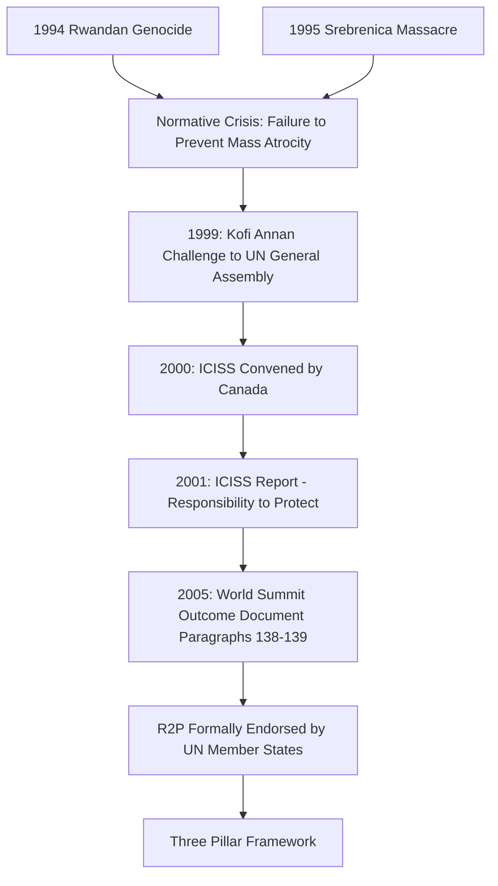

## Humanitarian Intervention and the Responsibility to Protect

### Definition and Conceptual Scope

Humanitarian intervention refers to coercive action, including the use of military force, undertaken by one or more states or international organizations against another sovereign state without its consent, for the stated purpose of preventing or halting widespread and grave violations of human rights (genocide, mass atrocity, ethnic cleansing) within that state's borders. The Responsibility to Protect (R2P) is a subsequently developed normative and policy framework intended to reformulate the humanitarian intervention debate around a state's responsibility toward its own population and the international community's residual role when that responsibility fails.

**Key Points**

- Both concepts sit at the center of a foundational tension in international relations between **state sovereignty** (traditionally understood as inviolable under the UN Charter's non-intervention principle, Article 2(4)) and the **protection of human life** across borders
- Humanitarian intervention as traditionally conceived lacked a clear, consistently applied legal basis in international law prior to R2P's development
- R2P was explicitly designed to reframe sovereignty as entailing responsibility rather than conferring unconditional protection from external scrutiny or action

### The Sovereignty–Intervention Tension

#### The UN Charter Framework

The UN Charter establishes two seemingly countervailing principles: Article 2(4) prohibits the threat or use of force against the territorial integrity or political independence of any state, while Article 2(7) prohibits UN intervention in matters "essentially within the domestic jurisdiction" of states — yet Chapter VII grants the Security Council authority to authorize enforcement action, including force, in response to threats to international peace and security, creating the principal legal pathway through which humanitarian concerns can be formally linked to lawful intervention.

#### Pre-R2P Humanitarian Intervention Debates

Prior to R2P's articulation, humanitarian intervention lacked settled legal status. Interventions undertaken without explicit Security Council authorization (e.g., NATO's 1999 Kosovo intervention) generated significant controversy precisely because they proceeded without Chapter VII authorization, leading some scholars to characterize such action as "illegal but legitimate" — a formulation used by the Independent International Commission on Kosovo (2000) to capture the gap between the intervention's perceived moral necessity and its uncertain legal grounding under the existing Charter framework.

### Origins and Development of R2P

#### The Rwandan Genocide and Srebrenica as Catalysts

The international community's failure to prevent or halt the 1994 Rwandan genocide (in which an estimated 800,000 people were killed over roughly 100 days while UN peacekeepers were withdrawn) and the 1995 Srebrenica massacre (in which Bosnian Serb forces killed roughly 8,000 Bosniak men and boys in a UN-declared "safe area") became central catalysts for rethinking the international community's obligations in the face of mass atrocity, generating significant institutional and normative reflection within the UN system.

#### International Commission on Intervention and State Sovereignty (ICISS)

Convened by the Canadian government in response to a 1999 UN General Assembly challenge from Secretary-General Kofi Annan (who asked how the international community should respond to gross human rights violations if humanitarian intervention constituted an unacceptable assault on sovereignty), the ICISS published its report, *The Responsibility to Protect*, in 2001. The report's central conceptual innovation was reframing sovereignty as **responsibility** rather than **control** — a state's sovereign authority is conditioned upon its fulfillment of a responsibility to protect its population, and when a state manifestly fails to do so, that responsibility shifts to the broader international community.

#### 2005 World Summit Outcome Document

R2P received formal, unanimous endorsement by UN member states at the 2005 World Summit, articulated in paragraphs 138–139 of the Outcome Document, marking its transition from an independent commission's proposal to a normative commitment formally adopted by the UN General Assembly.

### Diagram: Development of the Responsibility to Protect Framework

### The Three-Pillar Framework

As subsequently elaborated by UN Secretary-General Ban Ki-moon's 2009 report *Implementing the Responsibility to Protect*, R2P rests on three mutually reinforcing pillars:

- **Pillar One**: Every state bears the primary responsibility to protect its own population from genocide, war crimes, ethnic cleansing, and crimes against humanity (the "four crimes" to which R2P's scope is explicitly limited, distinguishing it from broader human rights protection generally)
- **Pillar Two**: The international community has a responsibility to assist states in fulfilling this responsibility, through capacity-building, technical assistance, and early-warning mechanisms
- **Pillar Three**: If a state manifestly fails to protect its population (including through direct perpetration), and peaceful means prove inadequate, the international community has a responsibility to take timely and decisive collective action through the UN Security Council, in accordance with the UN Charter, on a case-by-case basis

**Key Points**

- R2P's scope is deliberately narrow, limited to the four specified mass atrocity crimes rather than the broader universe of human rights violations, distinguishing it from more expansive conceptions of humanitarian intervention
- Pillar Three action, including the potential authorization of military force, remains explicitly channeled through the existing UN Security Council Chapter VII framework — R2P did not create a new independent legal basis for intervention outside Security Council authorization, addressing a key criticism of earlier unilateral humanitarian intervention practice
- The framework's design reflects a deliberate compromise intended to secure broad state buy-in by preserving Security Council primacy and P5 veto authority, even as it reframes the normative starting point around sovereignty-as-responsibility

### Diagram: R2P Three-Pillar Structure (svg_diagram)

<svg xmlns="http://www.w3.org/2000/svg" viewBox="0 0 880 380">
\<style\>
.title{font:bold 16px sans-serif;fill:#1a1a2e;}
.box{font:12px sans-serif;fill:#1a1a2e;}
.lbl{font:11px sans-serif;fill:#444;}
.node{fill:#eef3fb;stroke:#3a5a8c;stroke-width:1.5;}
.center{fill:#fff4e0;stroke:#b8860b;stroke-width:2;}
.arrow{stroke:#555;stroke-width:1.5;fill:none;marker-end:url(#arrow6);}
\</style\>
<text x="440" y="28" text-anchor="middle" class="title">R2P Three-Pillar Framework (svg_diagram)</text>
<rect x="340" y="50" width="200" height="50" rx="8" class="center" />
<text x="440" y="80" text-anchor="middle" class="box">Sovereignty as Responsibility</text>
<rect x="60" y="160" width="220" height="70" rx="8" class="node" />
<text x="170" y="185" text-anchor="middle" class="box">Pillar One</text>
<text x="170" y="202" text-anchor="middle" class="box">State's Own Responsibility</text>
<text x="170" y="218" text-anchor="middle" class="box">to Protect Population</text>
<rect x="330" y="160" width="220" height="70" rx="8" class="node" />
<text x="440" y="185" text-anchor="middle" class="box">Pillar Two</text>
<text x="440" y="202" text-anchor="middle" class="box">International Assistance</text>
<text x="440" y="218" text-anchor="middle" class="box">and Capacity-Building</text>
<rect x="600" y="160" width="220" height="70" rx="8" class="node" />
<text x="710" y="185" text-anchor="middle" class="box">Pillar Three</text>
<text x="710" y="202" text-anchor="middle" class="box">Timely, Decisive Collective</text>
<text x="710" y="218" text-anchor="middle" class="box">Response via UNSC</text>
<path d="M400,100 L170,160" class="arrow" />
<path d="M440,100 L440,160" class="arrow" />
<path d="M480,100 L710,160" class="arrow" />
<rect x="310" y="290" width="260" height="55" rx="8" class="node" />
<text x="440" y="313" text-anchor="middle" class="box">Applies only to Four Crimes:</text>
<text x="440" y="330" text-anchor="middle" class="box">Genocide, War Crimes, Ethnic Cleansing, Crimes Against Humanity</text>
</svg>

### Case Applications and Contested Practice

**Example**

The 2011 Libya intervention (UN Security Council Resolution 1973) represented the first case of the Security Council explicitly invoking R2P to authorize the use of force against a functioning state without its consent, establishing a no-fly zone and authorizing "all necessary measures" to protect civilians. The subsequent expansion of NATO's mission beyond civilian protection toward actions that contributed to regime change generated significant backlash among Security Council members (particularly Russia, China, and several regional and emerging powers), who argued the intervention had been used as pretext for an agenda beyond the resolution's stated humanitarian mandate — a controversy widely credited with substantially reducing subsequent Security Council willingness to authorize R2P-based Pillar Three action, most visibly reflected in the repeated Russian and Chinese vetoes blocking action on Syria beginning in 2011.

**Example**

The Syrian civil war (2011–present) illustrates R2P's practical limitations where P5 consensus is absent: despite documented atrocities meeting R2P's threshold criteria, repeated Security Council resolutions on Syria were vetoed (primarily by Russia, at times China), preventing Pillar Three collective action and demonstrating that R2P's design — preserving Security Council authorization as the gateway to coercive Pillar Three action — leaves the framework structurally vulnerable to the same veto-based paralysis that affects other Security Council decision-making.

### Critiques and Debates

#### Sovereignty and Neo-Imperialism Critique

Critics, particularly from the Global South and among realist and postcolonial scholars, argue R2P risks functioning as a normative pretext for great-power intervention that reproduces historical patterns of Western intervention in weaker states' affairs, with the Libya case frequently cited as validating concerns that humanitarian justification can mask broader strategic or regime-change objectives.

#### Selectivity and Inconsistency Critique

R2P's application has been markedly inconsistent: Security Council paralysis on Syria contrasts with action in Libya, and R2P has notably not been invoked or acted upon in numerous other contexts meeting its threshold criteria (e.g., limited international coercive action regarding Myanmar's treatment of the Rohingya, or Sudan/Darfur), raising the question of whether R2P functions more as a discretionary tool activated according to great-power interest than as a consistently applied normative standard. [Inference: whether this selectivity reflects a fundamental design flaw in R2P's dependence on Security Council authorization, versus a more general feature of any international enforcement mechanism operating in a system without centralized coercive authority, remains a matter of scholarly interpretation rather than settled consensus.]

#### Practical and Operational Critique

Even where Pillar Three action is authorized, questions persist regarding the effectiveness of military intervention in actually protecting civilians, the risk of intervention prolonging or escalating conflict, and the absence of clear criteria for determining when intervention has succeeded or should end (the "mission creep" concern illustrated by Libya).

#### Defenses of R2P

Proponents argue R2P has nonetheless shifted international discourse by establishing mass atrocity prevention as a recognized international responsibility, providing a normative and diplomatic framework (including UN Special Adviser mechanisms on genocide prevention) that did not previously exist, and constraining (even if imperfectly) the range of acceptable justifications a state can offer for actions against its own population.

### Related Topics

- Foundations of International Human Rights
- Human Rights Institutions and Enforcement
- UN Security Council Veto Power and Reform
- Just War Theory and the Ethics of Intervention
- Sovereignty and Non-Intervention in International Law
- Genocide Prevention and Early Warning Mechanisms
- Case Study: Kosovo Intervention (1999)
- Case Study: Libya Intervention (2011)
- Case Study: Syrian Civil War and Security Council Paralysis
- Norm Life Cycle Theory and Contested Norms in International Relations