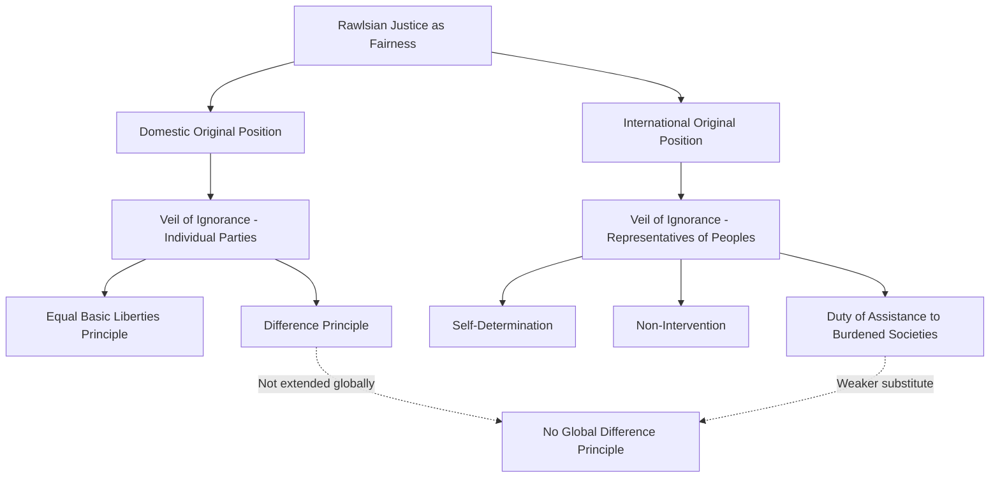
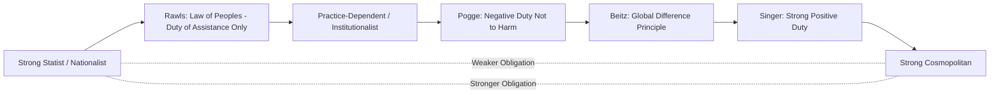

## Theories of Global Distributive Justice

### Definition and Conceptual Scope

Theories of global distributive justice address the normative question of what individuals and institutions owe one another across national borders with respect to the distribution of resources, wealth, opportunities, and other goods. The field sits at the intersection of political philosophy and international relations, examining whether principles of justice traditionally applied within a single political community (a state) extend to the international or global level, and if so, on what basis and with what content.

**Key Points**

- The central dividing line in the field is between **statist/nationalist** positions, which hold that robust distributive justice obligations apply only within bounded political communities, and **cosmopolitan** positions, which hold that such obligations extend to all persons globally
- The debate has been substantially shaped by, and largely emerges in response to, John Rawls's *A Theory of Justice* (1971) and his subsequent international extension, *The Law of Peoples* (1999)
- Global distributive justice theory has direct policy implications for debates over foreign aid, international trade rules, global taxation proposals, migration policy, and the design of international economic institutions

### Rawlsian Foundations

#### Domestic Justice as Fairness

Rawls's *A Theory of Justice* developed the influential "justice as fairness" framework, using the heuristic device of the **original position** — a hypothetical choice situation in which parties select principles of justice for their society from behind a **veil of ignorance**, unaware of their own place in that society (class, talents, conception of the good). Rawls argued that rational parties under these conditions would select two principles: an equal basic liberties principle, and the **difference principle**, permitting social and economic inequalities only insofar as they benefit the least advantaged members of society.

#### The Law of Peoples: Extension to the International Level

In *The Law of Peoples*, Rawls extended his contractualist method to the international level but reached markedly different conclusions than many expected. Rather than applying the difference principle globally, Rawls proposed a second-order original position among representatives of "peoples" (not individuals) to select principles governing relations between well-ordered societies, resulting in a comparatively thin set of international principles: self-determination, non-intervention, good faith treaty observance, and a **duty of assistance** to "burdened societies" — but explicitly not a global difference principle or global egalitarian redistribution.

**Example**

Rawls's central justification for rejecting a global difference principle rested on his claim that domestic inequality is uniquely problematic because it operates within a coercive, shared basic structure that governs individuals' entire lives from birth, whereas the international system lacks an equivalent unified coercive structure — a claim subsequently central to the statist/cosmopolitan debate, since it locates the moral significance of distributive justice specifically in the existence of shared coercive political institutions rather than in individuals' basic moral status as such.

### Diagram: Rawlsian Domestic and International Frameworks

### Cosmopolitan Critiques and Alternatives

#### Charles Beitz: Global Difference Principle

Beitz's *Political Theory and International Relations* (1979) argued, contra Rawls's later position, that Rawls's own domestic reasoning should extend globally: given extensive economic interdependence constituting a global basic structure, and given that the natural resource and talent endowments determining national wealth are as morally arbitrary from a global perspective as individual talent is from a domestic perspective, a global difference principle is the more consistent application of Rawlsian logic.

#### Thomas Pogge: Negative Duties and Institutional Harm

Pogge's work (*World Poverty and Human Rights*, 2002) reframes the debate by arguing that affluent states and their citizens do not merely have a *positive* duty to assist the global poor, but bear a *negative* duty not to contribute to and uphold unjust global institutional arrangements (e.g., international resource and borrowing privileges that entrench exploitative or authoritarian regimes) that actively cause or perpetuate global poverty. This reframing is significant because negative duties (not to harm) are generally considered more stringent and less contestable than positive duties (to assist), strengthening the case for obligation regardless of one's broader distributive theory.

#### Peter Singer: Utilitarian Obligation

Singer's utilitarian argument (most famously articulated in "Famine, Affluence, and Morality," 1972) holds that if it is in one's power to prevent something very bad (death from starvation or preventable disease) without sacrificing anything of comparable moral importance, one is morally obligated to do so — a principle Singer argues implies extensive individual obligations to transfer resources to the global poor, largely irrespective of national boundaries, since geographic distance has no independent moral significance in a utilitarian framework.

#### Cosmopolitanism as Moral Individualism

Broader cosmopolitan theory (associated with scholars including Simon Caney and Martha Nussbaum) grounds global distributive obligations in the claim that all persons possess equal moral worth as individuals, such that the accident of birth into a particular state should not determine one's life prospects or the strength of others' obligations toward them — a position often summarized as rejecting the moral arbitrariness of national boundaries in a manner analogous to how liberal theory rejects the moral arbitrariness of birth-based class or caste distinctions within a state.

### Statist and Nationalist Counter-Positions

#### Associative and Relational Accounts

Statist theorists (e.g., Michael Blake, Samuel Freeman) argue, following Rawls's own reasoning in *The Law of Peoples*, that the special obligations of distributive justice arise specifically from shared membership in a coercive political community that authoritatively structures individuals' life chances — a relationship that does not (yet) exist at the global level in the same form, such that international obligations, while real, are properly weaker and different in kind (e.g., humanitarian duties of assistance) rather than equivalent to full distributive justice.

#### Nationalist Accounts

Nationalist theorists (e.g., David Miller) argue that special obligations to compatriots are grounded in the ethical significance of national identity, shared culture, and voluntary participation in a scheme of cooperation, giving states latitude to prioritize their own members' welfare in ways that would be impermissible for sub-state groups to prioritize their own members over fellow citizens.

#### Practice-Dependent and Institutionalist Accounts

Some scholars (e.g., Aaron James) argue the content and stringency of distributive obligations should be derived from analysis of existing practices and institutions themselves (e.g., the practice of international trade) rather than from abstract prior principles, generating differentiated conclusions depending on the specific institutional context under examination rather than a single global standard.

### Diagram: Spectrum of Positions on Global Distributive Justice

### Key Substantive Debates and Applications

#### Foreign Aid and Assistance

Distributive justice theory underpins debates over the scale and structure of foreign aid obligations: whether aid should be understood as discretionary charity (weak obligation), a duty of assistance calibrated to help "burdened societies" reach minimally decent institutions (Rawlsian), or a matter of rectifying ongoing structural injustice (Pogge), each implying different scale, conditionality, and permanence of transfer.

#### International Trade Rules

Cosmopolitan critics argue that international trade rules (e.g., agricultural subsidies in wealthy states, intellectual property protections under TRIPS) often reflect and entrench the bargaining power of wealthy states in ways that constitute Pogge-style institutional harm to developing countries, rather than neutral technical arrangements.

#### Global Tax Proposals

Proposals such as a global wealth tax, a "Tobin tax" on financial transactions, or a global resources dividend (proposed by Pogge, taxing the extraction of natural resources to fund poverty alleviation) represent attempts to institutionalize cosmopolitan distributive principles at a practical policy level.

#### Migration and Open Borders

The distributive justice debate connects directly to migration ethics: cosmopolitan premises about the moral arbitrariness of birthplace have been used (e.g., by Joseph Carens) to argue for substantially more open borders, while statist and nationalist premises about states' entitlement to control membership are used to justify more restrictive immigration policy, illustrating how the abstract theoretical debate has direct application to a live and contested policy domain.

**Example**

The debate over Nationally Determined Contributions under the Paris Agreement illustrates practical application of distributive justice reasoning: the principle of "common but differentiated responsibilities" embeds a distributive justice judgment — that states bear differentiated obligations based on historical contribution to a problem (cumulative emissions) and differential capacity to address it — reflecting elements of both Pogge's institutional-harm reasoning (historical responsibility for a shared harm) and a duty-of-assistance framework (capacity-based differentiation).

### Diagram: Application Domains of Distributive Justice Theory (svg_diagram)

<svg xmlns="http://www.w3.org/2000/svg" viewBox="0 0 880 340">
\<style\>
.title{font:bold 16px sans-serif;fill:#1a1a2e;}
.box{font:12px sans-serif;fill:#1a1a2e;}
.lbl{font:11px sans-serif;fill:#444;}
.node{fill:#eef3fb;stroke:#3a5a8c;stroke-width:1.5;}
.center{fill:#fff4e0;stroke:#b8860b;stroke-width:2;}
.arrow{stroke:#555;stroke-width:1.5;fill:none;marker-end:url(#arrow7);}
\</style\>
<text x="440" y="28" text-anchor="middle" class="title">Policy Applications of Distributive Justice Theory (svg_diagram)</text>
<rect x="340" y="140" width="200" height="60" rx="8" class="center" />
<text x="440" y="165" text-anchor="middle" class="box">Global Distributive</text>
<text x="440" y="182" text-anchor="middle" class="box">Justice Theory</text>
<rect x="40" y="40" width="180" height="55" rx="8" class="node" />
<text x="130" y="62" text-anchor="middle" class="box">Foreign Aid</text>
<text x="130" y="78" text-anchor="middle" class="box">Obligations</text>
<rect x="40" y="250" width="180" height="55" rx="8" class="node" />
<text x="130" y="272" text-anchor="middle" class="box">Migration and</text>
<text x="130" y="288" text-anchor="middle" class="box">Border Ethics</text>
<rect x="660" y="40" width="180" height="55" rx="8" class="node" />
<text x="750" y="62" text-anchor="middle" class="box">International Trade</text>
<text x="750" y="78" text-anchor="middle" class="box">Rule Design</text>
<rect x="660" y="250" width="180" height="55" rx="8" class="node" />
<text x="750" y="272" text-anchor="middle" class="box">Climate Finance /</text>
<text x="750" y="288" text-anchor="middle" class="box">CBDR</text>
<path d="M220,80 L340,160" class="arrow" />
<path d="M220,270 L340,190" class="arrow" />
<path d="M660,80 L540,160" class="arrow" />
<path d="M660,270 L540,190" class="arrow" />
</svg>

### Critiques and Ongoing Debates

- **Feasibility critique**: Some scholars question whether abstract philosophical principles of global justice can meaningfully guide policy given the absence of global institutions capable of implementing redistribution at the scale cosmopolitan theories imply
- **Rawlsian consistency critique**: Beitz's and Pogge's arguments that Rawls's own domestic premises entail more cosmopolitan conclusions than he drew remain a central point of ongoing philosophical dispute, with defenders of Rawls's position (e.g., Blake, Freeman) offering competing accounts of why the coercive-basic-structure criterion is not satisfied at the global level [Inference: this remains an active, unresolved debate within political philosophy rather than one with a settled scholarly consensus]
- **Agency and responsibility critique**: Critics of strongly cosmopolitan positions (e.g., Singer's) question whether such extensive individual obligations are psychologically and practically demanding to an extent that undermines their action-guiding plausibility
- **State sovereignty and self-determination tension**: Strongly cosmopolitan redistributive proposals raise questions about their compatibility with legitimate national self-determination and democratic self-governance over domestic economic and social policy
- **Empirical contestation**: Debates over global poverty's causes (institutional/structural versus domestic governance factors) remain empirically contested among economists and development scholars, directly bearing on the plausibility of Pogge-style negative-duty arguments that locate primary responsibility in global institutional structures

### Related Topics

- Rawlsian Political Philosophy and the Original Position
- Cosmopolitanism versus Communitarianism in Political Theory
- Foundations of International Human Rights
- Common but Differentiated Responsibilities in Climate Governance
- Global Public Goods
- Foreign Aid Effectiveness and Development Assistance
- Migration Ethics and Open Borders Debate
- Global Inequality and North-South Relations
- Thomas Pogge and Institutional Harm Theory
- Utilitarian Ethics in International Relations