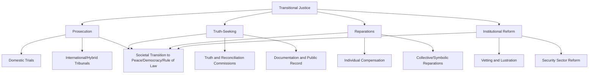

## Transitional Justice

### Definition and Conceptual Scope

Transitional justice refers to the range of judicial and non-judicial measures adopted by societies to address legacies of large-scale past human rights abuses — including genocide, war crimes, crimes against humanity, and systematic repression — as they transition from conflict or authoritarian rule toward peace, democracy, and the rule of law. The field emerged as a distinct area of scholarship and practice in the late twentieth century, drawing together international law, comparative politics, criminology, and peacebuilding studies.

**Key Points**

- Transitional justice is typically organized around four widely recognized pillars: prosecution, truth-seeking, reparations, and institutional reform, often summarized in policy literature as the "four pillars" framework
- The field emerged prominently from Latin American and post-communist European democratic transitions in the 1980s–1990s, later expanding to post-conflict and post-genocide contexts globally
- A persistent core tension exists between the pursuit of accountability (retributive justice) and the practical imperatives of political stability, reconciliation, and negotiated peace, often termed the "peace versus justice" dilemma

### The Four Pillars Framework

#### Prosecution

Criminal accountability for perpetrators of mass atrocity, pursued through domestic courts, international tribunals, or hybrid mechanisms combining both. Prosecution is grounded in retributive justice principles and the claim that accountability deters future violations and affirms the rule of law, but faces practical constraints including limited judicial capacity in post-conflict states, evidentiary challenges, and the sheer scale of potential perpetrators in mass-participation atrocities.

#### Truth-Seeking

Formal processes, most commonly truth commissions, established to investigate and publicly document the causes, nature, and extent of past violations, often incorporating victim testimony. Truth-seeking is grounded in the claim that establishing an authoritative public record serves distinct value from prosecution — including acknowledgment for victims, prevention of denialism, and a foundation for broader societal reconciliation — even where prosecution is not feasible for all perpetrators.

#### Reparations

Material and symbolic measures intended to remedy harm suffered by victims, including monetary compensation, restitution of property, rehabilitation services (medical, psychological), and symbolic measures (memorials, public apologies, commemorative practices). Reparations programs can be individual or collective, and may be pursued through litigation, administrative programs, or negotiated political settlements.

#### Institutional Reform (Guarantees of Non-Recurrence)

Structural changes to state institutions — security services, judiciary, police, military — implicated in past abuses, intended to prevent recurrence. This commonly includes **vetting/lustration** (removing or excluding individuals implicated in abuses from public office or security roles) and broader security sector reform.

### Diagram: The Four Pillars of Transitional Justice

### Mechanisms in Practice

#### Truth Commissions

Truth commissions are among the most widely adopted transitional justice mechanisms, typically time-bound bodies empowered to investigate a defined period of past abuses and issue a public report with findings and recommendations.

**Example**

South Africa's Truth and Reconciliation Commission (TRC, established 1995 following the end of apartheid) is among the most studied transitional justice mechanisms globally, notable for its distinctive **conditional amnesty model**: perpetrators could receive amnesty from prosecution in exchange for full public disclosure of politically motivated crimes committed during apartheid, reflecting an explicit prioritization of truth-telling and reconciliation over criminal accountability, a design choice that remains debated among scholars weighing its contribution to peaceful transition against its departure from retributive justice norms.

#### Criminal Prosecution Mechanisms

- **Domestic trials**: prosecutions conducted in national courts, sometimes years or decades after the underlying events (e.g., Argentina's prosecutions of military junta officials following its 1976–1983 "Dirty War")
- **International tribunals**: UN Security Council-established ad hoc tribunals (ICTY, ICTR) and the permanent International Criminal Court
- **Hybrid/internationalized tribunals**: combining international and domestic law, personnel, and procedure, often located within the affected country (e.g., the Special Court for Sierra Leone, the Extraordinary Chambers in the Courts of Cambodia)
- **Universal jurisdiction prosecutions**: prosecutions conducted in third-country domestic courts under the principle that certain crimes may be tried regardless of where they occurred

#### Reparations Programs

**Example**

Germany's post-war reparations to Holocaust survivors and the state of Israel (beginning with the 1952 Luxembourg Agreement) represent one of the earliest and most extensive state reparations programs, combining direct compensation payments, pension schemes for survivors, and continued institutional funding, and are frequently cited as a reference case in comparative reparations scholarship, though scholars note the German case's scale and duration are not typical of most transitional justice reparations programs, which tend to be more constrained by the fiscal capacity of transitional and often low-income states. [Inference: the generalizability of the German case to lower-resource transitional contexts is limited, a point frequently made in comparative reparations scholarship.]

#### Vetting and Lustration

**Example**

Post-communist Central and Eastern European states (e.g., Czech Republic, Poland) implemented lustration laws restricting individuals who had collaborated with communist-era secret police from holding public office, illustrating institutional reform's function of altering the personnel composition of state institutions as a distinct mechanism from prosecution, though such laws have generated ongoing debate regarding due process protections and the risk of politically motivated application.

### Diagram: Sequencing and Interaction of Transitional Justice Mechanisms (svg_diagram)

<svg xmlns="http://www.w3.org/2000/svg" viewBox="0 0 880 360">
\<style\>
.title{font:bold 16px sans-serif;fill:#1a1a2e;}
.box{font:12px sans-serif;fill:#1a1a2e;}
.lbl{font:11px sans-serif;fill:#444;}
.node{fill:#eef3fb;stroke:#3a5a8c;stroke-width:1.5;}
.center{fill:#fff4e0;stroke:#b8860b;stroke-width:2;}
.arrow{stroke:#555;stroke-width:1.5;fill:none;marker-end:url(#arrow8);}
\</style\>
<text x="440" y="28" text-anchor="middle" class="title">Transitional Justice Process Flow (svg_diagram)</text>
<rect x="40" y="70" width="180" height="55" rx="8" class="node" />
<text x="130" y="92" text-anchor="middle" class="box">Conflict/Authoritarian</text>
<text x="130" y="108" text-anchor="middle" class="box">Rule Ends</text>
<rect x="280" y="70" width="180" height="55" rx="8" class="center" />
<text x="370" y="92" text-anchor="middle" class="box">Political Transition</text>
<text x="370" y="108" text-anchor="middle" class="box">Negotiation</text>
<rect x="520" y="10" width="160" height="50" rx="8" class="node" />
<text x="600" y="30" text-anchor="middle" class="box">Truth</text>
<text x="600" y="46" text-anchor="middle" class="box">Commission</text>
<rect x="520" y="80" width="160" height="50" rx="8" class="node" />
<text x="600" y="100" text-anchor="middle" class="box">Prosecutions</text>
<rect x="520" y="150" width="160" height="50" rx="8" class="node" />
<text x="600" y="170" text-anchor="middle" class="box">Reparations</text>
<rect x="520" y="220" width="160" height="50" rx="8" class="node" />
<text x="600" y="240" text-anchor="middle" class="box">Institutional Reform</text>
<path d="M220,97 L280,97" class="arrow" />
<path d="M460,97 L520,35" class="arrow" />
<path d="M460,97 L520,105" class="arrow" />
<path d="M460,97 L520,175" class="arrow" />
<path d="M460,97 L520,245" class="arrow" />
<rect x="330" y="290" width="220" height="55" rx="8" class="node" />
<text x="440" y="312" text-anchor="middle" class="box">Consolidated Peace,</text>
<text x="440" y="328" text-anchor="middle" class="box">Democratic Governance</text>
<path d="M600,60 L440,290" class="arrow" />
<path d="M600,130 L440,290" class="arrow" />
<path d="M600,200 L440,290" class="arrow" />
<path d="M600,270 L440,290" class="arrow" />
</svg>

### Theoretical Debates

#### Peace versus Justice Dilemma

A central and recurring debate concerns whether pursuing criminal accountability during or immediately after conflict risks undermining fragile peace negotiations (as perpetrators may resist ceding power absent amnesty guarantees), versus whether foregoing accountability undermines the rule of law and risks entrenching impunity that can contribute to future violations. [Inference: the empirical literature testing whether prosecution genuinely undermines or instead has little effect on peace processes remains mixed and context-dependent rather than yielding a generalizable finding across all cases.]

#### Retributive versus Restorative Justice

Retributive approaches emphasize punishment proportionate to wrongdoing as the core requirement of justice, typically operationalized through criminal prosecution. Restorative approaches (influential in cases like South Africa's TRC) emphasize repairing harm, restoring relationships, and reintegrating both victims and perpetrators into a shared political community, often prioritizing truth-telling, acknowledgment, and reconciliation over punishment.

#### Amnesty and Its Contested Legality

While amnesties were historically common tools for securing negotiated transitions, contemporary international law increasingly restricts their permissibility for the most serious international crimes (genocide, crimes against humanity, grave breaches of the Geneva Conventions), reflected in jurisprudence from international and regional courts holding that blanket amnesties for such crimes are impermissible — creating tension with the continued political utility amnesty offers in some negotiated transitions.

#### Local versus International Ownership

Debate persists over the appropriate balance between internationally designed and supported transitional justice mechanisms (which can bring resources, expertise, and perceived impartiality) versus locally led and culturally embedded processes (which may better reflect local conceptions of justice and reconciliation and generate greater domestic legitimacy), with hybrid tribunals representing one institutional attempt to bridge this tension.

### Contemporary Extensions

- **Gender-sensitive transitional justice**: growing attention to conflict-related sexual violence as a distinct category requiring specialized investigative, prosecutorial, and reparative approaches, reflected in evolving ICC jurisprudence and dedicated UN mechanisms
- **Socioeconomic and structural violence**: debate over whether transitional justice frameworks, historically focused on civil/political rights violations, should more explicitly address socioeconomic harms and structural inequalities that contributed to conflict
- **Traditional and customary justice mechanisms**: incorporation of local/customary reconciliation practices alongside formal mechanisms (e.g., *gacaca* community courts used in post-genocide Rwanda to process the large caseload of genocide-related prosecutions at local level)

### Critiques and Limitations

- **Selectivity and political constraint**: Transitional justice processes are frequently shaped and limited by the underlying political settlement that ended conflict, meaning the scope of accountability achieved often reflects the relative bargaining power of former belligerents rather than a purely victim-centered or legally optimal outcome
- **Resource and capacity constraints**: Truth commissions and reparations programs in low-income post-conflict states often operate under severe budgetary and institutional capacity limitations, constraining the scope and quality of outcomes achievable
- **Measuring effectiveness**: Empirically assessing whether transitional justice mechanisms actually achieve their stated goals (reconciliation, deterrence, democratic consolidation) remains methodologically difficult, and findings across the comparative literature are mixed rather than uniformly affirming mechanism effectiveness
- **Victim-centeredness in practice**: Critics note that transitional justice processes, despite rhetorical commitment to victim-centered design, can in practice be driven more by elite political negotiation and international donor priorities than by victims' own expressed needs and preferences

### Related Topics

- Human Rights Institutions and Enforcement
- International Criminal Court and the Rome Statute
- Truth and Reconciliation Commissions (Comparative Cases)
- Humanitarian Intervention and the Responsibility to Protect
- Post-Conflict Peacebuilding and Democratization
- Genocide Prevention and Accountability
- Amnesty and International Law
- Security Sector Reform
- Conflict-Related Sexual Violence and International Law
- Universal Jurisdiction and Domestic Prosecution of International Crimes