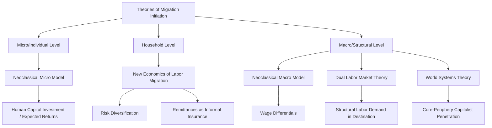
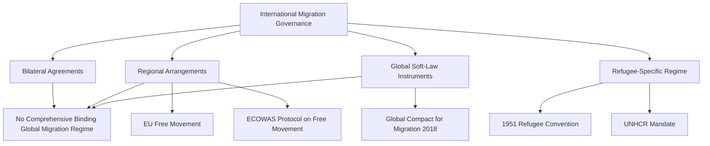

## Theories of International Migration

### Definition and Conceptual Scope

Theories of international migration comprise the body of explanatory frameworks developed across economics, sociology, demography, and political science to account for why individuals move across international borders, what sustains migration flows once initiated, and how migration processes are structured, regulated, and politically contested. No single theory comprehensively explains all forms of migration; the field instead comprises multiple, partially complementary and partially competing frameworks operating at different levels of analysis (individual, household, network, structural, and state/policy levels).

**Key Points**

- Migration theories can be broadly grouped into theories explaining the **initiation** of migration flows and theories explaining their **perpetuation** over time, a distinction emphasized in influential synthesis work (notably Massey et al., "Theories of International Migration," 1993)
- Different theoretical traditions emerged from different disciplinary starting points (neoclassical economics, historical-structural sociology, network sociology) and often carry distinct normative and policy implications
- Political science approaches to migration theory are particularly concerned with the role of state policy, borders, and receiving-society political dynamics, which purely economic models often treat as exogenous or secondary

### Micro-Level and Individual-Choice Theories

#### Neoclassical Economics: Macro-Level Model

The earliest systematic migration theory, rooted in neoclassical economics, explains international migration as driven by geographic differences in labor supply and demand, producing wage differentials between capital-rich, labor-scarce destination countries and labor-rich, capital-scarce origin countries. Migration flows are theorized to persist until wage equalization occurs, at which point net migration should approach zero.

#### Neoclassical Economics: Micro-Level Model (Human Capital Approach)

Building on the macro-level model, the micro-level variant (associated with Sjaastad's 1962 human capital framework) treats migration as an individual investment decision: rational individuals calculate the expected costs (travel, forgone earnings, psychological costs of dislocation) and expected benefits (higher wages, discounted over time) of migrating, and migrate when expected net returns are positive.

$$ER = \sum_{t=0}^{n} \frac{p_1(t)Y_{D1}(t) - p_2(t)Y_{O2}(t)}{(1+r)^t} - C(0)$$

where $ER$ is expected net returns, $Y_{D1}$ and $Y_{O2}$ represent earnings at destination and origin, $p$ represents the probability of employment, $r$ is the discount rate, and $C(0)$ represents the initial costs of migration. [Inference: this formalization is a standard textbook representation of the human capital investment model rather than a single canonical equation universally used without variation across the literature.]

#### The New Economics of Labor Migration (NELM)

Developed primarily by Oded Stark and associates beginning in the 1980s, NELM challenges the individualist assumption of neoclassical models, arguing migration decisions are made collectively by households or families, not simply isolated individuals maximizing personal income. Households strategically send members to work in different labor markets (domestic and international) as a form of **risk diversification** against local economic shocks (crop failure, unemployment, currency instability), with remittances functioning as an informal insurance mechanism rather than purely a function of wage differentials.

**Key Points**

- NELM explains phenomena that pure wage-differential models struggle to account for, such as migration continuing even where destination-origin wage gaps narrow, since risk-diversification motives are not solely a function of the wage gap
- NELM also helps explain why migration sometimes occurs even from relatively better-off households (which can better afford the upfront costs and risks of migration) rather than exclusively the poorest households

### Diagram: Migration Initiation Theories by Level of Analysis

### Macro-Level and Structural Theories

#### Dual Labor Market Theory

Associated with Michael Piore's *Birds of Passage* (1979), this theory locates the cause of migration not in individual wage-maximizing decisions but in the structural demand of advanced industrial economies, which develop a segmented ("dual") labor market: a primary sector of stable, well-compensated jobs held by native workers, and a secondary sector of low-wage, unstable, low-prestige jobs that native workers are reluctant to fill, generating persistent structural demand for immigrant labor largely independent of wage-differential dynamics or even destination-country unemployment levels.

#### World Systems Theory

Drawing on Immanuel Wallerstein's world-systems framework and applied to migration by scholars including Alejandro Portes and Saskia Sassen, this theory locates the origins of migration in the historical and structural penetration of capitalist economic relations into peripheral and semi-peripheral regions by core capitalist states — through colonialism, foreign direct investment, and global production networks — which disrupts traditional economic arrangements (e.g., displacing smallholder agriculture) and generates a mobile, displaced population disposed toward migration, often specifically toward the core countries most directly linked to the origin country through prior economic and political ties.

**Example**

World systems theory offers a distinct explanation for observed migration corridors — for instance, historical colonial and economic ties between former colonial powers and their former colonies (e.g., Algeria–France, Philippines–United States) — that a pure wage-differential model would not predict as strongly, since such models focus on relative wage gaps rather than pre-existing structural and historical linkages between specific country pairs. [Inference: while colonial-era ties are widely cited as a strong predictor of contemporary migration corridors in the empirical literature, attributing this pattern exclusively to world-systems dynamics versus overlapping explanations, such as shared language and existing migrant networks, is an interpretive judgment rather than a settled single-cause finding.]

### Meso-Level and Perpetuation Theories

#### Network Theory

Social network theory explains why migration, once initiated, tends to persist and expand even after the original structural or economic conditions that initiated it change, through the mechanism of **migrant networks**: interpersonal ties connecting migrants, former migrants, and non-migrants in origin and destination areas that transmit information, provide assistance with travel and settlement, and reduce the costs and risks of migration for subsequent migrants, creating **cumulative causation** — each act of migration alters the social context in ways that make additional migration more likely.

#### Institutional Theory

Institutional theory emphasizes the role of formal and informal organizations — recruitment agencies, smuggling and trafficking networks, humanitarian and legal-assistance NGOs — that emerge to service migrant flows once they reach a critical mass, creating a supporting institutional infrastructure that sustains migration independent of the original economic drivers, and that can develop interests in the continuation of migration flows themselves.

#### Cumulative Causation

Douglas Massey's concept of cumulative causation describes how migration itself progressively alters the social, economic, and cultural conditions that shape future migration decisions: for example, as migration becomes normalized within a community, the "culture of migration" itself can become a self-reinforcing factor, and origin-community relative deprivation (relative to already-migrating neighbors) can independently motivate further migration.

#### Migration Systems Theory

This framework conceptualizes migration as occurring within relatively stable systems of exchange linking specific sets of countries through flows of people, capital, goods, and information, emphasizing the multi-directional and interconnected nature of migration relationships within a defined system (e.g., the North American migration system linking Mexico, Central America, and the United States) rather than treating any single migration corridor in isolation.

### Diagram: Cumulative Causation and Network Dynamics (svg_diagram)

<svg xmlns="http://www.w3.org/2000/svg" viewBox="0 0 880 340">
\<style\>
.title{font:bold 16px sans-serif;fill:#1a1a2e;}
.box{font:12px sans-serif;fill:#1a1a2e;}
.lbl{font:11px sans-serif;fill:#444;}
.node{fill:#eef3fb;stroke:#3a5a8c;stroke-width:1.5;}
.arrow{stroke:#555;stroke-width:1.5;fill:none;marker-end:url(#arrow10);}
\</style\>
<text x="440" y="28" text-anchor="middle" class="title">Cumulative Causation Feedback Loop (svg_diagram)</text>
<rect x="330" y="60" width="220" height="55" rx="8" class="node" />
<text x="440" y="85" text-anchor="middle" class="box">Initial Migration Event</text>
<text x="440" y="101" text-anchor="middle" class="box">(structural/economic cause)</text>
<rect x="330" y="170" width="220" height="55" rx="8" class="node" />
<text x="440" y="195" text-anchor="middle" class="box">Expanded Migrant</text>
<text x="440" y="211" text-anchor="middle" class="box">Network Ties</text>
<rect x="330" y="280" width="220" height="55" rx="8" class="node" />
<text x="440" y="305" text-anchor="middle" class="box">Reduced Cost/Risk</text>
<text x="440" y="321" text-anchor="middle" class="box">for Subsequent Migrants</text>
<path d="M440,115 L440,170" class="arrow" />
<path d="M440,225 L440,280" class="arrow" />
<path d="M550,300 C 700,300 700,90 550,90" class="arrow" />
<text x="700" y="200" text-anchor="middle" class="lbl">reinforces</text>
</svg>

### State and Policy-Centered Approaches

#### Political Economy of Migration Control

Political science approaches examine why receiving states adopt particular migration control policies, drawing on interest-group theory (business interests favoring open labor migration versus labor and nativist interests favoring restriction), and on the observation that democratic states often face a persistent "liberal paradox" (Hollifield): economic globalization creates pressure for open labor markets while domestic political pressures push toward restrictive immigration control, generating recurring tension in liberal democracies' migration policy.

#### Securitization of Migration

Constructivist and critical security studies scholars (notably associated with the Copenhagen School) analyze how migration, historically often treated as a primarily economic or humanitarian policy domain, has in many contexts been reframed as a **security issue** through political discourse and policy practice — a process termed securitization — with significant consequences for the legal and political treatment of migrants, including expanded border enforcement, detention, and restrictive asylum practice.

#### Regime Theory Applied to Migration Governance

Unlike trade or environmental governance, international migration lacks a comprehensive binding multilateral regime comparable to the WTO or UNFCCC; migration governance instead occurs through a fragmented patchwork of bilateral agreements, regional arrangements (e.g., EU free movement, ECOWAS protocols), and soft-law instruments (e.g., the 2018 Global Compact for Safe, Orderly and Regular Migration, which is explicitly non-binding), reflecting states' persistent reluctance to cede sovereign control over border and membership decisions to binding international authority.

### Diagram: State-Centered Migration Governance Landscape

### Comparative Summary of Major Theoretical Traditions

| Theory | Level of Analysis | Core Driver | Key Scholars |
| --- | --- | --- | --- |
| Neoclassical (macro) | Structural/national | Wage differentials | Lewis, Todaro |
| Neoclassical (micro) | Individual | Expected income maximization | Sjaastad |
| New Economics of Labor Migration | Household | Risk diversification | Stark |
| Dual Labor Market Theory | Structural/destination | Segmented labor demand | Piore |
| World Systems Theory | Structural/global | Capitalist penetration of periphery | Wallerstein, Sassen |
| Network Theory | Meso/social | Cumulative causation via ties | Massey |
| Institutional Theory | Meso/organizational | Supporting institutional infrastructure | Massey et al. |

### Critiques and Ongoing Debates

- **Fragmentation critique**: The proliferation of partially overlapping theories, each explaining some but not all migration patterns, has led some scholars to call for greater theoretical integration rather than continued proliferation of discipline-specific frameworks operating in relative isolation from one another
- **Economistic bias**: Critics argue that even sociological and structural theories often retain implicit economistic assumptions about migrant rationality, potentially underweighting political, cultural, and identity-based motivations for migration (e.g., political persecution, family reunification, lifestyle migration) that do not fit neatly into labor-market-centered frameworks
- **Neglect of forced migration**: Much classical migration theory was developed primarily with voluntary labor migration in mind, and scholars increasingly note the need for distinct or adapted theoretical frameworks to adequately capture forced displacement dynamics (conflict, persecution, climate-related displacement), where individual cost-benefit calculation plays a substantially different role
- **State-centrism versus migrant agency**: Political science approaches focused on state policy and control have been critiqued by scholars emphasizing migrant agency and autonomy of migration, who argue that framing migration primarily as a problem of state control underweights migrants' own strategic navigation of and resistance to control regimes
- **Gender-blindness in classical models**: Early migration theory was frequently critiqued for implicitly modeling the "migrant" as male, with subsequent feminist migration scholarship developing more gender-attentive frameworks addressing distinct patterns in women's labor migration, family migration, and care-work-driven migration flows

### Related Topics

- Refugee Protection and the 1951 Refugee Convention
- Diaspora Politics and Transnational Communities
- Securitization Theory and Border Politics
- Remittances and Development
- The Liberal Paradox in Immigration Policy (Hollifield)
- Migration and Global Distributive Justice
- EU Free Movement and Regional Migration Governance
- Forced Migration and Climate Displacement
- Global Compact for Safe, Orderly and Regular Migration
- Gender and Migration Studies