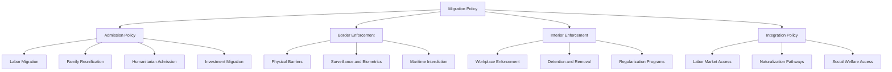
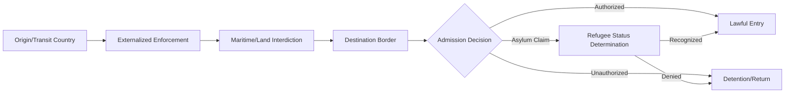

## Migration Policy and Border Control

### Definition and Conceptual Scope

Migration policy and border control encompass the legal frameworks, administrative institutions, and enforcement practices through which states regulate the entry, residence, and exit of non-citizens across their territorial borders. This domain sits at the intersection of sovereignty (the state's traditional prerogative to control membership), domestic politics (economic, security, and identity-based interests), and international legal obligations (refugee and human rights law), making it one of the more politically contested areas of contemporary governance.

**Key Points**

- Migration policy operates across multiple, often loosely coordinated dimensions: admission criteria, border enforcement, interior enforcement, integration policy, and exit/return policy
- States retain broad, though not unlimited, sovereign discretion over migration policy under international law, constrained primarily by non-refoulement obligations, human rights law, and any treaty commitments to freedom of movement (e.g., within regional blocs)
- Migration policy design reflects the "liberal paradox" identified by James Hollifield: economically liberal states face structural pressure toward openness (labor market needs, trade/investment linkages) while domestic political pressures frequently push toward restriction, producing persistent policy tension rather than stable equilibrium

### Categories of Migration Policy

#### Admission Policy

Rules governing who may lawfully enter and reside in a state's territory, typically organized around several admission channels:

- **Labor migration**: points-based systems (e.g., Canada, Australia, the UK's post-Brexit system) selecting migrants based on skills, education, and labor market criteria, versus employer-sponsored/demand-driven systems (e.g., the U.S. H-1B visa program) tied to specific job offers
- **Family reunification**: admission based on kinship ties to citizens or lawful residents, historically the largest admission category in several major destination countries including the United States
- **Humanitarian admission**: refugee resettlement and asylum, governed substantially by international refugee law obligations rather than purely domestic policy discretion
- **Investment/economic migration**: "golden visa" and citizenship-by-investment programs granting residency or citizenship in exchange for capital investment

#### Border Enforcement Policy

Physical, technological, and administrative measures to prevent or regulate unauthorized entry, including physical barriers, surveillance technology, maritime interdiction, biometric screening, and coordinated multilateral border management arrangements (e.g., the EU's Frontex agency).

#### Interior Enforcement Policy

Measures targeting unauthorized presence within a state's territory after entry, including workplace enforcement, detention, and deportation/removal proceedings, and administrative mechanisms such as status regularization programs.

#### Integration Policy

Measures affecting migrants' social, economic, and civic incorporation into the receiving society, including language and civic education requirements, labor market access, access to social welfare benefits, and naturalization/citizenship pathways.

### Diagram: Dimensions of Migration Policy

### Theoretical Frameworks for Understanding Migration Policy

#### Interest-Group and Political Economy Approaches

These approaches (associated with scholars including Hollifield and Gary Freeman) explain migration policy outcomes as the product of competing organized interests: business and employer groups generally favoring expanded labor migration (lower labor costs, addressing skill shortages), organized labor historically more ambivalent or opposed (wage competition concerns), and ethnic/civil-society advocacy groups favoring expanded family and humanitarian admission — with policy outcomes reflecting the relative political influence of these coalitions within a given domestic political system.

#### Client Politics Model

Freeman's "client politics" model argues immigration policy in liberal democracies is often characterized by concentrated, well-organized beneficiary interests (employers, ethnic advocacy groups) actively lobbying for expansive policy, against a diffuse, poorly organized general public bearing more distributed costs, producing a persistent tendency toward expansionary policy in liberal states relative to public opinion — a pattern Freeman argued has been increasingly challenged by the mobilization of restrictionist public opinion and political movements in subsequent decades.

#### Securitization Theory

Drawing on the Copenhagen School of security studies, securitization theory analyzes how migration is discursively constructed as an existential security threat by political actors (rather than reflecting an objective threat level), with significant policy consequences once successfully securitized: migration control shifts from ordinary administrative/economic policy domains toward exceptional security-oriented measures (border militarization, expanded executive discretion, reduced due process), often justified by reference to terrorism, criminality, or cultural/demographic anxiety.

#### Rights-Based and Legal Constraint Approaches

This perspective (associated with scholars including Hollifield's broader "liberal state" thesis) emphasizes how domestic and international legal constraints — constitutional rights protections, judicial review, and international human rights and refugee law — limit state discretion over migration policy even in the security-oriented and restrictionist political climates, noting that liberal democratic states cannot exercise migration control with the same unconstrained discretion as non-democratic states due to independent judicial review and rights litigation.

### Diagram: Policy Formation Dynamics (svg_diagram)

<svg xmlns="http://www.w3.org/2000/svg" viewBox="0 0 880 360">
\<style\>
.title{font:bold 16px sans-serif;fill:#1a1a2e;}
.box{font:12px sans-serif;fill:#1a1a2e;}
.lbl{font:11px sans-serif;fill:#444;}
.node{fill:#eef3fb;stroke:#3a5a8c;stroke-width:1.5;}
.center{fill:#fff4e0;stroke:#b8860b;stroke-width:2;}
.arrow{stroke:#555;stroke-width:1.5;fill:none;marker-end:url(#arrow11);}
\</style\>
<text x="440" y="28" text-anchor="middle" class="title">Competing Pressures on Migration Policy (svg_diagram)</text>
<rect x="340" y="150" width="200" height="60" rx="8" class="center" />
<text x="440" y="175" text-anchor="middle" class="box">Migration Policy</text>
<text x="440" y="192" text-anchor="middle" class="box">Outcome</text>
<rect x="40" y="40" width="200" height="55" rx="8" class="node" />
<text x="140" y="62" text-anchor="middle" class="box">Employer/Business</text>
<text x="140" y="78" text-anchor="middle" class="box">Interests (openness)</text>
<rect x="40" y="270" width="200" height="55" rx="8" class="node" />
<text x="140" y="292" text-anchor="middle" class="box">Restrictionist</text>
<text x="140" y="308" text-anchor="middle" class="box">Public/Political Pressure</text>
<rect x="640" y="40" width="200" height="55" rx="8" class="node" />
<text x="740" y="62" text-anchor="middle" class="box">International Legal</text>
<text x="740" y="78" text-anchor="middle" class="box">Obligations</text>
<rect x="640" y="270" width="200" height="55" rx="8" class="node" />
<text x="740" y="292" text-anchor="middle" class="box">Securitization</text>
<text x="740" y="308" text-anchor="middle" class="box">Discourse</text>
<path d="M240,80 L340,170" class="arrow" />
<path d="M240,290 L340,195" class="arrow" />
<path d="M640,80 L540,170" class="arrow" />
<path d="M640,290 L540,195" class="arrow" />
</svg>

### Border Control Mechanisms and Architecture

#### Physical and Technological Infrastructure

- **Physical barriers**: fencing and wall construction at land borders (e.g., the U.S.-Mexico border, sections of the EU's external border)
- **Biometric and digital systems**: fingerprint and facial recognition databases, entry-exit tracking systems, and advance passenger information sharing between carriers and border authorities
- **Maritime interdiction**: naval and coast guard operations intercepting vessels attempting unauthorized sea crossings, often raising distinct legal questions regarding non-refoulement obligations when interdiction occurs outside a state's territorial waters

#### Externalization of Border Control

A significant contemporary trend involves destination states extending migration control functions beyond their own territorial borders through cooperation with transit and origin countries — including funding and equipping third-country border enforcement, negotiating readmission agreements, and establishing offshore processing arrangements — intended to intercept or deter migration before it reaches the destination state's own territory.

**Example**

The European Union's cooperation arrangements with transit countries such as Libya and Turkey (including the 2016 EU-Turkey Statement) represent prominent examples of border externalization, under which financial and logistical support is provided to third countries in exchange for intercepting migration flows before they reach EU territory — arrangements that have generated substantial human rights criticism regarding conditions faced by intercepted migrants in transit countries and the practical accountability gaps created when enforcement is conducted by third-country actors rather than the destination state directly.

#### Regional Free Movement Arrangements

Some regions have moved in the opposite direction, establishing binding legal frameworks for freedom of movement among member states:

- **European Union**: the Schengen Area eliminates internal border controls among most member states while maintaining a coordinated external border (Frontex), representing the most extensive regional free movement regime globally
- **ECOWAS**: the West African regional bloc's Protocol on Free Movement of Persons establishes rights of entry, residence, and establishment among member states, though implementation gaps remain significant across the region

### Diagram: Border Control Enforcement Chain

### Legal Constraints on State Discretion

#### Non-Refoulement

The core constraint on state migration control discretion under international refugee and human rights law is the principle of non-refoulement: prohibition on returning individuals to a country where they face a well-founded fear of persecution or a real risk of torture or other serious harm, codified in the 1951 Refugee Convention and reinforced through international human rights instruments (e.g., the Convention against Torture).

#### Domestic Constitutional and Judicial Constraints

In many liberal democracies, judicial review provides an important constraint on executive migration policy discretion, with courts in various jurisdictions having invalidated or limited specific immigration enforcement measures on due process, equal protection, or statutory grounds — illustrating Hollifield's broader observation that liberal states face internal legal constraints on migration control not equally present in non-democratic systems.

### Critiques and Contemporary Debates

- **Effectiveness critique**: Scholars and policymakers debate whether intensified border enforcement measures (physical barriers, increased enforcement personnel) meaningfully reduce unauthorized migration, or primarily alter migration routes, increase reliance on smuggling networks, and raise the risk and cost of crossings without proportionately reducing overall flows [Inference: empirical findings on enforcement effectiveness vary substantially by context and enforcement type, and the literature does not support a single generalizable conclusion across all cases.]
- **Human rights and humanitarian costs**: Border enforcement intensification has been associated with documented increases in migrant deaths along certain routes and human rights concerns regarding detention conditions and interdiction practices, generating sustained criticism from humanitarian organizations and human rights bodies
- **Externalization accountability gap**: Delegating enforcement functions to third countries raises concerns about reduced legal accountability and oversight compared to enforcement conducted directly by the destination state, particularly regarding compliance with non-refoulement obligations
- **Securitization critique**: Critics argue that framing migration predominantly through a security lens can be empirically unwarranted relative to actual threat levels, and can generate policy responses disproportionate to demonstrated risk while entrenching restrictive practices that are politically difficult to reverse
- **Democratic legitimacy tension**: Ongoing debate over whether migration policy in practice reflects genuine democratic deliberation and public preference, or is more accurately explained by concentrated interest-group influence (per client politics theory) operating with limited direct public accountability

### Related Topics

- Theories of International Migration
- Refugee Protection and the 1951 Refugee Convention
- Non-Refoulement and International Human Rights Law
- Securitization Theory and Border Politics
- The Liberal Paradox in Immigration Policy (Hollifield)
- EU Schengen Area and Frontex
- Border Externalization and Third-Country Cooperation
- Diaspora Politics and Transnational Communities
- Citizenship and Naturalization Policy
- Client Politics and Interest Group Theory in Immigration