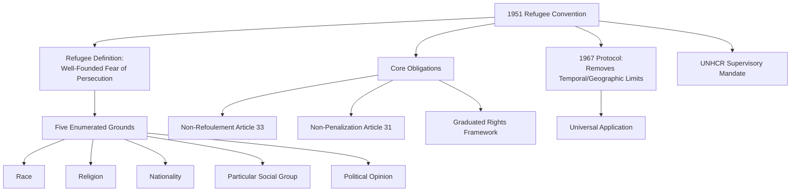

## Refugee Politics and Asylum Systems

### Definition and Conceptual Scope

Refugee politics and asylum systems encompass the international legal framework, domestic administrative procedures, and political dynamics governing the protection of individuals fleeing persecution, conflict, and serious harm across international borders. Unlike broader migration policy, which states largely design with wide discretion, refugee protection is substantially structured by binding international legal obligations, creating a distinctive governance domain in which sovereign discretion is more constrained than in general immigration policy.

**Key Points**

- The refugee protection regime rests on a foundational distinction between **refugees** (persons meeting a specific international legal definition, entitled to protection under binding treaty obligations) and other migrants (subject to greater state discretion over admission)
- The core international legal instrument, the 1951 Refugee Convention, was drafted in a specific Cold War and post-WWII European context, and its adequacy for contemporary global displacement patterns remains a subject of ongoing debate
- Refugee politics involves a persistent tension between international legal obligation (a rights-based, individual-entitlement framework) and domestic political and administrative discretion (asylum processing capacity, border control, public opinion)

### The 1951 Refugee Convention and Legal Framework

#### Definition and Scope

The 1951 Convention Relating to the Status of Refugees, as amended by the 1967 Protocol (which removed the original Convention's temporal and geographic limitations to European events before 1951), defines a refugee as a person who, owing to a well-founded fear of persecution for reasons of race, religion, nationality, membership of a particular social group, or political opinion, is outside their country of nationality and unable or unwilling to avail themselves of that country's protection.

**Key Points**

- The five enumerated grounds (race, religion, nationality, social group, political opinion) are exhaustive under the Convention text, meaning individuals fleeing generalized violence, natural disaster, or economic hardship without a persecution nexus to one of these grounds do not qualify as Convention refugees, even where their situation is genuinely dangerous or dire
- "Membership of a particular social group" has been the most contested and judicially developed ground, with evolving jurisprudence in various jurisdictions extending protection in some cases to categories including gender-based persecution and sexual orientation, though interpretation varies significantly across states
- The Convention definition's narrowness relative to the scope of contemporary forced displacement (including climate-related displacement and generalized conflict violence) is a central and recurring critique of the framework

#### Core Obligations

- **Non-refoulement (Article 33)**: the cornerstone obligation, prohibiting the return of a refugee to a territory where their life or freedom would be threatened on Convention grounds; widely regarded as having attained the status of customary international law binding even on non-signatory states
- **Non-penalization (Article 31)**: prohibits penalizing refugees for unauthorized entry or presence, provided they present themselves to authorities without delay and show good cause
- **Rights framework**: the Convention establishes a graduated set of rights (access to courts, employment, education, social welfare) that expand based on the refugee's degree of attachment to the host state

#### UNHCR Mandate

The UN High Commissioner for Refugees (UNHCR), established in 1950, holds the primary international mandate for refugee protection, supervising Convention implementation, providing direct protection and assistance in many contexts (particularly where host-state capacity is limited), and administering refugee status determination directly in some states lacking national asylum systems.

### Diagram: The International Refugee Protection Framework

### Domestic Asylum System Architecture

#### Refugee Status Determination (RSD) Procedures

States that are Convention parties typically establish domestic administrative and/or judicial procedures to determine whether an individual asylum applicant meets the refugee definition, generally involving:

- **Application and registration**: initial claim submission, often accompanied by biometric registration
- **Interview and evidence assessment**: adjudicators assess credibility and evaluate whether the claimed persecution risk meets the legal threshold, often relying on country-of-origin information reports
- **First-instance decision**: grant of refugee status, an alternative complementary protection status, or denial
- **Appeal mechanisms**: most systems provide administrative or judicial appeal rights, though the scope and independence of appellate review varies significantly across jurisdictions

#### Complementary and Subsidiary Protection

Many states have developed protection categories beyond the strict Convention refugee definition, recognizing that individuals facing serious harm not fitting the five enumerated grounds (e.g., generalized armed conflict violence, or the non-refoulement obligations under the Convention against Torture) merit protection. The European Union's Qualification Directive, for instance, establishes "subsidiary protection" for individuals facing real risk of serious harm from indiscriminate violence in armed conflict, without requiring proof of individualized persecution.

#### Temporary Protection Mechanisms

Some jurisdictions maintain distinct temporary protection regimes for mass influx situations, allowing expedited group-based protection without individualized status determination, exemplified by the EU's activation of its Temporary Protection Directive in 2022 in response to the large-scale displacement following Russia's invasion of Ukraine — the first activation of that mechanism since its 2001 adoption.

### Diagram: Asylum Determination Process Flow (svg_diagram)

<svg xmlns="http://www.w3.org/2000/svg" viewBox="0 0 880 380">
\<style\>
.title{font:bold 16px sans-serif;fill:#1a1a2e;}
.box{font:12px sans-serif;fill:#1a1a2e;}
.lbl{font:11px sans-serif;fill:#444;}
.node{fill:#eef3fb;stroke:#3a5a8c;stroke-width:1.5;}
.decision{fill:#fff4e0;stroke:#b8860b;stroke-width:1.5;}
.arrow{stroke:#555;stroke-width:1.5;fill:none;marker-end:url(#arrow12);}
\</style\>
<text x="440" y="28" text-anchor="middle" class="title">Refugee Status Determination Pathway (svg_diagram)</text>
<rect x="40" y="150" width="160" height="55" rx="8" class="node" />
<text x="120" y="172" text-anchor="middle" class="box">Application</text>
<text x="120" y="188" text-anchor="middle" class="box">and Registration</text>
<rect x="260" y="150" width="160" height="55" rx="8" class="node" />
<text x="340" y="172" text-anchor="middle" class="box">Interview and</text>
<text x="340" y="188" text-anchor="middle" class="box">Evidence Review</text>
<rect x="480" y="150" width="160" height="55" rx="8" class="decision" />
<text x="560" y="172" text-anchor="middle" class="box">First-Instance</text>
<text x="560" y="188" text-anchor="middle" class="box">Decision</text>
<path d="M200,177 L260,177" class="arrow" />
<path d="M420,177 L480,177" class="arrow" />
<rect x="700" y="40" width="160" height="50" rx="8" class="node" />
<text x="780" y="60" text-anchor="middle" class="box">Refugee Status</text>
<text x="780" y="76" text-anchor="middle" class="box">Granted</text>
<rect x="700" y="150" width="160" height="50" rx="8" class="node" />
<text x="780" y="170" text-anchor="middle" class="box">Complementary</text>
<text x="780" y="186" text-anchor="middle" class="box">Protection</text>
<rect x="700" y="260" width="160" height="50" rx="8" class="node" />
<text x="780" y="280" text-anchor="middle" class="box">Denial</text>
<path d="M640,165 L700,65" class="arrow" />
<path d="M640,177 L700,175" class="arrow" />
<path d="M640,190 L700,280" class="arrow" />
<rect x="480" y="290" width="160" height="55" rx="8" class="node" />
<text x="560" y="312" text-anchor="middle" class="box">Appeal</text>
<text x="560" y="328" text-anchor="middle" class="box">Mechanism</text>
<path d="M780,285 L560,290" class="arrow" />
</svg>

### Politics of Refugee Reception and Responsibility-Sharing

#### Global Distribution of Displacement

**Key Points**

- The overwhelming majority of the world's refugees are hosted by developing countries in regions neighboring conflict zones, rather than by wealthy states in the Global North, a pattern UNHCR annual reporting consistently documents [Unverified: precise current-year global displacement figures and host-country rankings change annually and should be checked against the most recent UNHCR Global Trends report rather than assumed static]
- This geographic distribution generates ongoing debate over "burden-sharing" or "responsibility-sharing" — the question of how the costs and responsibilities of refugee hosting should be distributed among states with vastly different economic capacity and proximity to displacement crises

#### The Global Compact on Refugees

Adopted by the UN General Assembly in 2018 (alongside the separate, broader Global Compact for Migration), the Global Compact on Refugees is a non-binding framework intended to operationalize more equitable and predictable international responsibility-sharing, including mechanisms such as the Comprehensive Refugee Response Framework and periodic Global Refugee Forums, though it creates no binding quota or redistribution obligations on states.

#### Resettlement as a Durable Solution

UNHCR identifies three traditional "durable solutions" to refugee situations: voluntary repatriation (return to the country of origin once conditions permit), local integration (permanent settlement in the first country of asylum), and third-country resettlement (permanent relocation to another state). Resettlement, while often considered the most protective solution for particularly vulnerable individuals, accommodates only a small fraction of the global refugee population relative to overall need, given that resettlement places are allocated at the voluntary discretion of a limited number of resettlement states.

### Politicization and Domestic Political Dynamics

#### Securitization of Asylum

Asylum policy has been substantially affected by the broader securitization of migration discourse (Copenhagen School framework), with asylum seekers in various political contexts framed as potential security threats, economic burdens, or cultural challenges, shaping public support for restrictive versus protective policy responses independent of the underlying legal merits of individual claims. [Inference: the relationship between securitized discourse and specific policy outcomes varies by country and political context rather than following a single uniform pattern across all democracies.]

#### Deterrence-Oriented Policy Measures

Many destination states have adopted policies explicitly intended to deter asylum seeking, including offshore processing arrangements, "safe third country" agreements (returning asylum seekers to transit countries deemed safe), expedited/accelerated procedures with reduced procedural safeguards, and restrictions on work authorization or welfare access during claim processing — measures whose compatibility with non-refoulement and broader international protection obligations is frequently contested in domestic and international litigation.

**Example**

Australia's offshore processing policy, under which asylum seekers arriving by boat are transferred to processing centers in third countries (historically Nauru and Papua New Guinea) rather than having claims processed on the Australian mainland, represents one of the most extensively studied deterrence-oriented policy models, credited by proponents with substantially reducing irregular maritime arrivals, while drawing sustained criticism from human rights organizations and UNHCR regarding conditions in offshore facilities and the policy's compatibility with international protection standards. [Inference: the specific causal contribution of offshore processing, as distinct from other concurrent policy changes such as maritime interdiction, to the observed reduction in arrivals is debated in the policy evaluation literature rather than definitively isolated.]

#### Public Opinion and Political Mobilization

Refugee and asylum policy has become an increasingly salient issue in domestic electoral politics across many destination regions, with political parties across the ideological spectrum mobilizing around asylum policy, and public attitudes shown in comparative survey research to be shaped by a combination of economic concern, cultural/identity considerations, and perceived state control (or loss of control) over borders.

### Critiques and Ongoing Debates

- **Definitional adequacy critique**: The 1951 Convention's persecution-based definition is widely argued to inadequately capture contemporary displacement drivers, including generalized conflict violence, environmental and climate-related displacement, and gang-related violence, leaving substantial displaced populations outside the Convention's binding protection framework and dependent on more discretionary complementary protection regimes
- **Responsibility-sharing failure**: Critics argue the international refugee regime lacks effective mechanisms to ensure equitable distribution of hosting responsibility, resulting in a system where proximity to crisis (correlating strongly with lower-income host states) rather than capacity determines the practical distribution of protection burden
- **Access and deterrence tension**: A persistent critique holds that deterrence-oriented policies (interdiction, safe third country returns, offshore processing) function to prevent asylum seekers from ever accessing the legal protection procedures to which they may be entitled, effectively narrowing Convention protections through practical/procedural obstruction rather than through formal legal amendment
- **Politicization and protection space erosion**: Scholars note that intensifying securitization and politicization of asylum in many democracies correlates with a broader "shrinking protection space" — declining resettlement commitments, tightening admission criteria, and expanding executive discretion — raising concern about the durability of the post-1951 protection framework in the current political climate [Speculation: whether this represents a durable long-term erosion of the international protection regime or a more cyclical political phase remains a genuinely open and contested question among refugee law and policy scholars.]
- **Selective solidarity concern**: Comparative scholarship has noted significant disparities in public and governmental reception responses to different refugee crises, raising questions about whether responses are driven primarily by need and legal obligation or are also shaped by factors including perceived cultural proximity and geopolitical alignment

### Related Topics

- Migration Policy and Border Control
- Non-Refoulement and International Human Rights Law
- Theories of International Migration
- UNHCR Mandate and Global Displacement Governance
- Securitization Theory and Border Politics
- Global Compact on Refugees and Responsibility-Sharing
- Temporary Protection Mechanisms (Comparative Cases)
- Diaspora Politics and Transnational Communities
- Climate Displacement and Legal Protection Gaps
- Offshore Processing and Deterrence Policy Models