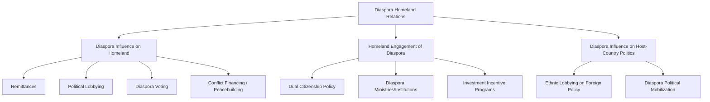

## Diaspora Communities and Homeland Politics

### Definition and Conceptual Scope

Diaspora communities and homeland politics examines the political, economic, and social relationships that migrant-origin communities settled abroad maintain with their countries of origin, and how these transnational ties shape both homeland governance and host-country political dynamics. The field has grown substantially since the 1990s as scholars increasingly recognized that migration does not sever political ties to the origin state but frequently transforms and extends them across borders.

**Key Points**

- The concept of "diaspora" has expanded significantly from its classical usage (originally describing specific historical experiences of forced dispersal, notably the Jewish and Armenian diasporas) to a broader contemporary usage encompassing any населення community maintaining a collective identity and connection to a homeland across generations and borders
- Diaspora politics operates bidirectionally: diasporas influence homeland politics (through remittances, lobbying, voting, and direct political participation), while homeland states increasingly develop deliberate policies to engage and mobilize their diaspora populations
- The field draws on transnationalism theory in migration studies, which emphasizes that migrants frequently maintain simultaneous, ongoing connections to both origin and destination societies rather than undergoing a linear, one-directional assimilation process

### Conceptualizing Diaspora

#### Classical and Expanded Definitions

Scholars including William Safran (1991) and Robin Cohen (*Global Diasporas*, 1997) developed influential typological frameworks distinguishing diaspora characteristics: dispersal from an original homeland (often but not always traumatic), maintenance of a collective memory and idealization of the homeland, a sense of alienation or distinctiveness within the host society, a commitment to homeland restoration or maintenance, and continued group solidarity across the dispersed population. Cohen's typology further distinguished among victim diasporas (e.g., Jewish, Armenian, African), labor diasporas (e.g., Indian indentured labor migration), trade diasporas, imperial diasporas, and cultural diasporas, reflecting the diversity of historical dispersal experiences now grouped under the broader term.

#### Diaspora versus Migrant Community

**Key Points**

- Not all migrant populations constitute a "diaspora" in the analytically meaningful sense; scholars generally distinguish diaspora status by the presence of a durable, often multi-generational collective identity oriented toward the homeland, rather than simply the fact of residing outside one's country of origin
- Diaspora identity can persist and even intensify across generations independent of continued direct migration, distinguishing diaspora communities from first-generation migrant populations whose homeland ties may be expected to attenuate through assimilation processes absent deliberate diaspora identity maintenance

### Diagram: Dimensions of Diaspora-Homeland Relations

### Mechanisms of Diaspora Influence on Homeland Politics

#### Remittances

Financial transfers from diaspora members to family and communities in the country of origin constitute one of the largest and most direct forms of diaspora-homeland economic linkage, in many developing countries substantially exceeding both foreign direct investment and official development assistance in aggregate value. Beyond direct household-level effects, remittances can shape homeland political dynamics by reducing dependence on state welfare provision, financing local development and, in some analyses, indirectly affecting government accountability by altering citizens' economic reliance on the state. [Inference: the precise causal relationship between remittance flows and homeland governance quality or political accountability remains debated in the empirical literature, with findings varying by context rather than pointing to a single consistent effect.]

#### Political Lobbying and Advocacy

Diaspora communities frequently organize politically within host countries to influence host-state foreign policy toward the homeland, ranging from formal lobbying organizations to informal community mobilization around specific homeland-related issues (e.g., recognition of historical events, sanctions policy, foreign aid allocation).

**Example**

The Cuban-American diaspora community in the United States, concentrated significantly in South Florida, has historically exercised substantial influence over U.S. policy toward Cuba, including sustained advocacy for the maintenance of the U.S. economic embargo, illustrating how a geographically concentrated and politically mobilized diaspora community can shape host-country foreign policy toward the homeland in ways that may diverge from broader national public opinion or the preferences of other domestic constituencies. [Inference: the degree to which specific U.S.-Cuba policy outcomes over multiple decades are attributable primarily to diaspora lobbying versus other strategic, ideological, or electoral factors is a matter of ongoing scholarly interpretation rather than a settled single-cause explanation.]

#### Diaspora Voting and Formal Political Participation

An increasing number of states have extended voting rights to citizens residing abroad, allowing diaspora populations direct formal participation in homeland elections, with mechanisms ranging from postal/absentee voting to dedicated diaspora electoral constituencies represented in the homeland legislature (e.g., France's dedicated overseas constituencies represented in the National Assembly).

#### Diaspora Financing of Conflict and Peacebuilding

Diaspora communities can play significant and sometimes contradictory roles in homeland conflict dynamics: some diaspora populations have historically provided financial and material support sustaining insurgent or separatist movements in the homeland (a pattern examined extensively in civil war financing literature), while other diaspora actors and organizations engage in active peacebuilding, reconciliation, and post-conflict reconstruction support, illustrating that diaspora political engagement is not uniformly oriented toward any single political outcome.

### Homeland State Engagement of Diaspora Populations

#### Dual Citizenship and Extraterritorial Membership Policy

Many states have liberalized dual citizenship policy specifically to formalize and strengthen ties with diaspora populations, recognizing that dual citizenship allows diaspora members to maintain full legal membership in the homeland polity while also naturalizing in host countries, addressing what scholars term the state's interest in extending its "extraterritorial" membership and legitimacy.

#### Dedicated Diaspora Institutions

A growing number of homeland governments have established dedicated institutional infrastructure for diaspora engagement, including diaspora ministries or dedicated government agencies (e.g., India's Ministry of External Affairs diaspora engagement functions, the Philippines' Overseas Workers Welfare Administration), reflecting increasing state recognition of diaspora populations as a strategic economic and political resource rather than simply a population that has permanently departed.

#### Investment and Economic Engagement Programs

Homeland states frequently develop specific policy instruments to channel diaspora economic resources toward national development objectives, including diaspora bonds (debt instruments marketed specifically to diaspora investors, often at below-market rates reflecting diaspora members' non-purely-financial motivations for investment), diaspora investment funds, and tax incentives for diaspora-originated investment.

**Example**

India and Israel are frequently cited comparative cases of extensive and sustained diaspora engagement policy: India's diaspora bonds have historically been used to raise foreign currency reserves during balance-of-payments difficulties by appealing to diaspora members' homeland attachment rather than purely market-competitive returns, while Israel's "Law of Return" grants an automatic pathway to citizenship for individuals of Jewish descent globally, representing one of the most institutionally extensive diaspora-homeland legal linkages in comparative practice.

### Diagram: Diaspora Engagement Policy Toolkit (svg_diagram)

<svg xmlns="http://www.w3.org/2000/svg" viewBox="0 0 880 340">
\<style\>
.title{font:bold 16px sans-serif;fill:#1a1a2e;}
.box{font:12px sans-serif;fill:#1a1a2e;}
.lbl{font:11px sans-serif;fill:#444;}
.node{fill:#eef3fb;stroke:#3a5a8c;stroke-width:1.5;}
.center{fill:#fff4e0;stroke:#b8860b;stroke-width:2;}
.arrow{stroke:#555;stroke-width:1.5;fill:none;marker-end:url(#arrow13);}
\</style\>
<text x="440" y="28" text-anchor="middle" class="title">Homeland State Diaspora Engagement Instruments (svg_diagram)</text>
<rect x="340" y="140" width="200" height="60" rx="8" class="center" />
<text x="440" y="165" text-anchor="middle" class="box">Homeland State</text>
<text x="440" y="182" text-anchor="middle" class="box">Diaspora Policy</text>
<rect x="40" y="40" width="200" height="55" rx="8" class="node" />
<text x="140" y="62" text-anchor="middle" class="box">Dual Citizenship /</text>
<text x="140" y="78" text-anchor="middle" class="box">Extraterritorial Rights</text>
<rect x="40" y="250" width="200" height="55" rx="8" class="node" />
<text x="140" y="272" text-anchor="middle" class="box">Dedicated Diaspora</text>
<text x="140" y="288" text-anchor="middle" class="box">Ministries/Agencies</text>
<rect x="640" y="40" width="200" height="55" rx="8" class="node" />
<text x="740" y="62" text-anchor="middle" class="box">Diaspora Voting</text>
<text x="740" y="78" text-anchor="middle" class="box">Rights</text>
<rect x="640" y="250" width="200" height="55" rx="8" class="node" />
<text x="740" y="272" text-anchor="middle" class="box">Diaspora Bonds /</text>
<text x="740" y="288" text-anchor="middle" class="box">Investment Incentives</text>
<path d="M240,80 L340,160" class="arrow" />
<path d="M240,270 L340,180" class="arrow" />
<path d="M640,80 L540,160" class="arrow" />
<path d="M640,270 L540,180" class="arrow" />
</svg>

### Diaspora Influence on Host-Country Politics

#### Ethnic Lobbying and Foreign Policy Influence

Beyond influencing homeland politics directly, diaspora communities also seek to shape host-country foreign policy toward the homeland or broader region, operating as a distinctive category of interest group within host-country domestic politics, with organizational capacity, geographic concentration, and electoral significance shaping the degree of influence achieved (paralleling broader interest-group political science frameworks applied specifically to ethnic and diaspora lobbying).

#### Diaspora Political Mobilization and Host-Country Integration

Diaspora political engagement and host-country civic/political integration are not necessarily in tension; comparative scholarship generally finds that diaspora political engagement (homeland-oriented political activity) and host-country political participation (naturalization, voting, civic engagement) frequently occur simultaneously and can be mutually reinforcing rather than representing competing loyalties, challenging earlier assimilationist assumptions that homeland political engagement necessarily indicates weaker host-country integration.

### Theoretical Perspectives

#### Transnationalism

Transnationalism theory (associated with scholars including Nina Glick Schiller, Linda Basch, and Cristina Szanton Blanc) provides the foundational theoretical framework for diaspora-homeland politics scholarship, arguing migrants frequently construct and sustain simultaneous, multi-stranded social relations linking their societies of origin and settlement, challenging earlier migration scholarship's assumption of a linear, one-directional process of assimilation and severance from homeland ties.

#### Long-Distance Nationalism

Benedict Anderson's concept of "long-distance nationalism" describes diaspora members' engagement in homeland nationalist politics from a position of physical distance and, in Anderson's original formulation, relative insulation from the direct consequences of the political positions they advocate — a framework used to analyze diaspora roles in financing and sustaining nationalist and separatist movements in homeland contexts.

#### Diaspora as Non-State Actor in International Relations

IR scholarship increasingly treats organized diaspora communities as a distinctive category of non-state actor capable of independently shaping international relations outcomes — influencing bilateral relations between host and homeland states, affecting conflict dynamics, and in some cases functioning as an informal channel of track-two diplomacy — situating diaspora politics within the broader literature on non-state actors in global governance.

### Critiques and Ongoing Debates

- **Representativeness concern**: Diaspora political influence, whether through lobbying or investment, is not necessarily representative of homeland public opinion or the broader diaspora population itself, raising questions about whether influential diaspora political actors (often disproportionately drawn from politically organized or economically advantaged segments) adequately represent the interests of homeland populations or the diaspora as a whole
- **Democratic accountability tension**: Extending formal political participation rights (voting, at times legislative representation) to diaspora populations who do not reside in and are not subject to the day-to-day governance consequences of homeland policy raises normative questions about the appropriate basis and scope of political membership and accountability
- **Conflict financing concern**: Diaspora financing of homeland conflict, whether through direct support for insurgent movements or indirectly through remittances that free up other resources for conflict-related spending, has generated significant scholarly and policy concern, particularly in civil war financing literature, though diaspora roles are heterogeneous and by no means uniformly conflict-perpetuating
- **Essentialization critique**: Scholars caution against treating "diaspora" communities as internally homogeneous or possessing a single unified political orientation toward the homeland, noting substantial internal diversity across generation, class, political orientation, and regional/ethnic subgroup within any given diaspora population
- **Host-state security concerns**: Some host states have expressed concern regarding homeland-state efforts to mobilize or influence diaspora populations for the homeland's strategic political purposes, generating debates in several countries regarding appropriate boundaries around foreign government engagement with diaspora communities residing within their territory

### Related Topics

- Theories of International Migration
- Non-State Actors in Global Governance
- Remittances and Development
- Dual Citizenship and Extraterritorial Political Rights
- Long-Distance Nationalism (Benedict Anderson)
- Transnationalism in Migration Studies
- Ethnic Lobbying and Foreign Policy Influence
- Diaspora Financing of Civil Conflict
- Migration Policy and Border Control
- Refugee Politics and Asylum Systems