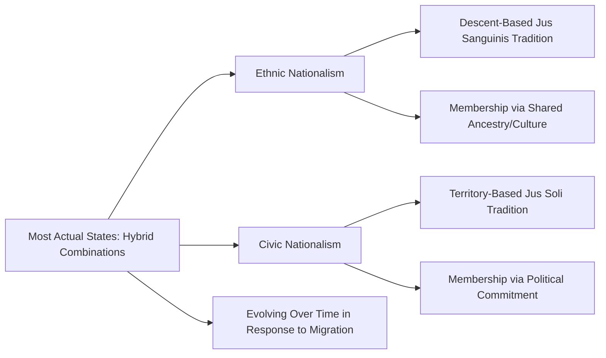
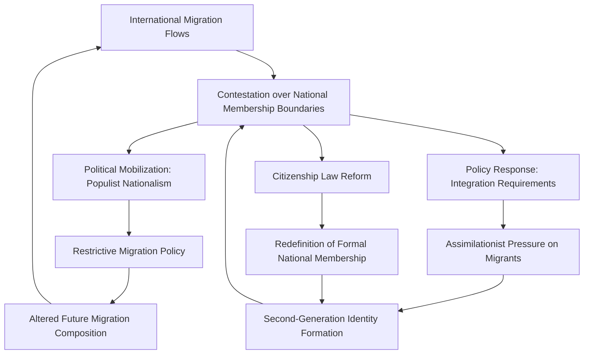

## Migration and National Identity

### Definition and Conceptual Scope

Migration and national identity examines how international migration challenges, reshapes, and interacts with the constructed boundaries of national belonging — who counts as a member of the nation, on what basis, and with what political consequences. This field sits at the intersection of nationalism studies, political theory, and migration studies, addressing both how receiving societies define and defend national identity in response to immigration, and how migration itself transforms the content and boundaries of that identity over time.

**Key Points**

- National identity is treated in this literature as a socially and politically constructed category rather than a fixed, primordial given — a foundational assumption drawn from constructivist nationalism theory (e.g., Benedict Anderson's "imagined communities")
- Migration exposes and often intensifies a core tension within liberal nationalism between civic conceptions of membership (based on shared political values and legal citizenship) and ethnic or cultural conceptions of membership (based on shared ancestry, language, religion, or culture)
- The politics of national identity in response to migration varies substantially across different national contexts depending on each state's historically dominant model of nationhood and citizenship

### Theoretical Foundations of National Identity

#### Constructivist Nationalism

Benedict Anderson's influential concept of the nation as an "imagined community" (*Imagined Communities*, 1983) frames national identity as a constructed, historically contingent form of collective belonging sustained through shared narratives, symbols, and institutions rather than reflecting any natural or inevitable grouping of people — a framework that underpins most contemporary scholarly analysis of how national identity is contested and renegotiated in response to immigration.

#### Civic versus Ethnic Nationalism

A foundational typological distinction, associated with scholars including Hans Kohn and subsequently refined extensively in comparative citizenship scholarship, differentiates:

- **Civic nationalism**: national membership defined by shared commitment to political institutions, values, and voluntary allegiance, in principle open to acquisition regardless of ancestry (associated historically with, though not perfectly exemplified by, states such as France and the United States)
- **Ethnic nationalism**: national membership defined by shared descent, ethnicity, language, or culture, historically associated with jus sanguinis (descent-based) citizenship traditions (associated historically with, though again imperfectly exemplified by, states such as Germany prior to its 1999 citizenship law reform)

**Key Points**

- Scholars including Rogers Brubaker (*Citizenship and Nationhood in France and Germany*, 1992) have significantly complicated the civic/ethnic binary, demonstrating that most real-world national identity traditions combine civic and ethnic elements in varying proportions rather than falling cleanly into either category, and that national citizenship traditions evolve substantially over time in response to political and demographic change
- The civic/ethnic distinction, while analytically useful as an ideal-typical heuristic, should not be treated as a precise empirical classification of actual states, which typically exhibit hybrid and evolving characteristics [Inference: this caveat reflects a broad scholarly consensus in the comparative citizenship literature rather than a settled taxonomic classification of specific states.]

### Diagram: Civic and Ethnic Nationalism Spectrum

### Citizenship Regimes and National Identity

#### Jus Soli versus Jus Sanguinis

Citizenship acquisition rules operationalize underlying conceptions of national membership:

- **Jus soli** ("right of soil"): citizenship based on birth within a state's territory, historically associated with civic/immigrant-nation traditions (e.g., the United States, Canada)
- **Jus sanguinis** ("right of blood"): citizenship based on descent from a citizen parent, historically associated with ethnic-nation traditions (e.g., historically Germany, Japan)
- **Naturalization pathways**: requirements (residency duration, language proficiency, civic knowledge testing, income/integration requirements) for non-citizens to acquire citizenship, varying substantially in stringency and design across states

**Example**

Germany's 1999 citizenship law reform, which introduced a modified jus soli element (conditional birthright citizenship for children of long-term resident non-citizens) alongside its traditional jus sanguinis framework, represents a widely cited case of formal legal shift in national membership conception, reflecting broader political and demographic pressures generated by Germany's large post-war "guest worker" immigrant population and their German-born descendants, who under the prior exclusively jus sanguinis framework often remained legally non-citizens despite multi-generational residence.

#### Multiculturalism versus Assimilationism versus Interculturalism

States have adopted varying formal policy models for managing the relationship between immigrant cultural difference and national identity:

- **Assimilationist models**: expect migrants to adopt the dominant national culture, language, and civic norms, with limited formal accommodation of distinct migrant cultural practices in the public sphere (historically associated with, though contested as an accurate characterization of, French republican integration policy)
- **Multiculturalist models**: formally recognize and accommodate cultural diversity, sometimes through group-differentiated rights or funding for minority cultural institutions (historically associated with Canadian and, to a lesser extent, earlier Dutch and British policy models)
- **Interculturalist models**: emphasize interaction and dialogue across cultural groups within a shared civic framework, positioned by proponents as an alternative to both assimilationism's perceived rigidity and multiculturalism's perceived risk of parallel/segregated communities

**Key Points**

- Several European states that had adopted more explicitly multiculturalist policy frameworks in earlier decades have since shifted toward more assimilationist or "civic integration" policy requirements (e.g., mandatory language and civic integration courses/testing), reflecting broader political debate over multiculturalism's perceived successes and limitations — a shift extensively documented and debated in comparative citizenship and integration policy scholarship [Inference: characterizing this shift as a uniform or complete "retreat from multiculturalism" across all previously multiculturalist states is a simplification of a more variegated and contested pattern documented differently across specific national cases in the literature.]

### Diagram: Models of Cultural Integration Policy (svg_diagram)

<svg xmlns="http://www.w3.org/2000/svg" viewBox="0 0 880 300">
\<style\>
.title{font:bold 16px sans-serif;fill:#1a1a2e;}
.box{font:12px sans-serif;fill:#1a1a2e;}
.lbl{font:11px sans-serif;fill:#444;}
.node{fill:#eef3fb;stroke:#3a5a8c;stroke-width:1.5;}
\</style\>
<text x="440" y="28" text-anchor="middle" class="title">Models of Migrant Cultural Integration (svg_diagram)</text>
<rect x="60" y="90" width="230" height="120" rx="8" class="node" />
<text x="175" y="115" text-anchor="middle" class="box" font-weight="bold">Assimilationism</text>
<text x="175" y="140" text-anchor="middle" class="lbl">Adoption of dominant</text>
<text x="175" y="156" text-anchor="middle" class="lbl">national culture expected</text>
<text x="175" y="180" text-anchor="middle" class="lbl">Limited public accommodation</text>
<text x="175" y="196" text-anchor="middle" class="lbl">of cultural difference</text>
<rect x="325" y="90" width="230" height="120" rx="8" class="node" />
<text x="440" y="115" text-anchor="middle" class="box" font-weight="bold">Interculturalism</text>
<text x="440" y="140" text-anchor="middle" class="lbl">Dialogue and interaction</text>
<text x="440" y="156" text-anchor="middle" class="lbl">across cultural groups</text>
<text x="440" y="180" text-anchor="middle" class="lbl">within shared civic space</text>
<rect x="590" y="90" width="230" height="120" rx="8" class="node" />
<text x="705" y="115" text-anchor="middle" class="box" font-weight="bold">Multiculturalism</text>
<text x="705" y="140" text-anchor="middle" class="lbl">Formal recognition and</text>
<text x="705" y="156" text-anchor="middle" class="lbl">accommodation of</text>
<text x="705" y="180" text-anchor="middle" class="lbl">cultural diversity</text>
</svg>

### Political Mobilization Around National Identity and Migration

#### Populist Nationalist Mobilization

A substantial body of comparative political science scholarship documents the rise of populist nationalist political parties and movements across multiple regions that explicitly frame immigration as a threat to national identity, cultural cohesion, or economic security, often combined with anti-establishment and anti-globalist framing. Scholars including Cas Mudde characterize this politics as combining a "thin-centered" populist ideology (dividing society into a pure people versus a corrupt elite) with nativist positions on national identity and belonging.

#### Securitization and Identity Threat Framing

Drawing on securitization theory, scholars analyze how migration is discursively constructed not only as a physical security threat but specifically as a threat to national **identity** and cultural continuity, a distinct framing from economic or criminal-security threat construction, with significant implications for the kinds of policy responses considered legitimate (cultural integration requirements, restrictions on religious or cultural practice, heightened naturalization barriers).

#### Identity Politics of the Second Generation

Scholarship on the children of immigrants (the "second generation") examines distinctive identity formation dynamics, including segmented assimilation theory (Portes and Rumbaut), which argues second-generation integration outcomes vary substantially depending on the socioeconomic context of reception, generating divergent pathways ranging from upward mobility and integration into the mainstream to downward assimilation into marginalized subgroups, complicating any single linear narrative of immigrant generational integration into national identity.

### Diagram: Feedback Dynamics Between Migration and National Identity Contestation

### Critiques and Ongoing Debates

- **Essentialization risk**: Critics caution that academic and political discourse about "national identity" can inadvertently reify what is, per constructivist theory, an inherently fluid and contested construct, treating national identity as though it has a fixed, discoverable content that migration either threatens or preserves
- **Liberal nationalism's internal tension**: Political theorists (e.g., Will Kymlicka, David Miller) continue to debate whether robust national identity and liberal-democratic commitments to equal treatment of all residents can be reconciled, or whether appeals to national identity in migration policy inherently risk excluding or subordinating migrant populations in tension with liberal egalitarian principles
- **Instrumentalization concern**: Scholars note that appeals to "national identity" in migration policy debates are sometimes strategically deployed by political actors for electoral or other strategic purposes, complicating any straightforward reading of such appeals as reflecting genuine widely shared public sentiment
- **Methodological challenges in measuring identity change**: Empirically assessing how migration actually transforms national identity over time (as opposed to studying political discourse and mobilization around identity) presents substantial methodological challenges, given identity's inherently subjective, multidimensional, and evolving character
- **Heterogeneity within receiving societies**: National identity contestation in response to migration is rarely uniform within a receiving society, with significant variation by region, generation, political orientation, and prior exposure to migration, complicating characterizations of a single national response to migration-related identity change

### Related Topics

- Theories of International Migration
- Migration Policy and Border Control
- Civic and Ethnic Nationalism (Comparative Theory)
- Citizenship Acquisition: Jus Soli and Jus Sanguinis
- Multiculturalism and Integration Policy
- Populism and Nativist Political Mobilization
- Securitization Theory and Border Politics
- Segmented Assimilation Theory
- Diaspora Communities and Homeland Politics
- Imagined Communities and Constructivist Nationalism Theory