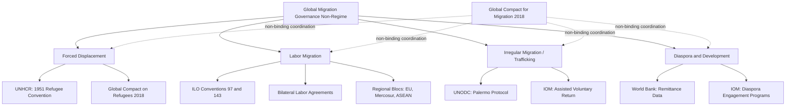

## Global Governance of Migration

### Definition and Conceptual Scope

Global governance of migration refers to the fragmented set of international institutions, legal instruments, norms, and cooperative mechanisms that states and non-state actors use to manage cross-border human mobility. Unlike trade or finance, migration lacks a single binding multilateral treaty regime or a central enforcement body. Instead, it is governed through a patchwork of "soft law" instruments, regional agreements, bilateral labor arrangements, and issue-specific conventions (refugee law, statelessness, trafficking, labor rights) that intersect but do not cohere into one unified framework.

**Key Points**

- Migration governance is often described as having a "non-regime" or "weak institutionalization" character, in contrast to trade (WTO) or finance (IMF).
- State sovereignty over admission and expulsion remains the foundational legal norm; no treaty obliges states to admit non-citizens except under specific refugee/asylum obligations.
- Governance spans multiple, only loosely coordinated policy domains: labor migration, forced displacement, irregular migration, human trafficking/smuggling, diaspora engagement, and remittances.

### Historical Development

#### Early International Efforts (1919–1951)

The International Labour Organization (ILO), founded in 1919, was among the first bodies to address labor migration through conventions on migrant worker rights. The 1951 Refugee Convention, drafted in the aftermath of WWII displacement in Europe, established the legal definition of a refugee and the principle of *non-refoulement* (prohibition on returning individuals to places where they face persecution).

#### Cold War Fragmentation (1950s–1980s)

Migration governance during this period was largely bilateral and regionalized, shaped by Cold War geopolitics, decolonization-driven population movements, and labor-recruitment agreements (e.g., West Germany's *Gastarbeiter* programs, Gulf state *kafala* systems).

#### Post-Cold War Institutionalization (1990s–2015)

- The International Organization for Migration (IOM), founded in 1951 as an operational logistics body, gradually expanded its normative role.
- The 1990 International Convention on the Protection of the Rights of All Migrant Workers entered into force in 2003, though it has low ratification among major destination countries.
- Global Forums such as the Global Forum on Migration and Development (GFMD, established 2007) provided informal, state-led dialogue outside binding treaty structures.

#### The 2016–2018 Turning Point

The 2015–2016 European migration crisis catalyzed the **New York Declaration for Refugees and Migrants** (2016), which committed UN member states to develop two parallel global compacts:

1. **Global Compact for Safe, Orderly and Regular Migration (GCM)** — adopted December 2018 in Marrakech.
2. **Global Compact on Refugees (GCR)** — affirmed by the UN General Assembly in December 2018.

Both compacts are explicitly non-binding, reaffirming state sovereignty over migration policy while establishing cooperative objectives and voluntary review mechanisms.

### Core Institutional Architecture

#### International Organization for Migration (IOM)

Became a UN-related agency in 2016 (the "UN Migration Agency"), though it remains distinct from having a normative mandate; its core function is operational (assisted voluntary return, displacement tracking via DTM — Displacement Tracking Matrix, resettlement logistics) rather than standard-setting.

#### UN High Commissioner for Refugees (UNHCR)

Holds the mandate for refugee protection and supervises the 1951 Convention and its 1967 Protocol. UNHCR's authority is limited to refugees and stateless persons under its mandate — it has no jurisdiction over labor migrants or other cross-border movers unless displacement-related.

#### International Labour Organization (ILO)

Sets labor standards relevant to migrant workers (e.g., Convention No. 97 on Migration for Employment, Convention No. 143 on Migrant Workers) and monitors compliance through its supervisory bodies, though enforcement relies on reputational pressure rather than sanctions.

#### Global Compact for Migration (GCM) Follow-up Mechanisms

- **International Migration Review Forum (IMRF)**: convened every four years under the UN General Assembly to review GCM implementation.
- **UN Network on Migration**: an inter-agency coordination body, chaired by IOM, tasked with supporting GCM implementation without creating new binding obligations.

**Example**

A state wishing to demonstrate GCM compliance might submit a voluntary national review to the IMRF describing steps taken on Objective 2 (minimizing adverse drivers of migration) — there is no penalty mechanism if the state does not comply, distinguishing this from binding regimes like WTO dispute settlement.

### Regional Governance Architectures

Because global governance is weak, much substantive migration policy occurs at the regional level:

- **European Union**: The Common European Asylum System (CEAS) and the 2024 Pact on Migration and Asylum represent the most legally dense regional regime, including binding regulations (e.g., the Dublin Regulation's successor mechanisms) with a degree of supranational enforcement via the Court of Justice of the EU.
- **African Union**: The 2018 African Continental Free Trade Area (AfCFTA) and the earlier 2018 Free Movement of Persons Protocol aim at intra-African labor mobility, though ratification has lagged.
- **ASEAN**: Governs migration primarily through non-binding declarations (e.g., 2007 ASEAN Declaration on the Protection and Promotion of the Rights of Migrant Workers) reflecting the bloc's consensus-based, sovereignty-preserving norms.
- **Mercosur / South America**: The 2002 Residence Agreement grants near-automatic residency rights to citizens of member and associate states, representing one of the more liberal regional mobility regimes outside the EU.

### Theoretical Frameworks for Analysis

#### Regime Theory Applied to Migration

Scholars (e.g., Betts, Koser) debate whether migration constitutes a coherent "regime complex" — an array of overlapping, non-hierarchical institutions — rather than a single regime. This contrasts with Krasner's classical regime definition (principles, norms, rules, decision-making procedures converging around an issue area).

#### Global Migration Governance as "Organized Hypocrisy"

[Inference] Some political scientists (drawing on Stephen Krasner's concept applied to sovereignty) characterize migration governance as an arena where liberal normative commitments (human rights, labor mobility benefits) coexist with restrictive state practice, producing persistent gaps between stated principles and enforcement.

#### Securitization Framework

The Copenhagen School's securitization theory explains how migration has been reframed from a labor/economic issue into a "security" issue since the 1990s, justifying exceptional measures (border militarization, detention) outside normal policy channels.

#### Liberal Paradox

Political economist James Hollifield's concept describes the tension between economic liberalism (which favors open labor markets) and political sovereignty (which favors restrictive migration control), a core structural feature explaining why liberal democracies simultaneously court and restrict migration.

### Governance Gaps and Structural Critiques

- **No binding admission obligations**: Aside from *non-refoulement* for refugees, states retain near-total discretion over who to admit, undermining calls for a "right to migrate."
- **Fragmentation across issue silos**: Labor migration (ILO), forced displacement (UNHCR), trafficking (UNODC via the Palermo Protocol), and diaspora/development linkages (World Bank, IOM) are governed by separate institutions with limited cross-coordination.
- **Enforcement deficit**: Compacts like the GCM are explicitly non-binding "cooperative frameworks," with review mechanisms relying on voluntary reporting rather than sanctions.
- **North-South power asymmetries**: Destination countries in the Global North largely set the terms of labor mobility and border externalization agreements (e.g., EU deals with Libya, Turkey, Tunisia), while origin countries have limited leverage except through remittance/diaspora bargaining power.
- **Low ratification of migrant worker rights instruments**: The 1990 ICRMW has been ratified mostly by labor-sending states, with almost no major destination countries (EU states, US, Gulf states) as parties. [Unverified: exact current ratification count fluctuates; verify against the UN treaty database for a specific date.]

### Visualizing the Institutional Landscape

### Diagram: Governance Fragmentation (SVG)

<svg xmlns="http://www.w3.org/2000/svg" viewBox="0 0 700 340">
<text x="350" y="28" font-size="16" font-weight="bold" text-anchor="middle" fill="#1a1a1a">Migration Governance Fragmentation (svg_diagram)</text>
<circle cx="180" cy="140" r="75" fill="#dbeafe" stroke="#2563eb" stroke-width="2" />
<text x="180" y="130" font-size="13" text-anchor="middle" fill="#1e3a8a">Refugee/</text>
<text x="180" y="148" font-size="13" text-anchor="middle" fill="#1e3a8a">Displacement</text>
<text x="180" y="166" font-size="11" text-anchor="middle" fill="#1e3a8a">(UNHCR)</text>
<circle cx="360" cy="90" r="75" fill="#dcfce7" stroke="#16a34a" stroke-width="2" />
<text x="360" y="80" font-size="13" text-anchor="middle" fill="#14532d">Labor</text>
<text x="360" y="98" font-size="13" text-anchor="middle" fill="#14532d">Migration</text>
<text x="360" y="116" font-size="11" text-anchor="middle" fill="#14532d">(ILO)</text>
<circle cx="540" cy="140" r="75" fill="#fef3c7" stroke="#d97706" stroke-width="2" />
<text x="540" y="130" font-size="13" text-anchor="middle" fill="#78350f">Trafficking/</text>
<text x="540" y="148" font-size="13" text-anchor="middle" fill="#78350f">Smuggling</text>
<text x="540" y="166" font-size="11" text-anchor="middle" fill="#78350f">(UNODC)</text>
<circle cx="360" cy="240" r="75" fill="#fce7f3" stroke="#db2777" stroke-width="2" />
<text x="360" y="230" font-size="13" text-anchor="middle" fill="#831843">Diaspora/</text>
<text x="360" y="248" font-size="13" text-anchor="middle" fill="#831843">Development</text>
<text x="360" y="266" font-size="11" text-anchor="middle" fill="#831843">(IOM/World Bank)</text>
<ellipse cx="360" cy="165" rx="170" ry="150" fill="none" stroke="#6b7280" stroke-width="1.5" stroke-dasharray="6,4" />
<text x="360" y="325" font-size="12" text-anchor="middle" fill="#374151">Global Compact for Migration (non-binding coordination layer)</text>
</svg>

### Key Debates in the Discipline

- **Should there be a "World Migration Organization"?** Proposals (notably by economist Bimal Ghosh in the 1990s–2000s) for a binding, WTO-style institution have gained little state support, since major migrant-receiving states prefer retaining unilateral control.
- **Migration as a global public good vs. a sovereign prerogative**: Development economists emphasize the efficiency gains of freer labor mobility (citing large wage-gap-driven welfare gains), while political realists emphasize that migration control is a core attribute of Westphalian sovereignty.
- **Externalization and responsibility-shifting**: Wealthy states increasingly outsource migration control to transit states (e.g., EU-Turkey Statement 2016, EU-Tunisia Memorandum 2023), raising questions about accountability for human rights violations occurring in third countries. [Inference] This trend is frequently interpreted by scholars as a deliberate strategy to evade direct legal responsibility under refugee and human rights law.

### Conclusion

Global migration governance remains a "non-regime" characterized by normative fragmentation, weak enforcement, and persistent sovereignty constraints, in contrast to more institutionalized global governance domains like trade or health. The 2018 Global Compacts marked a significant, though non-binding, step toward multilateral coordination, but substantive authority continues to reside primarily with states and regional blocs rather than global institutions. Analytically, the field draws on regime theory, securitization theory, and the liberal paradox to explain why cooperation is simultaneously sought and resisted by states.

**Related Topics**

- 1951 Refugee Convention and the Principle of Non-Refoulement
- Global Compact for Safe, Orderly and Regular Migration (GCM) — Objectives and Implementation
- Externalization of Border Control (EU-Turkey, EU-Libya Agreements)
- The Liberal Paradox in Migration Policy (Hollifield)
- Regional Free Movement Regimes: EU vs. ECOWAS vs. Mercosur
- Diaspora Diplomacy and Remittance Governance
- Securitization Theory and Migration as a Security Threat
- Statelessness and the 1954/1961 UN Conventions