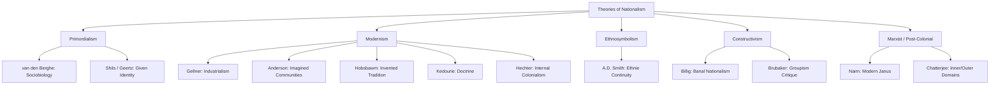

## Theories of Nationalism

### Definition and Conceptual Scope

Theories of nationalism seek to explain the origins, nature, and persistence of nations and nationalism as political phenomena. The field is organized around a central analytical dispute: whether nations are ancient, organic communities that predate modernity (primordialism/perennialism), or modern political constructs produced by specific historical processes (modernism), or continuously reconstituted through everyday social practice (ethnosymbolism, constructivism, banal nationalism).

**Key Points**

- "Nation," "nationalism," and "nation-state" are analytically distinct: a nation is a community bound by shared identity claims; nationalism is the ideology/political movement asserting that nations should govern themselves; a nation-state is the institutional form where political and national boundaries are claimed to coincide.
- The field is divided broadly into four schools: Primordialism, Modernism, Ethnosymbolism, and Constructivism, with additional important strands including Marxist and post-colonial critiques.
- No single theory is universally accepted; theories are often deployed selectively depending on the case (e.g., modernist theories fit European state formation better than long-standing ethnic communities in parts of Asia or the Middle East).

### Primordialism

#### Core Claims

Primordialism holds that nations are natural, ancient, and rooted in fixed characteristics such as blood ties, language, religion, and territory. Nationalist sentiment is treated as an extension of kinship attachment.

- **Sociobiological variant** (associated with Pierre van den Berghe): nationalism is an extension of kin selection, where ethnic and national attachment mimics extended kinship bonds for evolutionary reproductive advantage.
- **Cultural/perennialist variant** (associated with Edward Shils, Clifford Geertz): nations may not be biologically fixed but are experienced by members as natural, given, and primordial — a "given" of social existence rather than a choice.

**Example**

A primordialist account of Kurdish nationalism would emphasize continuous Kurdish linguistic and cultural distinctiveness stretching back centuries, treating this deep continuity as the wellspring of contemporary nationalist claims — independent of 20th-century state formation processes.

#### Critiques

Primordialism is widely criticized within the discipline for naturalizing what are, in modernist accounts, historically contingent identities, and for being difficult to falsify empirically.

### Modernism

Modernism is the dominant paradigm in nationalism studies since the 1980s, holding that nations and nationalism are products of modernity — industrialization, capitalism, print culture, and the bureaucratic state — rather than ancient continuities.

#### Ernest Gellner: Industrialism Thesis

Gellner (*Nations and Nationalism*, 1983) argues nationalism arises from the functional needs of industrial society. Industrial economies require a mobile, literate, culturally homogeneous workforce capable of communicating across an anonymous, complex division of labor — a requirement met by mass, standardized education systems ("exo-education") organized by the state, which in turn generates shared national culture. In Gellner's formulation, nationalism invents nations, not the reverse.

#### Benedict Anderson: Imagined Communities

Anderson (*Imagined Communities*, 1983) defines the nation as "an imagined political community" — imagined because members will never know most fellow-members but hold a mental image of communion; limited, because it has finite boundaries; sovereign, because it emerged displacing the divinely-ordained dynastic realm; and a community, because it is conceived as deep, horizontal comradeship. Anderson emphasizes **print capitalism** — the mass production of vernacular-language newspapers and novels — as the technological/economic mechanism that made it possible for large numbers of strangers to imagine themselves as part of a bounded national community.

#### Eric Hobsbawm: Invented Tradition

Hobsbawm (*The Invention of Tradition*, 1983, with Terence Ranger; *Nations and Nationalism Since 1780*, 1990) argues many practices presented as ancient national traditions (tartans, national anthems, royal ceremonial) were in fact deliberately constructed in the 19th century to manufacture continuity and legitimize new political orders. Hobsbawm also periodizes nationalism, distinguishing an early "civic" phase (nation defined by citizenship/state) from a later "ethnic" phase (nation defined by shared descent/culture) emerging after 1870.

#### Elie Kedourie: Nationalism as Doctrine

Kedourie (*Nationalism*, 1960) treats nationalism primarily as an intellectual doctrine invented in early 19th-century Europe (tracing roots to Kantian philosophy), arguing it artificially imposes the principle that humanity is naturally divided into nations, each of which is entitled to self-government.

#### Michael Hechter: Internal Colonialism

Hechter (*Internal Colonialism*, 1975) explains peripheral nationalisms (e.g., Welsh, Breton) as reactions to uneven economic development within states, where a "core" region economically exploits and culturally marginalizes a "periphery," generating a reactive nationalist mobilization along the cultural division of labor.

### Ethnosymbolism

Associated primarily with Anthony D. Smith, ethnosymbolism occupies a middle position between primordialism and modernism. Smith (*The Ethnic Origins of Nations*, 1986; *National Identity*, 1991) argues that while nations as political forms are indeed modern, they are typically built upon pre-existing *ethnies* — ethnic communities with shared myths of common ancestry, historical memories, and symbolic culture. Modern nationalism does not invent identity from nothing but selectively reinterprets and mobilizes pre-modern symbolic and mythic resources.

**Key Points**

- Ethnosymbolism emphasizes continuity of symbols, myths, and memories rather than continuity of fixed biological or cultural essence (distinguishing it from primordialism).
- It explains why some modernist "invention" projects succeed (they draw on genuine pre-existing ethnic material) while others fail to generate popular resonance.

### Constructivism and Everyday Nationalism

#### Constructivist Core Claim

Constructivism (broadly overlapping with modernism but analytically distinct) treats national identity as continuously produced and reproduced through discourse, institutions, and social practice, rather than as a fixed product of a single historical "invention" moment.

#### Michael Billig: Banal Nationalism

Billig (*Banal Nationalism*, 1995) argues established nations are reproduced daily through unnoticed, routine symbols and practices — flags on public buildings, national weather maps, pronoun use ("we," "our economy") in media — rather than through periodic dramatic events. This "banal" reproduction is what sustains national identity as background common sense in established nation-states.

#### Rogers Brubaker: Groupism Critique

Brubaker (*Nationalism Reframed*, 1996; *Ethnicity Without Groups*, 2004) critiques scholarship for treating "nations" and "ethnic groups" as bounded, internally homogeneous actors ("groupism"), arguing instead that ethnicity and nationhood should be studied as categories of practice, cognitive frames, and contingent events of group-making, not as pre-formed entities that act.

### Marxist and Post-Colonial Perspectives

#### Classical Marxism

Classical Marxist theory (Marx, Engels, Lenin, Stalin's *Marxism and the National Question*, 1913) treated nationalism as a superstructural phenomenon tied to the rise of bourgeois capitalism, generally predicting nationalism would be superseded by proletarian internationalism — a prediction largely falsified by 20th-century history, requiring later Marxist theorists (e.g., Tom Nairn) to develop more nuanced accounts of nationalism's persistence under capitalism ("the modern Janus").

#### Post-Colonial Critique

Post-colonial theorists (e.g., Partha Chatterjee, *Nationalist Thought and the Colonial World*, 1986) critique Western modernist theories (particularly Anderson) for treating European nationalism as the template, arguing anti-colonial nationalisms in Asia and Africa developed distinct "inner domain" cultural nationalisms resisting colonial modernity even while adopting colonial state forms in the "outer," material domain.

### Comparative Summary Table

| School | Key Theorist(s) | Nations Are... | Primary Driver |
| --- | --- | --- | --- |
| Primordialism | van den Berghe, Shils | Natural/ancient | Kinship, given identity |
| Modernism (industrialism) | Gellner | Modern constructs | Industrial economy's need for homogeneity |
| Modernism (print capitalism) | Anderson | Imagined communities | Print capitalism, vernacular languages |
| Modernism (invented tradition) | Hobsbawm | Manufactured continuity | Elite political legitimation |
| Ethnosymbolism | A.D. Smith | Modern forms, pre-modern roots | Myths, memories, symbols of *ethnies* |
| Constructivism | Brubaker, Billig | Ongoing processes/events | Everyday practice, categorization |
| Marxist | Nairn, Stalin | Superstructural/class-linked | Uneven capitalist development |
| Post-colonial | Chatterjee | Derivative yet distinct | Anti-colonial resistance, dual domains |

### Visualizing the Theoretical Landscape

### Diagram: Spectrum of Nation Formation (SVG)

<svg xmlns="http://www.w3.org/2000/svg" viewBox="0 0 700 220">
<text x="350" y="26" font-size="16" font-weight="bold" text-anchor="middle" fill="#1a1a1a">Continuity vs. Construction Spectrum (svg_diagram)</text>
<line x1="60" y1="120" x2="640" y2="120" stroke="#6b7280" stroke-width="3" />
<polygon points="640,120 628,113 628,127" fill="#6b7280" />
<circle cx="100" cy="120" r="10" fill="#dc2626" />
<text x="100" y="150" font-size="12" text-anchor="middle" fill="#1a1a1a">Primordialism</text>
<text x="100" y="165" font-size="10" text-anchor="middle" fill="#4b5563">Ancient/Given</text>
<circle cx="300" cy="120" r="10" fill="#d97706" />
<text x="300" y="150" font-size="12" text-anchor="middle" fill="#1a1a1a">Ethnosymbolism</text>
<text x="300" y="165" font-size="10" text-anchor="middle" fill="#4b5563">Modern form, old roots</text>
<circle cx="480" cy="120" r="10" fill="#2563eb" />
<text x="480" y="150" font-size="12" text-anchor="middle" fill="#1a1a1a">Modernism</text>
<text x="480" y="165" font-size="10" text-anchor="middle" fill="#4b5563">Invented in modernity</text>
<circle cx="620" cy="120" r="10" fill="#16a34a" />
<text x="600" y="150" font-size="12" text-anchor="middle" fill="#1a1a1a">Constructivism</text>
<text x="600" y="165" font-size="10" text-anchor="middle" fill="#4b5563">Ongoing process</text>

<text x="350" y="200" font-size="11" text-anchor="middle" fill="`#374151`">"Fixed/Essential" ←──────────────────────────→ "Fluid/Produced"</text>

</svg>

### Applied Case Illustration

**Example**

Comparing theoretical explanations for the rise of Serbian nationalism in the 1980s–1990s:

- A primordialist reading emphasizes deep-rooted Serbian Orthodox identity and historical memory of Kosovo (1389 Battle of Kosovo myth) as a continuous wellspring of ethnic solidarity.
- A modernist (Gellnerian) reading emphasizes the collapse of Yugoslav federal industrial structures and elite competition for control over state resources following Tito's death.
- An ethnosymbolist reading would argue that elites (notably Slobodan Milošević) successfully mobilized nationalism precisely because they drew on genuinely resonant pre-existing myths and symbols (the Kosovo myth), rather than inventing identity from nothing.
- A constructivist/Brubaker-style reading would treat "Serbian nationalism" not as a pre-formed group acting, but as an event of group-making actively produced through specific political mobilization processes in the late 1980s media and rally politics.

### Key Debates and Ongoing Tensions

- **Civic vs. ethnic nationalism**: A widely used but contested distinction (traced to Hans Kohn, 1944) between nationalism based on voluntary citizenship/political membership (often associated with Western Europe/US) versus nationalism based on shared descent/culture (often associated with Central/Eastern Europe). [Inference] Many scholars now view this dichotomy as an oversimplification, since most nationalisms blend civic and ethnic elements in varying proportions rather than falling cleanly into one category.
- **Diffusionist critique of Eurocentrism**: Modernist theories built on the European case (Gellner, Anderson) are criticized by post-colonial scholars for treating European nationalism as a template later diffused to (and derivatively imitated in) the rest of the world, rather than taking non-Western nationalisms as generative on their own terms.
- **Explaining nationalism's persistence**: Classical Marxist predictions that nationalism would fade under international proletarian solidarity did not materialize, prompting continued theoretical revision (e.g., Nairn's "modern Janus" metaphor, describing nationalism as inherently double-faced — simultaneously progressive/liberatory and regressive/exclusionary).

### Conclusion

Theories of nationalism remain divided along a fundamental axis: whether nations are natural, continuous communities (primordialism), functional products of modern industrial/print capitalism (modernism), modern reconstitutions of pre-existing ethnic material (ethnosymbolism), or ongoing discursive/institutional processes (constructivism). No single framework has achieved consensus, and most contemporary scholarship applies these theories selectively and comparatively depending on the specific national case under study, often synthesizing modernist mechanisms with ethnosymbolist attention to pre-modern cultural material.

**Related Topics**

- Civic vs. Ethnic Nationalism: The Kohn Dichotomy Reassessed
- Print Capitalism and the Spread of Vernacular Nationalism
- Nationalism and State Formation in Post-Colonial Africa
- Diaspora Nationalism and Long-Distance Nationalism (Anderson)
- Secessionist Nationalism and Self-Determination Claims
- Nationalism and Religion: Overlapping or Competing Identities
- Banal Nationalism in Contemporary Media and Sport