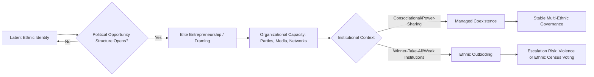

## Ethnic Identity and Political Mobilization

### Definition and Conceptual Scope

Ethnic identity and political mobilization examines how ethnicity — as a socially constructed category based on claims of shared ancestry, language, religion, or culture — becomes a basis for organized political action, including voting behavior, party formation, protest, and, in extreme cases, civil conflict. The subfield addresses two linked questions: (1) what makes ethnicity a salient political cleavage relative to other identities (class, ideology, region); and (2) under what conditions ethnic identity is politically mobilized versus remaining latent.

**Key Points**

- Ethnicity is analytically distinguished from race (typically based on phenotypic markers assigned by others) and nationhood (which carries a claim to self-governance), though the categories overlap empirically.
- Mobilization is not automatic: shared ethnic identity is a necessary but insufficient condition for political action; mobilization requires organizational capacity, political opportunity, and often elite entrepreneurship.
- The field spans three broad theoretical families: Primordialism, Instrumentalism, and Constructivism — closely paralleling but analytically distinct from the theories-of-nationalism debate.

### Theoretical Approaches to Ethnicity

#### Primordialism

Primordialist approaches (Geertz, van den Berghe) treat ethnic attachments as fixed, deeply felt, and quasi-natural, rooted in kinship or long-standing cultural givens. Political mobilization along ethnic lines is explained as an expression of pre-existing, intense affective bonds rather than strategic calculation.

#### Instrumentalism

Instrumentalist approaches (associated with Paul Brass, *Ethnicity and Nationalism*, 1991) treat ethnicity as a resource strategically manipulated by political elites to mobilize followers, gain access to state resources, or win elections. Ethnic identity content and boundaries are relatively malleable and are activated when doing so serves elite interests.

**Example**

An instrumentalist account of Rwandan Hutu-Tutsi tensions emphasizes how Belgian colonial administrators, and later Rwandan political elites, hardened and politically weaponized what had been a more fluid social/status distinction, using identity cards and quota systems to convert a flexible category into a rigid, mobilizable political cleavage.

#### Constructivism

Constructivist approaches (Brubaker, Fearon and Laitin) treat ethnic categories themselves as the object of analysis rather than pre-given units, examining how boundaries are drawn, categories are institutionalized (e.g., through census categories, colonial administration), and how "ethnic" framing of conflict is often a post-hoc interpretive frame rather than the underlying cause.

#### Rational Choice / Ethnic Voting Models

Scholars such as Donald Horowitz (*Ethnic Groups in Conflict*, 1985) apply rational-choice reasoning to explain ethnic voting as a low-information heuristic: in low-trust environments with weak programmatic party systems, voters use ethnicity as a proxy for expected distributive benefits, since co-ethnic politicians are assumed more likely to channel patronage to their group.

### Mechanisms Linking Identity to Mobilization

#### Ethnic Outbidding

In competitive multi-ethnic party systems with weak cross-ethnic coalition incentives, politicians face pressure to adopt increasingly extreme ethnic-nationalist positions to avoid being outflanked by rivals claiming to better represent the group — a dynamic formalized by Horowitz and later Rabushka and Shepsle (*Politics in Plural Societies*, 1972).

#### Political Opportunity Structures

Drawing from social movement theory (McAdam, Tarrow, Tilly), mobilization is more likely when political opportunity structures open — e.g., democratization creates competitive elections that reward group-based appeals, or state weakness reduces the cost of organizing.

#### Ethnic Institutions and Census Politics

Colonial and post-colonial states often institutionalized ethnic categories through censuses, identity documents, and quota systems (e.g., Malaysia's *Bumiputera* policy, Nigeria's federal character principle, colonial Rwanda/Burundi identity cards), which can harden fluid social distinctions into fixed, administratively salient political categories — a process constructivists emphasize as productive of ethnic salience rather than merely reflective of it.

#### Ethnic Party Systems

Political scientists distinguish "ethnic parties" (explicitly organized around and appealing to one ethnic group) from multi-ethnic or programmatic parties. Kanchan Chandra's work (*Why Ethnic Parties Succeed*, 2004) on India's Bahujan Samaj Party analyzes conditions under which ethnic parties succeed electorally, emphasizing the size and "patronage-democracy" logic of ethnic-category-based coalitions.

### Ethnic Identity and Violence

#### Instrumentalist Elite-Manipulation Model

Elites may deliberately incite ethnic violence to consolidate power, deflect attention from governance failures, or eliminate political competition — as in instrumentalist readings of the 1994 Rwandan genocide, where extremist media (Radio Télévision Libre des Mille Collines) is analyzed as a deliberate elite tool for mobilizing mass participation in violence.

#### Security Dilemma Models

Barry Posen's application of the security dilemma concept to ethnic conflict (1993) argues that in collapsing multi-ethnic states, groups face incentives to arm preemptively out of fear of what rival groups might do, generating spiraling violence even absent any initial hostile intent — a structural rather than purely identity-driven explanation.

#### Greed vs. Grievance Debate

Paul Collier and Anke Hoeffler's econometric work (early 2000s) sparked debate over whether civil conflicts framed as "ethnic" are better explained by economic opportunity structures (access to lootable resources, weak state capacity) than by genuine grievance over identity-based exclusion — a debate still contested within civil war studies. [Inference] Subsequent scholarship (e.g., work associated with the Horizontal Inequalities framework by Frances Stewart) has generally moved toward synthesis models that treat group-based economic and political exclusion (horizontal inequality) as a stronger predictor than either pure greed or pure grievance in isolation.

### Ethnic Identity in Electoral Politics

#### Ethnic Census Models

In "ethnic census" elections (a term associated with work on African party systems, e.g., by Bratton and posadas), voters are argued to vote predictably according to group membership regardless of policy platforms, with election outcomes closely tracking the relative demographic size of ethnic groups and their coalitions.

#### Consociationalism as an Institutional Response

Arend Lijphart's consociational theory (*Democracy in Plural Societies*, 1977) proposes power-sharing institutions — grand coalition cabinets, mutual veto, proportionality in representation and civil service, and segmental autonomy — as a way to manage, rather than eliminate, ethnic political cleavages in deeply divided societies (e.g., Lebanon, Bosnia-Herzegovina's Dayton framework, Northern Ireland's Good Friday Agreement).

#### Centripetalism as an Alternative

Donald Horowitz's centripetal approach critiques consociationalism for entrenching ethnic division, instead advocating institutional designs (e.g., alternative vote electoral systems, federalism) that incentivize politicians to build cross-ethnic coalitions to win office, thereby moderating rather than reinforcing ethnic outbidding.

### Comparative Summary Table

| Approach | Key Theorist(s) | Ethnicity Is... | Mobilization Driver |
| --- | --- | --- | --- |
| Primordialism | Geertz, van den Berghe | Fixed, deep attachment | Innate affective bonds |
| Instrumentalism | Brass, Horowitz | Elite-manipulated resource | Elite strategic calculation |
| Constructivism | Brubaker, Fearon & Laitin | Institutionally produced category | Boundary-making processes |
| Rational Choice | Horowitz, Chandra | Informational heuristic | Expected patronage/distributive benefit |
| Security Dilemma | Posen | Group survival unit | Structural fear under state collapse |

### Visualizing the Mobilization Pathway

### Diagram: Instrumentalist vs. Constructivist vs. Primordialist Causal Chains (SVG)

<svg xmlns="http://www.w3.org/2000/svg" viewBox="0 0 700 300">
<text x="350" y="26" font-size="16" font-weight="bold" text-anchor="middle" fill="#1a1a1a">Three Causal Logics of Ethnic Mobilization (svg_diagram)</text>
<rect x="30" y="60" width="190" height="60" rx="8" fill="#fee2e2" stroke="#dc2626" stroke-width="2" />
<text x="125" y="85" font-size="12" text-anchor="middle" fill="#7f1d1d">Primordialism</text>
<text x="125" y="103" font-size="11" text-anchor="middle" fill="#7f1d1d">Deep identity → Action</text>
<rect x="255" y="60" width="190" height="60" rx="8" fill="#dbeafe" stroke="#2563eb" stroke-width="2" />
<text x="350" y="85" font-size="12" text-anchor="middle" fill="#1e3a8a">Instrumentalism</text>
<text x="350" y="103" font-size="11" text-anchor="middle" fill="#1e3a8a">Elite interest → Mobilizes identity</text>
<rect x="480" y="60" width="190" height="60" rx="8" fill="#dcfce7" stroke="#16a34a" stroke-width="2" />
<text x="575" y="85" font-size="12" text-anchor="middle" fill="#14532d">Constructivism</text>
<text x="575" y="103" font-size="11" text-anchor="middle" fill="#14532d">Institutions → Produce category</text>
<line x1="125" y1="120" x2="125" y2="180" stroke="#6b7280" stroke-width="2" />
<line x1="350" y1="120" x2="350" y2="180" stroke="#6b7280" stroke-width="2" />
<line x1="575" y1="120" x2="575" y2="180" stroke="#6b7280" stroke-width="2" />
<rect x="130" y="190" width="440" height="70" rx="8" fill="#f3f4f6" stroke="#6b7280" stroke-width="2" />
<text x="350" y="220" font-size="12" text-anchor="middle" fill="#1a1a1a">Observed Political Mobilization</text>
<text x="350" y="240" font-size="11" text-anchor="middle" fill="#374151">(e.g., ethnic party, communal violence, bloc voting)</text>
</svg>

### Applied Case Illustration

**Example**

Kenya's ethnic politics illustrate several mechanisms simultaneously: colonial-era administrative boundaries hardened Kikuyu, Luo, Kalenjin, and other group categories (constructivism); post-independence elites (e.g., during the Moi and Kenyatta eras) have used patronage networks organized along ethnic lines to secure electoral coalitions (instrumentalism); and the 2007–2008 post-election violence has been analyzed through both ethnic-outbidding dynamics in a winner-take-all presidential system and horizontal-inequality grievances tied to land and resource distribution across regions.

### Key Debates and Critiques

- **Does mobilization require genuine grievance, or is manipulation sufficient?** Instrumentalist models are criticized for underestimating how elite framing succeeds only when it resonates with authentic pre-existing social experience — a critique paralleling the ethnosymbolist critique of pure modernism in nationalism theory.
- **Methodological nationalism/ethnicism critique**: Brubaker's "groupism" critique extends to ethnic mobilization studies, cautioning against treating ethnic groups as unified actors with singular interests, when in practice intra-group divisions (class, gender, generation) often cross-cut and complicate mobilization.
- **Institutional design trade-offs**: The consociational-centripetal debate remains unresolved empirically; consociational arrangements have stabilized some cases (Lebanon's National Pact, though with periodic breakdown) while entrenching sectarian allocation in ways critics argue undermine long-term de-ethnicization of politics.

### Conclusion

Ethnic identity becomes politically consequential not automatically but through interacting mechanisms: institutional categorization (constructivism), elite strategic framing (instrumentalism), and — in more contested primordialist accounts — pre-existing deep affective attachment. Mobilization outcomes are further shaped by political opportunity structures, electoral institutions (particularly winner-take-all vs. power-sharing arrangements), and the presence or absence of cross-cutting economic and political inequalities. Understanding any specific case typically requires combining elements of multiple frameworks rather than relying on a single theory.

**Related Topics**

- Consociationalism vs. Centripetalism: Institutional Design in Divided Societies
- Ethnic Outbidding and Party System Fragmentation
- Horizontal Inequalities and Civil War Onset (Stewart)
- Colonial Legacies and the Construction of Ethnic Categories
- Ethnic Voting and Patronage Democracy (Chandra)
- The Security Dilemma in Ethnic Conflict (Posen)
- Genocide and Elite-Driven Ethnic Violence: Rwanda Case Study
- Diaspora Ethnic Mobilization and Long-Distance Nationalism