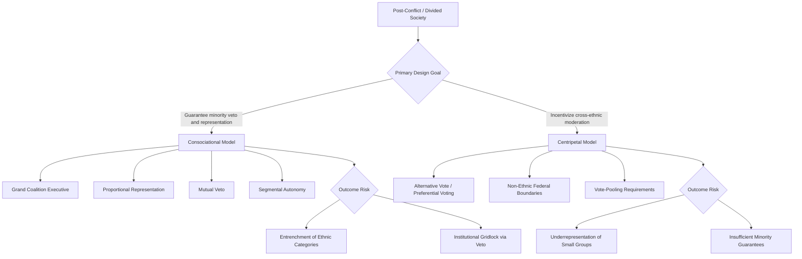

## Ethnic Conflict and Power-Sharing Arrangements

### Definition and Conceptual Scope

Power-sharing arrangements are institutional mechanisms designed to manage political conflict in ethnically divided societies by distributing political power, resources, and security guarantees across communal groups, rather than allowing a single group to dominate the state through majoritarian "winner-take-all" rule. Power-sharing is both an academic theoretical framework and a practical policy prescription frequently embedded in peace agreements ending civil wars in divided societies.

**Key Points**

- Power-sharing responds to the "commitment problem" in ethnic civil wars: groups that have fought each other cannot easily trust that a majoritarian government will not use state power to persecute the minority once conflict ends, so institutional guarantees are needed to make peace credible.
- The field is dominated by two competing schools: Consociationalism (associated with Arend Lijphart) and Centripetalism (associated with Donald Horowitz), which prescribe near-opposite institutional designs.
- Power-sharing dimensions are typically categorized as political, territorial, military, and economic.

### Theoretical Foundations

#### The Commitment Problem

Barbara Walter's work on civil war termination (*Committing to Peace*, 2002) frames power-sharing partly as a solution to the credible commitment problem: after a civil war, neither side can trust the other to disarm and share power voluntarily, so external guarantees (peacekeepers) or robust domestic institutional guarantees (power-sharing) are needed to make negotiated settlements durable rather than defaulting back to conflict.

#### Consociational Theory (Lijphart)

Arend Lijphart's consociational model (*Democracy in Plural Societies*, 1977) identifies four core institutional features for managing "plural societies" (societies with deep, politically salient segmental cleavages):

1. **Grand coalition government**: executive power shared among representatives of all major segments, rather than a single-party or single-group cabinet.
2. **Mutual veto (minority veto)**: minority segments retain the ability to block decisions on vital issues affecting their fundamental interests.
3. **Proportionality**: representation in the legislature, civil service, and public resources allocated proportionally to each segment's population share.
4. **Segmental autonomy**: significant self-governance for each segment in matters of exclusive concern (e.g., education, religion, family law).

**Example**

Post-1990 Lebanon's National Pact and Taif Agreement institutionalize consociational principles: the presidency is reserved for a Maronite Christian, the prime ministership for a Sunni Muslim, and the speakership of parliament for a Shia Muslim, with parliamentary seats allocated on a confessional (sectarian) quota basis.

#### Centripetal Theory (Horowitz)

Donald Horowitz (*Ethnic Groups in Conflict*, 1985; *A Democratic South Africa?*, 1991) critiques consociationalism for institutionally entrenching and freezing ethnic categories rather than incentivizing their moderation, arguing this can perpetuate rather than resolve division. Centripetalism instead proposes institutions that create electoral incentives for politicians to build cross-ethnic coalitions:

- **Alternative Vote (AV) / preferential electoral systems**: require candidates to seek second-preference votes from other groups to win, incentivizing moderate, cross-ethnic campaigning.
- **Federalism with non-ethnic boundaries**: territorial subdivisions that cross-cut rather than reinforce ethnic settlement patterns, reducing the incentive for ethnic-bloc regional autonomy claims.
- **Vote-pooling mechanisms**: electoral rules that reward candidates for accumulating votes across multiple groups (e.g., Nigeria's presidential distribution requirement across geographic zones).

### Dimensions of Power-Sharing

#### Political Power-Sharing

Formal rules guaranteeing group representation in the executive, legislature, and judiciary — e.g., reserved cabinet posts, proportional electoral systems, or explicit ethnic quotas.

#### Territorial Power-Sharing

Federal or devolved governance structures granting regional autonomy to geographically concentrated groups — e.g., Ethiopia's ethnic federalism (1995 Constitution, organizing federal states largely along ethnolinguistic lines), Bosnia-Herzegovina's two-entity structure under the 1995 Dayton Agreement (Federation of Bosnia and Herzegovina and Republika Srpska).

#### Military Power-Sharing

Integration of former combatant forces into a unified national army, or guarantees of proportional representation within security forces — a frequently cited critical component of durable peace, since retaining separate armed factions undermines mutual security guarantees (emphasized in Walter's commitment-problem framework).

#### Economic Power-Sharing

Guarantees regarding resource distribution, civil service employment quotas, or affirmative-action-style programs — e.g., Malaysia's New Economic Policy (1971) providing *Bumiputera* (ethnic Malay/indigenous) preferences in employment, education, and business ownership following the 1969 race riots.

### Case Studies

#### Bosnia-Herzegovina (Dayton Agreement, 1995)

Ended the Bosnian War through a highly consociational settlement: a tripartite rotating presidency (one Bosniak, one Croat, one Serb), an ethnic quota-based bicameral legislature, and territorial division into two entities plus the Brčko District. [Inference] Widely regarded by scholars as a stabilizing but also ossifying settlement — frequently criticized for entrenching ethnic categories in ways that have obstructed the development of cross-ethnic, programmatic politics in subsequent decades.

#### Northern Ireland (Good Friday/Belfast Agreement, 1998)

Established a consociational power-sharing executive between unionist (predominantly Protestant/British-identifying) and nationalist (predominantly Catholic/Irish-identifying) parties, requiring cross-community consent mechanisms in the Northern Ireland Assembly and a mandatory coalition First Minister/deputy First Minister arrangement. The Assembly has experienced multiple suspensions (notably 2017–2020, and again over post-Brexit Protocol disputes) illustrating the fragility of consociational arrangements when core power-sharing trust breaks down.

#### South Africa (Post-Apartheid Transition, 1994–1996)

The 1993 interim constitution included consociational elements (a Government of National Unity with mandatory power-sharing), but these provisions were explicitly temporary "sunset clauses," phased out under the 1996 final constitution in favor of majoritarian democracy — often cited as a case where power-sharing served as a transitional confidence-building bridge rather than a permanent institutional feature.

#### Rwanda (Arusha Accords, 1993, and post-genocide governance)

The pre-genocide Arusha Accords attempted power-sharing between the Habyarimana government and the Rwandan Patriotic Front, but collapsed amid the 1994 genocide — frequently cited as an example (following Walter's framework) of power-sharing failing where credible commitment and security guarantees for the threatened group were absent. Post-genocide Rwanda's governance instead moved toward centralized, non-ethnic official discourse alongside RPF political dominance, a markedly different model from consociational power-sharing.

#### Ethiopia (Ethnic Federalism, 1995–present)

Ethiopia's constitution establishes a federal structure with ethnolinguistically defined regional states and includes a constitutional right to secession (Article 39) — an unusually strong territorial power-sharing/autonomy guarantee. [Unverified: interpretation of Article 39's practical enforceability is contested; specific current constitutional status should be checked against recent developments given the Tigray conflict (2020–2022) and subsequent instability.]

### Comparative Summary Table

| Dimension | Consociational Mechanism | Centripetal Mechanism |
| --- | --- | --- |
| Executive | Grand coalition, quota-based cabinet | Cross-ethnic coalition incentivized by electoral rules |
| Legislature | Proportional/reserved seats | Preferential voting (AV), vote-pooling |
| Territory | Segmental/ethnic federalism | Non-ethnic federal boundaries |
| Minority Protection | Mutual veto | Electoral incentive for moderation, not veto |
| Risk | Entrenches ethnic categories, potential gridlock | May underrepresent smaller/concentrated groups |

### Visualizing the Power-Sharing Decision Space

### Diagram: Dayton Agreement Institutional Structure (SVG)

<svg xmlns="http://www.w3.org/2000/svg" viewBox="0 0 700 320">
<text x="350" y="26" font-size="16" font-weight="bold" text-anchor="middle" fill="#1a1a1a">Bosnia-Herzegovina Consociational Structure (svg_diagram)</text>
<rect x="240" y="50" width="220" height="55" rx="8" fill="#e0e7ff" stroke="#4338ca" stroke-width="2" />
<text x="350" y="72" font-size="12" text-anchor="middle" fill="#312e81">Tripartite Presidency</text>
<text x="350" y="90" font-size="10" text-anchor="middle" fill="#312e81">Bosniak · Croat · Serb (rotating)</text>
<line x1="350" y1="105" x2="350" y2="135" stroke="#6b7280" stroke-width="2" />
<rect x="240" y="140" width="220" height="55" rx="8" fill="#fef3c7" stroke="#b45309" stroke-width="2" />
<text x="350" y="162" font-size="12" text-anchor="middle" fill="#78350f">Council of Ministers</text>
<text x="350" y="180" font-size="10" text-anchor="middle" fill="#78350f">Ethnic quota-based cabinet</text>
<line x1="350" y1="195" x2="150" y2="230" stroke="#6b7280" stroke-width="2" />
<line x1="350" y1="195" x2="550" y2="230" stroke="#6b7280" stroke-width="2" />
<rect x="50" y="235" width="220" height="55" rx="8" fill="#dcfce7" stroke="#16a34a" stroke-width="2" />
<text x="160" y="257" font-size="12" text-anchor="middle" fill="#14532d">Federation of BiH</text>
<text x="160" y="275" font-size="10" text-anchor="middle" fill="#14532d">Bosniak/Croat majority entity</text>
<rect x="430" y="235" width="220" height="55" rx="8" fill="#fee2e2" stroke="#dc2626" stroke-width="2" />
<text x="540" y="257" font-size="12" text-anchor="middle" fill="#7f1d1d">Republika Srpska</text>
<text x="540" y="275" font-size="10" text-anchor="middle" fill="#7f1d1d">Serb-majority entity</text>
</svg>

### Empirical Debates and Critiques

- **Does power-sharing prevent conflict recurrence, or merely freeze it?** [Inference] Large-N studies (e.g., work by Caroline Hartzell and Matthew Hoddie on civil war settlements) generally find that more comprehensive power-sharing provisions (combining political, territorial, military, and economic dimensions) are associated with more durable peace, though causality and generalizability remain debated given the small number of comparable post-civil-war cases.
- **Elite capture critique**: Critics argue power-sharing arrangements often empower the same wartime elites and militia leaders who benefit from perpetuating ethnic salience, creating perverse incentives against genuine reconciliation or de-ethnicization of politics over time.
- **Democratic quality trade-off**: Consociational systems can produce chronic government instability or paralysis (as in Bosnia's cumbersome multi-layered institutions, or Lebanon's repeated cabinet formation crises and the prolonged 2022–2025 presidential vacancy), raising questions about the long-run trade-off between conflict management and effective governance.
- **Sunset clauses vs. permanent arrangements**: The South African case illustrates an alternative approach — treating power-sharing as a temporary confidence-building bridge toward eventual majoritarian democracy rather than a permanent institutional feature, though this model may be less applicable where deep mutual distrust persists indefinitely.

### Conclusion

Power-sharing arrangements represent the primary institutional toolkit for managing ethnic conflict in divided post-war societies, organized around the competing logics of consociationalism (guaranteeing minority representation and veto power) and centripetalism (incentivizing cross-ethnic electoral coalition-building). Empirical cases — Bosnia, Northern Ireland, Lebanon, South Africa, Rwanda, Ethiopia — illustrate substantial variation in design and durability, with recurring tensions between short-term conflict-management effectiveness and long-run risks of entrenching the very ethnic divisions the arrangements were designed to transcend.

**Related Topics**

- Consociationalism vs. Centripetalism: A Comparative Assessment
- The Commitment Problem in Civil War Termination (Walter)
- Ethnic Federalism: Ethiopia and Comparative Cases
- Peacekeeping and the Durability of Power-Sharing Agreements
- Sunset Clauses and Transitional Power-Sharing Models
- Electoral System Design in Divided Societies (Alternative Vote, PR)
- Security Sector Reform and Military Integration Post-Conflict