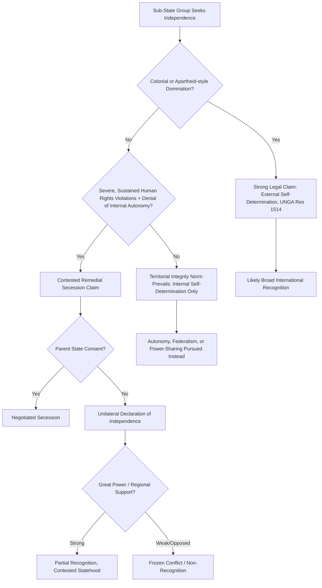

## Secessionism and Self-Determination

### Definition and Conceptual Scope

Secessionism refers to political movements seeking to withdraw a territory and its population from an existing sovereign state to form a new independent state or join another. Self-determination is the broader normative and legal principle — enshrined in international law — that "peoples" have the right to freely determine their political status. The relationship between the two is contested: self-determination is a recognized international legal right, but it does not automatically translate into a right to secede, creating one of the most persistent tensions in international law and comparative politics.

**Key Points**

- International law distinguishes "internal" self-determination (autonomy, minority rights, political participation within an existing state) from "external" self-determination (independence/secession), with the latter recognized as a right only in narrow, contested circumstances.
- The tension between self-determination and territorial integrity is foundational: the UN Charter and international practice generally privilege existing state borders (*uti possidetis*) over the claims of sub-state groups seeking independence.
- Secessionist outcomes are shaped by a combination of legal framing, great-power politics, domestic institutional design, and the presence or absence of colonial or apartheid-style domination.

### Legal Foundations of Self-Determination

#### UN Charter and Early Codification

The principle of self-determination appears in Article 1(2) and Article 55 of the UN Charter (1945), but was initially understood primarily in the context of decolonization rather than as a general right applicable to any sub-state group.

#### Decolonization-Era Instruments

- **UN General Assembly Resolution 1514 (1960)**, the "Declaration on the Granting of Independence to Colonial Countries and Peoples," affirmed the right of all peoples under colonial domination to self-determination.
- **UN General Assembly Resolution 2625 (1970)**, the "Declaration on Principles of International Law," articulated what became known as the **"safeguard clause"**: self-determination should not be construed as authorizing action that would dismember or impair the territorial integrity of states conducting themselves in compliance with the principle of equal rights and self-determination and possessing a government representing the whole population without distinction.

#### The Remedial Secession Doctrine

A contested strand of international legal scholarship argues that "remedial secession" may be justified as a last-resort right when a group faces sustained, severe human rights violations or is denied any meaningful internal self-determination by the parent state — though this doctrine has never been affirmatively recognized as binding customary international law by a definitive international judicial ruling.

#### The 2010 ICJ Kosovo Advisory Opinion

The International Court of Justice's advisory opinion on Kosovo (2010) found that Kosovo's 2008 declaration of independence did not violate international law, but deliberately avoided ruling on whether Kosovo had a *right* to secede — the Court held that general international law contains no prohibition on declarations of independence, without addressing whether a positive right to secession existed. [Inference] This narrow, technical framing is widely read by scholars as reflecting the ICJ's deliberate avoidance of establishing a general precedent for secession, given the destabilizing implications for the broader international system.

### Theoretical Frameworks

#### Territorial Integrity Norm

Robert Jackson's concept of "negative sovereignty" and the broader territorial integrity norm explain why post-1945 international society has strongly disfavored border changes through secession, in contrast to the pre-1945 era of frequent territorial revision — a stability-oriented norm that privileges existing juridical statehood over ethnographic or historical claims.

#### Just-Cause Theories of Secession

Political philosophers distinguish:

- **Primary right theories** (e.g., associated with nationalist self-determination arguments): a group has a general right to secede if it constitutes a "people" or nation, regardless of prior injustice.
- **Remedial right-only theories** (associated with Allen Buchanan, *Secession*, 1991): secession is justified only as a remedy for serious injustices (e.g., systematic discrimination, denial of internal autonomy, or annexation), not as a general entitlement of any self-identified group.

#### Rational Choice / Bargaining Models

Some political scientists model secession as the outcome of a bargaining failure between center and periphery, where credible commitment problems (the center cannot credibly promise not to renege on autonomy concessions) push toward violent or unilateral secession rather than negotiated settlement — paralleling commitment-problem logic used in civil war and power-sharing literature.

### Pathways to Secession: Comparative Typology

#### Negotiated/Consensual Secession

Secession achieved through mutual agreement and constitutional or referendum processes.

- **Example**: The 1993 "Velvet Divorce" split of Czechoslovakia into the Czech Republic and Slovakia was achieved through elite negotiation without a public referendum, widely cited as a rare peaceful, consensual dissolution.
- **Example**: South Sudan's 2011 independence referendum (following the 2005 Comprehensive Peace Agreement ending Sudan's civil war) resulted in secession with the consent of the Sudanese government, though post-independence relations and internal South Sudanese governance have remained highly unstable.

#### Unilateral Declaration of Independence (UDI)

Secession declared without the consent of the parent state, with recognition status contested internationally.

- **Example**: Kosovo's 2008 UDI has been recognized by roughly 100 UN member states but remains unrecognized by Serbia, Russia, China, and several EU states (Spain, Slovakia, Cyprus, Romania, Greece), producing a case of persistent contested/partial statehood.
- **Example**: Catalonia's 2017 unilateral independence referendum (declared illegal by Spain's Constitutional Court) resulted in the Spanish government's direct imposition of Article 155 control and did not achieve international recognition.

#### Referendum-Based, Internationally Facilitated Secession

- **Example**: East Timor's 1999 UN-administered referendum, following Indonesian withdrawal under international pressure, led to full independence in 2002 with broad international legitimacy and UN transitional administration (UNTAET).

#### Frozen/Unresolved Secessionist Conflicts

Territories exercising de facto independence without broad international recognition.

- **Examples**: Abkhazia and South Ossetia (from Georgia, recognized mainly by Russia and a small number of states), Transnistria (from Moldova), Nagorno-Karabakh (historically de facto independent from Azerbaijan until Azerbaijan's 2023 military reassertion of control), Somaliland (de facto independent from Somalia since 1991, recognized by no UN member states as of the author's training data — [Unverified: recognition status should be checked for any recent diplomatic developments]).

### Case Comparison Table

| Case | Mechanism | Parent State Consent | International Recognition |
| --- | --- | --- | --- |
| Czechoslovakia (1993) | Elite negotiation | Yes (mutual) | Full, immediate |
| South Sudan (2011) | Referendum | Yes (CPA-based) | Full, immediate |
| East Timor (2002) | UN-facilitated referendum | Eventual (after conflict) | Full |
| Kosovo (2008) | UDI | No | Partial (~100 states) |
| Catalonia (2017) | UDI (ruled illegal) | No | None |
| Somaliland (1991–present) | De facto declaration | No | None (as of last verified data) |
| Abkhazia/South Ossetia | De facto, Russia-backed | No | Minimal (Russia + few states) |

### Visualizing the Legal-Political Decision Space

### Diagram: Internal vs. External Self-Determination Spectrum (SVG)

<svg xmlns="http://www.w3.org/2000/svg" viewBox="0 0 700 240">
<text x="350" y="26" font-size="16" font-weight="bold" text-anchor="middle" fill="#1a1a1a">Self-Determination Spectrum (svg_diagram)</text>
<rect x="40" y="60" width="600" height="50" rx="6" fill="#f3f4f6" stroke="#6b7280" stroke-width="1.5" />
<line x1="200" y1="60" x2="200" y2="110" stroke="#9ca3af" stroke-width="1" stroke-dasharray="3,3" />
<line x1="360" y1="60" x2="360" y2="110" stroke="#9ca3af" stroke-width="1" stroke-dasharray="3,3" />
<line x1="520" y1="60" x2="520" y2="110" stroke="#9ca3af" stroke-width="1" stroke-dasharray="3,3" />

<text x="120" y="90" font-size="11" text-anchor="middle" fill="`#1e3a8a`">Cultural/</text>

<text x="120" y="103" font-size="11" text-anchor="middle" fill="`#1e3a8a`">Language Rights</text>

<text x="280" y="90" font-size="11" text-anchor="middle" fill="`#065f46`">Regional</text>

<text x="280" y="103" font-size="11" text-anchor="middle" fill="`#065f46`">Autonomy</text>

<text x="440" y="90" font-size="11" text-anchor="middle" fill="`#92400e`">Federalism /</text>

<text x="440" y="103" font-size="11" text-anchor="middle" fill="`#92400e`">Power-Sharing</text>

<text x="600" y="90" font-size="11" text-anchor="middle" fill="`#7f1d1d`">Full</text>

<text x="600" y="103" font-size="11" text-anchor="middle" fill="`#7f1d1d`">Independence</text>

<text x="120" y="135" font-size="10" text-anchor="middle" fill="`#4b5563`">"Internal" Self-Determination</text>

<text x="600" y="135" font-size="10" text-anchor="middle" fill="`#4b5563`">"External" Self-Determination</text>

<line x1="40" y1="160" x2="640" y2="160" stroke="#374151" stroke-width="2" />
<polygon points="640,160 628,153 628,167" fill="#374151" />
<text x="350" y="185" font-size="11" text-anchor="middle" fill="#374151">Territorial Integrity Norm Increasingly Contested →</text>
</svg>

### Key Debates and Critiques

- **The "secessionist paradox"**: Some scholars observe that granting robust internal autonomy or federal self-governance can either satisfy self-determination demands and reduce secessionist pressure, or alternatively provide groups with the institutional and administrative capacity (their own governing bodies, security forces, fiscal base) that makes eventual secession more feasible — the empirical relationship between autonomy and secession risk remains actively debated. [Inference]
- **Selective international recognition and double standards**: Critics highlight inconsistency in international responses — e.g., Western states' support for Kosovo's independence contrasted with opposition to Abkhazia/South Ossetia recognition by Russia, or the asymmetric treatment of Crimea's 2014 annexation/referendum (widely rejected as illegal under international law) versus other contested cases — illustrating how great-power interests shape which self-determination claims gain traction. [Inference]
- **Indigenous self-determination as a distinct category**: The 2007 UN Declaration on the Rights of Indigenous Peoples (UNDRIP) affirms indigenous peoples' right to self-determination, but is generally interpreted (including via its own text) as oriented toward autonomy and self-government within existing states rather than a right to full secession — a deliberately narrower framing than decolonization-era self-determination.
- **Economic viability and the "small state" question**: Debates persist over whether secessionist movements (e.g., Scottish independence debates, Catalonia) adequately address post-independence economic viability, currency arrangements, and EU/international organizational membership status, which are frequently central to the political feasibility of a secession movement's success.

### Conclusion

Secessionism sits at the unresolved intersection of a recognized international legal principle (self-determination) and a strongly protected competing norm (territorial integrity), producing a body of law and practice that is permissive in narrow decolonization/domination contexts but highly restrictive otherwise. Comparative outcomes — from Czechoslovakia's peaceful split to Kosovo's contested partial recognition to Somaliland's decades-long unrecognized de facto statehood — demonstrate that success depends less on the strength of a group's identity-based claim than on parent-state consent, great-power alignment, and the surrounding international political context.

**Related Topics**

- The Kosovo Precedent and the 2010 ICJ Advisory Opinion
- Remedial Secession Theory (Buchanan) vs. Primary Right Theories
- Frozen Conflicts: Abkhazia, South Ossetia, Transnistria, Nagorno-Karabakh
- Indigenous Self-Determination and UNDRIP
- Federalism and Autonomy as Alternatives to Secession
- Great Power Politics and Selective Recognition of Secessionist States
- Referendums on Independence: Scotland, Catalonia, New Caledonia