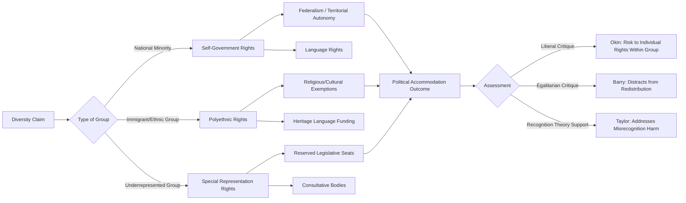

## Multiculturalism and Political Accommodation

### Definition and Conceptual Scope

Multiculturalism refers to a family of political philosophies and public policies that recognize, protect, and accommodate cultural, religious, linguistic, and ethnic diversity within a state, in contrast to assimilationist models that expect minorities to adopt the majority culture as a condition of full civic membership. Political accommodation encompasses the concrete institutional mechanisms — group-differentiated rights, language policy, religious exemptions, federalism — through which diversity claims are managed within liberal democratic states.

**Key Points**

- Multiculturalism is both a normative political theory (concerned with justice claims of minority groups within liberal states) and an empirical policy paradigm (concerned with actual government programs, e.g., Canadian or Australian multicultural policy).
- A foundational analytical distinction (developed most systematically by Will Kymlicka) separates national minorities (historically self-governing groups incorporated into a larger state, e.g., Quebec, Catalonia, Indigenous peoples) from immigrant/ethnic groups (voluntary migrants seeking integration with some cultural accommodation), since these groups typically make different types of claims.
- Since the mid-2000s, multiculturalism as a policy paradigm has faced significant political backlash in parts of Western Europe, generating a prominent "retreat from multiculturalism" debate.

### Theoretical Foundations

#### Will Kymlicka: Liberal Multiculturalism

Kymlicka (*Multicultural Citizenship*, 1995) provides the most influential liberal defense of group-differentiated rights, arguing that a fair liberal society requires more than formal equality of individual rights — it must also account for the fact that majority nations already receive substantial public support (through public education, official languages, national holidays) that minority cultures lack access to. Kymlicka distinguishes:

- **Self-government rights**: powers devolved to national minorities (e.g., federal autonomy for Quebec, tribal sovereignty for Indigenous nations).
- **Polyethnic rights**: accommodations for immigrant groups to express cultural particularity without it impeding integration (e.g., exemptions from dress codes, funding for heritage-language programs).
- **Special representation rights**: guaranteed political representation for groups otherwise likely to be underrepresented (e.g., reserved legislative seats).

#### Charles Taylor: The Politics of Recognition

Taylor's essay "The Politics of Recognition" (1992) argues that identity is partly formed dialogically through recognition or its absence, and that misrecognition or non-recognition can constitute a real form of harm — providing philosophical grounding for why public recognition of minority cultures (not merely private tolerance) matters for genuine equality.

#### Iris Marion Young: Politics of Difference

Young (*Justice and the Politics of Difference*, 1990) critiques the liberal ideal of a "universal" undifferentiated citizenship, arguing that formally neutral, group-blind policies often perpetuate the disadvantage of oppressed groups, and advocates group-differentiated policies and representation as necessary for substantive rather than merely formal equality.

#### Critiques from Liberal Egalitarianism (Barry) and Feminism (Okin)

- Brian Barry (*Culture and Equality*, 2001) offers an influential liberal-egalitarian critique, arguing multiculturalism often substitutes cultural recognition for the redistributive, class-based politics needed to address underlying material inequality, and risks essentializing cultures as static and homogeneous.
- Susan Moller Okin's essay "Is Multiculturalism Bad for Women?" (1997) raises the "paradox of multicultural vulnerability" — group accommodation rights can entrench illiberal practices that harm vulnerable members within minority groups (particularly women and children), creating a tension between group rights and individual rights that liberal multicultural theory must address.

### Models of Political Accommodation

#### Federalism and Territorial Autonomy

Devolving governance powers to sub-state units aligned with national minority populations — e.g., Canada's asymmetric federalism granting Quebec distinct powers over language and civil law; Spain's "State of Autonomies" granting varying degrees of self-government to Catalonia, the Basque Country, and other autonomous communities; Belgium's complex linguistic-community and regional federal structure balancing Flemish, Walloon, and Brussels-Capital constituencies.

#### Language Policy

Official multilingualism (e.g., Canada's Official Languages Act 1969, recognizing English and French; Switzerland's four national languages), versus more restrictive "one official language plus accommodation" models, versus assimilationist single-language policies.

#### Religious Accommodation

Exemptions and accommodations for religious practice within otherwise general laws — e.g., Sikh turban exemptions from motorcycle helmet laws in the UK and Canada, religious dress exemptions/restrictions (contrasted starkly by France's 2004 law banning conspicuous religious symbols in public schools and 2010 law banning full-face coverings in public spaces, reflecting France's distinct *laïcité* tradition of strict state secularism).

#### Consultative and Representative Mechanisms

Formal consultation requirements, reserved seats, or advisory bodies for minority communities — e.g., New Zealand's Māori electoral seats (reserved parliamentary constituencies dating to 1867), Norway's Sámi Parliament (an elected advisory/consultative body, established 1989).

#### Official Multicultural Policy Frameworks

- **Canada**: The Canadian Multiculturalism Act (1988) formally enshrines multiculturalism as an official government policy, building on Prime Minister Pierre Trudeau's 1971 policy announcement — Canada is frequently cited as the paradigmatic case of state-endorsed multiculturalism.
- **Australia**: Adopted multiculturalism as official policy from the mid-1970s, formalized through successive national multicultural policy statements, replacing the earlier "White Australia" assimilationist immigration policy (dismantled progressively 1949–1973).

### The "Retreat from Multiculturalism" Debate

#### Political Backlash in Western Europe

Since the mid-2000s, several prominent European leaders publicly declared multiculturalism a failure or in crisis — including German Chancellor Angela Merkel (2010), UK Prime Minister David Cameron (2011), and French President Nicolas Sarkozy (2011) — citing concerns about social cohesion, parallel communities, and the integration of Muslim minority populations in particular.

#### Empirical Counter-Evidence: The Multiculturalism Policy Index (MCP)

[Inference] Comparative research led by Keith Banting and Will Kymlicka (the Multiculturalism Policy Index project) found that, contrary to the political "retreat" narrative, formal multicultural accommodation *policies* were not, on average, actually retrenched across most OECD states during the 2000s–2010s — suggesting the political rhetoric of crisis outpaced actual substantive policy reversal in many cases, though country-level variation exists and should be checked against current MCP data for precise up-to-date country scores.

#### Distinguishing Rhetoric from Policy

Scholars increasingly distinguish the rhetorical "death of multiculturalism" discourse (a political communication phenomenon tied to anti-immigration party competition) from the empirical question of whether underlying accommodation policies (language rights, religious exemptions, funding for minority organizations) were substantively rolled back — with evidence suggesting more continuity in policy than rhetoric implies in several, though not all, cases.

### Comparative Summary Table

| Country/Region | Model | Key Mechanism |
| --- | --- | --- |
| Canada | State multiculturalism | 1988 Multiculturalism Act, official bilingualism |
| Australia | State multiculturalism | Post-White Australia policy, settlement services |
| France | Republican assimilationism/*laïcité* | Strict secularism, symbol bans |
| Spain | Territorial autonomy | Autonomous Communities (Catalonia, Basque Country) |
| Belgium | Consociational federalism | Linguistic community + regional structure |
| Switzerland | Territorial linguistic federalism | Cantonal autonomy, 4 national languages |
| New Zealand | Indigenous representation | Reserved Māori parliamentary seats |
| Norway | Indigenous consultative body | Sámi Parliament |

### Visualizing the Accommodation Spectrum

### Diagram: Kymlicka's Rights Typology (SVG)

<svg xmlns="http://www.w3.org/2000/svg" viewBox="0 0 700 260">
<text x="350" y="26" font-size="16" font-weight="bold" text-anchor="middle" fill="#1a1a1a">Kymlicka's Group-Differentiated Rights Typology (svg_diagram)</text>
<rect x="30" y="60" width="200" height="90" rx="8" fill="#dbeafe" stroke="#2563eb" stroke-width="2" />
<text x="130" y="85" font-size="12" font-weight="bold" text-anchor="middle" fill="#1e3a8a">Self-Government</text>
<text x="130" y="103" font-size="10" text-anchor="middle" fill="#1e3a8a">Rights</text>
<text x="130" y="125" font-size="10" text-anchor="middle" fill="#1e3a8a">National minorities</text>
<text x="130" y="140" font-size="10" text-anchor="middle" fill="#1e3a8a">(e.g., Quebec, tribes)</text>
<rect x="250" y="60" width="200" height="90" rx="8" fill="#dcfce7" stroke="#16a34a" stroke-width="2" />
<text x="350" y="85" font-size="12" font-weight="bold" text-anchor="middle" fill="#14532d">Polyethnic Rights</text>
<text x="350" y="103" font-size="10" text-anchor="middle" fill="#14532d">Cultural accommodation</text>
<text x="350" y="125" font-size="10" text-anchor="middle" fill="#14532d">Immigrant groups</text>
<text x="350" y="140" font-size="10" text-anchor="middle" fill="#14532d">(e.g., dress exemptions)</text>
<rect x="470" y="60" width="200" height="90" rx="8" fill="#fef3c7" stroke="#d97706" stroke-width="2" />
<text x="570" y="85" font-size="12" font-weight="bold" text-anchor="middle" fill="#78350f">Special Representation</text>
<text x="570" y="103" font-size="10" text-anchor="middle" fill="#78350f">Rights</text>
<text x="570" y="125" font-size="10" text-anchor="middle" fill="#78350f">Underrepresented groups</text>
<text x="570" y="140" font-size="10" text-anchor="middle" fill="#78350f">(e.g., reserved seats)</text>

<text x="350" y="190" font-size="11" text-anchor="middle" fill="`#374151`">Shared foundation: liberal equality requires more than formal, group-blind rights</text>

<text x="350" y="210" font-size="11" text-anchor="middle" fill="`#374151`">to address unequal access to societal culture (Kymlicka, 1995)</text>

</svg>

### Applied Case Illustration

**Example**

Canada's approach to Quebec versus its approach to immigrant communities illustrates Kymlicka's distinction directly: Quebec receives self-government rights (a distinct legal code, control over immigration selection criteria, French-language protection laws such as Bill 101), reflecting its status as a national minority historically possessing its own institutions prior to Confederation, whereas immigrant communities in Toronto or Vancouver typically receive polyethnic rights (funding for cultural associations, heritage-language education, exemptions from certain dress-code rules) aimed at facilitating integration while respecting cultural particularity — not self-government, since Kymlicka's framework treats immigrant groups as having voluntarily joined the existing national community.

### Key Debates and Critiques

- **Group rights vs. individual rights**: The Okin critique remains central — how should liberal states respond when minority group practices (e.g., certain religious family law arrangements) potentially disadvantage individual members, particularly women, within the accommodated group?
- **Multiculturalism vs. interculturalism**: Some scholars (e.g., Gérard Bouchard in the Quebec context) propose "interculturalism" as an alternative emphasizing intergroup dialogue and a stronger common civic culture, critiquing multiculturalism for allegedly encouraging parallel, insufficiently interacting communities — though defenders of multiculturalism dispute this characterization as a caricature of actual multicultural policy.
- **Securitization of Muslim minorities**: Post-9/11 and post-2015 European terrorism concerns have specifically reframed Muslim religious accommodation debates through a security lens, distinct from earlier multiculturalism debates focused on general immigrant integration — a shift scholars argue has disproportionately targeted one religious community's accommodation claims relative to others.
- **Does group recognition redistribute material resources or only symbolic status?** The Barry-style egalitarian critique continues to generate debate over whether multicultural recognition policies substitute for, complement, or actively undermine redistributive economic justice for disadvantaged minority populations.

### Conclusion

Multiculturalism and political accommodation address how liberal democratic states manage deep cultural, linguistic, and religious diversity without either coercive assimilation or unchecked fragmentation. Kymlicka's typology of self-government, polyethnic, and special representation rights remains the dominant analytical framework, while normative debates continue over the proper balance between group recognition and individual liberal rights (Okin), and between cultural recognition and material redistribution (Barry). Despite prominent political rhetoric declaring multiculturalism's "failure" since the mid-2000s, empirical policy research suggests more continuity in formal accommodation policies than the political discourse implies, though significant cross-national variation and ongoing contestation persist.

**Related Topics**

- The Multiculturalism Policy Index and Comparative Accommodation Measurement
- Quebec Nationalism and Asymmetric Federalism in Canada
- Religious Accommodation and Secularism: *Laïcité* vs. Multicultural Models
- The Politics of Recognition (Taylor) and Its Critics
- Gender, Group Rights, and the Okin Debate
- Indigenous Self-Government and Multicultural Citizenship
- Interculturalism as an Alternative Framework (Bouchard, Quebec)