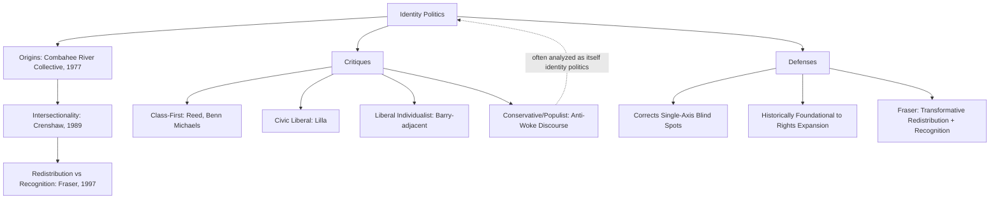

## Identity Politics and its Critics

### Definition and Conceptual Scope

Identity politics refers to political organizing, advocacy, and analysis centered on the shared experiences, interests, and social position of a group defined by identity categories — race, gender, sexuality, ethnicity, disability, religion — rather than solely by class or ideological affiliation. The term originated within left political movements as a descriptive and affirmative self-characterization, but has since become a widely contested term deployed across the political spectrum, both as a descriptive analytical category and as a pejorative critique.

**Key Points**

- The term is usually traced to the Combahee River Collective Statement (1977), a Black feminist socialist collective, which coined "identity politics" to describe organizing rooted in their own specific, intersecting oppressions rather than solely through existing (often white- or male-dominated) left movements.
- Identity politics is not a single unified theory but a broad descriptive label spanning civil rights movements, feminism, LGBTQ+ rights movements, disability rights, and Indigenous rights movements, among others.
- Critiques of identity politics come from multiple, often mutually opposed directions: class-first Marxist/socialist critiques, liberal-universalist critiques, and conservative critiques — each objecting to different aspects of identity-based mobilization.

### Origins and Theoretical Development

#### The Combahee River Collective Statement (1977)

The foundational text explicitly coined the term, articulating a politics rooted in the collective's own identity and experience, arguing that "the most profound and potentially most radical politics come directly out of our own identity" rather than working to end somebody else's oppression. The statement explicitly linked race, gender, sexuality, and class oppression as interlocking systems requiring integrated analysis — establishing an early intersectional framework prior to the coining of that specific term.

#### Kimberlé Crenshaw: Intersectionality

Legal scholar Kimberlé Crenshaw coined "intersectionality" (1989, "Demarginalizing the Intersection of Race and Sex") to describe how overlapping identity categories (e.g., being both Black and a woman) produce distinct, compounded forms of disadvantage not captured by analyzing race and gender separately — critiquing both mainstream feminism (implicitly centered on white women's experience) and anti-racist movements (implicitly centered on Black men's experience) for failing to address the specific position of Black women.

#### Nancy Fraser: Redistribution vs. Recognition

Fraser (*Justice Interruptus*, 1997) proposed an influential analytical distinction between claims for **redistribution** (addressing socioeconomic/class-based injustice) and claims for **recognition** (addressing cultural/status-based injustice, including identity-based misrecognition), arguing that a comprehensive theory of justice must integrate both dimensions rather than treating identity-based recognition claims as a substitute for, or in competition with, economic redistribution.

#### Charles Taylor and the Politics of Recognition

As discussed in multicultural theory, Taylor's argument that identity is partly constituted through recognition or misrecognition provides philosophical grounding for treating identity-based claims for public recognition as substantive rather than merely symbolic or secondary to material politics.

### Critiques from the Left: Class-First Perspectives

#### Marxist and Socialist Critiques

Some Marxist and socialist scholars (e.g., Adolph Reed Jr., Walter Benn Michaels) argue identity politics displaces attention from class-based economic inequality, and that a politics organized around racial or gender representation within existing hierarchies (e.g., diversifying corporate boardrooms or political elites) can coexist with, and even legitimize, persistent underlying class inequality — sometimes summarized as a critique that identity politics can function as a form of "neoliberal" or elite-compatible politics that leaves capitalist economic structures unchallenged.

#### Mark Lilla's "The Once and Future Liberal" (2017)

Political theorist Mark Lilla argued (in a widely debated 2016 New York Times essay and subsequent book) that Democratic Party emphasis on identity-based appeals contributed to electoral losses among white working-class voters, calling instead for a renewed "civic liberalism" organized around shared citizenship rather than group-specific identity claims — a critique that generated significant pushback from scholars who argued it mischaracterized identity politics and understated its historical role in expanding, rather than fragmenting, democratic citizenship.

### Critiques from Liberal Universalism

#### Francis Fukuyama: Identity (2018)

Fukuyama's *Identity: The Demand for Dignity and the Politics of Resentment* (2018) argues that contemporary identity politics — on both the left (recognition claims by marginalized groups) and right (nationalist/nativist identity claims) — reflects a common underlying psychological demand for dignity (*thymos*, drawing on Platonic/Hegelian political philosophy), but that an excessive proliferation of narrower group identities on the left risks fragmenting the broader solidarity needed for effective democratic coalition-building, while proposing a renewed emphasis on creedal national identity as an integrative alternative.

#### Liberal Individualist Critiques

Classical liberal critiques (echoing Brian Barry's critique of multiculturalism) argue that organizing politics around fixed group categories risks essentializing internally diverse groups, treating individuals primarily as group representatives rather than autonomous individuals, and potentially undermining the universalist premises of liberal citizenship (equal individual rights regardless of group membership).

### Critiques from the Right

#### Conservative and Populist Critiques

Conservative critiques (prominent in US and UK political discourse particularly since the mid-2010s) frame identity politics as promoting group grievance, victimhood culture, and "identitarian" fragmentation of national unity, often paired with critiques of "political correctness" or "wokeness" in broader culture-war discourse. [Inference] These critiques are frequently analyzed by scholars as themselves constituting a form of (majority/white/nationalist) identity politics, even while rhetorically positioning themselves as opposed to identity-based politics — a point frequently made by scholars such as Fukuyama regarding right-wing nationalist identity claims.

#### "Anti-Woke" Discourse

Since approximately 2020, "anti-woke" discourse has become a prominent organizing frame in US and UK conservative politics, targeting diversity, equity, and inclusion (DEI) programs, critical race theory in education, and broader institutional identity-conscious policies — representing a more recent and politically potent iteration of long-standing conservative critiques of identity politics. [Unverified: given the fast-moving and highly contested nature of this discourse, current policy status (e.g., of specific DEI regulations or legislation) should be verified against up-to-date sources for any time-sensitive claims.]

### Defenses and Reformulations

#### Intersectionality as Analytical Corrective, Not Fragmentation

Defenders (following Crenshaw) argue intersectionality does not fragment solidarity but rather corrects for the ways single-axis analyses (race-only or gender-only) already implicitly centered the most privileged members of a given group, and that genuinely inclusive coalition politics requires, rather than is undermined by, attention to intersecting identities.

#### Identity Politics as Historically Foundational to Democratic Expansion

Some scholars argue nearly all major democratic expansions of rights (abolition, suffrage, civil rights, LGBTQ+ rights) were achieved through group-based identity organizing, making the claim that "identity politics" is a recent or fragmenting deviation from a prior universalist politics historically inaccurate — since even ostensibly "universal" rights claims have historically required group-specific mobilization to be extended to excluded populations.

#### Fraser's Integrative Model

Fraser's own proposed resolution rejects the binary framing of redistribution *versus* recognition, arguing for a "transformative" politics that pursues both simultaneously rather than treating them as competing paradigms — positioning her critique as an internal corrective to identity politics discourse rather than a wholesale rejection of identity-based claims.

### Comparative Summary Table

| Critique Source | Key Figures | Core Objection |
| --- | --- | --- |
| Class-first/Marxist | Reed, Benn Michaels | Displaces attention from economic inequality |
| Civic liberal | Lilla | Fragments electoral coalitions, undermines shared citizenship |
| Liberal individualist | (Barry-adjacent) | Essentializes groups, undermines individual rights |
| Conservative/populist | Various | Promotes grievance politics, undermines national unity |
| Defenders | Crenshaw, Fraser, Taylor | Corrects single-axis blind spots; addresses real recognition harms |

### Visualizing the Debate Landscape

### Diagram: Fraser's Redistribution-Recognition Matrix (SVG)

<svg xmlns="http://www.w3.org/2000/svg" viewBox="0 0 700 260">
<text x="350" y="26" font-size="16" font-weight="bold" text-anchor="middle" fill="#1a1a1a">Fraser's Redistribution–Recognition Matrix (svg_diagram)</text>
<line x1="100" y1="220" x2="600" y2="220" stroke="#374151" stroke-width="2" />
<line x1="100" y1="220" x2="100" y2="50" stroke="#374151" stroke-width="2" />
<text x="350" y="245" font-size="12" text-anchor="middle" fill="#374151">Recognition Claim (cultural/status) →</text>
<text x="60" y="140" font-size="12" text-anchor="middle" fill="#374151" transform="rotate(-90 60 140)">Redistribution Claim (economic) →</text>
<rect x="130" y="60" width="200" height="70" rx="6" fill="#dbeafe" stroke="#2563eb" stroke-width="1.5" />
<text x="230" y="85" font-size="11" text-anchor="middle" fill="#1e3a8a">Class Politics</text>
<text x="230" y="102" font-size="10" text-anchor="middle" fill="#1e3a8a">(high redistribution,</text>
<text x="230" y="116" font-size="10" text-anchor="middle" fill="#1e3a8a">low recognition focus)</text>
<rect x="370" y="60" width="200" height="70" rx="6" fill="#dcfce7" stroke="#16a34a" stroke-width="1.5" />
<text x="470" y="85" font-size="11" text-anchor="middle" fill="#14532d">Transformative Politics</text>
<text x="470" y="102" font-size="10" text-anchor="middle" fill="#14532d">(Fraser's proposed</text>
<text x="470" y="116" font-size="10" text-anchor="middle" fill="#14532d">integrative synthesis)</text>
<rect x="130" y="150" width="200" height="60" rx="6" fill="#f3f4f6" stroke="#6b7280" stroke-width="1.5" />
<text x="230" y="175" font-size="10" text-anchor="middle" fill="#374151">Low redistribution,</text>
<text x="230" y="190" font-size="10" text-anchor="middle" fill="#374151">low recognition</text>
<rect x="370" y="150" width="200" height="60" rx="6" fill="#fef3c7" stroke="#d97706" stroke-width="1.5" />
<text x="470" y="175" font-size="10" text-anchor="middle" fill="#78350f">"Affirmative" Recognition</text>
<text x="470" y="190" font-size="10" text-anchor="middle" fill="#78350f">(critiqued as insufficient alone)</text>
</svg>

### Applied Case Illustration

**Example**

The 2016 and 2020 US presidential election post-mortems illustrate the class-first vs. identity-politics debate directly: some analysts (echoing Lilla) attributed Democratic underperformance among white working-class voters in the industrial Midwest to excessive focus on identity-specific appeals at the expense of class-based economic messaging, while other analysts (echoing Crenshaw-style intersectional critique) argued this framing itself erased the reality that voters of color and women are also workers, such that "class" and "identity" politics were being falsely presented as mutually exclusive categories rather than overlapping dimensions of the same electorate.

### Key Debates and Ongoing Tensions

- **Is identity politics analytically distinct from interest-group politics generally?** Some scholars argue all group-based political organizing (including class-based labor politics or region-based politics) constitutes a form of "identity politics" in the broad sense, complicating claims that identity politics is a uniquely new or uniquely fragmenting phenomenon.
- **Electoral coalition-building vs. substantive representation**: There is an unresolved empirical and normative tension between building broad electoral majorities (which may favor more universalist messaging) and ensuring substantive representation of specific group interests and historical grievances (which may require more particularist, identity-specific claims).
- **"Identity politics" as a contested, asymmetrically applied label**: Scholars note the term is frequently applied selectively to marginalized-group organizing while analogous majority-group political behavior (e.g., appeals to a national or racial majority) is often not labeled "identity politics" in mainstream discourse — itself a subject of ongoing critical analysis. [Inference]

### Conclusion

Identity politics, originating as an affirmative self-description by Black feminist organizers in the Combahee River Collective Statement, has become one of the most contested terms in contemporary political discourse, drawing critique from class-first socialists, civic liberals, liberal individualists, and conservatives alike — each objecting on different grounds (economic displacement, electoral fragmentation, group essentialism, or national cohesion, respectively). Defenders, particularly drawing on Crenshaw's intersectionality and Fraser's redistribution-recognition framework, argue these critiques often mischaracterize identity politics as a deviation from, rather than a historically necessary vehicle for, democratic inclusion, and propose integrative frameworks that treat economic redistribution and cultural recognition as complementary rather than competing political goals.

**Related Topics**

- Intersectionality Theory and Its Applications (Crenshaw)
- The Combahee River Collective and Black Feminist Political Thought
- Redistribution vs. Recognition: Nancy Fraser's Framework
- Populism and Majority-Group Identity Politics
- The Politics of Recognition and Liberal Multiculturalism (Taylor, Kymlicka)
- Electoral Coalition-Building: Class vs. Identity Messaging Debates
- Critical Race Theory and Contemporary Political Backlash