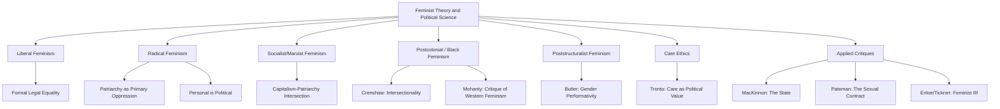

## Feminist Theory and Political Science

### Definition and Conceptual Scope

Feminist theory in political science examines how gender structures political power, institutions, citizenship, and knowledge production, and critiques the discipline's traditional categories (the state, the public/private divide, rationality, sovereignty) for embedding unexamined gendered assumptions. Rather than constituting a single unified theory, feminist political science comprises multiple traditions — liberal, radical, socialist, postcolonial/intersectional, and poststructuralist — that share a commitment to making gender a central category of political analysis while disagreeing substantially on causes, strategies, and normative conclusions.

**Key Points**

- Feminist political theory is distinguished from the empirical subfield of "gender and politics" (which studies women's representation, voting behavior, policy outcomes) though the two are closely linked; feminist theory provides the conceptual/normative foundations often applied in empirical gender-and-politics research.
- A foundational feminist claim, associated with the slogan "the personal is political" (popularized by 1960s–70s second-wave feminism, notably in Carol Hanisch's 1969 essay of that title), challenges the traditional liberal public/private distinction by arguing that power relations within supposedly "private" domains (family, sexuality, domestic labor) are properly political and subject to political analysis and contestation.
- The field is often organized historically into "waves" (first, second, third/postmodern, and contemporary intersectional feminism), though this periodization is itself contested for oversimplifying overlapping and non-linear theoretical developments.

### Major Theoretical Traditions

#### Liberal Feminism

Liberal feminism (rooted in Mary Wollstonecraft's *A Vindication of the Rights of Woman*, 1792, and later Betty Friedan's *The Feminine Mystique*, 1963) applies classical liberal principles of individual rights, equal citizenship, and formal legal equality to women, focusing on removing legal and institutional barriers to women's full participation in public and political life (suffrage, employment discrimination law, reproductive rights framed as individual liberty). Critics (from more radical feminist positions) argue liberal feminism's focus on formal legal equality within existing structures leaves underlying patriarchal social structures largely unaddressed.

#### Radical Feminism

Radical feminism (associated with Kate Millett's *Sexual Politics*, 1970, and Catharine MacKinnon's later work) treats patriarchy — the systemic domination of women by men — as the most fundamental and primary structure of oppression, often analyzed as predating and underlying other systems of domination (class, race). Radical feminist theory extends political analysis into sexuality, reproduction, and the family as primary sites of political power, famously encapsulated in the "personal is political" formulation.

#### Socialist/Marxist Feminism

Socialist and Marxist feminist theory (associated with Heidi Hartmann's concept of the "unhappy marriage" between Marxism and feminism, 1979) analyzes the intersection of capitalism and patriarchy, particularly through the concept of women's unpaid domestic and reproductive labor as functionally necessary for, and exploited by, capitalist production — arguing that gender oppression and class oppression are structurally intertwined rather than reducible to one another.

#### Postcolonial and Black Feminism

Postcolonial feminist theory (associated with Chandra Talpade Mohanty's critique of "Western eyes," 1988) critiques mainstream Western feminism for treating "Third World women" as a homogeneous, victimized category, and for universalizing white, Western, middle-class women's experiences as representative of women's experience generally. Black feminist theory (bell hooks, Patricia Hill Collins, and the earlier Combahee River Collective) similarly critiques mainstream feminism for centering white women's experience, developing intersectional frameworks (formalized by Kimberlé Crenshaw, 1989) analyzing how race, gender, and class combine to produce distinct forms of oppression.

#### Poststructuralist/Postmodern Feminism

Associated with Judith Butler (*Gender Trouble*, 1990), poststructuralist feminism challenges the presumed stability and naturalness of the sex/gender categories themselves, developing the concept of **gender performativity** — the argument that gender is not an innate essence expressed through action, but is itself constituted through repeated, stylized, socially regulated acts. This approach critiques earlier feminist traditions for treating "women" as a pre-given, unified political category with shared interests, arguing instead that the category itself is a contingent, discursively produced political construction.

#### Care Ethics and Feminist Political Theory

Associated with Carol Gilligan (*In a Different Voice*, 1982) and later political theorists (Joan Tronto, *Moral Boundaries*, 1993), care ethics critiques mainstream liberal political theory's emphasis on abstract, autonomous, rights-bearing individuals, proposing instead that care, interdependence, and relationality should be treated as central political values and organizing principles for democratic institutions and welfare policy.

### Core Analytical Concepts

#### The Public/Private Divide

Feminist theory extensively critiques the liberal separation of a "public" sphere of politics/economy (traditionally male-dominated) from a "private" sphere of family/domesticity (traditionally treated as apolitical), arguing this division has historically functioned to exempt gendered domination within the family (e.g., historically limited legal recourse for domestic violence, unequal division of domestic labor) from political and legal scrutiny.

#### Patriarchy as an Analytical Category

Patriarchy refers to systemic structures of male dominance over women, operating across political, economic, legal, cultural, and familial institutions — though feminist theorists differ substantially on whether patriarchy should be understood as a relatively autonomous system (radical feminism) or as historically co-constituted with capitalism (socialist feminism) or with race/colonialism (intersectional/postcolonial feminism).

#### Gender as a Category of Analysis

Following historian Joan Scott's influential formulation ("Gender: A Useful Category of Historical Analysis," 1986), political scientists increasingly treat gender not merely as a variable describing individuals (male/female) but as a constitutive category structuring institutions, symbols, and power relations themselves — e.g., analyzing how state sovereignty, military power, or economic rationality are symbolically coded as "masculine" independent of the individuals occupying those roles.

#### Intersectionality Applied to Political Institutions

Building on Crenshaw's framework, intersectional political science analyzes how political institutions and policies produce compounded effects for women who simultaneously hold multiple marginalized identities (race, class, disability, immigration status), critiquing analyses that treat "gender" and "race" as separable, additive variables rather than mutually constitutive.

### Feminist Critiques of Core Political Science Concepts

#### The State

Feminist state theory (e.g., Catharine MacKinnon's *Toward a Feminist Theory of the State*, 1989) argues the liberal state is not a neutral arbiter between competing interests but is itself structured by and reproductive of patriarchal power, historically codifying male interests as ostensibly universal law (e.g., historical legal treatment of marital rape, employment discrimination, reproductive rights).

#### Citizenship

Feminist theorists (e.g., Carole Pateman, *The Sexual Contract*, 1988) critique classical social contract theory for resting on an implicit, unacknowledged "sexual contract" that subordinated women's political standing to men's within the very foundational myths (Hobbes, Locke, Rousseau) used to justify modern liberal citizenship, arguing formal extension of citizenship rights to women did not fully dislodge these foundational gendered assumptions.

#### International Relations and Security

Feminist IR theory (J. Ann Tickner, Cynthia Enloe) critiques traditional security studies for treating the state and military power as gender-neutral categories, instead analyzing how militarism, nationalism, and international politics rely on and reproduce gendered divisions of labor and gendered symbolism (e.g., Enloe's analysis of military base economies and the gendered labor of women "camp followers," diplomatic wives, and sex workers in sustaining international military presence).

### Comparative Summary Table

| Tradition | Key Theorist(s) | Primary Site of Oppression | Core Strategy |
| --- | --- | --- | --- |
| Liberal | Wollstonecraft, Friedan | Legal/institutional exclusion | Formal legal equality |
| Radical | Millett, MacKinnon | Patriarchy (sexuality, family) | Challenge public/private divide |
| Socialist/Marxist | Hartmann | Capitalism + patriarchy | Address unpaid reproductive labor |
| Postcolonial/Black | Mohanty, Crenshaw, hooks | Interlocking race/gender/class/colonialism | Intersectional, anti-universalist analysis |
| Poststructuralist | Butler | Discursive construction of gender itself | Destabilize fixed gender categories |
| Care Ethics | Gilligan, Tronto | Devaluation of relational/care labor | Center care as political value |

### Visualizing the Theoretical Landscape

### Diagram: Public/Private Divide Critique (SVG)

<svg xmlns="http://www.w3.org/2000/svg" viewBox="0 0 700 260">
<text x="350" y="26" font-size="16" font-weight="bold" text-anchor="middle" fill="#1a1a1a">Feminist Critique of the Public/Private Divide (svg_diagram)</text>
<rect x="60" y="60" width="260" height="120" rx="8" fill="#dbeafe" stroke="#2563eb" stroke-width="2" />
<text x="190" y="85" font-size="13" font-weight="bold" text-anchor="middle" fill="#1e3a8a">"Public" Sphere</text>
<text x="190" y="105" font-size="11" text-anchor="middle" fill="#1e3a8a">Politics, State, Economy</text>
<text x="190" y="125" font-size="11" text-anchor="middle" fill="#1e3a8a">Traditionally: subject to</text>
<text x="190" y="140" font-size="11" text-anchor="middle" fill="#1e3a8a">law, rights, political scrutiny</text>
<text x="190" y="160" font-size="10" text-anchor="middle" fill="#1e3a8a">(Historically male-coded)</text>
<rect x="380" y="60" width="260" height="120" rx="8" fill="#fce7f3" stroke="#db2777" stroke-width="2" />
<text x="510" y="85" font-size="13" font-weight="bold" text-anchor="middle" fill="#831843">"Private" Sphere</text>
<text x="510" y="105" font-size="11" text-anchor="middle" fill="#831843">Family, Domesticity, Sexuality</text>
<text x="510" y="125" font-size="11" text-anchor="middle" fill="#831843">Traditionally: exempted from</text>
<text x="510" y="140" font-size="11" text-anchor="middle" fill="#831843">political/legal scrutiny</text>
<text x="510" y="160" font-size="10" text-anchor="middle" fill="#831843">(Historically female-coded)</text>
<line x1="320" y1="120" x2="380" y2="120" stroke="#dc2626" stroke-width="3" />
<text x="350" y="210" font-size="12" text-anchor="middle" fill="#7f1d1d">Feminist claim: "The personal is political" —</text>
<text x="350" y="228" font-size="12" text-anchor="middle" fill="#7f1d1d">this divide itself obscures gendered power relations</text>
</svg>

### Applied Case Illustration

**Example**

Domestic violence policy illustrates the public/private critique concretely: prior to sustained feminist legal and political advocacy from the 1970s onward, many liberal democracies treated intimate partner violence as a "private" family matter largely outside the scope of criminal law enforcement or state intervention (including, in many historical common-law jurisdictions, explicit or de facto marital rape exemptions). Feminist political mobilization reframed domestic violence as a matter of public political concern requiring state action (criminalization, funding for shelters, mandatory arrest policies in some jurisdictions), directly operationalizing the "personal is political" critique of the liberal public/private divide.

### Key Debates and Ongoing Tensions

- **Universalism vs. difference**: An enduring tension exists between feminist strategies emphasizing women's fundamental sameness to men (supporting equal-rights, gender-neutral legal strategies) and strategies emphasizing women's different experiences and needs (supporting gender-specific protections, e.g., maternity leave, sex-specific violence protections) — sometimes termed the "equality vs. difference" debate.
- **Essentialism critique**: Poststructuralist and intersectional feminists both (from different directions) critique earlier feminist theory for implicitly treating "women" as a unified category with common interests, obscuring differences of race, class, sexuality, and nationality among women.
- **Feminist theory and the transgender rights debate**: Contemporary feminist theory is divided over how gender-critical/radical feminist frameworks (which some scholars argue can implicitly rely on a fixed sex-based category of "woman") relate to Butler-influenced performativity frameworks and contemporary transgender rights claims — an active and unsettled area of theoretical and political contestation. [Inference] This remains one of the most actively contested fault lines within contemporary feminist theory and should be treated as an evolving, unsettled debate rather than one with a stable scholarly consensus.
- **Institutionalization vs. radical critique**: Some feminist scholars debate whether the institutionalization of feminist goals into state bureaucracies (state feminism, gender mainstreaming, national women's policy agencies) represents meaningful progress or a co-optation/dilution of more radical feminist critique of the state itself.

### Conclusion

Feminist theory has fundamentally reshaped political science by challenging the discipline's core categories — the state, citizenship, sovereignty, security, the public/private divide — as implicitly gendered rather than neutral, while itself remaining internally diverse across liberal, radical, socialist, postcolonial, poststructuralist, and care-ethics traditions that differ significantly in their diagnosis of gender oppression's causes and appropriate political strategies. The field continues to evolve through intersectional critique, debates over gender categories themselves, and ongoing contestation over the relationship between institutional inclusion and more fundamental structural transformation.

**Related Topics**

- Gender Performativity and Judith Butler's Political Theory
- Intersectionality in Political Institutions and Policy Analysis
- Feminist International Relations: Enloe, Tickner, and Militarism
- The Sexual Contract and Critiques of Social Contract Theory (Pateman)
- State Feminism and Gender Mainstreaming in Public Policy
- Care Ethics as an Alternative Political Framework (Tronto)
- Women's Political Representation: Descriptive vs. Substantive Representation