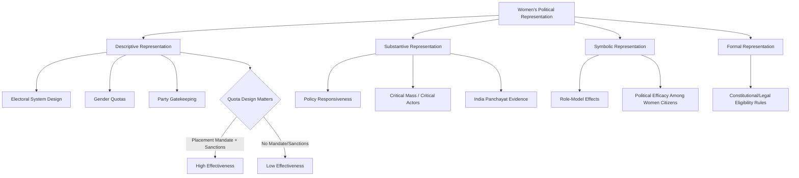

## Women's Political Representation

### Definition and Conceptual Scope

Women's political representation examines the presence, influence, and effects of women in political institutions — legislatures, executives, judiciaries, and party leadership — and the mechanisms, barriers, and consequences associated with gender parity in political power. The subfield is empirically rich, drawing on comparative electoral data, and is organized around a foundational theoretical distinction between different *types* of representation, most influentially articulated by Hanna Pitkin.

**Key Points**

- Global average women's share of national parliamentary seats remains below parity; the field tracks substantial cross-national variation, with Rwanda, Nordic countries, and several Latin American states typically ranking highest, and this ranking shifts with each election cycle. [Unverified: for the current global or country-specific percentage, verify against the latest Inter-Parliamentary Union (IPU) data given how quickly these figures change with elections.]
- The distinction between *descriptive* representation (numerical presence) and *substantive* representation (actual advocacy for women's interests/policy outcomes) is the central analytical framework in the field.
- Electoral system design (particularly proportional representation vs. majoritarian systems) and gender quota mechanisms are the two most heavily studied institutional levers affecting women's descriptive representation.

### Theoretical Foundations

#### Hanna Pitkin's Concept of Representation

Pitkin's *The Concept of Representation* (1967) provides the foundational typology used throughout the field:

- **Descriptive representation**: the degree to which representatives numerically "resemble" or share characteristics with the represented group (e.g., the proportion of women in a legislature).
- **Substantive representation**: whether representatives act in the interests of, or advocate for, the represented group, independent of whether the representative shares the group's characteristics.
- **Symbolic representation**: how representation affects the represented group's attitudes, sense of legitimacy, and political engagement (e.g., whether seeing women in political office affects women citizens' own political efficacy or trust in government).
- **Formal representation**: the institutional rules and procedures establishing who counts as an authorized representative.

#### The "Critical Mass" Theory

Drucilla Cornell and later political scientists (notably associated with work building on Rosabeth Moss Kanter's organizational sociology, applied to legislatures by Drude Dahlerup) proposed that women's substantive influence on legislative outcomes increases non-linearly once their descriptive representation crosses a "critical mass" threshold (often cited around 30%), after which women legislators face less tokenism and can form effective coalitions. [Inference] Subsequent empirical research has substantially qualified or challenged the critical mass thesis, finding that substantive effects depend heavily on institutional context, party discipline, and issue type rather than a simple numerical threshold — so the 30% figure should be treated as a historically influential heuristic rather than an empirically confirmed universal tipping point.

#### Concept of "Critical Actors"

As a refinement/alternative to critical mass theory, Sarah Childs and Mona Lena Krook (2008) proposed the concept of "critical actors" — individual legislators (not necessarily numerous) who act as key catalysts for substantive women's policy change regardless of overall numerical representation, shifting analytical focus from aggregate numbers to specific agency and institutional position.

### Institutional Mechanisms Affecting Descriptive Representation

#### Electoral System Effects

Comparative research consistently finds proportional representation (PR) electoral systems are associated with higher women's descriptive representation than majoritarian/plurality (first-past-the-post) systems, primarily because PR's multi-member districts and party-list mechanisms reduce the zero-sum "only one winner" incentive structure that disadvantages women candidates in majoritarian primary/nomination contests, and because party list construction gives party gatekeepers a direct mechanism (list-ordering) to promote gender balance.

#### Gender Quotas: Typology

- **Reserved seats**: constitutionally or legally mandated legislative seats set aside exclusively for women (e.g., Rwanda's constitutionally mandated 30% reserved seats, a major factor behind Rwanda's globally high women's parliamentary representation).
- **Legislative candidate quotas**: legal requirements that parties nominate a minimum proportion of women candidates (e.g., France's 2000 parity law requiring near-equal gender balance on candidate lists, with financial penalties for non-compliance).
- **Voluntary party quotas**: quotas adopted unilaterally by individual political parties rather than mandated by law (e.g., many Nordic social democratic and green parties adopted internal candidate quotas from the 1970s–1980s, contributing to the Nordic region's historically high women's representation prior to legal quota mandates elsewhere).

#### Quota Design and "Placement Mandates"

Research on quota effectiveness (e.g., work by Mona Lena Krook) emphasizes that quota laws lacking **placement mandates** (rules requiring women candidates to be placed in electable, not just token, list positions) or lacking enforcement/sanction mechanisms for non-compliance are frequently far less effective at translating into actual seats won — a well-documented pattern across comparative quota studies.

#### Party Gatekeeping and Candidate Selection

Beyond formal electoral rules, informal party candidate-selection processes (recruitment networks, incumbency advantages, fundraising access) are widely identified as a persistent barrier to women's nomination even in systems without formal legal exclusion — sometimes termed the "secondary barriers" or "supply and demand" model of candidate emergence (associated with Pippa Norris and Joni Lovenduski's influential framework distinguishing barriers on the "supply side," women's willingness/resources to run, from "demand side" barriers, party gatekeepers' willingness to select women candidates).

### Substantive Representation: Does Descriptive Presence Matter?

#### Policy Responsiveness Research

A substantial empirical literature examines whether increased women's descriptive representation is associated with distinct substantive policy outputs, with research generally finding correlations between higher women's representation and increased attention to issues such as childcare, parental leave, reproductive health, and gender-based violence legislation — though causal identification remains methodologically challenging given confounding factors (e.g., left-leaning parties tend to have both more women legislators and more socially progressive policy agendas simultaneously).

#### The Comparative Case of India's Panchayat Reservation

India's 1993 constitutional amendment mandating one-third reservation of local village council (*panchayat*) leadership positions for women created a well-studied natural experiment; research (notably Raghabendra Chattopadhyay and Esther Duflo's 2004 study) found that reserved women-led councils allocated significantly more resources to public goods prioritized by women (e.g., drinking water infrastructure) compared to councils led by men, providing relatively strong causal evidence for substantive representation effects at the local level.

#### Symbolic Representation Effects

Research on symbolic representation (e.g., work examining role-model effects) has found evidence that increased visibility of women in political office is associated with increased political engagement, ambition, and efficacy among women citizens and girls in some contexts — though effect sizes and generalizability vary across studies and institutional settings.

### Women in Executive Office

#### The "Glass Cliff" Phenomenon

Drawing on organizational psychology research (Michelle Ryan and Alex Haslam, initially applied to corporate leadership), some political scientists have applied the "glass cliff" concept to politics — the observation that women may be disproportionately selected for executive leadership positions (presidencies, prime ministerships, party leadership) during periods of crisis or heightened risk of failure, potentially setting women leaders up for disproportionate blame when outcomes are poor. [Inference] Application of this corporate-originated concept to political leadership remains an active and debated area of research rather than a definitively established pattern.

#### Women Heads of State/Government: Comparative Patterns

Research on women executives (e.g., work by Farida Jalalzai) finds women are more likely to attain "power-sharing" executive positions (e.g., prime minister in a dual-executive system alongside a president) than the single most powerful position in a given system, and are more likely to attain top executive office through family political dynasties (e.g., inheriting political capital from a father or husband) in some regions than men, particularly in South and Southeast Asia historically.

### Comparative Summary Table

| Mechanism | Effect on Descriptive Representation | Key Research |
| --- | --- | --- |
| Proportional Representation | Positive | Cross-national comparative studies |
| Reserved Seats | Strong positive, immediate | Rwanda, India panchayats |
| Legislative Candidate Quotas | Positive if placement mandates enforced | Krook, comparative quota studies |
| Voluntary Party Quotas | Moderate positive, gradual | Nordic party studies |
| Weak/Unenforced Quotas | Minimal effect | Comparative quota effectiveness literature |

### Visualizing Pitkin's Representation Typology

### Diagram: Quota Type Comparison (SVG)

<svg xmlns="http://www.w3.org/2000/svg" viewBox="0 0 700 260">
<text x="350" y="26" font-size="16" font-weight="bold" text-anchor="middle" fill="#1a1a1a">Gender Quota Mechanisms Compared (svg_diagram)</text>
<rect x="30" y="60" width="200" height="100" rx="8" fill="#dbeafe" stroke="#2563eb" stroke-width="2" />
<text x="130" y="85" font-size="12" font-weight="bold" text-anchor="middle" fill="#1e3a8a">Reserved Seats</text>
<text x="130" y="105" font-size="10" text-anchor="middle" fill="#1e3a8a">Constitutionally set aside</text>
<text x="130" y="120" font-size="10" text-anchor="middle" fill="#1e3a8a">e.g., Rwanda 30%</text>
<text x="130" y="140" font-size="10" font-weight="bold" text-anchor="middle" fill="#1e3a8a">Strongest, most direct</text>
<rect x="250" y="60" width="200" height="100" rx="8" fill="#dcfce7" stroke="#16a34a" stroke-width="2" />
<text x="350" y="85" font-size="12" font-weight="bold" text-anchor="middle" fill="#14532d">Legislative Quotas</text>
<text x="350" y="105" font-size="10" text-anchor="middle" fill="#14532d">Legal candidate mandate</text>
<text x="350" y="120" font-size="10" text-anchor="middle" fill="#14532d">e.g., France parity law</text>
<text x="350" y="140" font-size="10" font-weight="bold" text-anchor="middle" fill="#14532d">Effective if enforced</text>
<rect x="470" y="60" width="200" height="100" rx="8" fill="#fef3c7" stroke="#d97706" stroke-width="2" />
<text x="570" y="85" font-size="12" font-weight="bold" text-anchor="middle" fill="#78350f">Voluntary Party Quotas</text>
<text x="570" y="105" font-size="10" text-anchor="middle" fill="#78350f">Self-imposed by parties</text>
<text x="570" y="120" font-size="10" text-anchor="middle" fill="#78350f">e.g., Nordic parties</text>
<text x="570" y="140" font-size="10" font-weight="bold" text-anchor="middle" fill="#78350f">Gradual, uneven</text>
</svg>

### Applied Case Illustration

**Example**

Rwanda's post-genocide constitutional reform illustrates several mechanisms converging: the 2003 constitution mandated a 30% reserved-seat floor for women in the Chamber of Deputies, contributing to Rwanda consistently ranking among the highest globally in women's parliamentary representation for an extended period following the reform — a case frequently cited in the reserved-seats literature as demonstrating the strong, direct descriptive-representation effect of constitutionally mandated seat reservation, though analysts caution this descriptive achievement occurred within a broader context of a dominant-party political system that limits some other measures of substantive democratic competition.

### Key Debates and Ongoing Tensions

- **Does descriptive representation reliably produce substantive representation?** The field remains divided on the strength and consistency of this causal link, with the India panchayat evidence providing relatively strong local-level causal support but national-level cross-country evidence being more mixed and confounded by party ideology.
- **Quota critiques**: Some critics argue quotas can produce tokenism, be perceived as undermining meritocratic legitimacy, or primarily benefit already-privileged women (e.g., those with existing political/family connections) rather than advancing broader gender equity — a critique with particular salience in the intersectional literature examining which women benefit from quota mechanisms.
- **Intersectional representation gaps**: Aggregate women's representation statistics can obscure significant underrepresentation of women of color, working-class women, or LGBTQ+ women within the broader category of "women in politics," a concern raised by intersectional feminist political scientists building on Crenshaw's framework.
- **Backlash and quota reversal risk**: Some research has examined whether quota-driven representation gains can trigger political backlash or informal resistance mechanisms (e.g., relegating women to less powerful committee assignments even after formal seat gains), suggesting descriptive representation gains do not automatically translate into equivalent substantive institutional power.

### Conclusion

Women's political representation research is anchored by Pitkin's foundational distinction between descriptive, substantive, symbolic, and formal representation, with the empirical literature demonstrating that institutional design — particularly electoral system type and, especially, well-enforced quota mechanisms with placement mandates — substantially shapes women's numerical presence in political institutions. Whether increased descriptive presence reliably translates into substantive policy influence remains an actively researched and contextually variable question, with the strongest causal evidence emerging from natural-experiment settings such as India's panchayat reservation system, while broader cross-national patterns require continued attention to confounding factors such as party ideology and quota design and enforcement quality.

**Related Topics**

- Gender Quota Design: Placement Mandates and Enforcement Mechanisms
- Critical Mass Theory and Its Empirical Critiques
- Electoral Systems and Women's Descriptive Representation
- Women Executives and the Glass Cliff Phenomenon
- India's Panchayati Raj Reservation: Causal Evidence on Substantive Representation
- Intersectionality and Representation Gaps Among Women Legislators
- Pitkin's Concept of Representation: Theoretical Foundations