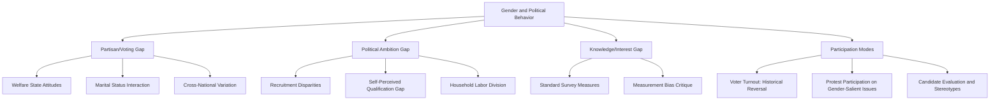

## Gender and Political Behavior

### Definition and Conceptual Scope

Gender and political behavior examines how gender shapes political attitudes, voting patterns, partisan identification, political participation, and political ambition among citizens (distinct from the study of women *in* political office, covered under representation research). The subfield draws heavily on political psychology, electoral behavior methodology, and comparative survey data to analyze the "gender gap" in political attitudes and participation, and the mechanisms producing it.

**Key Points**

- "Gender gap" in political science specifically refers to measurable differences between men's and women's political attitudes, party preference, or voting behavior — a concept distinct from, but related to, the gender gap in political representation.
- Research distinguishes multiple analytically separate gaps: the partisan/voting gender gap, the political ambition gap (willingness to run for office), the political knowledge/interest gap, and the participation gap (modes and levels of political engagement).
- Gender gaps vary substantially by country, historical period, age cohort, and intersecting identity (race, class, religiosity), cautioning against treating "the gender gap" as a single stable or universal phenomenon.

### The Partisan/Voting Gender Gap

#### Historical Emergence in the United States

The modern US gender gap in party preference (women more likely than men to support Democratic candidates) is typically dated to emerging clearly in the 1980 presidential election and has persisted, with some fluctuation, in subsequent elections. Prior to this period, women in the US were, if anything, sometimes found to lean slightly more Republican/conservative than men in earlier 20th-century survey data — indicating the gap's direction is not fixed but historically contingent.

#### Explanatory Frameworks

- **Structural/economic explanations**: Women's greater reliance on and support for social welfare programs, public sector employment, and government spending (linked partly to caregiving responsibilities, longer life expectancy affecting retirement security, and historically lower average earnings) are argued to shape more favorable attitudes toward activist government among women relative to men.
- **Values-based explanations**: Some research links the gender gap to differing attitudes on violence, military intervention, and compassion-oriented policy issues, with women's surveyed attitudes trending somewhat more dovish and supportive of social safety-net spending across many (though not all) national contexts. [Inference] The consistency and causal mechanisms behind values-based explanations remain actively debated in the literature, and effect sizes vary considerably by country and issue.
- **Marital status and gender gap interaction**: Some US research has found the partisan gender gap is more pronounced among unmarried women compared to married women, complicating simple gender-only explanations and suggesting economic security/dependency status interacts significantly with gender in shaping partisan attachment.

#### Comparative Variation

The gender gap's size and even direction vary substantially cross-nationally — some Northern European countries show smaller or differently structured gaps than the US, while in several countries the gap in earlier 20th-century periods ran in the opposite direction (women more conservative than men), often linked to higher average religiosity among women in that era — illustrating that the gender gap is a product of specific social, economic, and religious contexts rather than a universal feature of gender difference itself.

### The Political Ambition Gap

#### Lawless and Fox: "Citizen Political Ambition Studies"

Jennifer Lawless and Richard Fox's ongoing research program (beginning with *It Takes a Candidate*, 2005, and subsequent waves) finds a persistent gap between men's and women's self-reported willingness to run for political office, even among similarly credentialed professionals (e.g., lawyers, business executives, educators) who are otherwise equally "eligible" candidates by objective qualification criteria.

#### Explanatory Mechanisms

- **Political socialization**: Lawless and Fox's research finds women are less likely than men to have been recruited or encouraged to run for office by party officials, elected officials, or others, and are less likely to have considered themselves qualified to run despite objectively comparable credentials.
- **Family responsibilities and household labor division**: Women, including professionally credentialed women, report greater responsibility for childcare and household tasks, cited as a contributing factor to lower reported political ambition and candidate emergence.
- **Self-perceived qualification gap**: A consistently documented finding is that women are more likely than similarly qualified men to doubt their own qualifications to run for office, even controlling for objective credentials — a pattern linked to broader political psychology research on gendered differences in self-assessed competence in male-dominated domains.

### Political Knowledge and Information Gaps

Comparative survey research (e.g., using items from the American National Election Studies and comparable cross-national surveys) has repeatedly found measurable gender gaps in self-reported and tested political knowledge, with women scoring somewhat lower on average on standard political-knowledge survey batteries in many national contexts. [Inference] This finding has generated substantial methodological debate — some scholars (e.g., critiques associated with work by Jennifer Jerit and colleagues) argue standard political-knowledge measures may be biased toward topics and question framing more familiar to men (e.g., disproportionate emphasis on institutional/procedural facts versus policy-substance knowledge), such that the measured gap may partly reflect measurement artifact rather than a genuine underlying knowledge difference; this remains a contested methodological question rather than a settled empirical conclusion.

### Modes of Political Participation

#### Conventional Participation

Research on voter turnout finds that in many established democracies, including the contemporary United States, women's voter turnout rates now equal or exceed men's — a notable historical reversal from the early-to-mid 20th century, when women's turnout (following the extension of suffrage) initially lagged behind men's before converging and eventually surpassing it in numerous cases from the late 20th century onward.

#### Unconventional/Protest Participation

Some research finds gendered patterns in *modes* of political participation beyond voting — e.g., differences in rates of political donation, contacting elected officials, or participation in protest movements — though findings vary by country, issue domain, and time period, and protest movement participation shows less consistent gendered patterning than other participation modes, particularly around gender-salient issues (e.g., women's rights mobilizations, reproductive rights protests) where women's participation rates are typically markedly higher.

#### Political Interest and Discussion

Some survey research finds men self-report higher levels of political interest and more frequent political discussion than women in various national contexts, though — paralleling the political knowledge gap debate — the extent to which this reflects genuine underlying interest differences versus gendered patterns in self-assessment, question interpretation, or willingness to discuss politics in particular social settings remains debated.

### Political Psychology of Gender and Political Behavior

#### Gender Socialization and Political Identity Formation

Political socialization research examines how gendered norms transmitted through family, education, and media shape political self-concept and engagement from childhood, contributing to later-life gaps in candidacy consideration, political interest, and issue-priority formation.

#### Gender Stereotypes and Candidate Evaluation

A substantial experimental literature examines voter evaluation of women candidates, generally finding that voters apply gender-trait stereotypes (e.g., associating women candidates with compassion, honesty, and competence on "compassion issues" like education and healthcare, while associating men candidates with strength and competence on "toughness issues" like military/security policy) — a pattern with mixed and context-dependent implications for women candidates' electoral prospects depending on the salience of particular issues in a given election cycle.

### Comparative Summary Table

| Gap Type | Typical Direction (US context) | Key Explanatory Factor |
| --- | --- | --- |
| Partisan/voting gap | Women lean more Democratic | Welfare state attitudes, marital status |
| Ambition gap | Men more willing to run | Recruitment, self-perceived qualification |
| Knowledge gap | Women score lower on standard measures | Contested; possible measurement bias |
| Turnout | Women turnout ≥ men in many contemporary contexts | Historical reversal since late 20th century |
| Protest participation (gender-salient issues) | Women participate more | Issue salience and personal stake |

### Visualizing the Behavioral Gap Framework

### Diagram: The Ambition Gap Pipeline (SVG)

<svg xmlns="http://www.w3.org/2000/svg" viewBox="0 0 700 260">
<text x="350" y="26" font-size="16" font-weight="bold" text-anchor="middle" fill="#1a1a1a">Political Ambition Gap Pipeline (svg_diagram)</text>
<rect x="20" y="60" width="150" height="60" rx="6" fill="#dbeafe" stroke="#2563eb" stroke-width="2" />
<text x="95" y="85" font-size="11" text-anchor="middle" fill="#1e3a8a">Objectively</text>
<text x="95" y="100" font-size="11" text-anchor="middle" fill="#1e3a8a">Eligible Pool</text>
<path d="M170 90 L210 90" stroke="#6b7280" stroke-width="2" marker-end="url(#arrow1)" />
<rect x="215" y="60" width="150" height="60" rx="6" fill="#fef3c7" stroke="#d97706" stroke-width="2" />
<text x="290" y="80" font-size="11" text-anchor="middle" fill="#78350f">Recruitment /</text>
<text x="290" y="95" font-size="11" text-anchor="middle" fill="#78350f">Encouragement Gap</text>
<path d="M365 90 L405 90" stroke="#6b7280" stroke-width="2" marker-end="url(#arrow1)" />
<rect x="410" y="60" width="150" height="60" rx="6" fill="#fee2e2" stroke="#dc2626" stroke-width="2" />
<text x="485" y="80" font-size="11" text-anchor="middle" fill="#7f1d1d">Self-Perceived</text>
<text x="485" y="95" font-size="11" text-anchor="middle" fill="#7f1d1d">Qualification Gap</text>
<path d="M485 120 L485 160" stroke="#6b7280" stroke-width="2" marker-end="url(#arrow1)" />
<rect x="335" y="165" width="300" height="60" rx="6" fill="#dcfce7" stroke="#16a34a" stroke-width="2" />
<text x="485" y="190" font-size="11" text-anchor="middle" fill="#14532d">Gap in Actual</text>
<text x="485" y="205" font-size="11" text-anchor="middle" fill="#14532d">Candidate Emergence</text>
</svg>

### Applied Case Illustration

**Example**

The 1992 US "Year of the Woman" election, following the Anita Hill-Clarence Thomas Senate hearings, illustrates the interaction between gender gap voting dynamics and political ambition: heightened political salience of gender-related issues (sexual harassment, women's underrepresentation in the Senate) is credited with both mobilizing women voters distinctly around gender-salient concerns and temporarily narrowing the political ambition/candidate-emergence gap, contributing to a substantial one-cycle increase in women's candidacies and electoral success — illustrating how issue salience can temporarily shift both behavioral gaps simultaneously rather than these gaps being entirely stable, structural constants.

### Key Debates and Ongoing Tensions

- **Is the gender gap primarily about gender, or about confounded variables?** Much research emphasizes that apparent gender gaps in voting or attitudes are substantially mediated by marital status, income, religiosity, and racial/ethnic identity, raising ongoing methodological questions about isolating "pure" gender effects from these intersecting factors.
- **Measurement validity of the knowledge/interest gap**: As noted above, whether standard political knowledge and interest batteries adequately capture genuine underlying gender differences, or instead reflect gendered biases in question construction and self-assessment norms, remains an unresolved methodological debate central to interpreting this literature.
- **Generational and cohort change**: Some research suggests gender gaps in ambition, participation, and partisan attachment may be narrowing or shifting in composition among younger cohorts, though longitudinal evidence for durable generational change (versus life-cycle or period effects) requires continued tracking. [Inference]
- **Intersectional complications**: Aggregate "gender gap" findings can obscure substantial variation by race, class, and religiosity — e.g., US research finds the partisan gender gap is considerably smaller among white voters than the overall gender gap figure suggests once race is disaggregated, given persistently strong Democratic partisan attachment among Black voters of both genders — underscoring the analytical necessity of intersectional disaggregation rather than treating "women" and "men" as internally homogeneous categories.

### Conclusion

Gender and political behavior research documents multiple distinct, only partially overlapping "gaps" — in partisan voting preference, political ambition, self-reported political knowledge and interest, and modes of participation — each shaped by different underlying mechanisms ranging from welfare-state policy attitudes to gendered patterns of political recruitment and self-assessed qualification. These gaps are neither universal nor fixed: they vary substantially by country, historical period, marital status, and intersecting race/class identity, and some (such as voter turnout) have reversed direction over the twentieth century, underscoring that gendered political behavior reflects contingent social and institutional contexts rather than fixed differences between men and women.

**Related Topics**

- The Political Ambition Gap: Lawless and Fox's Citizen Political Ambition Studies
- Gender Stereotypes in Candidate Evaluation and Campaign Strategy
- Marital Status, Economic Security, and the Partisan Gender Gap
- Comparative Gender Gaps: Cross-National Variation and Historical Reversal
- Intersectionality and the Gender Gap: Race, Class, and Partisan Attachment
- Political Socialization and Gendered Civic Engagement
- The 1992 "Year of the Woman" and Issue-Salience Effects on Political Behavior