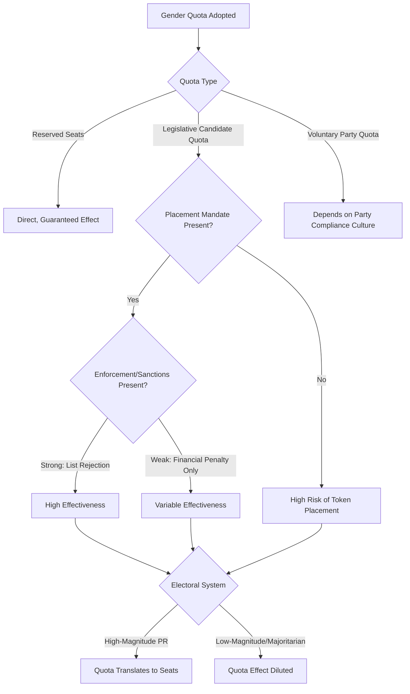

## Gender Quotas and Electoral Reform

### Definition and Conceptual Scope

Gender quotas are institutional mechanisms mandating minimum thresholds of women's representation in candidate selection, legislative seats, or party leadership positions, adopted globally since the early 1990s as the primary policy lever for accelerating women's political representation. Electoral reform in this context refers to the broader set of institutional design changes — electoral system type, candidate list rules, enforcement mechanisms — that interact with quota policy to determine actual representational outcomes.

**Key Points**

- Gender quotas have spread rapidly and globally since the early 1990s; over half of the world's countries now employ some form of gender quota in national or sub-national elections, though the type, scope, and effectiveness vary enormously. [Unverified: exact current global adoption figures fluctuate as countries adopt, amend, or repeal quota laws; verify against the Quota Project (International IDEA) database for current figures.]
- The field distinguishes three principal quota types by mechanism: reserved seats, legislative (legal) candidate quotas, and voluntary party quotas — each with distinct constitutional basis, enforcement logic, and typical effectiveness.
- Quota adoption itself is a significant object of study (why do states adopt quotas at all?), separate from the study of quota effectiveness once adopted.

### Typology of Gender Quota Mechanisms

#### Reserved Seats

Legislative seats constitutionally or legally set aside exclusively for women, filled either through separate elections, appointment, or the "best loser" method (unsuccessful women candidates from general elections filling reserved seats based on vote share).

- **Example**: Rwanda's 2003 constitution reserves 24 of 80 Chamber of Deputies seats for women (30%), elected through a separate women-only electoral college process at province level, layered atop the general electoral system.
- **Example**: Uganda's constitution reserves one seat per district specifically for a woman representative, elected through direct popular vote within that reserved-seat contest.

#### Legislative (Legal) Candidate Quotas

Laws requiring political parties to nominate a minimum proportion of women candidates for general elections, typically enforced through electoral commission rejection of non-compliant candidate lists or financial penalties.

- **Example**: Argentina's 1991 Ley de Cupos (Quota Law) was the first national legislative candidate quota globally, mandating 30% women on party lists — subsequently strengthened to full gender parity (50%) under a 2017 reform.
- **Example**: France's 2000 parity law requires near-equal alternation of men and women on party lists for proportional elections, with financial penalties for non-compliant parties in majoritarian legislative elections (rather than list rejection).

#### Voluntary Party Quotas

Quotas adopted unilaterally by individual political parties without legal mandate, historically pioneered by Nordic social democratic and green parties from the 1970s–1980s (e.g., Norway's Labour Party adopting a 40% quota in 1983), often preceding and sometimes substituting for legal quota adoption in countries with strong voluntary party compliance norms.

### Quota Design Elements Affecting Effectiveness

#### Placement Mandates

Rules specifying *where* on a candidate list women must be placed (e.g., requiring alternation — a "zipper" system — or requiring women in winnable top-list positions), rather than merely setting an aggregate percentage threshold. Mona Lena Krook's comparative research demonstrates that quotas lacking placement mandates are frequently circumvented by parties placing women candidates in low, unelectable list positions while technically satisfying the numerical quota — a well-documented compliance-without-effectiveness pattern.

#### Enforcement and Sanctions

Effective quota laws typically include enforceable sanctions for non-compliance, most commonly electoral commission rejection of non-compliant candidate lists (the strongest enforcement mechanism) or financial penalties (a weaker mechanism, particularly for well-funded parties able to absorb penalties without changing candidate selection behavior).

#### District Magnitude Interaction

Quota effectiveness interacts significantly with electoral system district magnitude: in low-magnitude districts (few seats per district), even a compliant quota may produce few or no actual women officeholders if only the top 1-2 list positions are competitive, whereas in high-magnitude PR districts, the same quota percentage translates more directly into seats won — a key reason quotas are generally found to be more effective in higher-magnitude proportional systems.

### Theories of Quota Adoption

#### International Diffusion and Global Norms

Comparative research (e.g., Mona Lena Krook's *Quotas for Women in Politics*, 2009) analyzes quota adoption as substantially driven by international norm diffusion — the 1995 UN Fourth World Conference on Women (Beijing) and subsequent international advocacy networks are widely credited with catalyzing a global wave of quota adoption from the mid-1990s onward, alongside regional diffusion effects (neighboring or culturally proximate countries adopting quotas in clusters).

#### Domestic Political Strategy

Quota adoption is also explained by domestic political incentive structures — incumbent (often male-dominated) party elites may adopt quotas as a relatively low-cost strategy to signal modernization or gain electoral advantage among women voters, particularly in contexts of party competition where rival parties threaten to capture the "women's vote" through more visible gender commitments, rather than purely as a result of feminist movement pressure alone. [Inference] The relative weight of international diffusion, women's movement mobilization, and elite strategic calculation in explaining any specific country's quota adoption is actively debated and likely varies substantially by case.

#### Post-Conflict Quota Adoption

A notable empirical pattern is the disproportionate adoption of strong gender quotas (often reserved seats) in post-conflict states undergoing constitutional redrafting (e.g., Rwanda, post-2003; Afghanistan's 2004 constitution, prior to the 2021 Taliban takeover; Iraq's 2005 constitution mandating 25% representation) — attributed partly to the unusual political opportunity for institutional redesign that post-conflict constitutional moments provide, and partly to international donor/peacebuilding influence during constitution-drafting processes.

### Electoral System Interactions

#### Proportional Representation as Quota-Facilitating

As established in the broader representation literature, PR electoral systems facilitate quota implementation more readily than majoritarian systems, since party-list mechanisms provide a direct structural point (list construction) for mandating gender balance, whereas single-member-district majoritarian systems require parties to make binary candidate-selection choices per district that are harder to balance in aggregate without additional coordinating mechanisms.

#### Mixed Electoral Systems and Quota Complexity

Countries with mixed electoral systems (combining single-member districts with proportional list seats, e.g., Germany, Mexico) face particular quota design challenges, since a quota applied only to the list-PR component may leave the single-member-district component largely unaffected — some countries (e.g., Mexico) have extended quota requirements to single-member-district nominations specifically to address this gap.

### Regional Patterns

#### Latin America: Pioneer Region

Latin America pioneered legislative candidate quotas globally (Argentina, 1991) and has since moved substantially toward full gender parity laws (50%) in several countries (e.g., Mexico's 2014 constitutional parity reform, Bolivia's 2009 constitution), making the region a global leader in quota strength and, correspondingly, women's legislative representation levels.

#### Sub-Saharan Africa: Reserved Seats and Post-Conflict Adoption

Sub-Saharan Africa shows a notable concentration of reserved-seat mechanisms, often linked to post-conflict constitutional processes (Rwanda, Uganda, South Sudan) or to broader African Union gender parity commitments articulated in instruments such as the 2003 Protocol to the African Charter on Human and Peoples' Rights on the Rights of Women in Africa (the Maputo Protocol).

#### Western Europe: Voluntary-to-Legal Progression

Many Western European countries show a historical pattern of voluntary party quota adoption (particularly by social democratic and green parties from the 1970s-80s) preceding, and in some cases substituting for, later legal quota mandates — with France's move to a strict legal parity mandate in 2000 representing a notable departure from the more common voluntary-party-quota pattern in the region.

### Comparative Summary Table

| Region/Country | Quota Type | Key Feature |
| --- | --- | --- |
| Rwanda | Reserved seats | 30% constitutional floor, post-conflict adoption |
| Argentina | Legislative candidate quota | First national quota globally (1991), later parity |
| France | Legislative candidate quota | Strict parity law (2000), financial penalties |
| Mexico | Legislative candidate quota | Constitutional parity (2014), extended to SMD seats |
| Norway | Voluntary party quota | Pioneered by Labour Party (1983) |
| Uganda | Reserved seats | District-level reserved women's seats |

### Visualizing the Quota Effectiveness Model

### Diagram: Quota Adoption Pathways (SVG)

<svg xmlns="http://www.w3.org/2000/svg" viewBox="0 0 700 260">
<text x="350" y="26" font-size="16" font-weight="bold" text-anchor="middle" fill="#1a1a1a">Pathways to Gender Quota Adoption (svg_diagram)</text>
<rect x="30" y="60" width="190" height="80" rx="8" fill="#dbeafe" stroke="#2563eb" stroke-width="2" />
<text x="125" y="85" font-size="12" font-weight="bold" text-anchor="middle" fill="#1e3a8a">International</text>
<text x="125" y="103" font-size="12" font-weight="bold" text-anchor="middle" fill="#1e3a8a">Diffusion</text>
<text x="125" y="122" font-size="10" text-anchor="middle" fill="#1e3a8a">1995 Beijing Conference</text>
<rect x="255" y="60" width="190" height="80" rx="8" fill="#dcfce7" stroke="#16a34a" stroke-width="2" />
<text x="350" y="85" font-size="12" font-weight="bold" text-anchor="middle" fill="#14532d">Domestic Political</text>
<text x="350" y="103" font-size="12" font-weight="bold" text-anchor="middle" fill="#14532d">Strategy</text>
<text x="350" y="122" font-size="10" text-anchor="middle" fill="#14532d">Elite competition for votes</text>
<rect x="480" y="60" width="190" height="80" rx="8" fill="#fef3c7" stroke="#d97706" stroke-width="2" />
<text x="575" y="85" font-size="12" font-weight="bold" text-anchor="middle" fill="#78350f">Post-Conflict</text>
<text x="575" y="103" font-size="12" font-weight="bold" text-anchor="middle" fill="#78350f">Constitutional Moment</text>
<text x="575" y="122" font-size="10" text-anchor="middle" fill="#78350f">Rwanda, Iraq, Afghanistan (pre-2021)</text>
<line x1="125" y1="140" x2="350" y2="180" stroke="#6b7280" stroke-width="1.5" />
<line x1="350" y1="140" x2="350" y2="180" stroke="#6b7280" stroke-width="1.5" />
<line x1="575" y1="140" x2="350" y2="180" stroke="#6b7280" stroke-width="1.5" />
<rect x="230" y="185" width="240" height="55" rx="8" fill="#f3f4f6" stroke="#374151" stroke-width="2" />
<text x="350" y="210" font-size="11" text-anchor="middle" fill="#1a1a1a">Quota Law/Reserved Seats</text>
<text x="350" y="226" font-size="11" text-anchor="middle" fill="#1a1a1a">Adopted</text>
</svg>

### Applied Case Illustration

**Example**

Mexico's quota trajectory illustrates the cumulative refinement process typical of the field: Mexico introduced a modest 30% candidate quota in 1996, progressively strengthened it (2002, 2008), and ultimately enshrined full 50/50 gender parity in the 2014 constitutional political reform — critically also extending the parity requirement to single-member-district nominations (not just PR list seats), directly addressing the mixed-system quota gap identified in comparative research, resulting in Mexico achieving near-parity in its federal Chamber of Deputies and Senate in subsequent election cycles.

### Key Debates and Critiques

- **Quotas and candidate quality perceptions**: Critics raise concerns that quota-elected women may face perceptions of reduced legitimacy or "quota stigma," though empirical research on whether quota-elected women perform differently (in legislative effectiveness, voter evaluation, or reelection rates) compared to non-quota-elected women shows mixed findings across different national contexts.
- **Quotas as ceiling vs. floor**: Some research examines whether quota thresholds (e.g., 30%) function as effective floors that representation continues to exceed over time, or instead become de facto ceilings that parties treat as a maximum rather than minimum target — with findings varying by country and quota design.
- **Which women benefit from quotas?**: Intersectional critiques (paralleling broader representation debates) raise concerns that quota mechanisms may disproportionately benefit women with existing political capital (family political connections, elite educational/professional backgrounds) rather than broadening access for working-class or minority women, an area of ongoing comparative research.
- **Quota durability and reversal**: While the overall global trend has been toward quota adoption and strengthening, some countries have weakened or faced political challenges to existing quota laws, underscoring that quota policy is not a one-directional or irreversible process. [Unverified: any specific recent quota reversal claims should be checked against current country-level legal status given the dynamic nature of this policy area.]

### Conclusion

Gender quotas represent the dominant global policy mechanism for accelerating women's descriptive political representation, spreading rapidly since the early 1990s through a combination of international norm diffusion, domestic political strategy, and — notably — post-conflict constitutional redesign opportunities. Effectiveness depends heavily on specific design features (placement mandates, enforcement sanctions) and their interaction with underlying electoral system architecture (particularly PR versus majoritarian systems and district magnitude), such that formally similar quota percentages can produce substantially different real-world representational outcomes depending on these institutional details.

**Related Topics**

- Placement Mandates and Quota Enforcement Design (Krook)
- The 1995 Beijing Platform for Action and Global Quota Diffusion
- Post-Conflict Constitutional Design and Gender Quota Adoption
- Mixed Electoral Systems and Quota Coverage Gaps
- Latin America's Parity Revolution: From Quotas to Full Parity Laws
- Intersectionality and Quota Beneficiary Analysis
- Electoral System Design and Women's Descriptive Representation