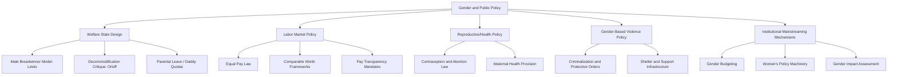

## Gender and Public Policy

### Definition and Conceptual Scope

Gender and public policy examines how gender shapes policy formation, implementation, and outcomes across substantive domains — welfare, labor, family, health, violence, and increasingly cross-cutting governance mechanisms. The field distinguishes between policies explicitly targeting gender inequality (e.g., pay equity law) and the broader analytical claim that ostensibly gender-neutral policies (tax codes, pension systems, urban planning) often produce differential, frequently disadvantageous, effects for women due to embedded assumptions about family structure, labor market participation, and caregiving roles.

**Key Points**

- The field distinguishes **gender-specific policy** (explicitly targeting women or gender inequality, e.g., parental leave, anti-discrimination law) from **gender mainstreaming** (integrating gender analysis into all policy areas, including ostensibly neutral domains like tax or infrastructure policy).
- Welfare state scholarship has been substantially reshaped by feminist critique, which argues that influential typologies of welfare regimes (notably Gøsta Esping-Andersen's) initially undertheorized the gendered division of paid and unpaid care labor underlying different welfare models.
- Comparative policy outcomes vary enormously by welfare regime type, religious/cultural context, and the presence of specific institutional mechanisms (gender budgeting, gender-impact assessment requirements) for embedding gender analysis into policymaking processes.

### Theoretical Foundations

#### Feminist Critique of Welfare State Typologies

Esping-Andersen's influential three-world typology of welfare capitalism (*The Three Worlds of Welfare Capitalism*, 1990) — liberal, conservative/corporatist, and social democratic regimes — was subsequently critiqued by feminist scholars (notably Ann Shola Orloff, Jane Lewis, and Diane Sainsbury) for classifying regimes primarily by their treatment of *paid* labor decommodification, while neglecting the gendered organization of unpaid care work and women's differential relationship to the welfare state as both providers and recipients of care.

#### Jane Lewis: The Male Breadwinner Model

Lewis's comparative framework (1992) classifies welfare states by the strength of their "male breadwinner" assumption — the degree to which policy design (tax structures, benefit eligibility, childcare provision) presumes a male primary earner and female dependent caregiver — distinguishing strong (e.g., historically the UK, Ireland), modified, and weak breadwinner-model states (e.g., Nordic countries with strong dual-earner support policies).

#### Ann Shola Orloff: Gendering the Decommodification Concept

Orloff (1993) proposed supplementing Esping-Andersen's "decommodification" concept (the degree to which welfare entitlements are independent of market participation) with attention to women's capacity to form and maintain autonomous households independent of both market and marriage relationships — arguing that welfare state generosity toward *paid* workers can coexist with policies that leave women's economic independence highly contingent on marital status.

#### Gender Mainstreaming as Institutional Strategy

Gender mainstreaming — formally adopted as a global policy strategy following the 1995 Beijing Platform for Action — refers to the systematic integration of gender-impact analysis into all stages of policymaking across all sectors, rather than confining gender policy to dedicated "women's policy machinery" agencies, reflecting a strategic shift from treating gender equality as a discrete policy sector to treating it as a cross-cutting analytical lens.

### Substantive Policy Domains

#### Parental Leave and Childcare Policy

Comparative research on parental leave design examines variation in duration, payment replacement rates, and — critically — the degree to which leave is designated specifically for fathers ("daddy quotas" or non-transferable paternity leave, pioneered by Nordic countries beginning with Norway in 1993) as opposed to gender-neutral "family leave" that in practice is disproportionately taken by mothers. [Inference] Research generally finds non-transferable, well-compensated paternity leave allocations are more effective at shifting the actual gendered division of caregiving than gender-neutral leave policies, since gender-neutral leave in practice tends to default to maternal uptake absent a specific incentive structure for paternal uptake — though the magnitude of this effect and its interaction with broader labor market norms varies across studies.

#### Pay Equity and Labor Market Policy

Policy approaches to the gender pay gap range from formal equal-pay legislation (mandating equal pay for equal work, a long-standing legal principle in most OECD states) to more expansive comparable-worth/pay-equity frameworks (mandating equal pay for work of *comparable* value across different job categories, addressing occupational segregation rather than only within-job discrimination) to newer pay-transparency and reporting mandates (e.g., the UK's mandatory gender pay gap reporting for large employers, introduced 2017, requiring aggregate rather than individual salary disclosure).

#### Reproductive Rights and Health Policy

Reproductive policy — encompassing contraception access, abortion law, and maternal health provision — represents one of the most politically contested domains of gender policy, with substantial cross-national and, in federal systems, substantial sub-national variation in legal frameworks, and is frequently analyzed as a site where competing frameworks of individual bodily autonomy, religious/moral value pluralism, and public health considerations directly collide in policy debate.

#### Gender-Based Violence Policy

Policy responses to intimate partner violence, sexual assault, and gender-based violence more broadly have evolved substantially since the 1970s–80s from treating such violence as a private family matter largely outside state jurisdiction toward criminalization, protective order systems, funded shelter/support infrastructure, and — in some jurisdictions — specialized domestic violence courts, reflecting the "personal is political" reframing discussed in feminist theory.

#### Gender Budgeting

Gender budgeting (or gender-responsive budgeting) refers to the practice of analyzing government budgets for their differential gender impact and adjusting budget allocation and processes accordingly — pioneered in Australia (1984) and subsequently adopted in various forms by numerous countries and international financial institutions (including as a technical assistance area for the IMF), representing a concrete institutional mechanism for operationalizing gender mainstreaming within fiscal policy specifically.

### Institutional Mechanisms for Gender Policy Integration

#### Women's Policy Machinery

National institutional bodies dedicated to gender equality policy — ranging from full cabinet-level ministries (e.g., ministries of women's affairs/gender equality in various countries) to smaller coordinating offices or ombudsperson-style institutions — vary substantially in institutional authority, budget, and capacity to influence cross-sectoral policy, a subject of extensive comparative institutional research.

#### Gender Impact Assessment Requirements

Some jurisdictions have adopted formal requirements for gender-impact assessment of proposed legislation or regulation (paralleling environmental impact assessment models), requiring policymakers to formally evaluate differential gendered effects prior to policy adoption — implementation rigor and actual influence on final policy design vary considerably across jurisdictions adopting such requirements.

### Comparative Welfare Regime Table

| Regime Type (Gendered Lens) | Example Countries | Care Policy Orientation |
| --- | --- | --- |
| Strong male breadwinner | Historically UK, Ireland | Limited public childcare, dependent-spouse benefits |
| Weak/dual-earner supportive | Nordic countries (Sweden, Norway) | Extensive public childcare, non-transferable paternity leave |
| Familialist/conservative | Historically Germany, Italy | Care assumed within family, limited state provision |
| Liberal/market-oriented | United States | Minimal state provision, market-based childcare |

### Visualizing Gender Policy Domains

### Diagram: Male Breadwinner Model Spectrum (SVG)

<svg xmlns="http://www.w3.org/2000/svg" viewBox="0 0 700 240">
<text x="350" y="26" font-size="16" font-weight="bold" text-anchor="middle" fill="#1a1a1a">Lewis's Male Breadwinner Model Spectrum (svg_diagram)</text>
<line x1="60" y1="130" x2="640" y2="130" stroke="#6b7280" stroke-width="3" />
<polygon points="640,130 628,123 628,137" fill="#6b7280" />
<circle cx="120" cy="130" r="10" fill="#dc2626" />
<text x="120" y="160" font-size="12" text-anchor="middle" fill="#1a1a1a">Strong Breadwinner</text>
<text x="120" y="175" font-size="10" text-anchor="middle" fill="#4b5563">Historically UK, Ireland</text>
<circle cx="350" cy="130" r="10" fill="#d97706" />
<text x="350" y="160" font-size="12" text-anchor="middle" fill="#1a1a1a">Modified Breadwinner</text>
<text x="350" y="175" font-size="10" text-anchor="middle" fill="#4b5563">France, mixed provision</text>
<circle cx="580" cy="130" r="10" fill="#16a34a" />
<text x="580" y="160" font-size="12" text-anchor="middle" fill="#1a1a1a">Weak Breadwinner</text>
<text x="580" y="175" font-size="10" text-anchor="middle" fill="#4b5563">Sweden, Norway</text>

<text x="350" y="205" font-size="11" text-anchor="middle" fill="`#374151`">Dependent-Spouse Assumption ←──────────────→ Dual-Earner/Individual Model</text>

</svg>

### Applied Case Illustration

**Example**

Sweden's parental leave policy illustrates the concrete mechanics of gender mainstreaming in family policy: Sweden's parental insurance system provides 480 total days of paid leave per child, but reserves a designated non-transferable portion specifically for each parent (the "daddy month" and "mummy month" quotas, first introduced in 1995 and subsequently expanded) — a direct policy response to research finding that fully transferable, gender-neutral leave in earlier Swedish policy design was disproportionately taken by mothers, illustrating the shift from formally gender-neutral to substantively gender-differentiated policy design intended to produce more equal caregiving outcomes in practice.

### Key Debates and Ongoing Tensions

- **Equal treatment vs. differential treatment**: A recurring policy design tension exists between formally gender-neutral policies (equal treatment, avoiding explicit gender categorization in law) and gender-differentiated policies explicitly designed to counteract existing gendered social patterns (e.g., non-transferable paternity leave) — echoing the broader "equality vs. difference" debate in feminist theory.
- **Gender mainstreaming effectiveness critique**: Some scholars argue gender mainstreaming, despite widespread formal adoption since Beijing 1995, has in practice often become a symbolic bureaucratic exercise ("mainstreaming as ritual") with limited genuine influence on final policy substance, particularly absent strong political will, dedicated budget, or enforcement mechanisms. [Inference]
- **Intersectional policy analysis**: Critics argue gender policy analysis focused solely on gender (without attention to intersecting race, class, disability, or immigration status) can obscure how ostensibly gender-neutral or even gender-progressive policies may have uneven effects across different groups of women — a critique paralleling broader intersectional critiques discussed elsewhere in gender and politics scholarship.
- **Backlash politics and policy retrenchment risk**: Gender policy domains, particularly reproductive rights, remain subject to significant political contestation and periodic retrenchment in various jurisdictions, underscoring that gender policy gains are not necessarily permanent or unidirectional. [Unverified: any specific claims about current legal status in a given jurisdiction should be checked against up-to-date sources given the fast-moving and contested nature of this policy area.]

### Conclusion

Gender and public policy scholarship has fundamentally reshaped welfare state and comparative policy analysis by demonstrating that ostensibly neutral policy design frequently embeds gendered assumptions about paid and unpaid labor, most influentially through feminist critiques and extensions of Esping-Andersen's welfare regime typology (Lewis's breadwinner model, Orloff's gendered decommodification). The field spans substantive domains — parental leave, pay equity, reproductive health, gender-based violence — and institutional mechanisms (gender budgeting, mainstreaming, impact assessment) for embedding gender analysis across policymaking, while ongoing debates continue over the effectiveness of gender-neutral versus gender-differentiated policy design and the risk of gender mainstreaming becoming symbolic rather than substantive practice.

**Related Topics**

- The Male Breadwinner Model and Comparative Welfare Regimes (Lewis, Orloff)
- Parental Leave Design: Non-Transferable "Daddy Quotas" and Uptake Effects
- Gender Budgeting as a Fiscal Policy Tool
- Comparable Worth and Pay Equity Frameworks
- Reproductive Rights Policy: Comparative Legal Frameworks
- Intersectional Analysis in Gender Policy Design
- Gender Mainstreaming: From Beijing 1995 to Contemporary Practice