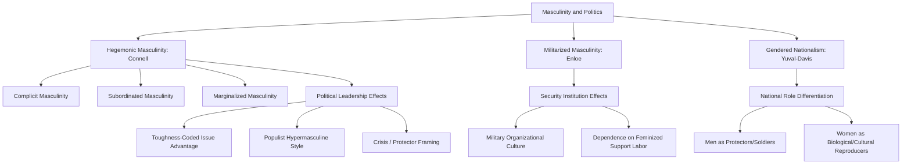

## Masculinity and Politics

### Definition and Conceptual Scope

Masculinity and politics examines how socially constructed norms of masculinity shape political institutions, leadership styles, foreign policy, militarism, and party competition, extending feminist political theory's insight that gender is a constitutive category of political power beyond the study of women alone. Rather than treating masculinity as a fixed biological attribute of male political actors, the field analyzes masculinity as a socially produced, historically variable, and politically consequential set of norms and performances that structure institutions independent of the individuals occupying them.

**Key Points**

- The field draws heavily on R.W. Connell's concept of **hegemonic masculinity** — the culturally dominant, idealized form of masculinity that legitimates men's collective dominance over women and over subordinated masculinities — as the central analytical framework for understanding masculinity's political effects.
- Masculinity studies in political science emphasize that masculinity is not singular: multiple, hierarchically ordered masculinities coexist (hegemonic, complicit, subordinated, marginalized), and political institutions can privilege some masculine performances over others (including over other men).
- Applications span political leadership and rhetoric, military/security institutions, populist and nationalist movements, and international relations theory.

### Theoretical Foundations

#### R.W. Connell: Hegemonic Masculinity

Connell's foundational work (*Masculinities*, 1995) defines hegemonic masculinity as the configuration of gender practice that, at a given historical moment, is culturally exalted and guarantees (or is taken to guarantee) the dominant position of men and the subordination of women. Crucially, hegemonic masculinity is not necessarily the most common or statistically typical form of masculinity among men, but the culturally idealized and institutionally privileged standard against which all masculinities (and, relatedly, femininities) are measured — meaning most individual men do not fully embody it but may still benefit from its structural privileges ("complicit masculinity").

#### Multiple and Hierarchical Masculinities

Connell's framework identifies masculinities existing in hierarchical relation to one another:

- **Hegemonic masculinity**: the culturally dominant ideal (historically, in many Western contexts, associated with traits like physical strength, emotional restraint, heterosexuality, economic providership, and authority).
- **Complicit masculinity**: masculinities that do not fully embody the hegemonic ideal but benefit from its structural privileges without actively contesting it.
- **Subordinated masculinity**: masculinities actively subordinated within the gender hierarchy, most notably (in Connell's original formulation) gay masculinity in contexts of institutionalized homophobia.
- **Marginalized masculinity**: masculinities marginalized through intersecting structures of race, class, or immigration status, even when otherwise conforming to hegemonic ideals.

#### Cynthia Enloe: Militarized Masculinity and International Relations

Enloe's feminist IR scholarship (*Bananas, Beaches and Bases*, 1989; *Maneuvers*, 2000) analyzes how military institutions systematically cultivate and depend upon specific constructions of masculinity (toughness, aggression, emotional control, willingness to use violence) as foundational to military effectiveness and legitimacy, while simultaneously relying on subordinated feminized labor (military spouses, sex workers around military bases, support staff) to sustain military operations — demonstrating how gender constructs (both masculine and feminine) are structurally embedded in, not incidental to, international security institutions.

#### Hegemonic Masculinity Applied to the State

Building on Connell and feminist state theory (MacKinnon), scholars analyze the modern state itself as historically constructed around hegemonic masculine norms — e.g., the association of legitimate political authority with rational, unemotional, decisive leadership; the historical conflation of full citizenship with military service capacity; and the gendered coding of "strength" and "toughness" as prerequisites for perceived political competence, particularly in security-related domains.

### Masculinity in Political Leadership and Rhetoric

#### Gendered Expectations of Political Leadership

Comparative research on political leadership finds that dominant conceptions of "strong," "decisive," "authoritative" leadership continue to be culturally coded as masculine traits in many contexts, creating a structural advantage for male candidates on "toughness"-coded issues (national security, crime, economic strength) even as women candidates may be perceived as advantaged on "compassion"-coded issues (education, healthcare, social welfare) — directly linking masculinity studies to the candidate-stereotype research discussed in gender-and-behavior scholarship.

#### Masculinity and Populist/Nationalist Political Style

Scholars analyzing contemporary right-wing populist and nationalist political movements (in various national contexts) have examined how populist leadership rhetoric frequently invokes hypermasculine performance — displays of physical vigor, aggressive rhetoric toward political opponents, explicit rejection of "political correctness" framed as effeminate weakness, and appeals to restoring a nation's lost masculine strength or virility — as a recurring cross-national stylistic pattern in populist political communication. [Inference] While this pattern has been widely observed and analyzed by scholars across multiple specific national cases, the degree to which it constitutes a generalizable causal mechanism (rather than a set of related but distinct national phenomena) remains an area of ongoing comparative research rather than a fully settled finding.

#### Crisis and "Protector" Masculinity

Some research examines how political and security crises (terrorism, war, economic collapse) tend to elevate hegemonic "protector" masculine framing in political discourse and public preference, potentially disadvantaging women candidates or leaders during crisis periods specifically due to gendered assumptions about protective capacity — an area of research with some conceptual overlap with, but analytically distinct from, the "glass cliff" phenomenon discussed in women's representation scholarship.

### Masculinity and Nationalism

#### Gendered Nation-Building

Feminist nationalism scholars (e.g., Nira Yuval-Davis, *Gender and Nation*, 1997) analyze how nationalist ideology typically assigns differentiated gendered roles within the national project — men positioned as protectors, soldiers, and political representatives of the nation; women positioned as biological and cultural reproducers of the nation (bearing children, transmitting cultural/linguistic heritage) and as symbolic embodiments of national honor requiring masculine protection.

#### Masculinity, Honor, and Political Violence

Research on political violence and civil conflict examines how constructions of masculine honor — particularly notions that masculine status requires defending group honor against perceived humiliation or threat — can function as a mobilizing mechanism for political violence and militant recruitment, though scholars caution against reductive explanations that treat masculinity as a sufficient rather than contributing causal factor alongside political, economic, and organizational drivers of conflict. [Inference]

### Masculinity and Institutional Culture

#### Legislatures and Political Institutions as Gendered Organizations

Institutional ethnography and organizational research on legislatures (extending Connell's framework to specific political institutions) examines how formal institutional rules, informal norms (working hours structured around historically male legislators without primary caregiving responsibilities), and interpersonal culture (including documented patterns of sexist treatment and harassment of women legislators) can embed hegemonic masculine norms into ostensibly gender-neutral institutional structures, creating persistent structural barriers for women and gender-nonconforming legislators independent of formal eligibility rules.

#### Military and Security Sector Institutional Culture

Beyond Enloe's broader IR analysis, more institutionally focused research examines masculine organizational culture within specific security institutions (militaries, police forces, intelligence agencies) as both a barrier to women's full institutional integration and, separately, as a subject of ongoing institutional reform efforts (e.g., debates over women's combat role integration in various national militaries) that have generated substantial political and organizational contestation.

### Comparative Summary Table

| Concept | Key Theorist(s) | Core Claim |
| --- | --- | --- |
| Hegemonic masculinity | Connell | Culturally dominant, institutionally privileged masculine ideal |
| Militarized masculinity | Enloe | Security institutions structurally depend on gendered constructs |
| Gendered nationalism | Yuval-Davis | Nation-building assigns differentiated gender roles |
| Multiple masculinities | Connell | Masculinities hierarchically ordered (hegemonic, complicit, subordinated, marginalized) |

### Visualizing the Masculinity-Politics Framework

### Diagram: Connell's Hierarchy of Masculinities (SVG)

<svg xmlns="http://www.w3.org/2000/svg" viewBox="0 0 700 280">
<text x="350" y="26" font-size="16" font-weight="bold" text-anchor="middle" fill="#1a1a1a">Connell's Hierarchy of Masculinities (svg_diagram)</text>
<rect x="250" y="50" width="200" height="55" rx="8" fill="#fee2e2" stroke="#dc2626" stroke-width="2" />
<text x="350" y="73" font-size="12" font-weight="bold" text-anchor="middle" fill="#7f1d1d">Hegemonic</text>
<text x="350" y="90" font-size="10" text-anchor="middle" fill="#7f1d1d">Culturally dominant ideal</text>
<line x1="350" y1="105" x2="350" y2="130" stroke="#6b7280" stroke-width="2" />
<rect x="250" y="135" width="200" height="55" rx="8" fill="#fef3c7" stroke="#d97706" stroke-width="2" />
<text x="350" y="158" font-size="12" font-weight="bold" text-anchor="middle" fill="#78350f">Complicit</text>
<text x="350" y="175" font-size="10" text-anchor="middle" fill="#78350f">Benefits without embodying ideal</text>
<line x1="250" y1="160" x2="80" y2="220" stroke="#6b7280" stroke-width="1.5" />
<line x1="450" y1="160" x2="620" y2="220" stroke="#6b7280" stroke-width="1.5" />
<rect x="10" y="225" width="180" height="50" rx="8" fill="#dbeafe" stroke="#2563eb" stroke-width="2" />
<text x="100" y="245" font-size="11" font-weight="bold" text-anchor="middle" fill="#1e3a8a">Subordinated</text>
<text x="100" y="262" font-size="9" text-anchor="middle" fill="#1e3a8a">e.g., under homophobic norms</text>
<rect x="510" y="225" width="180" height="50" rx="8" fill="#dcfce7" stroke="#16a34a" stroke-width="2" />
<text x="600" y="245" font-size="11" font-weight="bold" text-anchor="middle" fill="#14532d">Marginalized</text>
<text x="600" y="262" font-size="9" text-anchor="middle" fill="#14532d">Via race/class/immigration status</text>
</svg>

### Applied Case Illustration

**Example**

Political rhetoric during major national security crises illustrates the "protector masculinity" dynamic: research on post-9/11 US political discourse examined how national leaders across the political spectrum adopted markedly more hypermasculine, protector-coded rhetoric and policy posture during the immediate crisis period, with some scholars arguing this shift temporarily reinforced gendered assumptions about which forms of leadership (typically masculine-coded decisiveness and toughness) were seen as appropriate to crisis governance — illustrating how crisis contexts can activate hegemonic masculine framing in political communication even in officially gender-neutral democratic institutions.

### Key Debates and Ongoing Tensions

- **Essentialism risk in masculinity studies**: Scholars caution that analyzing "masculinity" as a political variable risks reproducing essentialist assumptions about men's political behavior if not carefully grounded in Connell's constructivist, historically variable framework — the field aims to analyze masculinity as a social construct with political effects, not as a fixed biological or psychological trait determining political outcomes.
- **Is hypermasculine populist style analytically distinct from broader authoritarian political style?** Some scholars debate whether gendered analysis of populist leadership adds distinct explanatory value beyond existing authoritarian personality or populism theory, or whether masculine performance is better understood as one component within broader populist communication strategies rather than a standalone causal factor. [Inference]
- **Positive/reformist masculinity frameworks**: A smaller but growing body of scholarship and policy work examines whether alternative, non-hegemonic masculine norms (e.g., emphasizing caregiving, emotional openness) can be politically cultivated or institutionally supported (e.g., through paternity leave policy, as discussed in gender-and-policy scholarship) as a complementary strategy to feminist policy reform, rather than focusing exclusively on women's inclusion.
- **Intersection with race and class**: Following Connell's marginalized-masculinity category, scholars increasingly examine how racialized and class-based constructions of masculinity (e.g., stereotyping and political framing of masculinity among racial minority or immigrant men) interact with, and are sometimes explicitly weaponized within, broader nationalist and security political discourse.

### Conclusion

Masculinity and politics extends feminist political analysis by treating masculinity — following Connell's concept of hegemonic masculinity — as a socially constructed, historically variable, and hierarchically organized set of norms that structure political institutions, leadership expectations, military and security culture, and nationalist ideology, independent of individual men's characteristics. Applications span candidate evaluation and crisis leadership dynamics, militarized international relations (Enloe), and gendered nation-building (Yuval-Davis), with ongoing scholarly attention to how hypermasculine political style functions within contemporary populist and nationalist movements, and to the potential for cultivating alternative, less hierarchical masculine norms through policy design.

**Related Topics**

- Hegemonic Masculinity: Theoretical Foundations and Critiques (Connell)
- Militarized Masculinity and Feminist International Relations (Enloe)
- Gendered Nationalism and the National Reproductive Role (Yuval-Davis)
- Populist Political Style and Hypermasculine Rhetoric
- The "Protector" Frame in Crisis Political Leadership
- Institutional Culture and Gendered Barriers in Legislatures
- Intersectionality in Masculinity Studies: Race, Class, and Political Framing