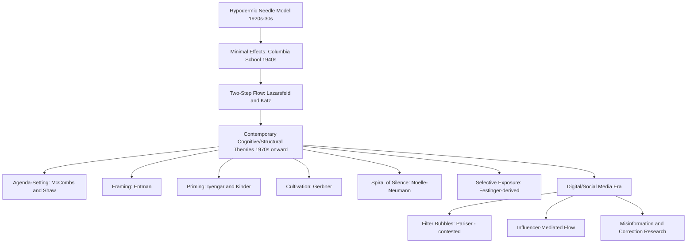

## Theories of Media Effects on Politics

### Definition and Conceptual Scope

Theories of media effects on politics examine how mass communication shapes political attitudes, knowledge, behavior, and the broader public sphere. The field has undergone substantial paradigm shifts since the early twentieth century — from initial assumptions of powerful, direct media effects, through a mid-century "minimal effects" consensus, to contemporary frameworks emphasizing conditional, cognitive, and structural media influence — reflecting evolving theoretical sophistication and methodological capability rather than a simple linear accumulation of findings.

**Key Points**

- The field's history is often narrated as three broad paradigm phases: (1) "powerful effects" / hypodermic-needle models (1920s–1930s), (2) "minimal effects" models (1940s–1960s), and (3) contemporary "conditional/cognitive effects" models (1970s–present), though this periodization simplifies substantial theoretical diversity within each phase.
- Key contemporary theoretical frameworks include agenda-setting, framing, priming, cultivation theory, and the spiral of silence, each identifying a distinct mechanism by which media shapes political cognition or behavior.
- The rise of digital and social media since the 2000s has generated a substantial "new media effects" research agenda examining whether and how established theories require revision for fragmented, algorithmically curated, and interactive media environments.

### Early Paradigms: From Powerful to Minimal Effects

#### The Hypodermic Needle / Magic Bullet Model

Early to mid-twentieth-century media theory (associated loosely with concerns following WWI propaganda and 1930s mass communication research) assumed media messages were absorbed relatively uniformly and directly by audiences, akin to an injection — a model now considered theoretically unsophisticated and empirically unsupported, but historically influential in shaping early anxieties about mass media's political power (notably informing concerns about radio propaganda's role in 1930s European fascism).

#### The Columbia School and Minimal Effects

Paul Lazarsfeld's influential Columbia School research (*The People's Choice*, 1944, on the 1940 US presidential election) found that mass media exerted comparatively limited *direct* influence on voting behavior, with pre-existing social characteristics (party identification, socioeconomic status, religion) and interpersonal social networks exerting stronger influence — findings that shifted the field toward a "minimal effects" paradigm and generated the influential **two-step flow model**.

#### Two-Step Flow of Communication

Lazarsfeld and Elihu Katz's two-step flow model (*Personal Influence*, 1955) proposed that media influence typically operates indirectly: media messages first reach politically attentive and socially connected "opinion leaders," who then interpret and relay this information to less attentive members of their social networks, meaning interpersonal communication mediates and substantially shapes ultimate media effects rather than media directly reaching and shaping the mass public.

### Contemporary Cognitive and Structural Frameworks

#### Agenda-Setting Theory

Maxwell McCombs and Donald Shaw's agenda-setting theory (1972 Chapel Hill study) proposes that media coverage does not necessarily tell audiences *what to think*, but powerfully shapes *what to think about* — by allocating coverage attention to particular issues, media influences which issues the public perceives as most important, a well-replicated finding across numerous subsequent studies and national contexts.

#### Framing Theory

Framing theory (drawing on Erving Goffman's sociological concept of frame analysis, 1974, and developed extensively in political communication by scholars including Robert Entman) examines how media presentation emphasizes particular interpretive dimensions of an issue — defining problems, diagnosing causes, making moral judgments, and suggesting remedies — shaping audience interpretation of political issues independent of the underlying factual content, since the same set of facts can be framed in substantially different ways with different political implications.

#### Priming Theory

Priming theory (associated with Shanto Iyengar and Donald Kinder's experimental research, *News That Matters*, 1987) proposes that media coverage of particular issues can make those issues more cognitively accessible and therefore more influential in subsequent political judgments (e.g., evaluations of presidential performance), such that heavy media coverage of a particular issue domain "primes" audiences to weight that domain more heavily when evaluating political leaders, independent of the specific evaluative content of coverage.

#### Cultivation Theory

George Gerbner's cultivation theory (developed from the 1960s–1980s, primarily applied to television) proposes that heavy, cumulative media (particularly television) exposure gradually shapes viewers' perceptions of social reality to align with patterns depicted in media content, most prominently studied in relation to perceptions of crime and violence — heavy television viewers, Gerbner's research found, tend to overestimate real-world crime prevalence and danger relative to lighter viewers and objective crime statistics, a pattern termed the "mean world syndrome."

#### The Spiral of Silence

Elisabeth Noelle-Neumann's spiral of silence theory (1974) proposes that individuals continuously assess the prevailing climate of public opinion (partly through media cues) and are more likely to openly express opinions perceived as increasingly popular while suppressing expression of opinions perceived as increasingly unpopular, creating a self-reinforcing spiral in which perceived-minority views become progressively less visible in public discourse regardless of their actual underlying prevalence.

#### Selective Exposure and Motivated Reasoning

Building on cognitive dissonance theory (Leon Festinger, 1957), selective exposure research examines the tendency of individuals to preferentially seek out media content consistent with pre-existing political beliefs while avoiding attitude-challenging content — a mechanism of particular contemporary relevance given the expanded content choice available in fragmented digital media environments compared to the more limited-choice broadcast era in which earlier "minimal effects" research was conducted.

### Digital and Social Media Effects Research

#### Filter Bubbles and Echo Chambers

Eli Pariser's popularized "filter bubble" concept (*The Filter Bubble*, 2011) describes how algorithmic content curation on digital platforms may reinforce selective exposure by preferentially surfacing content aligned with users' existing preferences and engagement patterns, though subsequent empirical research has produced more mixed and contested findings regarding the actual magnitude of algorithmically-driven political echo chamber effects compared to the popularized narrative, with some studies finding evidence of meaningful cross-cutting exposure persisting even within social media use. [Inference] The empirical magnitude and political consequences of filter bubble/echo chamber effects remain an actively contested area of research rather than a settled finding, with results varying substantially by platform, measurement methodology, and country studied.

#### Two-Step Flow Reconsidered: Social Media "Influencers"

Contemporary research has revisited the two-step flow model in the context of social media, examining how social media influencers and highly-followed political commentators may function analogously to Lazarsfeld's mid-century "opinion leaders," relaying and interpreting political information for their networks — while also noting substantial structural differences from the original broadcast-era model, including algorithmic amplification dynamics absent from the original framework.

#### Misinformation and Disinformation Research

The post-2016 period has generated substantial research attention to online political misinformation and disinformation, examining exposure patterns, correction/fact-checking effectiveness (including research on the contested "backfire effect," where corrective information may in some circumstances entrench rather than correct false beliefs — though subsequent replication research has found the backfire effect to be less consistently observed than initially reported), and the role of automated accounts and coordinated inauthentic behavior in amplifying political misinformation.

### Comparative Summary Table

| Theory | Key Theorist(s) | Core Mechanism |
| --- | --- | --- |
| Two-Step Flow | Lazarsfeld, Katz | Media influence mediated by opinion leaders |
| Agenda-Setting | McCombs, Shaw | Media shapes issue salience, not opinion directly |
| Framing | Entman (building on Goffman) | Interpretive emphasis shapes issue understanding |
| Priming | Iyengar, Kinder | Coverage shapes which criteria evaluate leaders |
| Cultivation | Gerbner | Cumulative exposure shapes perceived social reality |
| Spiral of Silence | Noelle-Neumann | Perceived opinion climate shapes willingness to speak |
| Selective Exposure | Festinger (dissonance) | Audiences seek attitude-consistent content |

### Visualizing the Paradigm Evolution

### Diagram: Agenda-Setting vs. Framing vs. Priming (SVG)

<svg xmlns="http://www.w3.org/2000/svg" viewBox="0 0 700 260">
<text x="350" y="26" font-size="16" font-weight="bold" text-anchor="middle" fill="#1a1a1a">Three Related Cognitive Media Effects (svg_diagram)</text>
<rect x="30" y="60" width="200" height="110" rx="8" fill="#dbeafe" stroke="#2563eb" stroke-width="2" />
<text x="130" y="85" font-size="12" font-weight="bold" text-anchor="middle" fill="#1e3a8a">Agenda-Setting</text>
<text x="130" y="108" font-size="10" text-anchor="middle" fill="#1e3a8a">Shapes WHAT issues</text>
<text x="130" y="123" font-size="10" text-anchor="middle" fill="#1e3a8a">are seen as important</text>
<text x="130" y="145" font-size="10" font-style="italic" text-anchor="middle" fill="#1e3a8a">"tells you what to think about"</text>
<rect x="250" y="60" width="200" height="110" rx="8" fill="#dcfce7" stroke="#16a34a" stroke-width="2" />
<text x="350" y="85" font-size="12" font-weight="bold" text-anchor="middle" fill="#14532d">Framing</text>
<text x="350" y="108" font-size="10" text-anchor="middle" fill="#14532d">Shapes HOW an issue</text>
<text x="350" y="123" font-size="10" text-anchor="middle" fill="#14532d">is interpreted</text>
<text x="350" y="145" font-size="10" font-style="italic" text-anchor="middle" fill="#14532d">"shapes the meaning"</text>
<rect x="470" y="60" width="200" height="110" rx="8" fill="#fef3c7" stroke="#d97706" stroke-width="2" />
<text x="570" y="85" font-size="12" font-weight="bold" text-anchor="middle" fill="#78350f">Priming</text>
<text x="570" y="108" font-size="10" text-anchor="middle" fill="#78350f">Shapes WHICH criteria</text>
<text x="570" y="123" font-size="10" text-anchor="middle" fill="#78350f">evaluate leaders</text>
<text x="570" y="145" font-size="10" font-style="italic" text-anchor="middle" fill="#78350f">"shapes the yardstick"</text>
</svg>

### Applied Case Illustration

**Example**

Media coverage of a national economic downturn illustrates all three mechanisms operating together: extensive coverage of unemployment statistics exemplifies agenda-setting (elevating the economy's perceived importance among voters' concerns); coverage choices about whether to frame the downturn as caused by government mismanagement versus global economic forces exemplify framing (shaping how the public assigns responsibility); and the resulting heightened salience of economic performance as an evaluative criterion when voters subsequently assess presidential approval exemplifies priming (shaping which criteria voters weight most heavily in leader evaluation) — the three theories describing analytically distinct but empirically interlocking mechanisms rather than competing explanations.

### Key Debates and Ongoing Tensions

- **How "minimal" were minimal effects, really?** Contemporary scholars have revisited the Columbia School's minimal-effects conclusions, arguing that mid-century media environments (limited channel choice, strong partisan social networks) may have genuinely constrained direct media effects in ways not generalizable to the more fragmented, high-choice contemporary media environment — suggesting the paradigm shift toward stronger contemporary effects findings may partly reflect genuinely different media environments rather than only improved measurement methodology. [Inference]
- **Effect size and boundary conditions**: Much contemporary media effects research emphasizes that effects (agenda-setting, framing, priming) are real but typically conditional and often modest in magnitude, dependent on audience predispositions, issue type, message repetition, and source credibility — a more nuanced position than either the original "powerful effects" or "minimal effects" paradigms.
- **Filter bubble empirical contestation**: As noted, the actual magnitude of algorithmically-driven political polarization and echo-chamber effects remains genuinely disputed in the empirical literature, with some studies finding social media use associated with more, not less, cross-cutting political exposure compared to offline social networks — cautioning against uncritical acceptance of the popularized filter bubble narrative.
- **Causal identification challenges**: A persistent methodological challenge across the field involves distinguishing genuine media effects from selective exposure (audiences choosing congenial media) and from confounding factors correlated with both media consumption patterns and political attitudes, an issue partially addressed through experimental designs (as in Iyengar and Kinder's priming research) but remaining a significant challenge for observational and digital-trace-data research.

### Conclusion

Theories of media effects on politics have evolved from early assumptions of direct, powerful media influence, through a mid-century "minimal effects" paradigm emphasizing the mediating role of social networks and opinion leaders, to contemporary frameworks (agenda-setting, framing, priming, cultivation, spiral of silence) that identify specific, empirically supported but typically conditional cognitive mechanisms of media influence. The rise of digital and social media has generated substantial new research attention to algorithmic curation, misinformation, and revised opinion-leader dynamics, though key empirical questions — particularly regarding the true magnitude of filter bubble and echo chamber effects — remain genuinely contested rather than settled within the contemporary research literature.

**Related Topics**

- Agenda-Setting Theory: The Chapel Hill Studies and Subsequent Research
- Framing Effects in Political Communication (Entman)
- Cultivation Theory and Perceptions of Crime and Risk (Gerbner)
- The Spiral of Silence and Public Opinion Expression (Noelle-Neumann)
- Selective Exposure and Motivated Political Reasoning
- Filter Bubbles and Echo Chambers: Empirical Contestation
- Political Misinformation, Fact-Checking, and the Backfire Effect Debate