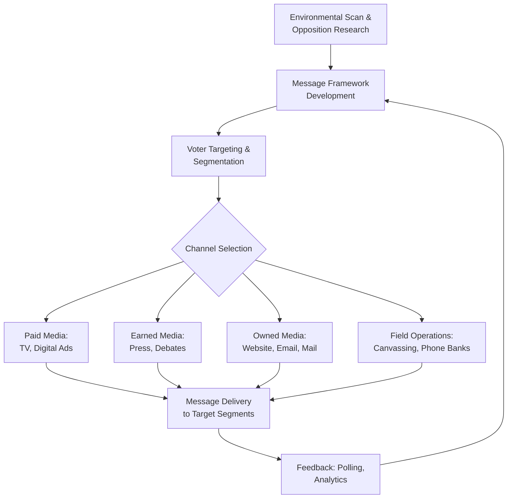

## Political Campaigns and Strategic Communication

### Definition and Scope

Political campaigns and strategic communication encompass the deliberate planning, messaging, and dissemination activities undertaken by candidates, parties, interest groups, and allied organizations to influence electoral outcomes, public opinion, and policy agendas. The field sits at the intersection of political science, communication studies, and marketing, examining how campaigns identify audiences, craft persuasive messages, allocate resources across media channels, and adapt strategy in response to competitive dynamics and electoral rules.

Core analytical components include:

- **Campaign strategy** — targeting, positioning, resource allocation, and sequencing of campaign activities
- **Message development** — framing, issue ownership, and candidate image construction
- **Channel selection** — paid media (advertising), earned media (press coverage), owned media (websites, direct mail), and social/digital media
- **Voter mobilization** — get-out-the-vote (GOTV) operations and persuasion targeting
- **Campaign finance and regulation** — legal frameworks governing fundraising and spending
- **Effects research** — empirical study of what campaign communication actually changes (turnout, vote choice, attitudes)

### Theoretical Foundations

**Key Points**

- **The Minimal Effects Model** (Lazarsfeld, Berelson, and Gaudet's *The People's Choice*, 1944; later Klapper's *The Effects of Mass Communication*, 1960) argued that campaign media primarily reinforces existing predispositions rather than converting voters, based on early studies of the 1940 US presidential election.
- **Agenda-Setting Theory** (McCombs and Shaw, 1972) holds that media coverage does not tell people what to think but strongly influences what issues they consider important, a mechanism central to campaign strategy around issue emphasis.
- **Framing Theory** (drawing on Erving Goffman and later applied to political communication by scholars such as Robert Entman) examines how the presentation of an issue — which aspects are emphasized or omitted — shapes audience interpretation and evaluation.
- **Priming** refers to the effect by which media coverage of particular issues shifts the criteria voters use to evaluate candidates (e.g., emphasizing the economy makes voters weight economic competence more heavily in candidate assessment).
- **Issue Ownership Theory** (John Petrocik, 1996) proposes that parties develop reputations for competence on specific issues (e.g., Republicans historically "owning" national security in the US context, Democrats "owning" social welfare), and successful campaigns strategically emphasize their party's owned issues while avoiding the opponent's.
- [Inference] The shift from "minimal effects" toward "conditional effects" and later "significant effects under certain conditions" models reflects several decades of accumulated survey-experimental and media-effects research; the field has moved away from either extreme (all-powerful media or no effects at all) toward context-dependent effect models.

### Campaign Strategy Architecture

**Strategic Planning Components**

1. **Environmental scan** — assessment of the electoral landscape: district/constituency demographics, partisan lean, incumbency status, and historical voting patterns
2. **Opposition research** — systematic investigation of the opponent's record, statements, and vulnerabilities
3. **Message framework** — the core narrative and 2–3 dominant themes repeated across all channels (message discipline)
4. **Targeting model** — segmentation of the electorate into persuadable, base, and unreachable voters, often using voter file data merged with commercial and modeled data
5. **Media plan** — allocation of budget across paid advertising, digital, direct mail, and earned media strategy
6. **Field/mobilization plan** — canvassing, phone banking, and GOTV operations targeting likely supporters
7. **Rapid response** — capacity to counter opposition attacks and unexpected events within a compressed news cycle

**Example: Voter Targeting Segmentation (Illustrative)**

| Segment | Description | Typical Campaign Treatment |
| --- | --- | --- |
| Base supporters | High propensity to support and vote | Mobilization (GOTV) messaging; turnout reminders |
| Persuadable/swing voters | Uncertain preference, moderate turnout propensity | Persuasion messaging; heavier ad spend concentration |
| Opposition base | High propensity to support opponent | Minimal direct targeting; occasionally suppression-oriented messaging (ethically and legally contested) |
| Unlikely voters | Low turnout propensity regardless of preference | Generally deprioritized due to low return on contact |

### Message Development and Framing

**Key Points**

- Message discipline — the consistent repetition of a narrow set of themes across all campaign touchpoints — is widely regarded in campaign practice literature as a key determinant of message penetration, since voters are exposed to fragmented, low-attention political information.
- Candidate image dimensions commonly studied include competence, integrity, empathy, and leadership, which interact with issue positions to shape overall evaluations (a framework elaborated in the political psychology literature, e.g., work by Shanto Iyengar and Donald Kinder).
- Negative advertising ("attack ads") is empirically associated with mixed effects on turnout — some studies find demobilizing effects while others find negligible or even mobilizing effects depending on content and context; [Unverified: the aggregate empirical consensus on negative advertising's turnout effects has shifted across decades of research and remains genuinely contested in the literature, so specific effect-size claims should be sourced to current meta-analyses.]
- Framing effects are moderated by source credibility, competing frames, and individual predispositions (motivated reasoning), meaning a single frame rarely operates in isolation from counter-framing by opponents.

### Channels of Political Communication

**Paid Media**

- Traditional broadcast and cable television advertising remains a major expenditure category in many national campaigns, though its relative share has declined as digital advertising has grown.
- Digital advertising (social media platforms, programmatic ad networks, search engine marketing) enables granular audience targeting based on demographic, behavioral, and modeled psychographic data.

**Earned Media**

- Press coverage generated through media relations, press conferences, debates, and newsworthy events, valued for perceived third-party credibility relative to paid advertising.
- Debate performance and post-debate spin operations (surrogates framing the narrative to press immediately following debates) are a distinct earned-media strategic sub-domain.

**Owned Media**

- Campaign websites, email lists, and direct mail provide unmediated, campaign-controlled communication channels, important for fundraising solicitation and detailed policy communication.

**Social and Digital Media**

- Enables direct candidate-to-voter communication bypassing traditional press gatekeeping, but also introduces challenges including misinformation spread, platform algorithmic curation effects, and micro-targeting controversies (e.g., the Cambridge Analytica data scandal involving the 2016 US presidential campaign, which drew widespread scrutiny over unauthorized use of Facebook user data for political targeting).
- [Inference] The relative strategic weight of digital versus traditional channels continues to shift with platform usage patterns and regulatory changes; specific channel allocation benchmarks from any given election cycle should not be assumed to generalize to subsequent cycles.

### Diagram: Campaign Communication Strategy Flow

### Voter Mobilization Research

**Key Points**

- Field experimental research on Get-Out-The-Vote (GOTV) tactics, pioneered by Alan Gerber and Donald Green in the early 2000s, established a comparative effectiveness hierarchy: in-person canvassing generally produces the largest turnout effects, followed by phone calls (with impersonal/scripted calls showing weaker effects than personalized calls), with direct mail and robocalls typically showing the smallest effects.
- Social pressure appeals (e.g., mailers informing recipients that their voting history will be shared with neighbors) have been shown in experimental studies to produce measurable turnout increases, though such tactics raise ethical questions about privacy and social coercion.
- [Inference] Effect sizes from GOTV field experiments are generally modest in absolute percentage-point terms but can be decisive in close elections; specific effect-size figures vary substantially by experimental context, population, and election salience, so any single number should be treated as context-specific rather than a universal constant.

### Campaign Finance and Regulatory Context

- Campaign finance regulation varies substantially across democracies, ranging from strict public financing and spending caps (common in parts of Western Europe) to comparatively permissive private-financing systems.
- In the United States, the Supreme Court's *Buckley v. Valeo* (1976) established that campaign spending constitutes protected political speech, limiting the constitutionality of spending caps while permitting contribution limits; *Citizens United v. FEC* (2010) further held that independent political expenditures by corporations and unions cannot be restricted, contributing to the rise of Super PACs (independent expenditure-only committees).
- [Unverified: Current statutory contribution limits and disclosure thresholds change periodically via legislation and FEC/regulatory adjustments; specific dollar figures should be verified against current regulatory sources rather than assumed static.]

### Comparative Campaign Systems

| Dimension | US-Style Candidate-Centered System | Parliamentary/Party-Centered System (e.g., many European democracies) |
| --- | --- | --- |
| Primary unit of campaigning | Individual candidates | Political parties |
| Financing | Predominantly private, candidate-controlled | Often mixed public/private, party-controlled |
| Media access | Purchased advertising time (where permitted) | Frequently regulated free airtime allocation |
| Personalization | High (candidate image central) | Traditionally lower, though increasing personalization is a documented trend |

[Inference] The personalization of politics — the increasing prominence of individual leaders' images relative to party brands, even in traditionally party-centered systems — is a trend widely discussed in comparative political communication literature, though the pace and extent vary by country and are subject to ongoing scholarly debate.

### Applied Example: Message Framework Construction

**Example**

A hypothetical mayoral candidate's strategic communication team might construct a message framework as follows:

- **Core narrative**: "Experienced leadership for practical results"
- **Owned issue**: Public safety (candidate has a law enforcement background)
- **Framing choice**: Presenting a crime policy proposal in terms of "community safety investment" (episodic, solution-framed) rather than "tougher sentencing" (thematic, punitive-framed), depending on which frame tests better with the target persuadable segment
- **Channel sequencing**: Earned media (endorsement announcements) in early campaign phase to build credibility at low cost; paid media concentrated in final six weeks when persuadable voters are more attentive; field operations scaled up in final two weeks for GOTV

**Output**

A coherent, tested message deployed consistently across mail, digital ads, debate talking points, and canvassing scripts, with variation only in format (not core content) across channels.

### Common Pitfalls and Debates

**Key Points**

- Overattributing electoral outcomes to campaign communication tactics while underweighting structural factors (partisanship, economic conditions, incumbency, fundamentals-based forecasting models) that political science research consistently finds to be strong predictors of election outcomes independent of campaign messaging.
- Treating negative advertising effects as uniformly demobilizing or uniformly effective, when the empirical literature finds substantial heterogeneity by content, tone, and context.
- Assuming digital micro-targeting is straightforwardly more persuasive than traditional broad-based advertising; the persuasive effectiveness of granular targeting relative to broadcast approaches remains an active empirical debate rather than a settled finding.
- [Speculation] The long-term impact of generative AI tools (synthetic media, AI-assisted message testing, deepfakes) on campaign strategic communication and regulatory response is an unsettled and rapidly evolving area; specific claims about AI's current or future electoral impact should be treated as provisional.

### Related Topics

- Agenda-setting, framing, and priming effects in political communication
- Issue ownership theory and party brand strategy
- Get-Out-The-Vote field experiments and mobilization research (Gerber and Green tradition)
- Campaign finance law: *Buckley v. Valeo*, *Citizens United*, and comparative regulatory regimes
- Political advertising effects: negative campaigning and persuasion research
- Digital micro-targeting, data-driven campaigning, and the Cambridge Analytica case
- Debate effects and post-debate media spin operations
- Personalization of politics in comparative perspective
- Fundamentals-based election forecasting versus campaign-effects models
- Disinformation, synthetic media, and emerging regulatory responses in campaign communication