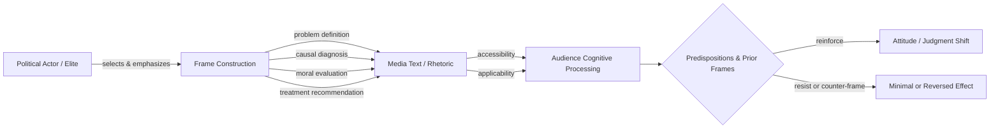

## Framing and Political Rhetoric

### Definition and Conceptual Overview

Framing is the process by which communicators — politicians, journalists, campaigns, interest groups — select certain aspects of a perceived reality and make them more salient in a communicating text, thereby promoting a particular problem definition, causal interpretation, moral evaluation, or treatment recommendation. This definition, developed by Robert Entman, remains the most widely cited formulation in political communication research.

Political rhetoric refers to the strategic use of persuasive language in political discourse — the deliberate crafting of arguments, appeals, and stylistic devices to shape audience beliefs, attitudes, and behaviors. Framing operates as one of the primary mechanisms through which rhetoric achieves persuasive effect: the frame supplies the interpretive lens, while rhetorical technique (metaphor, repetition, narrative, emotional appeal) delivers that lens to the audience.

The two concepts are theoretically distinct but practically inseparable. A frame is a cognitive structure; rhetoric is the linguistic vehicle that activates it. "Tax relief" versus "tax cuts for the wealthy" frames the same policy differently, and the choice of words is itself an act of rhetoric.

### Theoretical Foundations

**Goffman's Frame Analysis (1974)**

Erving Goffman introduced "frame" as a sociological concept describing the schemata of interpretation that allow individuals to locate, perceive, identify, and label events. Political communication scholars later adapted this micro-sociological concept to explain how media and elites structure political understanding.

**Entman's Four Functions of Frames**

Entman specified that frames perform up to four distinct functions within a text:

1. **Problem definition** — determining what an actor is doing and at what cost/benefit
2. **Causal diagnosis** — identifying the forces creating the problem
3. **Moral evaluation** — judging causal agents and their effects
4. **Treatment recommendation** — offering and justifying remedies

Not every frame performs all four functions simultaneously, but a fully developed frame typically does.

**Kahneman and Tversky's Prospect Theory**

The psychological foundation for framing effects comes from behavioral economics. Kahneman and Tversky demonstrated that identical outcomes described in terms of gains versus losses produce systematically different risk preferences (loss aversion). This "equivalency framing" research established that framing is not merely rhetorical decoration but can alter substantive judgment even when the underlying facts are unchanged.

**Lakoff's Cognitive Framing**

George Lakoff argued that political frames are structured by deep conceptual metaphors — most famously, the "Nation as Family" metaphor underlying competing conservative ("strict father") and progressive ("nurturant parent") moral worldviews. Lakoff's central claim is that facts alone rarely change minds because people process information through pre-existing frames; contradicting a frame directly (e.g., "don't think of an elephant") can reinforce rather than dislodge it.

### Types of Framing

**Equivalency Framing**

Presents logically equivalent information using different words or reference points (e.g., "90% employment" vs. "10% unemployment"). Effects arise purely from valence/reference-point manipulation, not from added or omitted content.

**Emphasis (Issue) Framing**

Selects genuinely different, though potentially equally valid, considerations to emphasize about a multidimensional issue (e.g., framing a hate-group rally in terms of free speech versus public order). This is the dominant form in political communication research because most real-world political framing involves selective emphasis rather than pure logical equivalence.

**Episodic vs. Thematic Framing**

Shanto Iyengar's distinction:

- **Episodic frames** present issues via specific instances or case studies (e.g., a news story about one unemployed worker)
- **Thematic frames** present issues in general, abstract, collective context (e.g., statistical trends in unemployment)

Iyengar's experimental research found episodic framing tends to attribute responsibility to individuals, while thematic framing tends to attribute responsibility to societal or governmental structures — with significant downstream effects on support for policy versus individual-blame narratives.

**Strategic vs. Issue (Policy) Framing**

Common in campaign journalism:

- **Strategic/game frames** cover politics as competition — polls, tactics, who's winning
- **Issue frames** cover substantive policy content and consequences

Research consistently finds strategic framing dominates contemporary political journalism and is associated with increased public cynicism toward politics.

### Core Rhetorical Techniques in Political Communication

**Metaphor**

Structures abstract political concepts through concrete, embodied experience. "War on drugs," "tax burden," "flood of immigrants," "marketplace of ideas." Metaphors are not neutral illustrations — they import entailments from the source domain (a "war" implies enemies, casualties, and victory conditions) that shape reasoning about the target domain.

**Repetition and Message Discipline**

Reinforces frame retention and recall. Modern campaign communication relies heavily on tightly controlled message repetition ("message of the day," talking points) to ensure a single frame dominates media coverage over competing frames.

**Narrative and Storytelling**

Political rhetoric frequently deploys canonical narrative structures — victim/villain/hero, decline-and-redemption, us-versus-them — because narratives are more memorable and emotionally engaging than abstract policy argument.

**Antithesis and Parallelism**

Rhetorical balancing of contrasting ideas in parallel grammatical structure ("Ask not what your country can do for you — ask what you can do for your country"). Increases memorability and perceived authority.

**Ethos, Pathos, Logos (Aristotelian Appeals)**

- **Ethos**: appeals grounded in the speaker's credibility, character, or authority
- **Pathos**: appeals to audience emotion (fear, hope, anger, pride)
- **Logos**: appeals to logical/rational argument structure

Effective political rhetoric typically blends all three; over-reliance on pathos without logos is a common target of rhetorical criticism.

**Presupposition and Loaded Language**

Framing information as background assumption rather than assertion, which places it outside the normal scope of contestation. A question like "How will you fix the failing economy?" presupposes the economy is failing regardless of the answer given.

**Euphemism and Dysphemism**

Softening ("enhanced interrogation," "collateral damage") or intensifying ("death tax," "abortion mill") the emotional valence of a referent through word choice alone.

### Framing Effects: Empirical Mechanisms

Framing effects operate primarily through two psychological pathways studied in political communication:

**Accessibility (Priming-adjacent)**: Frames make certain considerations more cognitively available, increasing the probability that those considerations are retrieved when forming a judgment.

**Applicability**: Frames signal that certain existing beliefs or values are relevant to the issue at hand, even without necessarily making them more accessible in memory.

[Inference] The relative strength of accessibility versus applicability mechanisms appears to be moderate by individual differences such as political knowledge and need for cognition, though the precise boundary conditions remain an active area of experimental research and findings vary by study design.

Framing effects are also constrained by:

- **Frame strength** — strong, resonant frames overpower weak counter-frames
- **Repetition and source credibility** — frames from trusted or repeated sources are more effective
- **Audience predispositions** — prior partisan or ideological commitments moderate susceptibility
- **Competitive framing environments** — when audiences are exposed to opposing frames, effects often cancel out or diminish (documented in Chong and Druckman's work on framing competition)

### Framing vs. Related Concepts

| Concept | Distinction from Framing |
| --- | --- |
| **Agenda-setting** | Concerns *what* issues are salient (what to think about), not *how* they're interpreted |
| **Priming** | Concerns which considerations are activated for evaluating a separate target (e.g., a politician), often as a downstream effect of agenda-setting |
| **Propaganda** | A normatively loaded term for framing/rhetoric deployed with intent to deceive or manipulate, often via one-sided, monopolized information flow |
| **Spin** | Colloquial term for reactive, defensive framing applied after an event, typically by press secretaries or communications staff |

### Extended Example: Framing the Same Policy

Consider an immigration policy proposal, framed three distinct ways by different political actors:

**Frame A (Economic Threat)**: "This policy will flood the labor market and drive down wages for American workers." — Problem definition: job competition. Causal diagnosis: policy-induced supply of labor. Treatment: restriction.

**Frame B (Humanitarian)**: "This policy offers a lifeline to families fleeing violence and persecution." — Problem definition: human suffering. Causal diagnosis: conditions in origin countries. Treatment: welcoming.

**Frame C (Rule of Law)**: "This policy undermines the integrity of our legal immigration system." — Problem definition: institutional fairness. Causal diagnosis: policy design flaw. Treatment: procedural reform.

Each frame is built on a different metaphor (flood/threat, lifeline/rescue, integrity/order), selects different facts as relevant, and implies a different treatment — despite all three describing the identical underlying policy text.

### Diagram: Frame Construction and Effect Pathway

### Illustration: Frame as Interpretive Lens (svg_diagram)

<svg xmlns="http://www.w3.org/2000/svg" viewBox="0 0 640 300">
<text x="320" y="28" text-anchor="middle" font-size="16" font-weight="bold" fill="#1a1a1a">Frame as Interpretive Lens (svg_diagram)</text>
<rect x="20" y="70" width="140" height="80" rx="6" fill="#e8f0fe" stroke="#3b5bdb" stroke-width="1.5" />
<text x="90" y="105" text-anchor="middle" font-size="13" fill="#1a1a1a">Raw Event /</text>
<text x="90" y="122" text-anchor="middle" font-size="13" fill="#1a1a1a">Policy Text</text>
<polygon points="200,60 320,90 320,150 200,180" fill="#fff3bf" stroke="#e8590c" stroke-width="1.5" />
<text x="260" y="118" text-anchor="middle" font-size="13" fill="#1a1a1a">Frame</text>
<text x="260" y="134" text-anchor="middle" font-size="13" fill="#1a1a1a">(lens)</text>
<rect x="380" y="55" width="150" height="50" rx="6" fill="#d3f9d8" stroke="#2f9e44" stroke-width="1.5" />
<text x="455" y="85" text-anchor="middle" font-size="12" fill="#1a1a1a">Interpretation A</text>
<rect x="380" y="115" width="150" height="50" rx="6" fill="#ffe3e3" stroke="#e03131" stroke-width="1.5" />
<text x="455" y="145" text-anchor="middle" font-size="12" fill="#1a1a1a">Interpretation B</text>
<rect x="380" y="175" width="150" height="50" rx="6" fill="#e5dbff" stroke="#7048e8" stroke-width="1.5" />
<text x="455" y="205" text-anchor="middle" font-size="12" fill="#1a1a1a">Interpretation C</text>
<line x1="160" y1="110" x2="200" y2="110" stroke="#495057" stroke-width="2" marker-end="url(#arrow)" />
<line x1="320" y1="95" x2="380" y2="80" stroke="#495057" stroke-width="2" marker-end="url(#arrow)" />
<line x1="320" y1="120" x2="380" y2="140" stroke="#495057" stroke-width="2" marker-end="url(#arrow)" />
<line x1="320" y1="145" x2="380" y2="195" stroke="#495057" stroke-width="2" marker-end="url(#arrow)" />
<text x="320" y="260" text-anchor="middle" font-size="12" fill="`#495057`">Same underlying fact set; frame determines which interpretation reaches the audience</text>

</svg>

### Framing, Propaganda, and Normative Boundaries

Not all framing constitutes propaganda, and the boundary is a matter of ongoing scholarly and political dispute. Jacques Ellul and later propaganda scholars typically distinguish propaganda from ordinary persuasive rhetoric by:

- **Intent to manipulate** rather than inform or genuinely persuade
- **Monopolization or suppression** of competing frames/information
- **Use of emotional or psychological manipulation** that bypasses rational evaluation
- **Institutional or systematic** production (state apparatus, coordinated campaigns) rather than isolated rhetorical acts

[Unverified] Where exactly ordinary political spin ends and propaganda begins is contested among communication scholars, and different theoretical traditions (critical/Frankfurt School vs. liberal-pluralist) draw this line differently; this is a normative and theoretical disagreement rather than an empirical fact this reference can resolve.

### Methodological Approaches to Studying Framing

- **Content/frame analysis**: manual or computational coding of texts for the presence of defined frames (inductive frame discovery vs. deductive coding against a pre-specified list)
- **Experimental framing studies**: randomly assigning subjects to different frame conditions and measuring attitude/behavior differences (the dominant method following Kahneman/Tversky and Iyengar's tradition)
- **Computational/NLP framing detection**: topic modeling, word embedding analysis, and supervised classifiers trained on hand-coded frame corpora (e.g., the Media Frames Corpus) to detect frames at scale in large text datasets
- **Discourse and rhetorical analysis**: qualitative, close-reading approaches drawing on rhetorical criticism traditions (Aristotelian, Burkean) to interpret persuasive structure in specific speeches or texts

### Key Points

- Framing selects and emphasizes aspects of reality to promote a particular interpretation; rhetoric is the linguistic delivery mechanism
- Entman's four frame functions: problem definition, causal diagnosis, moral evaluation, treatment recommendation
- Equivalency framing (same facts, different valence) is distinct from emphasis framing (different but valid considerations)
- Episodic framing tends to individualize responsibility; thematic framing tends to structuralize it
- Framing effects are moderated by predispositions, competing frames, and source credibility — they are not unconditional
- Framing is analytically distinct from agenda-setting (what to think about) and priming (what standards to use in evaluation)
- The line between rhetoric/framing and propaganda is normatively contested, generally turning on intent, monopolization of discourse, and manipulation of rational assessment

**Related Topics**

- Agenda-Setting Theory and the Media
- Priming Effects in Political Evaluation
- Propaganda Techniques and Historical Case Studies
- Political Metaphor and Cognitive Linguistics (Lakoff)
- Media Bias: Selection, Framing, and Presentation
- Computational Text Analysis for Political Discourse
- Rhetorical Criticism and Speech Analysis Methods
- Prospect Theory and Political Risk Perception
- Strategic (Game) Frame Journalism and Political Cynicism
- Social Media Framing and Algorithmic Amplification