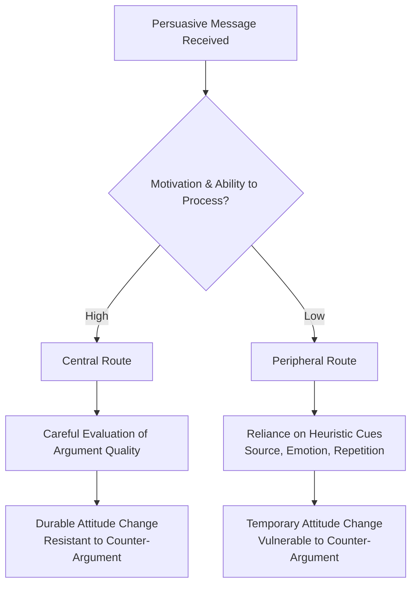

## Propaganda and Persuasion

### Definition and Conceptual Distinction

Persuasion is the process of using communication to shape, reinforce, or change the beliefs, attitudes, or behaviors of an audience, typically through appeals that leave the audience's rational evaluative capacity intact. Propaganda is a specific, normatively contested subtype of persuasive communication, generally distinguished by systematic, often institutional production; deliberate concealment or distortion of intent, source, or evidence; and reliance on psychological or emotional manipulation designed to bypass rather than engage critical reasoning.

Jacques Ellul, in *Propaganda: The Formation of Men's Attitudes* (1965), defined propaganda as a technique of psychological manipulation employed by an organized group to bring about the active or passive participation of a mass of individuals in actions or attitudes, through psychological manipulations integrated into that group's objectives. Ellul's formulation emphasizes that propaganda is a sociological phenomenon of mass society, not merely a rhetorical style.

Garth Jowett and Victoria O'Donnell offer a widely used working definition: propaganda is the deliberate, systematic attempt to shape perceptions, manipulate cognitions, and direct behavior to achieve a response that furthers the desired intent of the propagandist.

### Historical Development of Propaganda Studies

**Early Theoretical Period (1920s–1930s)**

Harold Lasswell's *Propaganda Technique in the World War* (1927) established propaganda as a serious object of academic study following World War I, analyzing how belligerent states manipulated public opinion. This period corresponds to the "hypodermic needle" or "magic bullet" model of media effects, which assumed audiences were largely passive and directly susceptible to propagandistic messaging.

**Wartime Institutionalization (1930s–1940s)**

World War II produced extensive state-run propaganda apparatuses on all sides — Joseph Goebbels' Reich Ministry of Public Enlightenment and Propaganda in Nazi Germany, the U.S. Office of War Information, and Soviet agitprop structures. This period generated foundational empirical research, including the Institute for Propaganda Analysis's identification of common propaganda devices (see below) and Carl Hovland's Yale Attitude Change program, which began systematic experimental study of persuasion variables (source credibility, message order, fear appeals).

**Limited Effects and Two-Step Flow (1940s–1960s)**

Paul Lazarsfeld, Elihu Katz, and colleagues found that media effects were mediated by opinion leaders and social networks rather than acting directly on isolated individuals (the "two-step flow" model), substantially revising the hypodermic needle assumption and establishing that persuasion is contingent on social context.

**Cognitive and Dual-Process Era (1980s–present)**

Contemporary persuasion research shifted toward cognitive models explaining *how* persuasion occurs at the level of individual information processing, most notably the Elaboration Likelihood Model and Heuristic-Systematic Model (detailed below).

### Classical Propaganda Techniques (Institute for Propaganda Analysis Framework)

The Institute for Propaganda Analysis (1937–1942) catalogued seven recurring devices, still used as a baseline typology in media literacy education:

1. **Name-calling** — attaching a negative label to a person, group, or idea to induce rejection without examination of evidence
2. **Glittering generalities** — associating something with a virtue word (freedom, democracy, justice) to induce approval without examination
3. **Transfer** — carrying the authority, sanction, or prestige of something respected (a flag, a religious symbol) over to something else
4. **Testimonial** — having a respected or hated person endorse or condemn an idea
5. **Plain folks** — the speaker presents themselves as an ordinary person to win audience trust
6. **Card stacking** — selective use of facts, half-truths, and selective omission to build the best (or worst) possible case
7. **Bandwagon** — appealing to the desire to conform, implying "everyone is doing it"

### Modern Typology of Propaganda

**White, Gray, and Black Propaganda** (Jowett and O'Donnell's source-based classification)

| Type | Source Disclosure | Content Accuracy |
| --- | --- | --- |
| **White propaganda** | Source openly and correctly identified | Generally accurate, though selectively presented |
| **Gray propaganda** | Source deliberately unclear or unstated | Accuracy uncertain or unverifiable |
| **Black propaganda** | Source falsely attributed | Often deliberately false |

**Agitation vs. Integration Propaganda** (Ellul)

- **Agitation propaganda** seeks to mobilize populations toward disruptive action, typically short-term and associated with revolutionary or opposition movements
- **Integration propaganda** seeks to habituate populations to a stable, existing social order, typically long-term and associated with governing regimes

### Psychological Mechanisms of Persuasion

**Elaboration Likelihood Model (Petty and Cacioppo, 1986)**

Posits two routes to persuasion:

- **Central route**: audience engages in effortful, issue-relevant thinking, evaluating argument quality; attitude change via this route tends to be durable and resistant to counter-persuasion
- **Peripheral route**: audience relies on heuristic cues (source attractiveness, message length, number of arguments, emotional tone) rather than argument substance; attitude change via this route tends to be weaker and more temporary

Elaboration likelihood is a function of both **motivation** (personal relevance, need for cognition) and **ability** (distraction, prior knowledge, time pressure) to process the message centrally.

**Heuristic-Systematic Model (Chaiken, 1980)**

A parallel dual-process framework distinguishing **systematic processing** (comprehensive analysis of message content) from **heuristic processing** (reliance on cognitive shortcuts, e.g., "experts are usually correct"). Unlike ELM's either/or route framing, HSM allows both processing modes to co-occur.

**Cognitive Dissonance Theory (Festinger, 1957)**

Individuals experience psychological discomfort when holding contradictory cognitions and are motivated to reduce that discomfort — often by adjusting attitudes rather than behavior. Propaganda and persuasive campaigns exploit dissonance reduction by engineering small behavioral commitments (e.g., signing a petition) that create pressure toward attitude realignment (foot-in-the-door technique).

**Social Proof and Conformity**

Persuasive and propagandistic messaging frequently leverages descriptive norms (what most people do) and injunctive norms (what most people approve of) to induce compliance, consistent with Cialdini's broader framework of influence principles (reciprocity, commitment/consistency, social proof, authority, liking, scarcity).

### Propaganda in Mass Media and Institutional Contexts

**Propaganda Model of Media (Herman and Chomsky, 1988)**

Argues that structural features of commercial mass media — ownership concentration, advertising dependence, reliance on official sources, "flak" (organized pushback against dissenting coverage), and anti-communist/ideological filters — systematically bias news coverage toward elite interests without requiring deliberate top-down censorship. [Unverified] The propaganda model remains a contested framework within media studies; critics argue it understates journalistic agency and market/audience diversity, while proponents point to persistent patterns of source dependency and framing consistent with the model's predictions — resolving this dispute empirically is beyond the scope of a definitional reference.

**Public Diplomacy and State Communication**

Contemporary states distinguish "public diplomacy" (transparent, attributed international communication intended to build mutual understanding) from propaganda, though the boundary is frequently contested in practice, particularly regarding international broadcasters (e.g., state-funded international media services) whose funding source is disclosed but whose editorial framing may still serve state interests.

### Digital-Era Propaganda and Computational Persuasion

**Computational Propaganda**

Refers to the use of algorithms, automation (bots), and human curation to distribute deliberately misleading or manipulative content over social media, studied extensively by the Oxford Internet Institute's Computational Propaganda Project. Key mechanisms:

- **Astroturfing**: coordinated inauthentic behavior designed to simulate grassroots public opinion
- **Sock puppet and troll networks**: fake or misrepresented accounts amplifying specific narratives
- **Bot amplification**: automated accounts inflating apparent popularity or virality of content
- **Microtargeting**: using granular behavioral/demographic data to deliver tailored persuasive messages to narrow audience segments, raising distinct concerns because messages are less publicly visible and less subject to counter-argument or fact-checking

**Disinformation, Misinformation, and Malinformation**

A widely used tripartite distinction (Wardle and Derakhshan):

- **Misinformation**: false information spread without intent to deceive
- **Disinformation**: false information spread deliberately to deceive
- **Malinformation**: genuine information spread with intent to cause harm (e.g., leaked private information deployed out of context)

Propaganda most closely overlaps with disinformation but is broader, since propaganda can be built entirely from factually accurate but selectively curated material (card stacking).

### Persuasion vs. Propaganda: Comparative Framework

| Dimension | Persuasion (general) | Propaganda |
| --- | --- | --- |
| **Transparency of intent** | Often disclosed or inferable | Frequently concealed or disguised |
| **Evidentiary standard** | May rely on genuine argument and evidence | May rely on selective, fabricated, or decontextualized material |
| **Audience treatment** | Generally treats audience as capable of independent judgment | Frequently seeks to bypass independent judgment |
| **Institutional scale** | May be individual or organizational | Typically systematic and organized (state, party, movement) |
| **Reversibility/durability** | Central-route persuasion tends to be durable and resistant to counter-argument | Peripheral, emotion-driven propaganda effects often weaken under counter-argument exposure |

[Inference] These distinctions describe tendencies rather than bright-line rules; in practice, real-world political communication frequently combines legitimate persuasive argument with techniques closer to the propaganda end of the spectrum, and classifying a specific text often requires contextual judgment rather than mechanical application of criteria.

### Extended Example: Analyzing a Political Message

Consider a hypothetical campaign message: *"A vote for my opponent is a vote against hardworking families. Join thousands of your neighbors who are standing up for what's right."*

**Applied analysis using the frameworks above:**

- **Name-calling/transfer**: opponent's policy is implicitly associated with harm to a sympathetic in-group ("hardworking families") without argument specifics
- **Bandwagon**: "thousands of your neighbors" invokes social proof/conformity pressure
- **Glittering generality**: "standing up for what's right" invokes an undefined virtue term
- **Peripheral route cues**: message relies on emotional and social heuristics rather than policy argument, suggesting persuasion via the peripheral/heuristic route rather than central/systematic route
- **Propaganda classification**: likely falls under **white propaganda** (source is openly the campaign) using **integration-adjacent techniques** to consolidate in-group identity rather than incite disruptive action

### Diagram: Persuasion Processing Pathway (Elaboration Likelihood Model)

### Diagram: Propaganda Source and Content Classification (svg_diagram)

<svg xmlns="http://www.w3.org/2000/svg" viewBox="0 0 640 320">
<text x="320" y="28" text-anchor="middle" font-size="16" font-weight="bold" fill="#1a1a1a">Propaganda Source Classification (svg_diagram)</text>
<rect x="40" y="70" width="160" height="90" rx="6" fill="#d3f9d8" stroke="#2f9e44" stroke-width="1.5" />
<text x="120" y="105" text-anchor="middle" font-size="14" font-weight="bold" fill="#1a1a1a">White</text>
<text x="120" y="125" text-anchor="middle" font-size="11" fill="#1a1a1a">Source disclosed</text>
<text x="120" y="141" text-anchor="middle" font-size="11" fill="#1a1a1a">Generally accurate</text>
<rect x="240" y="70" width="160" height="90" rx="6" fill="#fff3bf" stroke="#e8590c" stroke-width="1.5" />
<text x="320" y="105" text-anchor="middle" font-size="14" font-weight="bold" fill="#1a1a1a">Gray</text>
<text x="320" y="125" text-anchor="middle" font-size="11" fill="#1a1a1a">Source unclear</text>
<text x="320" y="141" text-anchor="middle" font-size="11" fill="#1a1a1a">Accuracy uncertain</text>
<rect x="440" y="70" width="160" height="90" rx="6" fill="#ffe3e3" stroke="#e03131" stroke-width="1.5" />
<text x="520" y="105" text-anchor="middle" font-size="14" font-weight="bold" fill="#1a1a1a">Black</text>
<text x="520" y="125" text-anchor="middle" font-size="11" fill="#1a1a1a">Source falsified</text>
<text x="520" y="141" text-anchor="middle" font-size="11" fill="#1a1a1a">Often false content</text>
<line x1="40" y1="200" x2="600" y2="200" stroke="#495057" stroke-width="2" />
<text x="60" y="195" font-size="11" fill="#495057">Increasing concealment</text>
<text x="500" y="195" font-size="11" fill="#495057" text-anchor="end">→</text>

<text x="320" y="240" text-anchor="middle" font-size="12" fill="`#495057`">Classification is based on source attribution and disclosed intent,</text>

<text x="320" y="258" text-anchor="middle" font-size="12" fill="`#495057`">not solely on the truth value of the content itself.</text>

</svg>

### Key Points

- Propaganda is a systematic, often institutional subtype of persuasion, distinguished by concealment of intent/source and reliance on manipulation over rational engagement — not by content falsity alone
- The Institute for Propaganda Analysis's seven devices (name-calling, glittering generalities, transfer, testimonial, plain folks, card stacking, bandwagon) remain a foundational teaching typology
- White/gray/black propaganda classifies by source disclosure; agitation/integration classifies by intended social function
- Dual-process models (ELM, HSM) explain persuasion mechanically: central/systematic processing produces durable attitude change; peripheral/heuristic processing produces more superficial, reversible change
- The Herman-Chomsky propaganda model explains media bias as a structural, not conspiratorial, outcome of ownership, advertising, and sourcing incentives — a contested but influential framework
- Computational propaganda (bots, astroturfing, microtargeting) introduces distribution-scale and audience-opacity challenges not present in pre-digital propaganda
- Misinformation, disinformation, and malinformation are distinguished primarily by intent and factual accuracy, and propaganda can overlap with all three depending on technique

**Related Topics**

- Framing and Political Rhetoric
- Media Bias: Selection, Framing, and Presentation
- Computational Propaganda and Bot Networks
- Public Diplomacy and Soft Power
- Cognitive Biases in Political Judgment
- Fact-Checking and Media Literacy Interventions
- Authoritarian Information Control and State Media
- Social Media Algorithms and Political Polarization
- Public Opinion Formation and Measurement
- Censorship and Information Control in Comparative Perspective