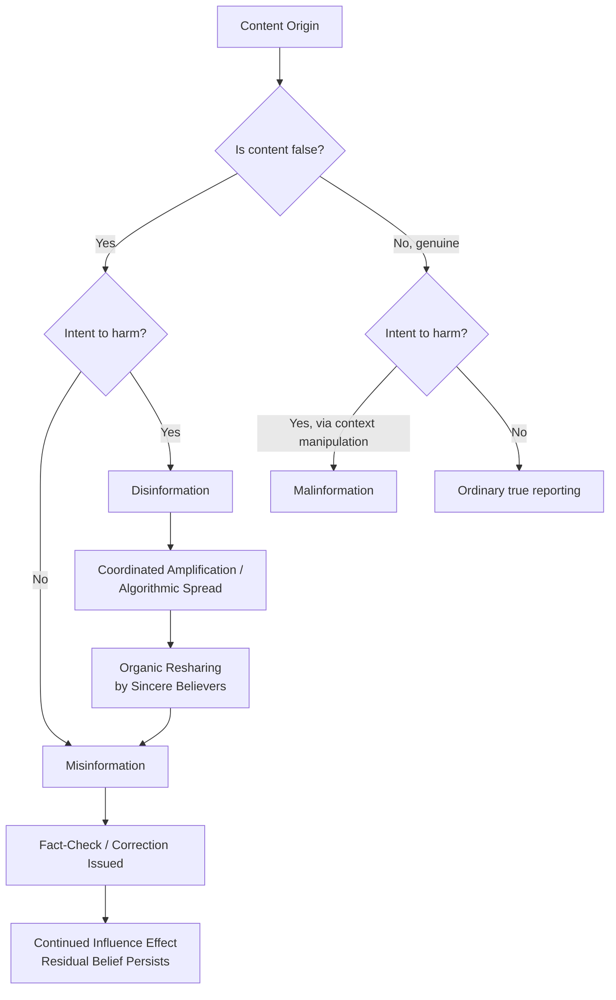

## Misinformation and Disinformation

### Definitional Framework

Misinformation and disinformation are distinguished primarily by **intent** rather than by content accuracy alone, though accuracy is also relevant. The most widely cited tripartite typology comes from Claire Wardle and Hossein Derakhshan's "Information Disorder" framework (Council of Europe, 2017):

- **Misinformation**: false or inaccurate information that is shared without intent to deceive or cause harm — the sharer genuinely believes it to be true
- **Disinformation**: false information that is deliberately created and/or shared with intent to deceive or cause harm
- **Malinformation**: genuine, factually accurate information that is shared with intent to cause harm — typically by removing it from its original context (e.g., leaked private communications, doxxing, selectively surfaced true facts intended to damage a target)

This framework crosses two independent dimensions — **falseness** and **intent to harm** — producing a 2x2 conceptual space rather than a simple continuum.

### The Information Disorder Matrix

|  | Not Intended to Harm | Intended to Harm |
| --- | --- | --- |
| **False Content** | Misinformation | Disinformation |
| **Genuine Content** | (ordinary true reporting) | Malinformation |

[Inference] Real-world content often does not sort cleanly into this matrix — a single piece of content can shift categories as it moves through a sharing chain, since something created as deliberate disinformation by an originator can become sincere misinformation when reshared by someone who believes it, without any change to the content itself.

### Seven Types of Mis/Disinformation (Wardle's Extended Typology)

Wardle later elaborated a finer-grained spectrum of content types, ordered roughly by increasing intent to deceive:

1. **Satire/parody** — no intent to cause harm but has potential to fool
2. **False connection** — headlines, visuals, or captions don't support the content
3. **Misleading content** — misleading use of information to frame an issue or individual
4. **False context** — genuine content shared with false contextual information
5. **Imposter content** — genuine sources impersonated
6. **Manipulated content** — genuine information or imagery manipulated to deceive (e.g., a doctored photo)
7. **Fabricated content** — entirely new content designed to deceive and cause harm

### Theoretical Mechanisms of Belief and Spread

**Illusory Truth Effect**

Repeated exposure to a claim increases its perceived truthfulness independent of the claim's actual accuracy or the source's credibility, documented experimentally since Hasher, Goldstein, and Toppino (1977). [Inference] This effect appears to operate even when the claim initially contradicts prior knowledge, though the durability and boundary conditions of the effect across different studies and populations remain areas of ongoing methodological refinement.

**Motivated Reasoning**

Individuals process information in ways that protect pre-existing identity-relevant beliefs, applying more scrutiny to attitude-incongruent information (disconfirmation bias) and less scrutiny to attitude-congruent information (confirmation bias). Kahan's "identity-protective cognition" extends this to explain why politically sophisticated individuals can be *more* susceptible to partisan misinformation, since greater cognitive ability enables more effective rationalization rather than more accurate belief updating.

**Continued Influence Effect**

Corrected misinformation continues to influence subsequent reasoning and judgment even after an individual has acknowledged and accepted the correction — a well-documented phenomenon in the cognitive psychology literature on memory and reasoning (Johnson and Seifert; Lewandowsky et al.). This underlies the observation that simple factual correction ("debunking") is often insufficient to fully neutralize misinformation's effects.

**Source Monitoring and Familiarity Misattribution**

Over time, individuals tend to retain the *content* of a claim more reliably than its *source* or *credibility context*, meaning a claim initially encountered with a debunking label can later be recalled and treated as credible once the source tag is forgotten.

### Disinformation as Strategic/Coordinated Activity

**State-Sponsored Disinformation Campaigns**

Documented cases include Soviet-era "active measures" (dezinformatsiya), a formalized KGB doctrine involving forged documents, front organizations, and media infiltration; and post-2014 Russian Internet Research Agency operations targeting foreign elections and social cohesion, extensively documented in the U.S. Senate Intelligence Committee's investigation into 2016 election interference.

**Coordinated Inauthentic Behavior (CIB)**

A term popularized by Meta's (Facebook's) platform policy enforcement to describe networks of accounts working together to mislead people about who they are or what they're doing, distinguishing the *behavioral coordination pattern* from the *content's truth value* — CIB can be enforced against even when individual posted content isn't independently false.

**Firehose of Falsehood Model**

A propaganda technique identified by RAND Corporation researchers (Paul and Matthews, 2016) characterizing a strategy of high-volume, multi-channel, rapid, and repetitive dissemination of messages without regard for consistency or objective reality — designed to overwhelm fact-checking capacity and produce cognitive fatigue/cynicism rather than persuade toward a single coherent narrative.

### Platform and Network Dynamics

**Algorithmic Amplification**

Engagement-optimized recommendation systems on social platforms tend to amplify emotionally activating content, and research on differential diffusion (notably Vosoughi, Roy, and Aral's 2018 *Science* study on Twitter) found that false news spread significantly farther, faster, deeper, and more broadly than true news, with human sharing behavior — not bots — identified as the primary driver.

**Filter Bubbles and Echo Chambers**

- **Filter bubble** (Eli Pariser): algorithmic personalization narrows the range of information a user encounters without their active choice
- **Echo chamber**: a social structure in which users primarily encounter opinions that align with their own, driven substantially by self-selected homophilous network ties rather than algorithms alone

[Unverified] The relative causal contribution of algorithmic curation versus voluntary self-selection to political polarization is actively disputed in the empirical literature, with some large-scale platform-data studies finding smaller algorithmic effects than commonly assumed; this remains an open empirical question rather than a settled fact.

**Network Structure of Diffusion**

Disinformation research distinguishes **broadcast diffusion** (few-to-many, characteristic of media/elite-driven spread) from **peer-to-peer diffusion** (many-to-many, characteristic of encrypted messaging apps like WhatsApp, which present distinct detection challenges due to end-to-end encryption preventing platform-level content moderation).

### Detection and Mitigation Approaches

**Fact-Checking**

Third-party verification organizations (e.g., signatories of the International Fact-Checking Network's Code of Principles) assess claim veracity, typically applying standardized rating scales (true/mostly true/half true/false, etc.). Research on fact-check effectiveness generally finds corrections reduce but do not eliminate false belief, consistent with the continued influence effect above.

**Prebunking / Inoculation Theory**

Based on McGuire's 1960s inoculation theory (itself an analogy to biological immunization), prebunking exposes individuals to a weakened, forewarned version of a manipulation technique before encountering it "in the wild," building cognitive resistance. Empirically studied via platforms like the "Bad News" and "Go Viral!" games developed by Cambridge researchers, which train users to recognize manipulation techniques (impersonation, emotional exploitation, polarization, conspiracy, discrediting, trolling) rather than debunking specific false claims.

**Media Literacy Interventions**

Educational approaches (e.g., lateral reading — checking a source's credibility by leaving the source and searching independently, as taught by the Stanford History Education Group) aim to build durable evaluative skills rather than claim-specific corrections.

**Platform Content Moderation**

Mechanisms include labeling (contextual warnings attached to flagged content), demonetization/reduced algorithmic distribution ("visibility filtering"), and removal, each involving different tradeoffs between harm mitigation and free expression concerns; [Inference] the relative effectiveness of labeling versus removal appears to depend heavily on content type and platform context, and cross-platform comparative evidence is still limited.

**Computational Detection**

NLP-based classifiers, network analysis (detecting coordinated posting timing/content similarity), and bot-detection tools (e.g., Botometer) are used at scale, though [Unverified] fully automated detection of disinformation intent (as opposed to detecting coordinated behavior patterns or stylistic markers of fabrication) remains a substantially unsolved technical problem given the difficulty of automating ground-truth intent assessment.

### Misinformation/Disinformation vs. Adjacent Concepts

| Concept | Key Distinguishing Feature |
| --- | --- |
| **Misinformation** | False, no intent to deceive |
| **Disinformation** | False, intent to deceive |
| **Malinformation** | True, intent to harm via context manipulation |
| **Propaganda** | Broader category; systematic persuasion, may use true, false, or mixed content |
| **Fake news** | Popularized but imprecise colloquial term, often conflating disinformation with legitimate journalism the speaker disputes; generally avoided in scholarly literature in favor of the terms above |
| **Conspiracy theory** | A specific narrative structure attributing events to secret, malevolent coordination; may be sincerely believed (a form of misinformation) or strategically promoted (disinformation) |

### Extended Example: Tracing a Disinformation Lifecycle

1. **Fabrication**: A false claim about an election procedure is created and posted by a coordinated account network (disinformation, by Wardle's matrix — false + intent to harm)
2. **Amplification**: Accounts within the coordinated network engage in coordinated inauthentic behavior — synchronized posting, cross-platform seeding — to trigger algorithmic amplification
3. **Organic pickup**: The claim crosses into ordinary users' networks; a user who sincerely believes it shares it further (now functioning as misinformation at this node in the chain, despite disinformation origin)
4. **Fact-check and correction**: A fact-checking organization rates the claim false and issues a correction
5. **Continued influence**: Some users who saw the correction still exhibit residual belief effects in subsequent related judgments (continued influence effect)
6. **Malinformation variant**: A bad-faith actor separately takes an out-of-context but genuine screenshot of an election official's private communication to imply wrongdoing — true content, harmful intent, a distinct malinformation pathway running parallel to the disinformation narrative

### Diagram: Information Disorder Pipeline

### Diagram: Wardle's Seven-Type Spectrum of Intent (svg_diagram)

<svg xmlns="http://www.w3.org/2000/svg" viewBox="0 0 680 260">
<text x="340" y="26" text-anchor="middle" font-size="16" font-weight="bold" fill="#1a1a1a">Spectrum of Intent to Deceive (svg_diagram)</text>
<line x1="40" y1="140" x2="640" y2="140" stroke="#495057" stroke-width="2" marker-end="url(#arrow2)" />
<text x="40" y="130" font-size="11" fill="`#495057`">Low intent to deceive</text>

<text x="640" y="130" text-anchor="end" font-size="11" fill="`#495057`">High intent to deceive</text>

<circle cx="80" cy="140" r="6" fill="#2f9e44" />
<text x="80" y="170" text-anchor="middle" font-size="10" fill="#1a1a1a">Satire /</text>
<text x="80" y="184" text-anchor="middle" font-size="10" fill="#1a1a1a">Parody</text>
<circle cx="180" cy="140" r="6" fill="#66a80f" />
<text x="180" y="170" text-anchor="middle" font-size="10" fill="#1a1a1a">False</text>
<text x="180" y="184" text-anchor="middle" font-size="10" fill="#1a1a1a">Connection</text>
<circle cx="280" cy="140" r="6" fill="#e8b339" />
<text x="280" y="170" text-anchor="middle" font-size="10" fill="#1a1a1a">Misleading</text>
<text x="280" y="184" text-anchor="middle" font-size="10" fill="#1a1a1a">Content</text>
<circle cx="380" cy="140" r="6" fill="#e8590c" />
<text x="380" y="170" text-anchor="middle" font-size="10" fill="#1a1a1a">False</text>
<text x="380" y="184" text-anchor="middle" font-size="10" fill="#1a1a1a">Context</text>
<circle cx="460" cy="140" r="6" fill="#e8590c" />
<text x="460" y="170" text-anchor="middle" font-size="10" fill="#1a1a1a">Imposter</text>
<text x="460" y="184" text-anchor="middle" font-size="10" fill="#1a1a1a">Content</text>
<circle cx="550" cy="140" r="6" fill="#e03131" />
<text x="550" y="170" text-anchor="middle" font-size="10" fill="#1a1a1a">Manipulated</text>
<text x="550" y="184" text-anchor="middle" font-size="10" fill="#1a1a1a">Content</text>
<circle cx="620" cy="140" r="6" fill="#c92a2a" />
<text x="620" y="170" text-anchor="middle" font-size="10" fill="#1a1a1a">Fabricated</text>
<text x="620" y="184" text-anchor="middle" font-size="10" fill="#1a1a1a">Content</text>

<text x="340" y="230" text-anchor="middle" font-size="11" fill="`#495057`">Based on Claire Wardle's seven-part typology of information disorder</text>

</svg>

### Key Points

- Misinformation, disinformation, and malinformation are distinguished by the intersection of factual falseness and intent to harm, not by falseness alone
- Content can shift categories as it moves through a sharing chain — disinformation at origin can become sincere misinformation when reshared by believers
- The illusory truth effect, motivated reasoning, and continued influence effect explain why belief in false claims persists even after correction
- The firehose of falsehood strategy prioritizes volume and repetition over narrative consistency, aiming to overwhelm fact-checking rather than build a single persuasive case
- False news has been found empirically to spread farther and faster than true news on social platforms, primarily driven by human sharing behavior rather than automated bots
- Prebunking/inoculation theory targets resistance to manipulation techniques in general, addressing a documented limitation of after-the-fact fact-checking
- The causal role of algorithmic curation versus voluntary network self-selection in polarization remains empirically disputed

**Related Topics**

- Propaganda and Persuasion
- Framing and Political Rhetoric
- Computational Propaganda and Bot Networks
- Media Literacy and Prebunking Interventions
- Political Polarization and Selective Exposure
- Conspiracy Theory Belief and Political Psychology
- Platform Governance and Content Moderation Policy
- Election Security and Foreign Interference
- Public Opinion Formation and Measurement
- Trust in Media and Institutional Credibility