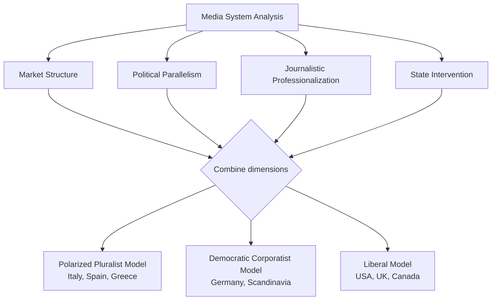

## Comparative Media Systems

### Definitional Overview

Comparative media systems research analyzes how the structural, political, economic, and cultural organization of a country's media environment shapes journalism, political communication, and democratic functioning. The subfield emerged from comparative politics and media sociology, treating media systems as institutional configurations shaped by — and shaping — broader political systems, rather than treating media as a neutral, universally uniform conduit for information.

### Foundational Framework: Four Theories of the Press

Fred Siebert, Theodore Peterson, and Wilbur Schramm's *Four Theories of the Press* (1956) established the earliest influential comparative typology, though it is now widely regarded as dated and Cold War-inflected:

1. **Authoritarian theory** — media serves and is controlled by the state/ruling authority
2. **Libertarian theory** — media operates as a free marketplace of ideas, minimally regulated
3. **Social responsibility theory** — media enjoys freedom but is expected to serve public interest, often with self-regulatory or light regulatory oversight
4. **Soviet communist theory** — media is an instrument of the Communist Party, serving collective/state goals

[Unverified] This framework is generally treated in the field today as a normative and historically situated artifact of its Cold War context rather than an empirically derived comparative model — critics note it conflates normative theory with descriptive typology and inadequately captures hybrid or non-Western media systems.

### Hallin and Mancini's Three Models (2004)

Daniel Hallin and Paolo Mancini's *Comparing Media Systems: Three Models of Media and Politics* is the dominant contemporary framework, built through systematic comparison of 18 Western democracies along four structural dimensions, from which three ideal-typical models emerge.

**Four Comparative Dimensions**

1. **Media market structure** — particularly newspaper circulation and the degree of mass-circulation vs. elite-oriented press
2. **Political parallelism** — the degree to which media outlets reflect and are organizationally linked to political parties or tendencies
3. **Journalistic professionalization** — the degree of autonomy, shared professional norms, and public-service orientation among journalists
4. **Degree and nature of state intervention** — including public broadcasting, subsidies, and content regulation

**The Three Models**

| Model | Representative Countries | Key Characteristics |
| --- | --- | --- |
| **Polarized Pluralist** | Italy, Spain, Greece, Portugal, France (partial) | High political parallelism, lower journalistic professionalization, strong state role, historically lower newspaper circulation, media closely tied to party/political factions |
| **Democratic Corporatist** | Germany, Netherlands, Scandinavian countries, Austria, Switzerland, Belgium | Historically strong party press tradition but coexisting with high professionalization, strong public broadcasting, organized social groups (unions, churches) historically influential, strong press freedom norms |
| **Liberal** | United States, United Kingdom (partial), Canada, Ireland | Market-dominated media, low political parallelism, high journalistic professionalization framed around objectivity norms, minimal formal state intervention, commercial broadcasting emphasis |

[Inference] Hallin and Mancini themselves emphasized these are ideal types rather than exact descriptions of any single country, and most real systems exhibit some hybridity or are undergoing convergence pressures — the UK, for instance, combines a strongly liberal commercial press with a distinctly non-liberal public-service broadcaster (the BBC) funded via license fee.

### Extensions Beyond the Original Three-Model Framework

Hallin and Mancini's original study was explicitly limited to Western Europe and North America; subsequent scholarship has extended and critiqued the framework's applicability:

**Hybrid and "Fourth Model" Proposals**

Scholars have proposed additional models for regions outside the original scope, including:

- Central and Eastern European "post-communist" or hybrid models, characterized by rapid marketization following 1989-91 combined with weak professional norms and high political instrumentalization
- Latin American models emphasizing concentrated commercial media ownership alongside significant state intervention and historically weak independent public broadcasting
- East Asian "developmental" media models (notably in China, Singapore) where state-directed economic development goals shape media policy alongside political control

**Media Systems and Democratization**

Comparative work on media in hybrid and authoritarian regimes (distinct from Hallin-Mancini's democracy-focused original scope) examines how state media dominance, licensing control, and selective repression of independent outlets function as tools of regime maintenance — connecting media systems analysis to the broader authoritarianism and hybrid-regime literature.

### Public Service vs. Commercial Broadcasting Traditions

A central comparative axis distinct from but related to Hallin-Mancini:

**Public Service Broadcasting (PSB)**

Institutionally insulated (in principle) from both direct state control and pure market pressure, typically funded via license fee, general taxation, or hybrid models. Exemplars: BBC (UK), NHK (Japan), ARD/ZDF (Germany), CBC (Canada). PSB systems are generally associated in comparative research with higher political knowledge and more equal knowledge distribution across socioeconomic groups, though [Inference] the causal direction and generalizability of this finding across differing national contexts remains debated, since PSB strength often correlates with other democratic-institutional factors that could independently explain the pattern.

**Commercial Broadcasting Dominance**

Advertising- or subscription-funded, market-responsive, historically dominant in the U.S. system, associated in comparative literature with greater emphasis on entertainment content, audience-maximization incentives, and — per the strategic/game-frame research discussed under political communication — a stronger tilt toward horse-race political coverage.

### Press Freedom and Regulatory Frameworks

**Comparative Press Freedom Measurement**

Organizations including Reporters Without Borders (World Press Freedom Index) and Freedom House (Freedom of the Press / Freedom in the World) produce annual comparative rankings based on indicators such as legal protections, political pressure, economic constraints on media, and safety of journalists. [Unverified] These indices involve substantial methodological judgment in indicator weighting and are sometimes critiqued for embedding particular normative assumptions about press freedom rooted in liberal-model countries; users of these indices in comparative research should treat scores as constructed measures rather than direct observations.

**Media Ownership Regulation**

Comparative approaches diverge significantly:

- Cross-media ownership caps (limiting single-entity control across print/broadcast/online) common in parts of Europe
- Foreign ownership restrictions, common in broadcasting specifically due to spectrum scarcity and national security rationales
- Minimal ownership regulation in strongly liberal-model systems, producing higher observed ownership concentration

### Digital Disruption and Media System Convergence/Divergence

**Convergence Hypothesis**

Some scholars argue digital platforms (social media, global streaming, algorithmic news distribution) are eroding traditional national media system distinctions by shifting gatekeeping power to globally standardized platform algorithms (Facebook, Google, YouTube) regardless of underlying national press traditions.

**Divergence/Persistence Counter-Argument**

Other comparative scholars argue national regulatory frameworks (e.g., the EU's Digital Services Act, Germany's NetzDG platform-liability law, differing national approaches to public broadcasting funding of digital services) continue to produce meaningfully different national media environments even as the underlying technology platforms are globally shared.

[Inference] The empirical balance between convergence and persistence likely varies significantly by the specific media function examined (e.g., news distribution algorithms may converge globally while public broadcasting funding models remain nationally distinct), though systematic comparative measurement of this balance across the digital transition is still an active and unsettled area of research.

### Comparative Media Systems vs. Related Subfields

| Concept | Distinguishing Focus |
| --- | --- |
| **Comparative media systems** | Cross-national structural/institutional comparison of media organization |
| **Media effects research** | Individual-level psychological impact of media exposure, largely nationally-bounded methodologically |
| **Political communication (general)** | Broader field encompassing message content, effects, and system-level structure together |
| **Journalism studies** | Professional norms, practices, and occupational culture of journalists, which comparative systems research treats as one dimension (professionalization) |
| **Media economics** | Market structure, ownership, and revenue models, which comparative systems research incorporates as one dimension (market structure) |

### Extended Example: Applying the Framework to a Case Comparison

Comparing coverage of the same hypothetical national election controversy across three Hallin-Mancini model types illustrates the framework's predictive logic:

- **Liberal model outlet** (e.g., a major U.S. commercial network): likely frames the story through an "objectivity" norm — presenting both major parties' claims with minimal explicit editorial framing, emphasizing horse-race/strategic angle consistent with high commercialization
- **Polarized pluralist outlet** (e.g., an Italian newspaper historically aligned with a party tendency): likely frames the story with more overt editorial position-taking consistent with that outlet's political parallelism, less concerned with an "objectivity" professional norm
- **Democratic corporatist outlet** (e.g., a German public broadcaster): likely provides more detailed policy-substance coverage consistent with stronger public-service mandate and professionalization norms, while still reflecting the historically organized-interest-group traditions of that system

### Diagram: Hallin-Mancini Comparative Dimensions

### Diagram: Three Models Positioned on Key Axes (svg_diagram)

<svg xmlns="http://www.w3.org/2000/svg" viewBox="0 0 640 360">
<text x="320" y="26" text-anchor="middle" font-size="16" font-weight="bold" fill="#1a1a1a">Hallin-Mancini Models: Parallelism vs. Professionalization (svg_diagram)</text>
<line x1="80" y1="300" x2="580" y2="300" stroke="#495057" stroke-width="2" marker-end="url(#arrowX)" />
<line x1="80" y1="300" x2="80" y2="50" stroke="#495057" stroke-width="2" marker-end="url(#arrowY)" />
<text x="330" y="325" text-anchor="middle" font-size="12" fill="`#495057`">Political Parallelism (increasing →)</text>

<text x="45" y="175" text-anchor="middle" font-size="12" fill="`#495057`" transform="rotate(-90 45 175)">Journalistic Professionalization (increasing ↑)</text>

<circle cx="480" cy="220" r="10" fill="#e03131" />
<text x="480" y="250" text-anchor="middle" font-size="12" fill="#1a1a1a">Polarized Pluralist</text>
<text x="480" y="266" text-anchor="middle" font-size="10" fill="#495057">(Italy, Spain, Greece)</text>
<circle cx="280" cy="100" r="10" fill="#2f9e44" />
<text x="280" y="130" text-anchor="middle" font-size="12" fill="#1a1a1a">Democratic Corporatist</text>
<text x="280" y="146" text-anchor="middle" font-size="10" fill="#495057">(Germany, Scandinavia)</text>
<circle cx="150" cy="90" r="10" fill="#3b5bdb" />
<text x="150" y="120" text-anchor="middle" font-size="12" fill="#1a1a1a">Liberal</text>
<text x="150" y="136" text-anchor="middle" font-size="10" fill="#495057">(USA, UK, Canada)</text>
</svg>

### Key Points

- Comparative media systems research treats national media organization as a structural, institutional variable shaped by political history — not a uniform global constant
- Siebert, Peterson, and Schramm's *Four Theories of the Press* is foundational but now regarded as normatively dated; Hallin and Mancini's three-model framework is the dominant contemporary standard
- Hallin-Mancini's four comparative dimensions are market structure, political parallelism, journalistic professionalization, and state intervention
- The three models — polarized pluralist, democratic corporatist, and liberal — are ideal types; most real systems show hybridity
- The original framework's Western/North American scope has prompted extensions for post-communist, Latin American, and East Asian media systems
- Public service broadcasting and commercial broadcasting traditions represent a related but analytically distinct comparative axis from the Hallin-Mancini models
- Digital platforms raise an unresolved empirical question of whether national media systems are converging toward platform-driven uniformity or persisting through distinct national regulatory frameworks

**Related Topics**

- Propaganda and Persuasion
- Framing and Political Rhetoric
- Public Service Broadcasting and Media Regulation
- Platform Governance and Digital Services Regulation
- Authoritarian Information Control and State Media
- Political Economy of Media Ownership
- Journalistic Professionalization and Objectivity Norms
- Democratization and Media Liberalization
- Comparative Political Institutions
- Digital Platforms and Global News Distribution