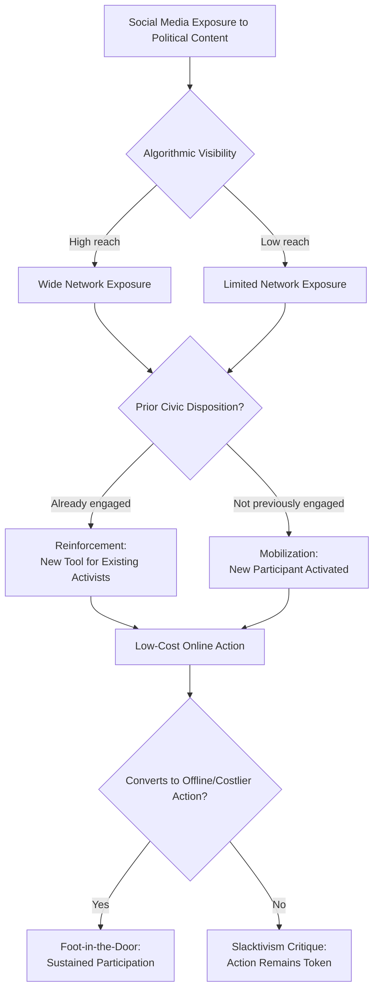

## Social Media and Political Participation

### Definitional Framework

Political participation refers to activities by ordinary citizens directed at influencing government, policy, or political outcomes — voting, protest, campaign work, contacting officials, and civic engagement more broadly (Verba, Schlozman, and Brady's classic formulation). Social media introduces new participatory modalities (liking, sharing, hashtag activism, online petitioning, crowdfunded political mobilization) while also mediating traditional participatory forms (event organization, information-seeking about candidates, campaign donation solicitation).

The core scholarly question organizing this literature is whether social media **mobilizes** previously inactive citizens into new forms of engagement, **reinforces** existing patterns of participation among the already-engaged, or produces participatory forms that are **substantively weaker** than offline equivalents despite superficially resembling political action.

### Theoretical Frameworks for Digital Participation

**Mobilization vs. Reinforcement Hypotheses**

- **Mobilization hypothesis**: social media lowers participation costs (information, coordination, time) enough to draw in citizens who would not otherwise participate, particularly younger or less resource-endowed citizens
- **Reinforcement hypothesis**: social media primarily provides new tools for citizens already disposed toward political engagement (higher education, prior civic skills, prior partisan interest), widening rather than narrowing participatory gaps

[Inference] The empirical literature does not resolve cleanly in favor of either hypothesis; findings vary by participatory form measured (online petition-signing shows different mobilization patterns than sustained offline volunteering, for instance) and by national/platform context, suggesting the mobilization/reinforcement balance may not be a single fixed empirical fact but rather contingent on the specific activity and population studied.

**Slacktivism / Clicktivism Critique**

A normatively loaded but widely used term describing low-cost, low-risk online political gestures (liking, sharing, changing a profile picture) argued by critics (notably Evgeny Morozov) to substitute for more substantive, higher-cost civic engagement while providing participants a sense of moral satisfaction disproportionate to actual impact. Counter-research (e.g., work by Kristofferson, White, and Peloza on token vs. costly support) finds mixed evidence: some studies show low-cost initial actions serve as a "foot in the door" toward later, more substantial engagement, while others find token public support can reduce subsequent willingness to engage in costlier action (moral licensing).

**Connective Action (Bennett and Segerberg, 2013)**

Distinguishes traditional **collective action** (requiring formal organizational coordination, shared identity framing, and resource mobilization through hierarchical organizations) from **connective action** (personalized, digitally networked action organized around easily shareable, individualized action frames — e.g., a hashtag — with minimal formal organizational coordination required). Connective action logic explains rapid, loosely coordinated mobilizations (e.g., Occupy Wall Street, various hashtag-driven movements) that lack traditional social-movement-organization structures.

**Networked Public Sphere (Yochai Benkler)**

Argues digital networks restructure Habermas's public sphere concept by lowering barriers to speech production (not just consumption), enabling many-to-many rather than one-to-many discourse — with contested implications for deliberative quality given simultaneous concerns about fragmentation and polarization (see Comparative Media Systems and Misinformation/Disinformation content for related discussion).

### Empirical Patterns in Digital Political Participation

**Hashtag Activism and Networked Movements**

Case studies extensively analyzed in the literature include #BlackLivesMatter, #MeToo, #ArabSpring-associated hashtags, and #FridaysForFuture — each illustrating rapid, decentralized issue-framing and mobilization capacity, alongside documented challenges around sustaining offline institutional follow-through, leadership diffusion/accountability, and vulnerability to counter-mobilization or co-optation.

**Digital Campaign Mobilization**

Social media enables microtargeted get-out-the-vote (GOTV) messaging, peer-to-peer social pressure techniques (e.g., displaying friends' voting status, following Gerber and Green's social-pressure GOTV experimental tradition adapted to digital contexts), and low-cost small-dollar fundraising infrastructure (exemplified by platforms enabling rapid, viral small-donor fundraising surges).

**Political Expression as Participation**

Scholars debate whether expressive online behavior (posting political opinions, arguing in comment sections) constitutes genuine political participation or a distinct category ("political talk") with different antecedents and consequences than instrumental participation aimed at influencing outcomes.

### Structural and Platform-Level Mechanisms

**Algorithmic Curation and Visibility**

Recommendation and ranking algorithms determine which political content receives amplification, meaning platform design choices (engagement optimization, virality mechanics) shape which participatory calls-to-action succeed independent of their underlying political merit or organizational strength — a mechanism distinct from, but related to, the algorithmic amplification dynamics discussed under Misinformation and Disinformation.

**Network Structure and Diffusion**

Participatory mobilization on social platforms follows documented network diffusion patterns — weak ties (Granovetter) are argued to be particularly important for spreading mobilization calls beyond dense, homogeneous existing networks, though strong ties remain important for converting awareness into sustained offline action.

**Platform Governance and Political Speech Rules**

Content moderation policies regarding political advertising, coordinated inauthentic behavior enforcement, and candidate-account rules (e.g., differential treatment of political figures' accounts) directly shape the participatory information environment, connecting this topic to platform governance debates covered under Digital Politics and Technology Governance more broadly.

### The Digital Divide and Participatory Inequality

**Access-Level Digital Divide**

Baseline disparities in internet/device access, still empirically significant across income, age, rurality, and cross-national development levels, constrain who can participate via digital channels at all.

**Skills-Level (Second-Level) Digital Divide**

Even among those with access, disparities in digital literacy, political efficacy, and technical skill shape who translates access into effective participation (van Dijk's multi-level digital divide framework).

**Participation Gap / Algorithmic Visibility Divide**

An emerging "third-level" concern in the literature regarding unequal algorithmic visibility — even technically skilled users may have unequal reach depending on platform algorithm behavior, follower network size, and monetization/verification status, raising equity concerns distinct from earlier access- and skills-based divides.

### Cross-National and Regime-Type Variation

**Democracies**

Social media participation research in established democracies focuses substantially on the mobilization/reinforcement question above and on polarization effects on discourse quality.

**Authoritarian and Hybrid Regimes**

A distinct literature examines social media's role in circumventing state media control (relevant to the Authoritarian Information Control topic) alongside documented state capacity to co-opt, surveil, or shut down digital participation (internet shutdowns during protests, state-sponsored troll operations targeting activists, platform compliance with government takedown requests). [Unverified] Whether social media's net effect in authoritarian contexts favors liberalization or regime resilience is contested in the literature — early "liberation technology" optimism (post-Arab Spring) has been substantially qualified by subsequent research documenting authoritarian adaptive capacity, and no single generalizable finding currently resolves this across the diversity of regime types studied.

### Comparative Table: Traditional vs. Digitally-Networked Participation

| Dimension | Traditional Collective Action | Digitally Networked (Connective) Action |
| --- | --- | --- |
| **Coordination requirement** | Formal organizations, hierarchical leadership | Minimal; personalized action frames, peer-to-peer sharing |
| **Entry cost** | Often higher (membership, meetings, sustained commitment) | Often lower (single click, share, hashtag use) |
| **Identity framing** | Collective identity emphasized ("we") | Personalized identity emphasized ("I") |
| **Speed of mobilization** | Typically slower, resource-dependent | Can be very rapid, viral-dependent |
| **Durability/follow-through** | Often more institutionally durable | Frequently criticized for weaker sustained follow-through |
| **Vulnerability** | Organizational infiltration, resource constraints | Platform algorithm dependency, rapid attention decay, co-optation |

### Extended Example: Applying the Frameworks to a Case

Consider a hypothetical local protest movement against a proposed policy that originates and spreads primarily via a trending hashtag:

- **Connective action lens**: the movement exhibits low formal organizational structure, relies on a shareable, personalized action frame (the hashtag), and mobilizes rapidly through peer networks — consistent with Bennett and Segerberg's model
- **Mobilization/reinforcement question**: empirical follow-up would need to determine whether hashtag participants are disproportionately drawn from already-civically-engaged populations (reinforcement) or represent genuinely new participants without prior offline activism history (mobilization)
- **Slacktivism critique applied**: a researcher skeptical of the movement's substance would examine whether hashtag engagement converts to costlier offline actions (attending a rally, contacting a representative) or remains confined to low-cost sharing — directly testable via the Kristofferson et al. foot-in-the-door vs. moral-licensing frameworks
- **Algorithmic visibility factor**: the movement's reach is partly contingent on platform algorithm behavior at the moment of posting, meaning identical organizational effort could produce very different participatory scale depending on engagement-optimization dynamics outside organizers' control

### Diagram: Pathways from Online Exposure to Political Participation

### Diagram: Digital Divide Levels Affecting Participation (svg_diagram)

<svg xmlns="http://www.w3.org/2000/svg" viewBox="0 0 640 300">
<text x="320" y="26" text-anchor="middle" font-size="16" font-weight="bold" fill="#1a1a1a">Multi-Level Digital Divide (svg_diagram)</text>
<rect x="60" y="60" width="520" height="60" rx="6" fill="#e8f0fe" stroke="#3b5bdb" stroke-width="1.5" />
<text x="320" y="85" text-anchor="middle" font-size="13" font-weight="bold" fill="#1a1a1a">First Level: Access Divide</text>
<text x="320" y="103" text-anchor="middle" font-size="11" fill="#495057">Internet/device access disparities</text>
<rect x="60" y="130" width="520" height="60" rx="6" fill="#fff3bf" stroke="#e8590c" stroke-width="1.5" />
<text x="320" y="155" text-anchor="middle" font-size="13" font-weight="bold" fill="#1a1a1a">Second Level: Skills Divide</text>
<text x="320" y="173" text-anchor="middle" font-size="11" fill="#495057">Digital literacy, political efficacy, technical skill</text>
<rect x="60" y="200" width="520" height="60" rx="6" fill="#ffe3e3" stroke="#e03131" stroke-width="1.5" />
<text x="320" y="225" text-anchor="middle" font-size="13" font-weight="bold" fill="#1a1a1a">Third Level: Algorithmic Visibility Divide</text>
<text x="320" y="243" text-anchor="middle" font-size="11" fill="#495057">Unequal reach regardless of access or skill</text>
<line x1="320" y1="120" x2="320" y2="130" stroke="#495057" stroke-width="2" marker-end="url(#arrowD)" />
<line x1="320" y1="190" x2="320" y2="200" stroke="#495057" stroke-width="2" marker-end="url(#arrowD)" />
<text x="320" y="285" text-anchor="middle" font-size="11" fill="`#495057`">Each level presumes but does not guarantee resolution of the level above it</text>

</svg>

### Key Points

- The mobilization vs. reinforcement debate remains empirically unresolved and appears contingent on participatory form and context rather than settled by a single generalizable finding
- Bennett and Segerberg's connective action framework distinguishes low-coordination, personalized digital mobilization from traditional organization-dependent collective action
- The slacktivism critique is empirically contested — low-cost actions sometimes serve as a gateway to further engagement (foot-in-the-door) and sometimes substitute for it (moral licensing)
- Algorithmic curation shapes which participatory calls-to-action gain visibility, introducing a structural mechanism independent of organizers' effort or message quality
- The digital divide operates at multiple levels — access, skills, and algorithmic visibility — each posing distinct barriers to effective digital participation
- Social media's net effect on participation in authoritarian contexts is contested, with early "liberation technology" optimism substantially qualified by subsequent evidence of authoritarian adaptive capacity

**Related Topics**

- Propaganda and Persuasion
- Misinformation and Disinformation
- Comparative Media Systems
- Platform Governance and Content Moderation
- Political Polarization and Selective Exposure
- Social Movement Theory and Collective Action
- Authoritarian Information Control and Digital Repression
- Digital Divide and Technology Access Policy
- Political Efficacy and Civic Engagement
- Election Campaigns and Digital Mobilization Strategy