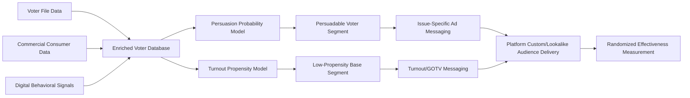

## Digital Campaigning and Microtargeting

### Definitional Framework

Digital campaigning refers to the use of internet-based tools and platforms — social media, email, search advertising, mobile applications, and data analytics infrastructure — to conduct political campaign functions: voter contact, persuasion, fundraising, mobilization, and organizational coordination. Microtargeting is a specific technique within digital campaigning: the use of granular data about individual voters (demographic, behavioral, consumer, and inferred psychological attributes) to segment the electorate into narrow subgroups and deliver tailored, differentiated political messages to each segment, rather than a single uniform message to a mass audience.

The core distinguishing feature of microtargeting relative to traditional mass-media political advertising is **message differentiation at the individual or small-cluster level**, made computationally feasible only by the availability of large-scale behavioral and transactional data combined with programmatic ad-delivery infrastructure.

### Historical Development

**Pre-Digital Antecedents**

Direct mail targeting based on voter file data (party registration, past voting frequency, geographic/demographic proxies) represents the pre-digital ancestor of microtargeting, used extensively in U.S. campaigns from the late 20th century onward, relying on commercially available consumer marketing data merged with public voter registration records.

**2004 and 2008 U.S. Campaigns**

The Bush 2004 re-election campaign is widely credited with popularizing systematic microtargeting in U.S. presidential politics, using consumer data clustering to identify persuadable voter segments beyond simple partisan identification. The Obama 2008 and especially 2012 campaigns significantly expanded data-driven targeting, building large proprietary voter databases and applying statistical modeling (individual-level support-probability scores) to prioritize both persuasion and turnout targeting.

**Social Media Platform Era (2012–present)**

The emergence of programmatic social media advertising infrastructure — Facebook's Custom Audiences and Lookalike Audiences, Google's advertising targeting stack — enabled campaigns to upload first-party voter lists and match them against platform user data, then algorithmically expand targeting to similar users, without requiring campaigns to build independent data-matching infrastructure.

**Cambridge Analytica and the Public Reckoning (2018)**

The Cambridge Analytica scandal — in which a political consulting firm obtained Facebook data on tens of millions of users without proper consent, reportedly building psychographic profiles for political targeting — became the primary public reference point for microtargeting controversy, triggering regulatory scrutiny, platform policy changes, and the U.S. FTC's subsequent enforcement action against Facebook. [Unverified] The actual persuasive effectiveness of the psychographic ("OCEAN"/Big Five personality-based) targeting methods Cambridge Analytica claimed to use remains disputed among researchers; some post-hoc academic analyses have questioned whether the firm's techniques worked as effectively as marketed, distinct from the separate and well-documented question of whether the underlying data was obtained improperly.

### Technical and Data Infrastructure

**Voter File Data**

Publicly available (in the U.S., varying by state) records including registration status, address, age, party affiliation (where registered), and historical voting participation (whether someone voted, not who they voted for) — the foundational dataset for most targeting operations.

**Data Append and Enhancement**

Campaigns and data vendors merge voter files with commercial consumer data (purchase history, magazine subscriptions, loyalty program data), publicly available records (property records, court records), and increasingly, digital behavioral data (browsing history via third-party data brokers, app usage signals) to build enriched individual-level profiles.

**Modeling Approaches**

- **Support/persuasion scores**: statistical models (commonly logistic regression or more recently ensemble/machine-learning classifiers) predicting an individual's likelihood of supporting a candidate or being persuadable on a specific issue
- **Turnout propensity scores**: separate models predicting likelihood of voting at all, used to prioritize GOTV (get-out-the-vote) resource allocation distinctly from persuasion targeting
- **Issue-priority clustering**: segmentation identifying which policy issues are most salient or persuasive to which voter clusters, enabling issue-specific message tailoring

**Platform-Side Targeting Mechanisms**

- **Custom Audiences**: campaigns upload their own contact lists (email, phone) which platforms match to existing user accounts
- **Lookalike Audiences**: platforms algorithmically identify users statistically similar to an uploaded seed audience, expanding reach beyond known supporters
- **Interest and behavioral targeting**: platform-inferred categories (based on page likes, engagement history, inferred interests) available for targeting independent of campaign-uploaded data
- **Geofencing and geo-targeting**: location-based targeting, sometimes at highly granular levels (e.g., targeting devices present at a specific rally or venue)

### Persuasion vs. Mobilization Targeting

A key operational distinction within campaign targeting strategy:

| Targeting Type | Goal | Typical Audience | Typical Message |
| --- | --- | --- | --- |
| **Persuasion targeting** | Shift attitudes/vote choice among undecided or weakly-aligned voters | Moderate/swing voters, low-propensity partisans | Issue-specific, tailored to identified concerns |
| **Mobilization (GOTV) targeting** | Increase turnout probability among likely supporters | Base voters with lower turnout propensity | Turnout logistics, social pressure, deadline reminders |
| **Base reinforcement** | Strengthen enthusiasm/fundraising among committed supporters | High-propensity partisans | Fundraising appeals, volunteer recruitment |

### Effectiveness: Empirical Research Findings

**General Persuasion Effects**

A substantial body of field-experimental research on political persuasion (notably Kalla and Broockman's meta-analyses of campaign contact experiments) finds that the persuasive effects of campaign advertising and contact — including digital and microtargeted forms — are generally small on average, often statistically indistinguishable from zero in general election contexts, with somewhat larger effects documented in low-salience primary or ballot-initiative contexts where voters hold weaker prior attitudes.

**Mobilization/Turnout Effects**

Turnout-focused digital and social-pressure messaging has more consistently documented, though still modest, positive effects in the experimental literature, building on the broader Gerber-Green tradition of GOTV field experiments extended to digital contexts.

[Inference] The gap between the substantial public and journalistic attention paid to microtargeting's persuasive power and the comparatively modest effect sizes documented in rigorous field experiments suggests that microtargeting's practical value to campaigns may derive as much from **efficiency gains** (reducing wasted spend on non-persuadable audiences, improving message-audience fit) as from large persuasive effects per contact — though this remains an inference rather than a directly measured finding in the literature reviewed here.

### Privacy, Ethics, and Regulatory Frameworks

**Data Privacy Regulation**

- **GDPR (EU)**: imposes consent and data-processing restrictions directly relevant to political data collection and ad targeting within EU jurisdiction, including specific protections for data revealing political opinions as a "special category"
- **CCPA/CPRA (California)** and similar U.S. state-level laws: provide more limited but growing consumer data rights relevant to political data brokers
- **Absence of comprehensive U.S. federal privacy law**: [Unverified] as of the most recent developments available, the U.S. lacks a comprehensive federal data privacy statute comparable to GDPR, leaving political data practices governed by a patchwork of state laws and platform self-regulation — given the pace of legislative activity in this area, this status should be verified against current sources for any time-sensitive application

**Platform Political Advertising Policies**

Major platforms have adopted varying and evolving policies on political ad transparency (public ad libraries disclosing sponsor and spend), targeting restrictions (e.g., some platforms have restricted granular targeting specifically for political ads), and outright political advertising bans (some platforms banning political advertising entirely) — policies that have shifted substantially over time and vary significantly by platform.

**Normative Critiques**

- **Manipulation concern**: granular targeting may enable messages calibrated to individual psychological vulnerabilities rather than genuine persuasive argument, raising concerns distinct from traditional mass persuasion (connecting to the Propaganda and Persuasion peripheral-route discussion)
- **Fragmentation of public discourse**: because microtargeted messages are less publicly visible than mass advertising, they are less subject to journalistic fact-checking, opposition rebuttal, or public accountability — sometimes termed the "dark ads" problem
- **Discriminatory targeting/exclusion concern**: the same infrastructure that enables precise inclusion also enables precise exclusion of specific demographic groups from receiving certain messages or opportunities, raising civil-rights-adjacent concerns studied particularly in the housing/employment ad-targeting context and analogically relevant to political contexts

### Digital Campaigning Beyond Microtargeting

**Programmatic and Search Advertising**

Automated real-time bidding for ad placement across websites and search results, allowing campaigns to bid for visibility against specific search terms or website audiences at scale.

**SMS and Relational Organizing Tools**

Peer-to-peer texting platforms and relational organizing apps (which prompt supporters to contact people in their own personal networks rather than relying solely on campaign-to-voter contact) represent a growing category distinct from pure microtargeted advertising, leveraging social-network trust dynamics.

**Influencer and Creator Partnerships**

Increasing campaign investment in paid or organic partnerships with social media influencers/content creators, blending campaign messaging with creator-native content formats — an area of rapidly evolving practice with comparatively less rigorous effectiveness research than traditional advertising channels.

### Extended Example: A Microtargeting Campaign Workflow

1. **Data assembly**: campaign merges state voter file with commercial data append and digital behavioral signals to build an enriched voter database
2. **Modeling**: a persuasion-probability model identifies a segment of registered independents in a specific region who show above-average likelihood of being persuadable on a healthcare-related issue, distinct from a separate turnout model identifying low-propensity base-party voters
3. **Message differentiation**: the persuadable-independent segment receives issue-focused digital ads emphasizing healthcare policy specifics; the low-propensity base segment instead receives turnout-logistics messaging (voting deadlines, polling locations) with minimal persuasive argument content
4. **Platform execution**: the campaign uploads segment-specific contact lists as Custom Audiences to a social platform, and separately builds a Lookalike Audience from its highest-confidence persuadable-independent seed list to extend reach
5. **Measurement**: the campaign runs a randomized geographic or individual-level holdout experiment to estimate incremental persuasion/turnout lift attributable to the targeted messaging, consistent with the field-experimental methodology underlying the Kalla-Broockman research tradition

### Diagram: Microtargeting Campaign Data Pipeline

### Diagram: Persuasion vs. Mobilization Targeting Logic (svg_diagram)

<svg xmlns="http://www.w3.org/2000/svg" viewBox="0 0 640 300">
<text x="320" y="26" text-anchor="middle" font-size="16" font-weight="bold" fill="#1a1a1a">Persuasion vs. Mobilization Targeting (svg_diagram)</text>
<line x1="80" y1="260" x2="580" y2="260" stroke="#495057" stroke-width="2" marker-end="url(#arrowM)" />
<line x1="80" y1="260" x2="80" y2="60" stroke="#495057" stroke-width="2" marker-end="url(#arrowN)" />
<text x="330" y="282" text-anchor="middle" font-size="11" fill="#495057">Partisan Alignment (weak → strong)</text>
<text x="45" y="160" text-anchor="middle" font-size="11" fill="#495057" transform="rotate(-90 45 160)">Turnout Propensity (low → high)</text>
<rect x="100" y="80" width="180" height="90" fill="#fff3bf" stroke="#e8590c" stroke-width="1.5" rx="6" />
<text x="190" y="115" text-anchor="middle" font-size="12" font-weight="bold" fill="#1a1a1a">Persuasion Target</text>
<text x="190" y="133" text-anchor="middle" font-size="10" fill="#495057">Weak alignment,</text>
<text x="190" y="148" text-anchor="middle" font-size="10" fill="#495057">low turnout propensity</text>
<rect x="360" y="180" width="180" height="60" fill="#d3f9d8" stroke="#2f9e44" stroke-width="1.5" rx="6" />
<text x="450" y="205" text-anchor="middle" font-size="12" font-weight="bold" fill="#1a1a1a">Base Reinforcement</text>
<text x="450" y="223" text-anchor="middle" font-size="10" fill="#495057">Strong alignment, high propensity</text>
<rect x="360" y="80" width="180" height="60" fill="#e8f0fe" stroke="#3b5bdb" stroke-width="1.5" rx="6" />
<text x="450" y="105" text-anchor="middle" font-size="12" font-weight="bold" fill="#1a1a1a">GOTV / Mobilization</text>
<text x="450" y="123" text-anchor="middle" font-size="10" fill="#495057">Strong alignment, low propensity</text>
</svg>

### Key Points

- Microtargeting is defined by individual/small-cluster message differentiation, enabled by merged voter file, commercial, and behavioral data combined with programmatic ad platforms
- Persuasion targeting, mobilization/GOTV targeting, and base reinforcement represent distinct operational goals requiring different modeling approaches and message content
- Rigorous field-experimental research generally finds small average persuasion effects from campaign contact, including digital targeting, with somewhat larger and more consistent turnout effects
- The Cambridge Analytica scandal became the primary public reference point for microtargeting controversy, though the actual effectiveness of its specific psychographic methods remains academically disputed separately from the well-documented data-consent violations
- "Dark ads" reduce public and journalistic visibility of targeted political messaging compared to mass-media advertising, limiting external accountability mechanisms
- Regulatory frameworks vary substantially by jurisdiction (GDPR's special-category protection for political opinion data vs. the more fragmented U.S. approach), and platform self-regulation of political ad targeting has shifted considerably over time

**Related Topics**

- Social Media and Political Participation
- Propaganda and Persuasion
- Misinformation and Disinformation
- Platform Governance and Content Moderation
- Data Privacy Law and Political Data Regulation
- Campaign Finance and Digital Fundraising
- Voter Behavior and Turnout Field Experiments
- Political Advertising Transparency and Regulation
- Algorithmic Accountability in Political Contexts
- Comparative Election Campaign Regulation