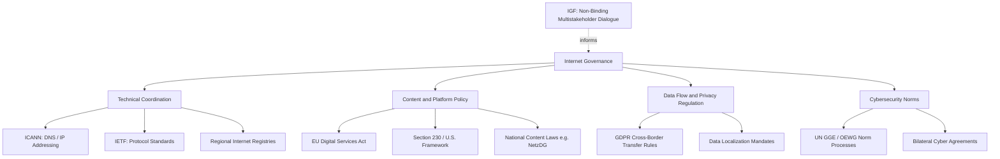

## Internet Governance

### Definitional Framework

Internet governance refers to the development and application of shared principles, norms, rules, decision-making procedures, and programs that shape the evolution and use of the internet — spanning technical infrastructure (domain names, IP addressing, protocol standards), content and platform policy, cybersecurity, and digital economic regulation. The Tunis Agenda (2005), produced by the World Summit on the Information Society, remains a widely cited formal definition emphasizing that governance involves governments, the private sector, and civil society, each playing appropriate roles — a formulation that established the "multistakeholder" framing central to subsequent debate.

Internet governance is distinguished from general technology policy by its focus on the internet's foundational coordination problems: who controls naming and addressing, how cross-border data flows are regulated, how technical standards are set, and how authority over a fundamentally transnational infrastructure is allocated among sovereign states, private firms, technical bodies, and civil society.

### The Multistakeholder Model

**Core Concept**

The dominant governance paradigm for internet-specific technical coordination holds that governments, private sector actors, technical/academic communities, and civil society should participate jointly in governance decisions, rather than governance being the exclusive domain of state actors (as in most traditional international regimes) or being left purely to market actors.

**Institutional Embodiments**

- **ICANN (Internet Corporation for Assigned Names and Numbers)**: a California-based nonprofit responsible for coordinating the Domain Name System (DNS), IP address allocation (via regional registries), and root server system policy, governed through a multistakeholder structure involving a Governmental Advisory Committee, technical community representatives, and public comment processes
- **IETF (Internet Engineering Task Force)**: the primary body developing internet technical standards and protocols (TCP/IP-era and beyond) through an open, rough-consensus, working-code-oriented process rather than formal state-based voting
- **IGF (Internet Governance Forum)**: a UN-convened multistakeholder discussion forum (established following the 2005 World Summit on the Information Society) that produces non-binding dialogue rather than binding rules — an explicit design choice reflecting the difficulty of achieving binding multistakeholder consensus on contested issues
- **Regional Internet Registries (RIRs)**: five regional bodies (ARIN, RIPE NCC, APNIC, LACNIC, AFRINIC) managing IP address allocation within defined geographic scopes

**The IANA Transition (2016)**

A landmark case in multistakeholder governance history: the U.S. government's National Telecommunications and Information Administration (NTIA) formally transferred its historical oversight role over the IANA functions (the technical DNS root-zone management function) to the global multistakeholder community in October 2016, ending direct U.S. government contractual oversight that had existed since the internet's early infrastructure development. This transition was framed by proponents as completing the internet's transition to genuinely global multistakeholder governance and was contested by critics who argued it risked ceding influence to authoritarian state actors within multistakeholder forums.

### Competing Governance Models

**Multistakeholder vs. Multilateral Governance**

The central and long-running fault line in internet governance debates:

| Model | Core Claim | Key Proponents (Historically) |
| --- | --- | --- |
| **Multistakeholder** | Technical/civil-society/private-sector actors should have direct governance roles alongside states | United States, much of the technical community, many Western democracies, civil society organizations |
| **Multilateral (state-centric)** | Internet governance should occur primarily or exclusively through traditional intergovernmental bodies (e.g., a UN-agency framework) with states as the primary decision-making unit | Historically advanced by Russia, China, and a coalition of developing states seeking a more state-centric ITU-based framework, particularly visible in debates at the 2012 World Conference on International Telecommunications |

[Inference] This divide reflects deeper disagreements about internet governance legitimacy — multistakeholder proponents argue technical and civil-society expertise improves outcomes and prevents capture by any single government, while multilateral proponents argue only formal state sovereignty provides democratic legitimacy and accountability — and the debate has not been definitively resolved at the level of global institutional design, with different regimes continuing to advocate for their preferred model in ongoing forums.

**Digital Sovereignty and Cyber-Sovereignty**

An alternative framing, most closely associated with China's internet governance approach (articulated around the concept of "internet sovereignty" or *wangluo zhuquan*), asserting that states retain full sovereign authority over the internet infrastructure and content within their territorial jurisdiction, including rights to filter, monitor, and control domestic internet access largely independent of transnational multistakeholder norms.

### Key Substantive Governance Domains

**Data Localization and Cross-Border Data Flows**

Requirements that data generated within a jurisdiction be stored and/or processed within that jurisdiction's borders, driven variously by privacy protection rationales (EU-style), national security/law enforcement access rationales, or economic protectionism rationales (favoring domestic data infrastructure providers). The EU's GDPR imposes conditions on cross-border data transfer (adequacy decisions, standard contractual clauses) without mandating full localization, representing a middle position between free data flow and strict localization mandates.

**Platform Content Regulation**

- **EU Digital Services Act (DSA)**: imposes tiered content moderation, transparency, and risk-assessment obligations on platforms operating in the EU, with heightened obligations for "very large online platforms"
- **Germany's NetzDG**: an earlier national law imposing takedown-timeline requirements on platforms for clearly illegal content, often cited as an influential (and controversial) model subsequently referenced by other jurisdictions' legislative efforts
- **Section 230 (U.S.)**: a foundational U.S. legal provision generally shielding platforms from liability for user-generated content, representing a substantially more permissive regulatory baseline than the EU approach and itself the subject of ongoing U.S. legislative and judicial reconsideration

**Network Neutrality**

The principle that internet service providers should treat all data traffic equally, without discriminating or charging differentially based on content, application, user, or platform. Regulatory status varies significantly by jurisdiction and has shifted over time even within single jurisdictions (e.g., U.S. net neutrality rules have been adopted, repealed, and revisited across different regulatory administrations), reflecting contested views on whether ISPs should be regulated as common carriers.

**Cybersecurity Governance**

Overlaps substantially with international security studies but is distinct in its internet-governance dimension: coordination on vulnerability disclosure norms, critical infrastructure protection standards, cross-border incident response cooperation, and contested efforts toward binding international cyber-norms (e.g., UN Group of Governmental Experts and Open-Ended Working Group processes addressing state behavior in cyberspace).

**Internet Fragmentation ("Splinternet")**

A descriptive and normative concern that divergent national regulatory approaches, content filtering, and technical standards may be fragmenting the historically unified global internet into distinct national or regional internets with differing accessible content, technical standards, or platform availability — with China's Great Firewall representing the most extensively documented case of comprehensive national internet fragmentation.

### Internet Governance vs. Related Concepts

| Concept | Distinguishing Focus |
| --- | --- |
| **Internet governance** | Coordination of internet-specific infrastructure, standards, and cross-cutting policy issues |
| **Cybersecurity policy** | Focuses specifically on protecting systems/data from attack; a substantive domain within internet governance |
| **Platform governance** | Focuses specifically on private platform companies' content/data policies; a substantive domain within internet governance, increasingly treated as a distinct subfield |
| **Digital sovereignty/cyber-sovereignty** | A normative position within internet governance debates, not a governance mechanism itself |
| **Technology policy (general)** | Broader category including internet governance alongside non-internet-specific technology regulation (e.g., AI policy, biotechnology regulation) |

### Extended Example: Governance Layers in a Cross-Border Data Dispute

Consider a hypothetical dispute in which a social media platform headquartered in Country A stores user data on servers in Country B, while Country C's law enforcement seeks access to a user's data for a domestic criminal investigation:

- **Technical layer**: ICANN/IETF-coordinated protocols determine how the request is technically routed and how the platform's domain/infrastructure functions, but these technical bodies have no jurisdiction over the legal dispute itself
- **Legal/jurisdictional layer**: Country C's ability to compel data production depends on mutual legal assistance treaties (MLATs), any applicable cross-border data-access agreements (e.g., the U.S. CLOUD Act framework, which allows certain bilateral agreements enabling direct law-enforcement data requests bypassing traditional MLAT processes), and Country B's data localization or sovereignty laws potentially restricting extraterritorial access
- **Platform governance layer**: the platform's own content and data-request policies (published transparency reports, internal legal review processes) mediate whether and how it responds, operating within but not fully determined by the legal layer
- **Normative/multistakeholder layer**: broader debates about appropriate cross-border data governance norms (reflected in IGF discussions, academic and civil-society advocacy) shape the longer-term legal and policy environment in which such disputes are eventually resolved through treaty-making or domestic legislation

### Diagram: Internet Governance Institutional Landscape

### Diagram: Multistakeholder vs. Multilateral Governance Axis (svg_diagram)

<svg xmlns="http://www.w3.org/2000/svg" viewBox="0 0 640 260">
<text x="320" y="26" text-anchor="middle" font-size="16" font-weight="bold" fill="#1a1a1a">Governance Model Spectrum (svg_diagram)</text>
<line x1="60" y1="140" x2="580" y2="140" stroke="#495057" stroke-width="3" />
<circle cx="120" cy="140" r="9" fill="#3b5bdb" />
<text x="120" y="170" text-anchor="middle" font-size="12" font-weight="bold" fill="#1a1a1a">Multistakeholder</text>
<text x="120" y="188" text-anchor="middle" font-size="10" fill="#495057">ICANN, IETF, IGF model</text>
<text x="120" y="204" text-anchor="middle" font-size="10" fill="#495057">Tech community + civil society</text>
<text x="120" y="220" text-anchor="middle" font-size="10" fill="#495057">+ private sector + states</text>
<circle cx="320" cy="140" r="9" fill="#e8b339" />
<text x="320" y="170" text-anchor="middle" font-size="12" font-weight="bold" fill="#1a1a1a">Hybrid / Contested</text>
<text x="320" y="188" text-anchor="middle" font-size="10" fill="#495057">EU regulatory approach,</text>
<text x="320" y="204" text-anchor="middle" font-size="10" fill="#495057">ongoing IANA-transition-era debates</text>
<circle cx="520" cy="140" r="9" fill="#c92a2a" />
<text x="520" y="170" text-anchor="middle" font-size="12" font-weight="bold" fill="#1a1a1a">State-Centric / Multilateral</text>
<text x="520" y="188" text-anchor="middle" font-size="10" fill="#495057">Cyber-sovereignty framing,</text>
<text x="520" y="204" text-anchor="middle" font-size="10" fill="#495057">ITU-based intergovernmental proposals</text>

<text x="320" y="245" text-anchor="middle" font-size="11" fill="`#495057`">Positions are contested and actively advocated by different state and non-state coalitions</text>

</svg>

### Key Points

- Internet governance spans technical coordination (DNS, IP addressing, protocols), content/platform policy, data flow regulation, and cybersecurity norms
- The multistakeholder model — joint governance by states, private sector, technical community, and civil society — is the dominant paradigm for internet-specific technical coordination, institutionalized through ICANN, IETF, and the IGF
- The 2016 IANA transition ended direct U.S. government oversight of DNS root-zone functions, a landmark and contested event in multistakeholder governance history
- The multistakeholder vs. multilateral (state-centric) divide remains the central unresolved fault line in global internet governance debates, closely tied to competing digital sovereignty framings
- Substantive governance domains — data localization, platform content regulation, network neutrality, cybersecurity norm-building — each exhibit significant jurisdictional variation without a single unified global regulatory framework
- Internet fragmentation ("splinternet") describes concern that divergent national regulatory and technical approaches are eroding the internet's historical global unity, with China's comprehensive filtering infrastructure as the most extensively documented case

**Related Topics**

- Digital Campaigning and Microtargeting
- Platform Governance and Content Moderation
- Authoritarian Information Control and Digital Repression
- Cybersecurity and International Security Studies
- Data Privacy Law and Cross-Border Regulation
- Global Governance and International Institutions
- Digital Sovereignty and Techno-Nationalism
- Comparative Technology Regulation (EU, US, China)
- Global Digital Divide and Development Policy
- International Law and Emerging Technology Norms