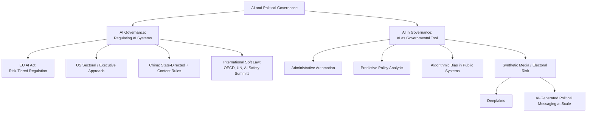

## Artificial Intelligence and Political Governance

### Definitional Framework

AI and political governance encompasses two analytically distinct but interconnected areas: (1) **AI governance** — the political and regulatory frameworks states and international bodies develop to oversee the development, deployment, and risks of artificial intelligence systems; and (2) **AI in governance** — the use of AI systems themselves as tools within governmental and political decision-making processes, including administrative automation, predictive policy analysis, algorithmic public service delivery, and political communication applications.

This topic sits at the intersection of technology policy, public administration, and democratic theory, raising questions distinct from earlier internet governance debates because AI systems' opacity, autonomy in decision-making, and capacity for large-scale behavioral influence introduce governance challenges not fully addressed by prior digital-technology regulatory frameworks.

### AI Governance: Regulatory Approaches

**Risk-Based Regulation: The EU AI Act**

The European Union's AI Act (formally adopted 2024, with phased implementation through 2026–2027) established the most comprehensive AI-specific regulatory framework to date, organizing obligations around a tiered risk classification:

- **Unacceptable risk**: practices banned outright (e.g., social scoring by public authorities, certain forms of real-time biometric identification in public spaces, subject to narrow law-enforcement exceptions)
- **High risk**: AI systems used in specified sensitive domains (critical infrastructure, employment, law enforcement, migration, education, essential public/private services) subject to conformity assessment, risk management, and transparency obligations
- **Limited risk**: systems (e.g., chatbots, deepfake generators) subject to transparency obligations — users must be informed they are interacting with an AI system or viewing synthetic content
- **Minimal risk**: the large majority of AI applications, largely unregulated beyond voluntary codes of conduct

[Unverified] Given the AI Act's staggered implementation timeline, specific enforcement provisions and guidance documents continue to be finalized on an ongoing basis; any application requiring current compliance status should be verified against the European Commission's current published guidance rather than treated as fixed.

**Sectoral and Executive-Action Approaches: United States**

The U.S. approach has historically relied more heavily on sectoral regulation (applying existing agency authority — FTC consumer protection law, existing civil rights statutes — to AI applications within their jurisdiction) and executive branch action rather than comprehensive AI-specific statute, reflecting the broader U.S. preference for narrower, sector-specific regulation relative to the EU's more comprehensive approach (a pattern consistent with the Comparative Media Systems liberal-model tendency toward lighter-touch formal regulation). [Unverified] U.S. federal AI policy has been an area of unusually rapid change across recent administrations; the specific current regulatory posture (executive orders, agency guidance, any pending federal legislation) should be verified against current sources given the pace of change in this area.

**State-Directed Development Model: China**

China's approach combines substantial state direction of AI industrial strategy (positioning AI development as a national strategic priority) with simultaneous content-specific regulation (e.g., requirements governing generative AI content, algorithmic recommendation transparency requirements, deep synthesis/deepfake labeling requirements), reflecting the broader cyber-sovereignty governance philosophy discussed under Internet Governance.

**International and Multilateral AI Governance Efforts**

- **OECD AI Principles** (2019, updated 2024): among the earliest widely-adopted international AI governance principles, emphasizing human rights, transparency, and accountability, subsequently referenced by the G20
- **UN efforts**: including a UN General Assembly resolution on AI (2024) and ongoing discussions toward more binding international coordination, reflecting similar multistakeholder-vs-multilateral tensions present in broader internet governance debates
- **Bletchley Declaration and AI Safety Summits**: a series of international summits (beginning at Bletchley Park, UK, in 2023, with subsequent summits in South Korea and France) focused specifically on frontier AI safety risks, producing non-binding declarations and establishing AI Safety Institutes in several countries

### AI in Governance: Applications and Concerns

**Administrative and Public Service Automation**

Governments increasingly deploy AI/algorithmic systems for tasks including benefits eligibility determination, fraud detection, risk scoring in criminal justice (recidivism prediction tools), and administrative document processing. Documented controversies (e.g., the Netherlands' childcare benefits scandal involving algorithmic fraud-detection systems that disproportionately and wrongly flagged families, partly along ethnic lines, leading to a government resignation in 2021) illustrate core accountability risks in this domain.

**Predictive Policy Analysis**

AI-assisted forecasting and scenario modeling applied to policy domains (economic forecasting, public health modeling, climate policy scenario planning) raises distinct governance questions about model transparency, the appropriate role of algorithmic output in political decision-making, and risks of technocratic legitimation (using model outputs to foreclose political debate about value-laden tradeoffs that are not purely technical).

**Algorithmic Bias and Discrimination in Governmental Use**

A substantial body of research (e.g., Buolamwini and Gebru's work on facial recognition accuracy disparities across demographic groups) documents that AI systems can encode and amplify existing societal biases present in training data, with particular governance salience when such systems are deployed in high-stakes public contexts (policing, benefits determination, hiring for public roles) where errors carry direct rights implications.

**AI and Electoral/Political Communication Risks**

- **Synthetic media and deepfakes**: AI-generated audio, video, and image content capable of realistically depicting public figures saying or doing things that did not occur, raising acute risks for electoral disinformation (connecting directly to the Misinformation and Disinformation and Propaganda and Persuasion content), with several documented instances of AI-generated political content circulating during recent election cycles globally
- **AI-generated political messaging at scale**: large language models enable low-cost generation of persuasive political content, personalized messaging, and potentially large-scale coordinated inauthentic content production, raising concerns about an evolution of the computational propaganda dynamics discussed earlier in this chapter
- **AI-assisted campaign operations**: candidate use of AI tools for constituent communication drafting, opposition research synthesis, and campaign strategy analysis, an area of rapidly evolving practice with limited systematic effectiveness or governance research to date

### Theoretical and Normative Frameworks

**Algorithmic Accountability**

A framework emphasizing that automated decision-making systems used in governmental or high-stakes contexts should be subject to mechanisms analogous to traditional administrative accountability — explainability, contestability (ability to appeal an algorithmic decision), auditability, and clear lines of human responsibility — reflecting broader administrative law principles applied to a new decision-making modality.

**Technological Determinism vs. Social Construction of Technology**

A longer-standing science and technology studies debate directly relevant to AI governance framing: technological determinist perspectives treat AI's societal effects as substantially fixed by the technology's inherent properties, while social construction perspectives emphasize that AI's political and social effects are substantially shaped by the institutional, regulatory, and design choices made around its deployment — a framing distinction with direct implications for whether governance intervention is seen as capable of meaningfully shaping outcomes.

**Governance of "Frontier AI" and Existential/Catastrophic Risk Framing**

A distinct strand of AI governance discourse, more prominent in AI-safety-focused policy communities, focuses on potential large-scale or catastrophic risks from highly capable future AI systems, motivating governance proposals (compute governance, model evaluation requirements before deployment, international coordination on frontier model development) distinct from the more established algorithmic-fairness and accountability governance strand focused on present-day deployed systems. [Unverified] The relative policy weight and empirical grounding of catastrophic-risk framing versus present-harm framing is a matter of significant and ongoing debate within the AI governance research and policy community, without settled consensus on prioritization.

### Comparative Regulatory Approaches Table

| Jurisdiction | Regulatory Philosophy | Key Instrument | Primary Emphasis |
| --- | --- | --- | --- |
| **European Union** | Comprehensive, risk-tiered, ex-ante regulation | AI Act | Rights protection, prohibited-use categories, conformity assessment |
| **United States** | Sectoral, agency-based, executive action | Existing agency authority + executive orders | Innovation-preserving, case-by-case sectoral application |
| **China** | State-directed development + content-specific rules | Generative AI / algorithm regulations | Industrial strategy alignment + content/information control |
| **International bodies (OECD, UN)** | Non-binding principles and coordination fora | AI Principles, UN resolutions | Soft-law norm-setting, cross-national coordination |

### Extended Example: Governance Response to a Synthetic Media Incident

Consider a hypothetical scenario in which an AI-generated deepfake video depicting a candidate making inflammatory statements circulates rapidly on social media shortly before an election:

- **Platform governance layer**: the platform's synthetic-media labeling and takedown policies (connecting to Internet Governance's platform-regulation content) determine initial content moderation response speed and effectiveness
- **AI-specific regulatory layer**: under a framework like the EU AI Act's transparency obligations for synthetic content, the content's failure to carry required AI-disclosure labeling would itself constitute a separate compliance violation independent of its political content
- **Electoral law layer**: some jurisdictions have adopted election-specific synthetic media disclosure or restriction laws (a rapidly evolving area across U.S. states and other jurisdictions) creating an additional, election-specific legal layer beyond general AI or platform regulation
- **Computational propaganda dynamics**: the incident's spread pattern (viral amplification, potential coordinated inauthentic sharing) would be analyzable using the same diffusion frameworks discussed under Misinformation and Disinformation, now applied to AI-generated rather than traditionally fabricated content
- **Democratic legitimacy concern**: even after correction, the continued influence effect (discussed under Misinformation and Disinformation) suggests residual reputational damage may persist among portions of the electorate regardless of subsequent debunking — a concern motivating proposals for pre-election "cooling off" disclosure requirements in some jurisdictions

### Diagram: AI Governance Domains and Instruments

### Diagram: EU AI Act Risk Tiers (svg_diagram)

<svg xmlns="http://www.w3.org/2000/svg" viewBox="0 0 640 320">
<text x="320" y="26" text-anchor="middle" font-size="16" font-weight="bold" fill="#1a1a1a">EU AI Act Risk Classification Pyramid (svg_diagram)</text>
<polygon points="320,50 420,120 220,120" fill="#c92a2a" />
<text x="320" y="95" text-anchor="middle" font-size="11" fill="#ffffff" font-weight="bold">Unacceptable Risk</text>
<text x="320" y="110" text-anchor="middle" font-size="9" fill="#ffffff">Banned outright</text>
<polygon points="220,120 420,120 460,190 180,190" fill="#e8590c" />
<text x="320" y="150" text-anchor="middle" font-size="11" fill="#ffffff" font-weight="bold">High Risk</text>
<text x="320" y="166" text-anchor="middle" font-size="9" fill="#ffffff">Conformity assessment, transparency</text>
<text x="320" y="180" text-anchor="middle" font-size="9" fill="#ffffff">(employment, law enforcement, etc.)</text>
<polygon points="180,190 460,190 500,250 140,250" fill="#e8b339" />
<text x="320" y="215" text-anchor="middle" font-size="11" fill="#1a1a1a" font-weight="bold">Limited Risk</text>
<text x="320" y="231" text-anchor="middle" font-size="9" fill="#1a1a1a">Disclosure obligations (chatbots, deepfakes)</text>
<polygon points="140,250 500,250 540,300 100,300" fill="#d3f9d8" />
<text x="320" y="275" text-anchor="middle" font-size="11" fill="#1a1a1a" font-weight="bold">Minimal Risk</text>
<text x="320" y="291" text-anchor="middle" font-size="9" fill="#1a1a1a">Largely unregulated; voluntary codes</text>
</svg>

### Key Points

- AI and political governance spans regulating AI systems (AI governance) and using AI within governmental decision-making (AI in governance) — distinct but interconnected problem spaces
- The EU AI Act's risk-tiered model (unacceptable/high/limited/minimal risk) represents the most comprehensive current regulatory framework, contrasted with the U.S.'s sectoral/executive-action approach and China's state-directed-development-plus-content-control model
- Documented cases (e.g., the Netherlands childcare benefits algorithm scandal) illustrate concrete accountability risks when automated systems are deployed in high-stakes governmental decision-making
- Synthetic media/deepfakes introduce electoral risks that extend and intensify concerns already established under propaganda, disinformation, and computational-propaganda research
- Algorithmic accountability frameworks emphasize explainability, contestability, auditability, and clear human responsibility as governance requirements for automated decision systems
- Catastrophic/frontier-risk framing and present-harm/algorithmic-fairness framing represent two distinct, actively debated strands within the AI governance policy and research community, without settled consensus on relative prioritization
- Given the pace of regulatory change in this domain, specific compliance and policy details should be verified against current sources rather than treated as fixed reference facts

**Related Topics**

- Internet Governance
- Digital Campaigning and Microtargeting
- Misinformation and Disinformation
- Propaganda and Persuasion
- Platform Governance and Content Moderation
- Algorithmic Bias and Discrimination in Public Policy
- Comparative Technology Regulation (EU, US, China)
- Democratic Theory and Technocratic Legitimacy
- Public Administration and Administrative Law
- Global AI Safety Governance and International Coordination