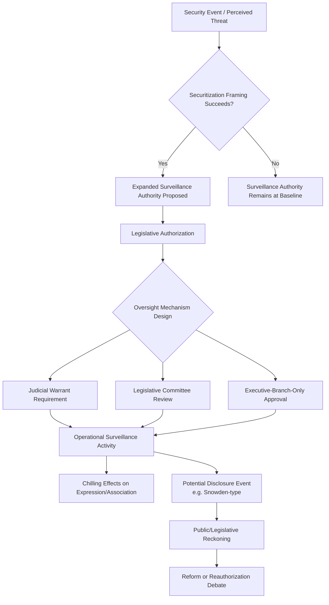

## Surveillance, Privacy, and the State

### Definitional Framework

State surveillance refers to the systematic collection, monitoring, and analysis of information about individuals or populations by governmental authorities, historically for purposes including national security, law enforcement, taxation, and public administration, and increasingly enabled by digital data infrastructure. Privacy, in political theory, is typically understood not merely as secrecy but as a form of control over information about oneself and the boundary conditions of one's exposure to others — a conception central to why surveillance raises distinct political concerns beyond simple data collection.

The core normative tension organizing this subfield is between legitimate state interests (security, crime prevention, effective administration) and individual/collective interests in autonomy, dissent, and freedom from unwarranted state intrusion — a tension that political and legal theory treats as a matter of degree and institutional design rather than a binary choice between surveillance and its absence.

### Theoretical Foundations

**Panopticism (Bentham/Foucault)**

Jeremy Bentham's 18th-century Panopticon prison design — architecture enabling a single observer to potentially watch all inmates without inmates knowing whether they are being watched at any given moment — was extended by Michel Foucault (*Discipline and Punish*, 1975) into a broader theory of disciplinary power: the mere *possibility* of being observed induces self-regulation and behavioral conformity independent of whether observation is actually occurring. This theoretical lineage remains the most frequently invoked framework for understanding surveillance's political effects on behavior, extended by contemporary scholars to digital contexts (sometimes termed the "digital panopticon" or "algorithmic panopticon").

**Surveillance Capitalism (Shoshana Zuboff)**

Zuboff's *The Age of Surveillance Capitalism* (2019) argues that a distinct economic logic has emerged in which private commercial actors (not only states) extract behavioral data as a raw material, using it to predict and increasingly to shape human behavior for profit — a framework that reoriented much surveillance scholarship toward private-sector data practices as a governance concern in their own right, and toward the state's role in either regulating or benefiting from (via data purchase or compelled access) this private-sector infrastructure.

**Chilling Effects Theory**

A body of legal and empirical research (extending from First Amendment jurisprudence in the U.S. context but studied more broadly) examining how awareness or suspicion of surveillance measurably suppresses lawful expression, association, and information-seeking behavior even absent any actual enforcement action — documented empirically in studies following the 2013 Snowden disclosures showing measurable declines in certain categories of internet search and Wikipedia article traffic on sensitive topics.

**Securitization Theory (Copenhagen School)**

From international security studies, securitization theory (Buzan, Wæver, de Wilde) explains how framing an issue as an existential security threat enables extraordinary measures — including expanded surveillance authority — that would not be politically acceptable under normal, non-securitized policy deliberation, directly relevant to understanding how surveillance authorities have historically expanded following security crises.

### State Surveillance Infrastructure and Legal Frameworks

**Signals Intelligence (SIGINT) and Communications Interception**

State surveillance of electronic communications, historically governed in the U.S. context by the Foreign Intelligence Surveillance Act (FISA, 1978) and its subsequent amendments, and internationally coordinated through arrangements including the Five Eyes intelligence-sharing alliance (United States, United Kingdom, Canada, Australia, New Zealand).

**The Snowden Disclosures (2013)**

Edward Snowden's disclosure of extensive NSA surveillance programs (including bulk telephone metadata collection under Section 215 of the USA PATRIOT Act, and the PRISM program involving data requests to major technology companies) became the most significant public reckoning with post-9/11 surveillance expansion, triggering the USA FREEDOM Act (2015), which ended bulk metadata collection by the NSA itself while creating a modified framework requiring telecommunications providers to retain and provide targeted access to such data, alongside broader international debate about surveillance oversight and technology company complicity.

**Judicial and Legislative Oversight Mechanisms**

- **FISA Court (U.S.)**: a specialized, largely non-adversarial court reviewing government surveillance applications, frequently criticized for low rates of application rejection and structural limitations on adversarial scrutiny, though subsequent reforms introduced limited amicus curiae participation in certain cases
- **Parliamentary/legislative oversight committees**: mechanisms in various democracies (e.g., the UK's Investigatory Powers Tribunal and Intelligence and Security Committee) providing varying degrees of retrospective and ongoing oversight of intelligence surveillance activities
- **Judicial warrant requirements**: the baseline requirement in many democratic legal systems that search/surveillance require prior judicial authorization based on articulated cause, subject to significant national security and foreign-intelligence exceptions that have been a persistent site of legal and political contestation

**Biometric and Facial Recognition Surveillance**

Increasing deployment of facial recognition, gait analysis, and other biometric identification technologies in public and semi-public spaces by law enforcement and, in some jurisdictions, private commercial actors — raising distinct governance concerns given documented demographic accuracy disparities (connecting to the Artificial Intelligence and Political Governance content on algorithmic bias) and the qualitatively different tracking capability biometric systems provide relative to earlier surveillance technologies.

### Comparative State Surveillance Models

**Liberal-Democratic Model**

Characterized by (contested and imperfect) formal legal constraints — warrant requirements, judicial and legislative oversight, some public transparency mechanisms — coexisting with substantial documented gaps between formal constraint and operational practice (illustrated by the Snowden disclosures revealing surveillance scope exceeding prior public legal understanding).

**Authoritarian Comprehensive Surveillance Model**

Exemplified most extensively by China's surveillance infrastructure, combining pervasive camera networks with facial recognition, the "social credit" ecosystem (a loosely coordinated set of scoring and restriction mechanisms rather than a single unified national score, contrary to some popular characterizations), internet content filtering (connecting to the Internet Governance "Great Firewall" content), and documented mass surveillance of specific populations (notably extensively documented surveillance infrastructure deployed in Xinjiang targeting the Uyghur population). [Unverified] Specific technical and administrative details of China's surveillance systems continue to evolve and are subject to varying degrees of independent verification given restricted research access; general architecture claims here reflect the broad consensus of independent researchers and journalism but specific current operational details should be checked against current reporting.

**Hybrid and Developing Surveillance Capacity Cases**

A substantial body of research examines surveillance technology proliferation to a wider range of states via commercial spyware and surveillance-technology export markets (discussed below), meaning surveillance capacity is increasingly available to states without the historical infrastructure investment of established intelligence powers.

### Commercial Spyware and the Surveillance Technology Market

**Targeted Spyware Tools**

Commercial spyware products (most prominently the NSO Group's Pegasus software) enable remote, often "zero-click" (requiring no user interaction) compromise of mobile devices, providing access to messages, location, camera, and microphone. Documented cases compiled by research organizations (notably the Citizen Lab at the University of Toronto, and the 2021 "Pegasus Project" journalistic investigation) have identified use of such tools against journalists, human rights defenders, political opposition figures, and in some documented cases, heads of state — by both authoritarian and democratic governments, complicating any clean liberal-democratic/authoritarian binary in practice.

**Export Control and Regulatory Response**

Responses have included U.S. Commerce Department export blacklisting of specific spyware vendors, EU-level regulatory discussion of surveillance technology export controls, and ongoing debate about the adequacy of existing dual-use technology export control frameworks (historically designed for physical/military technology) in addressing software-based surveillance tools.

### Privacy Regulation as a Constraint on State (and Private) Surveillance

**GDPR's State-Surveillance-Adjacent Provisions**

While primarily framed as private-sector data protection regulation, GDPR's restrictions on data processing intersect with state surveillance capacity insofar as government access to privately held data is partly constrained by the same underlying data minimization and purpose-limitation principles, though GDPR includes national-security carve-outs that limit its direct applicability to core intelligence activities.

**Fourth Amendment and Comparable Constitutional Privacy Frameworks**

U.S. constitutional doctrine (Fourth Amendment protection against unreasonable search and seizure) has been extended through case law to digital contexts with mixed and evolving results — for instance, the Supreme Court's *Carpenter v. United States* (2018) decision requiring a warrant for historical cell-site location data, reflecting judicial recognition that digital data aggregation creates privacy interests not fully anticipated by earlier doctrine developed for physical searches. [Unverified] Constitutional digital-privacy doctrine remains an actively evolving area across multiple jurisdictions; specific current case law should be verified against current legal sources for any application requiring precise current legal status.

### Surveillance, Privacy, and the State vs. Related Concepts

| Concept | Distinguishing Focus |
| --- | --- |
| **State surveillance** | Government collection/monitoring of information about individuals or populations |
| **Surveillance capitalism** | Private commercial actors' behavioral data extraction, a related but analytically distinct economic phenomenon |
| **Internet governance (data flow dimension)** | Broader cross-border data regulation, of which state surveillance access is one specific concern |
| **AI governance (algorithmic bias dimension)** | Overlaps with surveillance where AI-driven tools (facial recognition) are the surveillance technology in question |
| **Civil liberties (general)** | Broader category of rights protections, of which privacy/surveillance limits are one specific domain alongside speech, assembly, etc. |

### Extended Example: Analyzing a Surveillance Policy Expansion

Consider a hypothetical post-terrorist-attack legislative proposal to expand government authority to collect bulk communications metadata without individualized warrants:

- **Securitization lens**: the proposal's political viability depends substantially on successful framing of the underlying threat as existential/exceptional, following Copenhagen School securitization logic — the same proposal would likely face different political reception absent the triggering security event
- **Panopticism/chilling-effects lens**: empirical assessment of the proposal's societal impact would examine not only direct enforcement outcomes but behavioral changes (reduced dissent, self-censorship in communications, altered information-seeking) among the broader population aware of expanded monitoring capability, consistent with the post-Snowden empirical research on measurable chilling effects
- **Oversight design question**: the proposal's institutional design — whether authorization requires judicial warrant, legislative committee review, or executive-branch-only approval — determines where it falls on the liberal-democratic oversight spectrum discussed above, with documented historical patterns showing oversight mechanisms are frequently weaker in practice than in formal legal design
- **Sunset and reform dynamics**: drawing on the USA FREEDOM Act precedent, such expanded authorities are often subject to periodic reauthorization requirements that create recurring political opportunities for either further expansion or partial rollback, rather than being permanently fixed at time of initial passage

### Diagram: Surveillance Governance and Oversight Pathway

### Diagram: Comparative Surveillance Oversight Models (svg_diagram)

<svg xmlns="http://www.w3.org/2000/svg" viewBox="0 0 640 300">
<text x="320" y="26" text-anchor="middle" font-size="16" font-weight="bold" fill="#1a1a1a">Surveillance Oversight Spectrum (svg_diagram)</text>
<line x1="60" y1="150" x2="580" y2="150" stroke="#495057" stroke-width="3" />
<circle cx="120" cy="150" r="9" fill="#2f9e44" />
<text x="120" y="180" text-anchor="middle" font-size="12" font-weight="bold" fill="#1a1a1a">Strong Formal Oversight</text>
<text x="120" y="198" text-anchor="middle" font-size="10" fill="#495057">Judicial warrant + legislative</text>
<text x="120" y="212" text-anchor="middle" font-size="10" fill="#495057">review (formal design)</text>
<circle cx="320" cy="150" r="9" fill="#e8b339" />
<text x="320" y="180" text-anchor="middle" font-size="12" font-weight="bold" fill="#1a1a1a">Documented Formal/Practice Gap</text>
<text x="320" y="198" text-anchor="middle" font-size="10" fill="#495057">Liberal-democratic model as</text>
<text x="320" y="212" text-anchor="middle" font-size="10" fill="#495057">revealed post-Snowden</text>
<circle cx="520" cy="150" r="9" fill="#c92a2a" />
<text x="520" y="180" text-anchor="middle" font-size="12" font-weight="bold" fill="#1a1a1a">Minimal External Oversight</text>
<text x="520" y="198" text-anchor="middle" font-size="10" fill="#495057">Comprehensive authoritarian</text>
<text x="520" y="212" text-anchor="middle" font-size="10" fill="#495057">surveillance model</text>

<text x="320" y="260" text-anchor="middle" font-size="11" fill="`#495057`">Commercial spyware proliferation complicates this spectrum,</text>

<text x="320" y="276" text-anchor="middle" font-size="11" fill="`#495057`">as documented misuse spans both authoritarian and democratic state actors</text>

</svg>

### Key Points

- Foucault's extension of Bentham's Panopticon remains the foundational theoretical lens for understanding surveillance's behavioral effects independent of actual enforcement, extended to digital contexts as the "algorithmic panopticon"
- Zuboff's surveillance capitalism framework reoriented scholarship toward private commercial data extraction as a governance concern intersecting with, but distinct from, direct state surveillance
- The Snowden disclosures remain the pivotal empirical case documenting the gap between formal legal surveillance constraints and actual operational scope in a liberal-democratic system
- Chilling effects on expression and information-seeking have been empirically documented following surveillance disclosure events, providing quantitative support for panopticism's behavioral predictions
- Commercial spyware proliferation (e.g., Pegasus) has been documented in use by both authoritarian and nominally democratic governments against journalists and dissidents, complicating simple liberal-democratic/authoritarian surveillance-model distinctions
- Oversight mechanism design (judicial warrant vs. legislative review vs. executive-only approval) is a key determinant of where a given surveillance regime falls on the accountability spectrum, though documented gaps between formal design and operational practice are common even in strong-formal-oversight systems

**Related Topics**

- Internet Governance
- Artificial Intelligence and Political Governance
- Authoritarian Information Control and Digital Repression
- Civil Liberties and Constitutional Rights
- Securitization Theory and Security Studies
- Comparative Technology Regulation (EU, US, China)
- Data Privacy Law and Cross-Border Regulation
- Intelligence Oversight and Accountability
- Human Rights and Digital Technology
- Political Dissent and State Repression