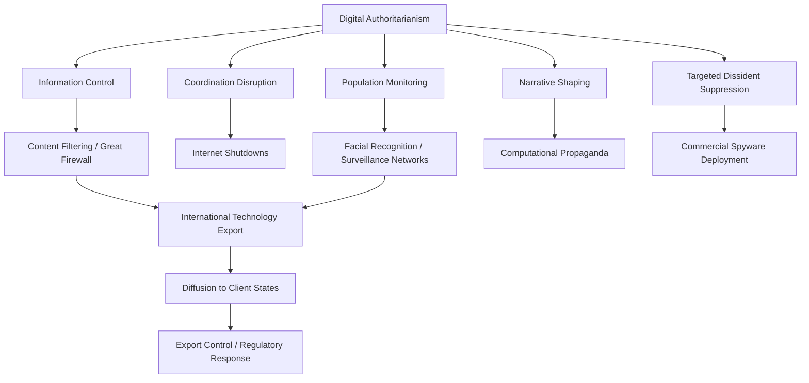

## Digital Authoritarianism

### Definitional Framework

Digital authoritarianism refers to the use of digital information and communication technologies by authoritarian and hybrid regimes to monitor, censor, shape, and control the information environment as a mechanism of regime maintenance and social control — extending traditional authoritarian information control tools (state media monopoly, censorship, propaganda) with digital-era capabilities for scale, precision, and reduced marginal enforcement cost. The term is used both descriptively (documenting specific technologies and practices) and as an organizing analytical framework connecting internet governance, AI governance, surveillance, and comparative authoritarianism scholarship into a single regime-survival lens.

This topic synthesizes and extends several threads already developed in this chapter — Internet Governance's cyber-sovereignty framing, Artificial Intelligence and Political Governance's state-directed development model, and Surveillance, Privacy, and the State's authoritarian comprehensive surveillance model — organized specifically around the question of how digital tools function as instruments of authoritarian regime durability.

### Theoretical Positioning: Liberation Technology vs. Digital Authoritarianism Optimism-Pessimism Debate

**Early "Liberation Technology" Framework**

Scholarship in the 2000s and early 2010s (notably associated with Larry Diamond's "liberation technology" framing, and popular narratives surrounding the 2010–2011 Arab Spring) emphasized digital technologies' capacity to lower coordination costs for opposition movements, circumvent state media monopolies, and document human rights abuses — broadly optimistic about digital technology's net effect on democratization prospects in authoritarian contexts.

**Subsequent Revisionist Scholarship**

Beginning roughly in the mid-2010s, a substantial body of comparative authoritarianism research (including work associated with scholars such as Sergei Guriev, Daniel Treisman on "informational autocracy," and various country-specific studies) documented authoritarian regimes' adaptive capacity to co-opt, weaponize, and out-innovate the same digital tools once assumed to favor opposition movements — producing the current scholarly consensus that digital technology's political effects are contingent on regime adaptive capacity rather than inherently liberalizing.

**"Networked Authoritarianism" (Rebecca MacKinnon)**

An influential intermediate framework arguing that authoritarian regimes do not simply ban digital technology but actively shape a "networked authoritarian" information environment — permitting substantial online expression and even limited criticism while maintaining control over collective action coordination, opposition organization, and critical mass information flows, allowing regimes to claim openness while preserving core control functions.

**"Informational Autocracy" (Guriev and Treisman)**

A related framework distinguishing "fear-based" traditional dictatorship (relying primarily on repression and coercion) from "informational autocracy" (relying more heavily on manipulating citizens' beliefs about regime competence and popularity through information control, co-optation of media, and controlled propaganda, with repression used more selectively and often covertly) — arguing informational autocracy has become an increasingly common authoritarian model in the post-Cold War, digitally mediated era.

### Core Toolkit of Digital Authoritarian Practice

**Censorship and Content Filtering**

- **Great Firewall (China)**: the most extensively documented comprehensive national internet filtering system, combining DNS manipulation, IP blocking, deep packet inspection, and keyword filtering to block foreign platforms and content at the network level
- **Selective/event-driven censorship**: more targeted approaches used by many hybrid and authoritarian regimes, intensifying filtering around specific events (elections, protests, anniversaries of sensitive historical events) rather than maintaining comprehensive year-round filtering
- **Platform-level compliance requirements**: regimes compelling domestically operating platforms (whether local or accommodating foreign platforms choosing to operate within the jurisdiction) to remove specified content under threat of market access denial

**Internet Shutdowns and Throttling**

Deliberate, government-directed full or partial internet/mobile network shutdowns, particularly common during protests, elections, and periods of civil unrest, documented systematically by organizations including Access Now's #KeepItOn coalition, which tracks shutdown incidents globally. [Unverified] Given the rapidly evolving and geographically dispersed nature of shutdown incidents, current-year global shutdown counts and specific country cases should be verified against current tracking sources rather than treated as static reference facts.

**Surveillance-Enabled Social Control**

Building directly on the Surveillance, Privacy, and the State content: comprehensive camera/facial-recognition networks, mobile app-based tracking and movement-monitoring systems, and behavioral scoring mechanisms function not only as intelligence-gathering tools but as visible, deterrence-oriented instruments intended to produce Foucauldian self-regulation among the surveilled population.

**Computational Propaganda and State-Directed Disinformation**

Extending the Propaganda and Persuasion and Misinformation and Disinformation content into the authoritarian-regime-maintenance context: state-sponsored troll and bot networks, coordinated inauthentic amplification of regime-favorable narratives, and "reflexive control" information operations (a Russian military-theoretical concept describing information operations designed to shape an adversary's decision-making by controlling the information environment within which decisions are made) directed at both domestic populations and, in some documented cases, foreign audiences.

**Digital Repression of Specific Populations and Dissidents**

Documented cases include extensive surveillance infrastructure deployed against specific ethnic or religious minority populations (as referenced in the Surveillance content regarding Xinjiang), targeted commercial spyware deployment against exiled dissidents and journalists (connecting to the Pegasus/NSO Group content), and digital tools used to identify and pursue legal or extralegal action against domestic protest participants (e.g., using facial recognition or mobile location data to identify protest attendees after the fact).

### Export and Diffusion of Digital Authoritarian Technology

**Surveillance Technology Export Markets**

Chinese firms (including Huawei, Hikvision, and others) have been documented as significant international suppliers of surveillance infrastructure — camera networks, "safe city" platforms, network equipment — to a range of client governments internationally, alongside Israeli, European, and other commercial spyware and surveillance technology vendors, creating a broader global marketplace for authoritarian-capable digital tools available to states without independent development capacity.

**Technology Transfer and "Digital Silk Road" Framing**

Some scholarship situates surveillance and digital infrastructure export within China's broader Belt and Road Initiative-adjacent "Digital Silk Road" framing, raising governance questions about whether infrastructure investment carries embedded governance-model influence — a contested claim, since recipient states' subsequent domestic use of exported technology is shaped by their own political institutions and incentives as much as by exporter influence. [Inference] The extent to which technology export functions as active authoritarian-model promotion versus passive commercial availability that recipient regimes then apply according to their own preexisting governance logic is difficult to disentangle empirically, and the research literature does not offer a fully settled answer distinguishing these mechanisms.

**Regulatory and Normative Responses**

Includes export-control listings (connecting to the Surveillance content's discussion of U.S. Commerce Department spyware blacklisting), advocacy for human-rights-conditional export licensing frameworks, and ongoing debate about the adequacy of dual-use technology export regimes in addressing software- and data-infrastructure-based tools.

### Digital Authoritarianism Under Democratic and Hybrid Regimes

An important qualification in current scholarship: digital-authoritarian *tools and techniques* are not confined to consolidated authoritarian regimes. Documented cases of internet shutdowns, targeted spyware use, and content-restriction measures have occurred in states more accurately classified as hybrid or backsliding democracies, and even in some consolidated democracies in narrower contexts (e.g., emergency-related restrictions, documented spyware misuse cases discussed under Surveillance, Privacy, and the State). [Unverified] This has led some scholars to argue "digital authoritarianism" is better understood as a spectrum of techniques available to and used by a range of regime types to varying degrees, rather than a binary property distinguishing authoritarian from democratic states — though the intensity, comprehensiveness, and impunity of use still differs substantially by regime type in the empirical literature, and reasonable scholarly disagreement exists about how sharply to draw this distinction.

### Comparative Table: Digital Authoritarian Toolkit by Function

| Function | Primary Tools | Illustrative Case |
| --- | --- | --- |
| **Information control** | Content filtering, platform compliance mandates, keyword blocking | China's Great Firewall |
| **Coordination disruption** | Internet/mobile shutdowns, selective platform throttling | Documented shutdown incidents during protests globally |
| **Population monitoring** | Facial recognition networks, mobile tracking, behavioral scoring | Comprehensive surveillance infrastructure in documented cases |
| **Narrative shaping** | State-sponsored troll/bot networks, computational propaganda | Documented state-linked influence operations |
| **Targeted dissident suppression** | Commercial spyware, post-hoc protester identification | Pegasus-linked cases against journalists/activists |
| **International diffusion** | Surveillance technology export, "safe city" platform sales | Documented export relationships across multiple client states |

### Extended Example: A Protest-Response Digital Authoritarianism Sequence

Consider a hypothetical scenario in which anti-government protests emerge in a hybrid regime:

1. **Pre-emptive/reactive shutdown**: the government orders a partial mobile internet shutdown in the protest region, following the #KeepItOn-documented pattern of coordination-disruption shutdowns
2. **Selective content filtering**: specific hashtags and platform features used for protest coordination are throttled or blocked while general internet access remains otherwise available — consistent with MacKinnon's networked-authoritarianism pattern of selective rather than comprehensive control
3. **Computational propaganda counter-narrative**: state-linked social media accounts amplify counter-narratives framing the protests as foreign-instigated or criminally motivated, drawing on the same coordinated inauthentic behavior patterns documented under Misinformation and Disinformation
4. **Post-event surveillance-enabled identification**: facial recognition analysis of protest footage and mobile location data are used to identify participants after the event concludes, enabling selective, deterrence-oriented legal or extralegal consequences without requiring real-time crowd control
5. **International scrutiny and export-control response**: if the surveillance technology used is traceable to a foreign commercial vendor, the incident may trigger export-control advocacy or blacklisting proceedings in the vendor's home jurisdiction, connecting the case back to the international regulatory responses discussed above

### Diagram: Digital Authoritarianism Toolkit Integration

### Diagram: Liberation Technology vs. Digital Authoritarianism Debate Timeline (svg_diagram)

<svg xmlns="http://www.w3.org/2000/svg" viewBox="0 0 680 260">
<text x="340" y="26" text-anchor="middle" font-size="16" font-weight="bold" fill="#1a1a1a">Scholarly Framing Evolution (svg_diagram)</text>
<line x1="60" y1="140" x2="620" y2="140" stroke="#495057" stroke-width="2" marker-end="url(#arrowT)" />
<circle cx="140" cy="140" r="8" fill="#2f9e44" />
<text x="140" y="115" text-anchor="middle" font-size="12" font-weight="bold" fill="#1a1a1a">Liberation Technology</text>
<text x="140" y="170" text-anchor="middle" font-size="10" fill="#495057">2000s–early 2010s</text>
<text x="140" y="186" text-anchor="middle" font-size="10" fill="#495057">Arab Spring optimism</text>
<circle cx="340" cy="140" r="8" fill="#e8b339" />
<text x="340" y="115" text-anchor="middle" font-size="12" font-weight="bold" fill="#1a1a1a">Networked Authoritarianism</text>
<text x="340" y="170" text-anchor="middle" font-size="10" fill="#495057">Mid-2010s</text>
<text x="340" y="186" text-anchor="middle" font-size="10" fill="#495057">MacKinnon: selective control model</text>
<circle cx="540" cy="140" r="8" fill="#c92a2a" />
<text x="540" y="115" text-anchor="middle" font-size="12" font-weight="bold" fill="#1a1a1a">Informational Autocracy</text>
<text x="540" y="170" text-anchor="middle" font-size="10" fill="#495057">Mid-2010s–present</text>
<text x="540" y="186" text-anchor="middle" font-size="10" fill="#495057">Guriev/Treisman: belief manipulation model</text>

<text x="340" y="230" text-anchor="middle" font-size="11" fill="`#495057`">Current scholarship treats digital technology's political effects as contingent on regime adaptive capacity</text>

</svg>

### Key Points

- Digital authoritarianism synthesizes internet governance, AI governance, and surveillance tools into a regime-maintenance analytical frame, distinct from but building on each of those subfields
- Early "liberation technology" optimism has been substantially revised by subsequent research documenting authoritarian regimes' adaptive capacity to co-opt and weaponize the same digital tools
- MacKinnon's "networked authoritarianism" and Guriev/Treisman's "informational autocracy" represent influential intermediate frameworks emphasizing selective control and belief manipulation over comprehensive repression
- The core toolkit spans censorship/filtering, internet shutdowns, surveillance-enabled social control, computational propaganda, and targeted spyware against dissidents
- Digital authoritarian technology export (particularly from Chinese firms, alongside other international vendors) has diffused surveillance capacity to a broader range of client states, raising contested questions about whether export functions as active governance-model promotion or passive commercial diffusion
- Current scholarship increasingly frames digital authoritarian techniques as a spectrum of tools available to varying degrees across regime types rather than a strict binary distinguishing authoritarian from democratic states, while still recognizing substantial differences in intensity and impunity of use by regime type

**Related Topics**

- Internet Governance
- Surveillance, Privacy, and the State
- Artificial Intelligence and Political Governance
- Propaganda and Persuasion
- Misinformation and Disinformation
- Authoritarianism and Hybrid Regimes
- Comparative Technology Regulation (EU, US, China)
- Social Media and Political Participation
- Democratization and Regime Transition
- Human Rights and Digital Technology