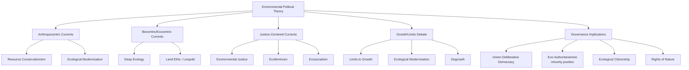

## Environmental Political Theory

### Definitional Framework

Environmental political theory examines the normative, conceptual, and institutional questions raised by the relationship between political communities and the natural world — encompassing questions of intergenerational justice, the moral status of non-human nature, the compatibility of existing political and economic institutions with ecological sustainability, and competing visions of what environmentally sound governance should look like. The field emerged substantially from the 1960s–1970s environmental movement but draws on much older traditions in political philosophy while also generating genuinely novel theoretical questions that classical political theory did not directly address (obligations to future generations, the standing of non-human entities, planetary-scale collective action problems).

### Foundational Currents in Environmental Political Thought

**Resource Conservation and Utilitarian Environmentalism**

The earliest strand of environmental political thought (associated with figures like Gifford Pinchot in the early 20th-century U.S. conservation movement) framed environmental protection primarily in terms of efficient, sustained-yield management of natural resources for long-term human benefit — an anthropocentric, utilitarian framing distinct from later biocentric or ecocentric currents.

**Preservationism**

A parallel and partly competing early current (associated with John Muir) emphasizing the intrinsic value of wilderness and natural landscapes independent of instrumental human use, providing philosophical grounding for protected-area and wilderness-preservation policy distinct from Pinchot's managed-use conservation framing.

**Deep Ecology (Arne Næss)**

Arne Næss's deep ecology (from the 1970s) argues for a fundamental philosophical shift from anthropocentrism (human-centered value) to biocentric or ecocentric egalitarianism — the view that all living beings, and potentially ecosystems themselves, possess intrinsic value independent of their usefulness to humans. Deep ecology's "eight-point platform" (developed with George Sessions) explicitly calls for substantial reduction in human population and consumption, distinguishing it sharply from reformist environmentalism that seeks efficiency improvements within existing economic and demographic trajectories.

**Social Ecology (Murray Bookchin)**

Murray Bookchin's social ecology argues that ecological crisis is fundamentally rooted in hierarchical social domination (of humans over humans) that then extends to domination of nature — meaning genuine ecological sustainability requires addressing underlying social hierarchy and domination (including capitalism and statist political structures) rather than treating environmental protection as a separable technical or resource-management problem. Bookchin was also a sharp critic of deep ecology, arguing its focus on human population/consumption reduction obscured the more fundamental social-hierarchy drivers of ecological crisis.

**Ecofeminism**

A theoretical current (associated with figures including Val Plumwood, Carolyn Merchant, and Maria Mies) arguing that the domination of nature and the domination of women share common conceptual and historical roots in dualistic, hierarchical Western thought (culture/nature, reason/emotion, male/female dualisms), such that ecological and feminist liberation are theoretically and practically linked rather than separate concerns.

**Ecosocialism and Ecological Marxism**

Draws on Marxist political economy to argue that capitalism's structural drive toward continuous accumulation and growth is fundamentally incompatible with ecological limits — associated with theorists including John Bellamy Foster's development of Marx's concept of "metabolic rift" (the disruption of natural nutrient/material cycling caused by capitalist agricultural and industrial organization) as an ecological reading embedded within Marx's original political economy rather than a purely external addition to it.

**Environmental Justice**

Emerged substantially from U.S. grassroots organizing in the 1980s (notably the 1982 Warren County, North Carolina PCB landfill protests, widely cited as a catalyzing event) and associated academic work (including Robert Bullard's foundational research on environmental racism), documenting that environmental harms (pollution exposure, hazardous facility siting, climate impacts) are systematically distributed unequally along racial and socioeconomic lines, and arguing that environmental political theory must center distributive and procedural justice rather than treating environmental protection as a race/class-neutral technical problem.

### Core Normative Debates

**Anthropocentrism vs. Ecocentrism/Biocentrism**

The central and recurring axis distinguishing environmental political theory's major currents:

- **Anthropocentric** approaches ground environmental value in human interests (health, resource availability, aesthetic/recreational value, obligations to future human generations)
- **Biocentric** approaches extend moral consideration to individual non-human living beings
- **Ecocentric** approaches extend moral consideration to ecological wholes (species, ecosystems, the biosphere) rather than only individual organisms, associated particularly with Aldo Leopold's influential "land ethic" (*A Sand County Almanac*, 1949), which argued a thing is right when it tends to preserve the integrity, stability, and beauty of the biotic community, and wrong when it tends otherwise.

**Intergenerational Justice**

A distinctively environmental political-theory problem: what obligations, if any, do current generations owe to future generations who cannot participate in present political decision-making or consent to tradeoffs made on their behalf? Approaches include:

- **Rawlsian extensions**: adapting Rawls's original-position/veil-of-ignorance framework to include uncertainty about which generation one is born into, generating arguments for a "just savings principle" limiting present consumption of shared resources
- **Discounting debates**: economic and philosophical disputes over whether and how much future costs/benefits should be discounted relative to present ones, with environmental philosophers generally more skeptical of standard economic discounting practices when applied to long-term or irreversible ecological harms than economists working in more conventional cost-benefit frameworks
- **Non-identity problem** (Derek Parfit): a philosophical puzzle noting that different policy choices affect *which* future individuals come into existence at all, complicating simple harm-based arguments for obligations to specific future persons

**The Moral Status of Non-Human Nature**

Ranges from purely instrumental valuation (nature matters only for human benefit) through sentientist positions (moral consideration extends to beings capable of suffering, connecting to animal rights philosophy, notably Peter Singer's utilitarian extension of moral consideration) to biocentric individualism (all living things have interests warranting moral consideration, associated with Paul Taylor) to holistic ecocentrism (ecological wholes themselves warrant consideration, per Leopold's land ethic).

**Growth, Limits, and Degrowth**

- **Limits to Growth tradition**: originating with the 1972 Club of Rome report of the same name, arguing finite planetary resources impose hard constraints on continuous economic growth
- **Ecological modernization**: a competing, more optimistic current arguing technological innovation and efficiency improvements can substantially decouple economic growth from environmental impact, making continued growth and ecological sustainability compatible rather than contradictory
- **Degrowth**: a more recent and more radical current (associated with theorists including Serge Latouche and Giorgos Kallis) arguing that decoupling has proven empirically insufficient and that deliberate, planned reduction in material throughput in wealthy economies is necessary for ecological sustainability, generally paired with arguments for redistributive and non-market-based measures of wellbeing to avoid degrowth being experienced as simple economic decline

### Institutional and Governance Implications

**Green Political Theory and Democracy**

Distinct strands debate whether ecological crisis requires:

- **Green democratic reform**: strengthening deliberative and participatory democratic mechanisms specifically to better represent long-term and diffuse ecological interests against short-term, concentrated interests (associated with theorists like John Dryzek's work on deliberative democracy and ecological rationality)
- **Eco-authoritarianism**: a minority but historically present strand (with roots traceable to some 1970s writing, e.g., William Ophuls) arguing ecological crisis may require centralized, potentially non-democratic authority capable of imposing necessary constraints faster than democratic deliberation allows — a position that remains a significant point of normative and empirical contention within the field, generally rejected by most contemporary environmental political theorists in favor of green-democracy approaches, but persisting as a reference point in debates about the compatibility of democratic process speed with ecological urgency

**Ecological Citizenship**

A concept (associated with Andrew Dobson) proposing an expanded conception of citizenship obligations extending beyond the traditional bounded nation-state political community to encompass ecological footprint responsibilities toward distant (including foreign and future) others affected by one's environmental impact — distinguishing ecological citizenship from traditional civic republican or liberal citizenship frameworks bounded by state membership.

**Rights of Nature**

An emerging legal-theoretical and political movement seeking to grant legal standing/rights directly to natural entities (rivers, ecosystems, forests) rather than treating environmental protection solely through human-interest-mediated property or regulatory law — with documented implementing cases including Ecuador's 2008 constitutional recognition of nature's rights and New Zealand's 2017 legal personhood grant to the Whanganui River, often connected theoretically to indigenous cosmological frameworks that do not treat nature as separate from or subordinate to human political community.

### Comparative Table: Major Environmental Political Theory Currents

| Current | Core Claim | Key Figures |
| --- | --- | --- |
| **Resource conservationism** | Efficient managed use of resources for sustained human benefit | Gifford Pinchot |
| **Preservationism** | Intrinsic value of wilderness independent of use | John Muir |
| **Deep ecology** | Biocentric egalitarianism; reduce human population/consumption | Arne Næss, George Sessions |
| **Social ecology** | Ecological crisis rooted in social hierarchy/domination | Murray Bookchin |
| **Ecofeminism** | Shared conceptual roots of nature and gender domination | Val Plumwood, Carolyn Merchant |
| **Ecosocialism** | Capitalism's growth imperative is fundamentally incompatible with ecological limits | John Bellamy Foster |
| **Environmental justice** | Environmental harms are unequally and unjustly distributed by race/class | Robert Bullard |

### Extended Example: Applying Multiple Frameworks to a Policy Case

Consider a hypothetical proposal to site a new industrial waste facility, with two candidate locations: a low-income community of color, and a nearby affluent suburb.

- **Environmental justice lens**: the central analytical question is whether the siting decision reflects (or would perpetuate) a documented historical pattern of disproportionate environmental burden placement on marginalized communities, regardless of the facility's overall environmental impact level
- **Ecocentric/land ethic lens**: analysis would extend beyond the human-distributional question to ask whether the facility's placement affects the "integrity, stability, and beauty" of the broader biotic community at either site, independent of which human population is affected
- **Intergenerational justice lens**: analysis would examine long-term contamination risk and whether current-generation decision-makers are appropriately weighing costs likely to fall on future residents unable to participate in the current siting decision
- **Ecological modernization vs. degrowth lens**: a deeper policy question in the background — whether the waste-generating industrial activity itself should be addressed through efficiency/technology improvements (ecological modernization) or through more fundamental reduction in the underlying production/consumption pattern generating the waste (degrowth) — shapes whether the debate is framed narrowly (where to site the facility) or broadly (whether the facility's underlying economic activity should continue at its current scale)

### Diagram: Environmental Political Theory Currents Map

### Diagram: Anthropocentric–Ecocentric Spectrum (svg_diagram)

<svg xmlns="http://www.w3.org/2000/svg" viewBox="0 0 660 260">
<text x="330" y="26" text-anchor="middle" font-size="16" font-weight="bold" fill="#1a1a1a">Moral Consideration Spectrum (svg_diagram)</text>
<line x1="60" y1="140" x2="600" y2="140" stroke="#495057" stroke-width="3" />
<circle cx="110" cy="140" r="8" fill="#3b5bdb" />
<text x="110" y="170" text-anchor="middle" font-size="11" font-weight="bold" fill="#1a1a1a">Anthropocentric</text>
<text x="110" y="186" text-anchor="middle" font-size="9" fill="#495057">Conservationism</text>
<circle cx="260" cy="140" r="8" fill="#66a80f" />
<text x="260" y="170" text-anchor="middle" font-size="11" font-weight="bold" fill="#1a1a1a">Sentientist</text>
<text x="260" y="186" text-anchor="middle" font-size="9" fill="#495057">Animal rights extension</text>
<circle cx="410" cy="140" r="8" fill="#e8b339" />
<text x="410" y="170" text-anchor="middle" font-size="11" font-weight="bold" fill="#1a1a1a">Biocentric Individualism</text>
<text x="410" y="186" text-anchor="middle" font-size="9" fill="#495057">Paul Taylor</text>
<circle cx="560" cy="140" r="8" fill="#2f9e44" />
<text x="560" y="170" text-anchor="middle" font-size="11" font-weight="bold" fill="#1a1a1a">Ecocentric</text>
<text x="560" y="186" text-anchor="middle" font-size="9" fill="#495057">Land ethic, deep ecology</text>

<text x="330" y="230" text-anchor="middle" font-size="11" fill="`#495057`">Movement rightward expands the scope of entities warranting direct moral consideration</text>

</svg>

### Key Points

- Environmental political theory spans anthropocentric (conservationism, ecological modernization), biocentric/ecocentric (deep ecology, land ethic), and justice-centered (environmental justice, ecofeminism, ecosocialism) currents, distinguished primarily by their account of what and whom possesses moral/political standing
- Deep ecology and social ecology represent a significant internal theoretical split — biocentric population/consumption reduction (Næss) versus social-hierarchy-rooted critique (Bookchin) — over the fundamental cause of ecological crisis
- Environmental justice, emerging from 1980s U.S. grassroots organizing, established that environmental harms are systematically and unjustly distributed along racial and socioeconomic lines, reframing environmental protection as inseparable from distributive justice
- Intergenerational justice raises distinctive theoretical puzzles (the non-identity problem, discounting debates) not fully resolved by extending standard political theory frameworks
- The growth/limits debate — Limits to Growth, ecological modernization, and degrowth — remains a live and unresolved theoretical and empirical dispute about whether continued economic growth is compatible with ecological sustainability
- Eco-authoritarianism remains a minority position within the field, generally rejected in favor of green-democratic-reform approaches, but persists as a reference point in debates about democratic process speed relative to ecological urgency
- Rights-of-nature legal movements (Ecuador, New Zealand) represent an emerging institutional translation of ecocentric theory into positive law, often connected to indigenous cosmological frameworks

**Related Topics**

- Climate Governance and International Climate Regimes
- Environmental Justice and Distributive Politics
- Sustainable Development and Growth Debates
- Indigenous Politics and Rights of Nature
- Deliberative Democracy and Ecological Rationality
- Political Economy of Natural Resources
- Global Governance and International Environmental Law
- Animal Rights and Moral Status Theory
- Green Political Parties and Movements
- Intergenerational Justice and Future Generations