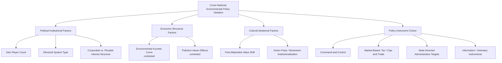

## Comparative Environmental Policy

### Definitional Framework

Comparative environmental policy examines how different states and jurisdictions design, implement, and enforce environmental regulation, analyzing cross-national variation in policy instruments, institutional structures, stringency, and effectiveness. The subfield draws on comparative politics, public policy analysis, and political economy to explain why environmental policy outcomes diverge significantly across countries with sometimes similar underlying environmental problems, treating environmental policy as an institutionally and politically mediated outcome rather than a direct, uniform technical response to ecological conditions.

### Policy Instrument Typology

**Command-and-Control Regulation**

Direct regulatory mandates specifying required actions, technologies, or emission/discharge limits, enforced through permitting, inspection, and penalty mechanisms. Historically the dominant instrument type in early environmental regulation (e.g., the U.S. Clean Air Act and Clean Water Act's technology-based standards in the 1970s), valued for regulatory certainty and direct enforceability but frequently criticized by economists for imposing higher aggregate compliance costs than market-based alternatives by failing to account for differing marginal abatement costs across regulated entities.

**Market-Based Instruments**

- **Pigouvian/carbon taxes**: directly pricing an externality (e.g., a per-ton carbon price) to internalize environmental costs into market decisions, implemented in varying forms in jurisdictions including Sweden (one of the earliest and highest-rate carbon taxes, since 1991), British Columbia, and other jurisdictions
- **Cap-and-trade systems**: setting an aggregate emissions cap and allocating/auctioning tradeable permits, allowing market mechanisms to achieve the cap at lowest aggregate cost by directing abatement toward lowest-cost sources; major implementations include the EU Emissions Trading System (EU ETS, launched 2005, the largest carbon market globally) and various U.S. regional systems (e.g., the Regional Greenhouse Gas Initiative in the northeastern U.S., California's cap-and-trade program)
- **Tradeable permit systems for non-carbon pollutants**: the U.S. Acid Rain Program (sulfur dioxide cap-and-trade, established under 1990 Clean Air Act amendments) is frequently cited as an influential early large-scale demonstration of cap-and-trade effectiveness, achieving substantial emissions reductions at lower cost than initially projected under command-and-control alternatives

**Information-Based and Voluntary Instruments**

Eco-labeling, mandatory environmental disclosure requirements, voluntary industry agreements, and public information/right-to-know programs (e.g., the U.S. Toxics Release Inventory) that rely on market and reputational pressure rather than direct mandate, generally viewed in comparative policy research as complementary to rather than substitutable for stronger regulatory or market-based instruments.

**Subsidies and Public Investment**

Direct government support for clean technology deployment (renewable energy subsidies, feed-in tariffs, tax credits), R&D funding, and public infrastructure investment, representing a fundamentally different policy logic (positive incentive for desired behavior) compared to the negative-incentive logic of taxes, caps, and command-and-control mandates.

### National and Regional Policy Models

**European Union**

Characterized by comparatively extensive supranational environmental policy harmonization through EU-level directives and regulations, the EU ETS as the flagship market-based climate instrument, and the European Green Deal (2019) as an overarching policy framework aiming for climate neutrality by 2050, combined with the Fit for 55 legislative package translating that target into specific sectoral binding measures. [Unverified] Specific EU environmental legislative targets and implementation timelines continue to be revised through ongoing legislative processes; current specifics should be verified against current EU sources for any application requiring precise current status.

**United States**

Characterized by a more fragmented, multi-level regulatory structure reflecting federalism — significant environmental policy authority resides at both federal (EPA, established 1970, operating primarily under statutes including the Clean Air Act, Clean Water Act, and others) and state levels, with individual states (notably California, which holds a unique statutory waiver authority to set vehicle emissions standards more stringent than federal minimums) sometimes exceeding federal standards and functioning as de facto national policy leaders when other states voluntarily adopt California's standards. U.S. federal environmental policy has also historically exhibited more pronounced partisan and administration-to-administration volatility than many comparably developed democracies' environmental policy trajectories, particularly regarding climate policy specifically. [Unverified] Given this volatility, current specific federal climate and environmental regulatory status should be verified against current sources.

**China**

Combines rapid recent expansion of environmental regulatory capacity and ambition (including a national carbon emissions trading scheme launched in 2021, initially covering the power sector) with continued reliance on state-directed industrial policy and target-based administrative enforcement (binding provincial-level environmental targets embedded within China's broader five-year planning framework) rather than primarily market-based mechanisms, reflecting the broader state-directed-development governance pattern discussed under Artificial Intelligence and Political Governance.

**Nordic and Northern European Models**

Frequently cited in comparative research as exhibiting some of the most stringent and longest-standing environmental policy frameworks globally (including early carbon taxation, discussed above), generally explained in comparative political economy literature by reference to these countries' broader corporatist policy-making traditions (connecting to the Democratic Corporatist media/political model discussed under Comparative Media Systems), strong environmental-movement institutionalization, and comparatively high public trust in government regulatory capacity.

**Developing and Emerging Economy Contexts**

Comparative environmental policy research on developing economies frequently emphasizes the tension between environmental regulatory ambition and development priorities, administrative/enforcement capacity constraints, and debates over "common but differentiated responsibilities" (discussed further under international climate governance) regarding the appropriate distribution of environmental policy burden between historically high-emitting developed economies and developing economies with lower historical cumulative emissions but often rapidly growing current emissions.

### Explaining Cross-National Policy Variation

**Political-Institutional Explanations**

- **Veto player theory** (Tsebelis): systems with more institutional veto points (federalism, bicameralism, coalition government requirements) generally exhibit greater difficulty passing and sustaining ambitious environmental policy change, holding other factors constant
- **Electoral system effects**: comparative research has examined whether proportional representation systems (which tend to produce more viable green/environmental parties) are associated with more ambitious environmental policy outcomes than majoritarian systems, with [Inference] the empirical relationship appearing real but moderate in size and mediated by numerous other institutional and cultural factors, such that electoral system alone provides only partial explanatory power
- **Corporatist vs. pluralist interest group structures**: corporatist systems with formalized, encompassing interest-group bargaining (common in the Nordic and broader Democratic Corporatist model) are argued by some scholars to more easily internalize long-term collective costs (including environmental costs) than more fragmented pluralist interest-group systems, though this remains a contested causal claim rather than a definitively settled finding

**Economic and Structural Explanations**

- **Environmental Kuznets Curve hypothesis**: a contested empirical claim that environmental degradation initially increases with economic development before later declining as wealthier societies demand and can afford stronger environmental protection — [Unverified] the empirical support for this hypothesis varies substantially by specific pollutant studied (found for some local pollutants like particulate matter in some studies, generally not found for global pollutants like greenhouse gas emissions, which do not automatically decline with wealth absent deliberate policy intervention) and the hypothesis remains actively contested rather than a settled empirical regularity
- **Pollution haven hypothesis**: the contested claim that stringent environmental regulation in wealthy economies drives polluting industry relocation to jurisdictions with weaker regulation, with [Unverified] empirical support again mixed and dependent on industry sector and methodology, generally found to be a real but more modest effect than early theoretical predictions suggested

**Cultural and Ideational Explanations**

Comparative research also emphasizes cross-national variation in environmental values, post-materialist value shifts (Ronald Inglehart's influential argument that economic security enables prioritization of quality-of-life and environmental values over material security concerns), and the differential institutionalization of environmental movements and green political parties across otherwise similar democratic systems.

### Policy Diffusion and Learning

**Horizontal Diffusion**

Documented patterns of policy instrument diffusion across jurisdictions — for example, cap-and-trade design elements spreading from the U.S. Acid Rain Program to the EU ETS and subsequently to other regional carbon markets — studied within the broader comparative policy diffusion literature examining mechanisms including learning, competition, coercion, and emulation.

**Subnational and Multi-Level Policy Leadership**

California's role in U.S. vehicle emissions standards (noted above) exemplifies a broader comparative pattern in which subnational jurisdictions within federal systems act as policy innovators or "laboratories," with successful subnational policies sometimes subsequently adopted at national or supranational levels.

### Comparative Table: Instrument Choice by Jurisdiction

| Jurisdiction | Primary Instrument Emphasis | Notable Example |
| --- | --- | --- |
| **European Union** | Market-based (cap-and-trade) + supranational directive harmonization | EU ETS, European Green Deal |
| **United States (federal)** | Fragmented command-and-control + subnational market-based experimentation | Clean Air Act; California cap-and-trade |
| **China** | State-directed administrative targets + emerging market mechanisms | Provincial five-year plan targets; national ETS |
| **Nordic countries** | Early and high-rate carbon taxation + corporatist consensus-building | Swedish carbon tax (since 1991) |

### Extended Example: Comparing Policy Response to an Identical Environmental Problem

Consider three hypothetical jurisdictions responding to the same industrial air pollution problem:

- **Command-and-control jurisdiction**: mandates specific emissions-control technology installation across all regulated facilities regardless of individual facility abatement cost differences, prioritizing regulatory certainty and straightforward enforceability over cost-minimization
- **Market-based jurisdiction**: establishes a tradeable permit cap allowing facilities with low abatement costs to over-comply and sell surplus permits to facilities with higher abatement costs, achieving the same aggregate emissions reduction at lower total economic cost, consistent with the U.S. Acid Rain Program's documented cost-effectiveness pattern
- **State-directed administrative jurisdiction**: sets binding provincial/regional-level pollution-reduction targets embedded within a broader multi-year economic planning framework, relying on administrative enforcement against local officials' target compliance rather than either facility-level command-and-control mandates or market mechanisms
- **Veto-player analysis**: a comparative political-institutional analyst would further ask whether each jurisdiction's chosen instrument reflects genuine policy-design preference or is partly an artifact of that jurisdiction's institutional capacity to pass and sustain more ambitious alternatives — e.g., a federal system with many veto points may adopt market-based instruments partly because achieving political consensus on stringent uniform command-and-control mandates proves institutionally more difficult

### Diagram: Comparative Environmental Policy Explanatory Framework

### Diagram: Command-and-Control vs. Market-Based Cost Efficiency (svg_diagram)

<svg xmlns="http://www.w3.org/2000/svg" viewBox="0 0 640 300">
<text x="320" y="26" text-anchor="middle" font-size="16" font-weight="bold" fill="#1a1a1a">Abatement Cost Efficiency Comparison (svg_diagram)</text>

<text x="160" y="60" text-anchor="middle" font-size="13" font-weight="bold" fill="`#1a1a1a`">Command-and-Control</text>

<rect x="70" y="80" width="60" height="120" fill="`#e8590c`" />

<text x="100" y="215" text-anchor="middle" font-size="10" fill="`#495057`">Facility A</text>

<rect x="150" y="80" width="60" height="120" fill="`#e8590c`" />

<text x="180" y="215" text-anchor="middle" font-size="10" fill="`#495057`">Facility B</text>

<text x="140" y="240" text-anchor="middle" font-size="10" fill="`#495057`">Uniform reduction</text>

<text x="140" y="254" text-anchor="middle" font-size="10" fill="`#495057`">regardless of cost</text>

<text x="480" y="60" text-anchor="middle" font-size="13" font-weight="bold" fill="`#1a1a1a`">Market-Based (Cap-and-Trade)</text>

<rect x="390" y="60" width="60" height="140" fill="`#2f9e44`" />

<text x="420" y="215" text-anchor="middle" font-size="10" fill="`#495057`">Low-cost Facility</text>

<text x="420" y="228" text-anchor="middle" font-size="10" fill="`#495057`">Over-complies, sells permits</text>

<rect x="470" y="140" width="60" height="60" fill="`#e8b339`" />

<text x="500" y="215" text-anchor="middle" font-size="10" fill="`#495057`">High-cost Facility</text>

<text x="500" y="228" text-anchor="middle" font-size="10" fill="`#495057`">Buys permits instead</text>

<text x="320" y="275" text-anchor="middle" font-size="11" fill="`#495057`">Same aggregate emissions cap achieved at lower total economic cost under trading</text>

</svg>

### Key Points

- Comparative environmental policy analyzes cross-national variation in instrument choice (command-and-control, market-based, information-based, subsidy-based) as a politically and institutionally mediated outcome
- The U.S. Acid Rain Program is a frequently cited foundational demonstration of cap-and-trade cost-effectiveness, influencing subsequent design of the EU ETS and other carbon markets
- The EU, U.S., China, and Nordic countries exhibit meaningfully distinct environmental policy models reflecting their broader governance structures — supranational harmonization, federal fragmentation, state-directed administrative targets, and corporatist consensus-building respectively
- Veto player theory, electoral system effects, and corporatist/pluralist interest-group structure represent the leading political-institutional explanations for cross-national environmental policy stringency variation
- The Environmental Kuznets Curve and pollution haven hypotheses are both empirically contested, with support varying substantially by pollutant type and industry sector rather than holding as general regularities
- Policy diffusion (horizontal spread of instrument design across jurisdictions) and subnational policy leadership (e.g., California's role in U.S. vehicle emissions standards) are important supplementary mechanisms explaining observed policy convergence in specific instrument types despite persistent broader cross-national variation

**Related Topics**

- Environmental Political Theory
- International Climate Governance and Regimes
- Sustainable Development and Growth Debates
- Comparative Political Institutions and Veto Players
- Political Economy of Energy Transition
- Environmental Justice and Distributive Politics
- Green Political Parties and Electoral Systems
- Federalism and Multi-Level Environmental Governance
- Common but Differentiated Responsibilities in Climate Policy
- Policy Diffusion and Comparative Public Policy