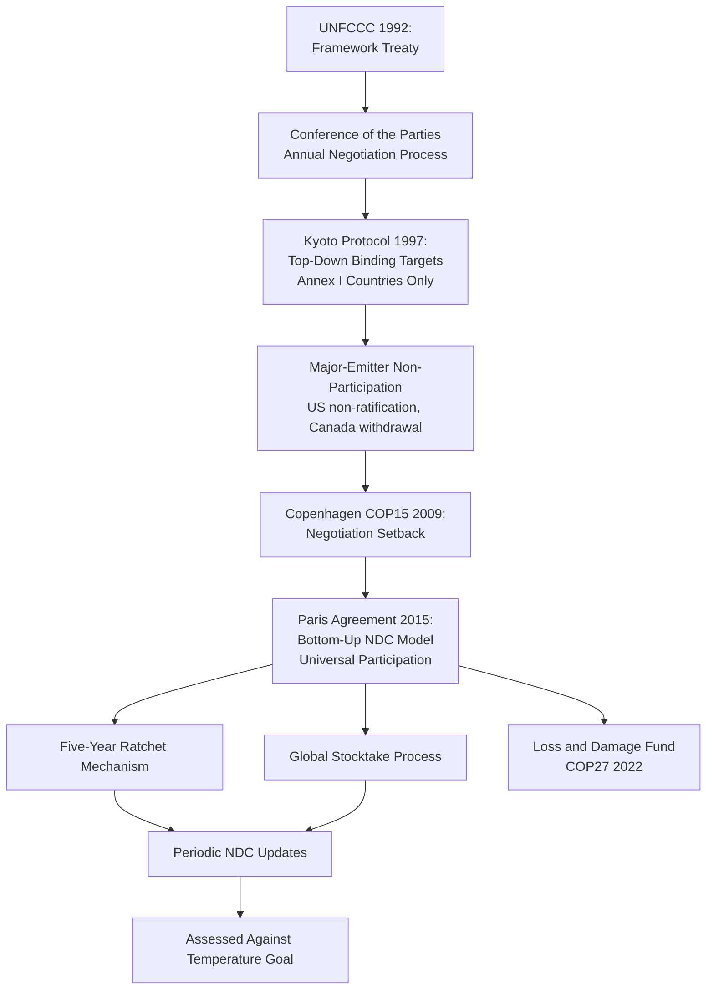

## Global Climate Governance and the UNFCCC Process

### Definitional Framework

Global climate governance refers to the international institutional architecture, negotiation processes, and legal instruments through which states and non-state actors coordinate responses to anthropogenic climate change — a problem political scientists frequently characterize as an especially difficult collective action problem given its global public-goods character (climate stability benefits are non-excludable and non-rival), long time horizons, and deep asymmetries in historical responsibility, current emissions, and vulnerability to impacts across states. The United Nations Framework Convention on Climate Change (UNFCCC), adopted at the 1992 Rio Earth Summit, established the primary multilateral treaty framework and ongoing negotiation process within which subsequent climate agreements have been developed.

### The UNFCCC Institutional Architecture

**Founding Framework (1992)**

The UNFCCC established the treaty's ultimate objective — stabilizing greenhouse gas concentrations at a level preventing dangerous anthropogenic interference with the climate system — without specifying binding numerical targets itself, instead creating an ongoing institutional process (the Conference of the Parties) through which more specific binding or non-binding commitments would subsequently be negotiated.

**Conference of the Parties (COP)**

The UNFCCC's supreme decision-making body, convening annually (with rare exceptions) and bringing together nearly universal state membership alongside accredited observer organizations (NGOs, business groups, subnational governments, intergovernmental organizations) in a format combining formal negotiation sessions with extensive parallel civil-society and side-event activity. COP numbering follows a continuous sequence from COP1 (Berlin, 1995) through the present, with landmark COPs including COP3 (Kyoto, 1997), COP15 (Copenhagen, 2009), and COP21 (Paris, 2015).

**Common but Differentiated Responsibilities and Respective Capabilities (CBDR-RC)**

A foundational UNFCCC principle (Article 3) holding that while all states share responsibility for addressing climate change, developed countries bear greater responsibility given their historical cumulative emissions and greater capacity to act, justifying differentiated (rather than uniform) obligations across developed and developing country parties. CBDR-RC has been a persistent and central point of negotiation contestation throughout the UNFCCC process, as the practical translation of the principle into specific binding differentiated obligations has proven consistently difficult to negotiate.

### Major Agreements Within the UNFCCC Process

**Kyoto Protocol (1997, entered into force 2005)**

Established the first binding emissions-reduction targets, but applied binding targets only to developed ("Annex I") countries, reflecting an initial strong application of CBDR-RC that later became a major point of contention, particularly regarding the exclusion of rapidly growing developing-economy emitters (notably China, which became the world's largest annual emitter during the Protocol period) from binding obligations. The United States signed but never ratified the Kyoto Protocol, and Canada later formally withdrew (2011), illustrating the binding top-down model's vulnerability to major-emitter non-participation.

**Copenhagen Accord (2009) and the Shift Toward Bottom-Up Pledging**

COP15 in Copenhagen was widely characterized in subsequent scholarship as a significant negotiation setback, failing to produce the comprehensive binding successor agreement to Kyoto that had been anticipated, instead producing a weaker, non-binding political accord. [Inference] Copenhagen's perceived failure is generally credited in the political science and international relations literature with catalyzing a significant strategic shift in subsequent UNFCCC design — away from the Kyoto model's top-down, binding, differentiated-target architecture and toward the bottom-up, nationally self-determined pledging architecture that would characterize the Paris Agreement — though the precise causal weight of Copenhagen specifically, versus longer-building recognition of Kyoto-model limitations, is not fully separable in the historical record.

**Paris Agreement (2015, entered into force 2016)**

The current central instrument of global climate governance, distinguished from Kyoto by several key architectural features:

- **Nationally Determined Contributions (NDCs)**: each party sets and submits its own emissions-reduction commitments, rather than having binding targets negotiated and assigned top-down, addressing the major-emitter non-participation vulnerability that undermined Kyoto
- **Universal participation**: applies to all parties (nearly 200 states) rather than only developed-country Annex I parties, addressing the developing-economy-exclusion critique of Kyoto
- **Temperature goal**: commits parties to holding global average temperature increase to well below 2°C above pre-industrial levels, pursuing efforts to limit the increase to 1.5°C
- **Five-year ratchet mechanism**: requires periodic (five-year cycle) submission of increasingly ambitious NDCs, combined with a "global stocktake" process (first conducted at COP28, 2023) assessing collective progress against the temperature goal and informing subsequent NDC ambition
- **Legally binding procedural obligations, non-binding substantive targets**: a frequently noted architectural feature — the *obligation to submit and periodically update* an NDC is legally binding under the treaty, but the *specific content and ambition level* of any given NDC is nationally determined and not internationally enforceable, a deliberate design compromise enabling near-universal participation at the cost of directly enforceable substantive commitment

**U.S. Withdrawal and Re-Entry Pattern**

The Paris Agreement has experienced U.S. withdrawal and subsequent re-entry across different presidential administrations (announced withdrawal in 2017, formal withdrawal completed 2020, re-entry 2021), illustrating a documented pattern of U.S. climate policy volatility across administrations with direct effects on the credibility and stability of international climate commitments given the U.S.'s position as a major historical and current emitter. [Unverified] Given the demonstrated pattern of administration-driven reversal, current U.S. Paris Agreement participation status should be verified against current sources rather than assumed fixed.

### Climate Finance Architecture

**Green Climate Fund and Finance Mobilization Commitments**

Developed countries committed (initially at COP15, formalized subsequently) to mobilizing climate finance for developing countries, with a widely cited (though contested in terms of actual delivery and accounting methodology) $100 billion annual target, and the Green Climate Fund established as a primary multilateral channel for climate finance disbursement to developing countries for both mitigation and adaptation activities.

**Loss and Damage**

A distinct and long-contested climate finance category addressing compensation or support for climate impacts that exceed adaptation capacity (as opposed to mitigation funding, which addresses emissions reduction, or standard adaptation funding, which addresses building resilience to anticipated impacts) — a dedicated Loss and Damage Fund was formally established at COP27 (2022) following decades of developing-country advocacy and developed-country resistance rooted partly in liability-avoidance concerns, representing a significant CBDR-RC-related institutional development. [Unverified] Fund operationalization, contribution levels, and disbursement mechanisms continue to develop through ongoing negotiation; current status should be verified against current sources.

### Theoretical Frameworks for Analyzing Climate Negotiations

**Collective Action Problem Framing**

Climate change is frequently analyzed through Mancur Olson's collective action theory and related public-goods frameworks: because climate stability is a global public good, individual states face incentives to free-ride on other states' mitigation efforts, a structural dynamic argued to explain both the general difficulty of achieving ambitious binding international climate agreements and specific negotiation dynamics (states' incentives to understate their own mitigation capacity while emphasizing others' greater responsibility).

**Regime Theory**

International relations regime theory (associated broadly with scholars including Robert Keohane and Oran Young) analyzes the UNFCCC as an international regime — a set of principles, norms, rules, and decision-making procedures around which state expectations converge in a given issue area — providing a framework for understanding how the regime has evolved architecturally (Kyoto's binding-target model to Paris's pledge-and-review model) in response to demonstrated limitations of earlier institutional design.

**Two-Level Games (Robert Putnam)**

Putnam's two-level games framework — analyzing international negotiations as simultaneously occurring at the international bargaining table and within domestic ratification/political constraint contexts — is frequently applied to climate negotiations to explain why negotiators' internationally agreed commitments are constrained by anticipated domestic political feasibility, helping explain phenomena including the Paris Agreement's shift toward nationally self-determined (rather than internationally negotiated and imposed) commitment levels.

**Polycentric Governance (Elinor Ostrom)**

Ostrom's polycentric governance framework, developed partly in direct response to skepticism about the sufficiency of a single global top-down climate agreement, argues that effective climate governance likely requires action at multiple governance scales simultaneously (local, subnational, national, regional, and global) rather than depending exclusively on the UNFCCC/global-treaty level — a framework that has gained increased scholarly and practitioner attention as a complement to, rather than replacement for, the UNFCCC process, particularly given documented gaps between aggregate NDC ambition and the temperature goals the Paris Agreement establishes.

### Non-State and Subnational Climate Governance

Beyond the state-centric UNFCCC process, comparative and IR climate governance scholarship increasingly examines subnational (city and regional government climate commitments, e.g., networks like C40 Cities), corporate (voluntary corporate net-zero commitments and associated accountability/greenwashing concerns), and civil-society (climate litigation, protest movements, shareholder activism) governance channels operating alongside and sometimes exerting pressure on the formal UNFCCC state-centric process — consistent with the polycentric governance framing above.

### Comparative Table: Kyoto vs. Paris Architecture

| Dimension | Kyoto Protocol | Paris Agreement |
| --- | --- | --- |
| **Target-setting approach** | Top-down, negotiated and assigned | Bottom-up, nationally self-determined (NDCs) |
| **Participation scope** | Binding targets only for developed (Annex I) countries | Universal participation, all parties submit NDCs |
| **Legal bindingness** | Binding numerical emissions targets | Binding procedural obligation to submit/update NDCs; substantive targets non-binding |
| **Major-emitter participation risk** | High vulnerability (U.S. non-ratification, Canada withdrawal) | Reduced structural vulnerability, though administration-level withdrawal still possible (U.S. 2017/2020/2021 pattern) |
| **Ambition mechanism** | Fixed commitment period targets | Five-year ratchet + global stocktake cycle |

### Extended Example: Analyzing a COP Negotiation Dynamic

Consider a hypothetical COP negotiation session addressing proposed loss and damage funding contribution levels:

- **Collective action lens**: developed countries face individual incentives to minimize their own contribution commitments while benefiting from any collective fund's existence, a free-rider dynamic analysts would expect to produce contribution levels below the collectively optimal amount absent strong enforcement or reputational mechanisms
- **CBDR-RC lens**: developing-country negotiators are likely to invoke historical emissions responsibility to argue for higher developed-country contribution obligations, while developed-country negotiators may emphasize "respective capabilities" language to argue for broader contributor bases including higher-income developing economies with substantial current emissions
- **Two-level games lens**: individual developed-country negotiators' willingness to commit to specific funding levels is constrained by anticipated domestic legislative or budgetary approval feasibility, meaning internationally "optimal" outcomes from a pure negotiation-table perspective may be unachievable if they exceed what domestic political processes would ratify
- **Regime theory lens**: the eventual negotiated outcome (whatever its substantive terms) becomes part of the evolving institutional architecture and normative expectation baseline for subsequent COP negotiations, illustrating regime theory's emphasis on converging expectations built incrementally over successive negotiation rounds rather than negotiated once and fixed permanently

### Diagram: UNFCCC Institutional Architecture and Agreement Evolution

### Diagram: CBDR-RC Principle and Contested Application (svg_diagram)

<svg xmlns="http://www.w3.org/2000/svg" viewBox="0 0 640 280">
<text x="320" y="26" text-anchor="middle" font-size="16" font-weight="bold" fill="#1a1a1a">Common but Differentiated Responsibilities (svg_diagram)</text>
<rect x="60" y="60" width="220" height="100" rx="6" fill="#e8f0fe" stroke="#3b5bdb" stroke-width="1.5" />
<text x="170" y="90" text-anchor="middle" font-size="13" font-weight="bold" fill="#1a1a1a">Developed Countries</text>
<text x="170" y="112" text-anchor="middle" font-size="10" fill="#495057">Higher historical cumulative</text>
<text x="170" y="126" text-anchor="middle" font-size="10" fill="#495057">emissions; greater capacity</text>
<text x="170" y="144" text-anchor="middle" font-size="10" fill="#495057">→ Greater obligation (claimed)</text>
<rect x="360" y="60" width="220" height="100" rx="6" fill="#fff3bf" stroke="#e8590c" stroke-width="1.5" />
<text x="470" y="90" text-anchor="middle" font-size="13" font-weight="bold" fill="#1a1a1a">Developing Countries</text>
<text x="470" y="112" text-anchor="middle" font-size="10" fill="#495057">Lower historical emissions;</text>
<text x="470" y="126" text-anchor="middle" font-size="10" fill="#495057">growing current emissions</text>
<text x="470" y="144" text-anchor="middle" font-size="10" fill="#495057">→ Differentiated obligation (claimed)</text>
<line x1="280" y1="110" x2="360" y2="110" stroke="#495057" stroke-width="2" stroke-dasharray="4,4" />
<text x="320" y="105" text-anchor="middle" font-size="10" fill="#495057">Contested</text>
<text x="320" y="118" text-anchor="middle" font-size="10" fill="#495057">boundary</text>

<text x="320" y="210" text-anchor="middle" font-size="11" fill="`#495057`">Practical translation into specific binding obligations has been</text>

<text x="320" y="226" text-anchor="middle" font-size="11" fill="`#495057`">a persistent point of negotiation contestation since 1992</text>

</svg>

### Key Points

- The UNFCCC (1992) established the ongoing multilateral negotiation framework; the annual Conference of the Parties (COP) is its primary decision-making venue
- CBDR-RC is the foundational differentiation principle but its practical translation into specific binding obligations has been persistently contested throughout the regime's history
- Kyoto's top-down, developed-country-only binding target model proved vulnerable to major-emitter non-participation (U.S. non-ratification, Canada withdrawal, developing-economy exclusion)
- Paris (2015) shifted to a bottom-up, universal-participation, nationally-determined-contribution model, trading directly enforceable substantive ambition for broader participation and a binding procedural ratchet mechanism
- The Loss and Damage Fund (established COP27, 2022) represents a significant recent institutional development addressing climate impacts beyond adaptation capacity, following decades of contested negotiation
- Regime theory, two-level games, collective action theory, and polycentric governance each offer distinct but complementary analytical lenses for understanding UNFCCC negotiation dynamics and institutional evolution
- U.S. participation has exhibited a documented pattern of administration-driven withdrawal and re-entry, illustrating a persistent credibility/stability vulnerability in the broader climate regime tied to domestic political volatility in major-emitter states

**Related Topics**

- Comparative Environmental Policy
- Environmental Political Theory
- International Regime Theory and Global Governance
- Climate Finance and Green Climate Fund
- Common but Differentiated Responsibilities in Climate Policy
- Two-Level Games and International Negotiation
- Polycentric Governance and Multi-Level Climate Action
- Loss and Damage and Climate Justice
- Subnational and Corporate Climate Governance
- Collective Action Problems in International Relations