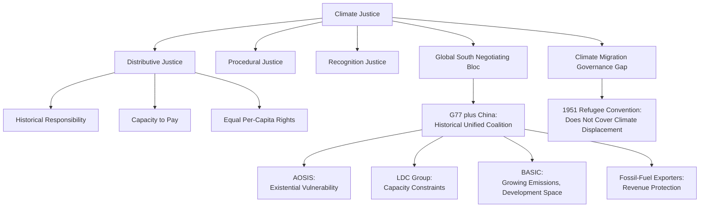

## Climate Justice and North-South Politics

### Definitional Framework

Climate justice examines the ethical, political, and distributive dimensions of climate change and climate policy — specifically the fact that the states, communities, and individuals who have historically contributed least to cumulative greenhouse gas emissions are frequently among those most vulnerable to climate change's physical impacts and least equipped with adaptive capacity, while those who have historically contributed most bear disproportionately lower direct physical vulnerability. North-South politics in the climate context refers to the persistent negotiating cleavage between historically industrialized, high-cumulative-emission "Global North" states and historically lower-emitting, often more climate-vulnerable "Global South" states within international climate governance processes, extending and specifying the Common but Differentiated Responsibilities principle discussed under Global Climate Governance and the UNFCCC Process.

### Conceptual Foundations of Climate Justice

**Distributive Justice Dimension**

The core distributive question: how should the burdens of mitigation (emissions reduction costs) and the costs of climate impacts (adaptation needs, loss and damage) be fairly allocated across states and populations, given vastly unequal historical contribution to the problem and vastly unequal capacity to bear its costs? Major competing distributive principles debated in the climate ethics and political theory literature include:

- **Historical responsibility / polluter pays**: allocating burden in proportion to cumulative historical emissions contribution, on the grounds that those who caused the problem should bear proportionate responsibility for addressing it
- **Capacity to pay**: allocating burden in proportion to current economic capacity/wealth, independent of historical emissions responsibility, on grounds of ability rather than causal responsibility
- **Equal per-capita emissions rights**: allocating an equal per-person entitlement to a global emissions budget, implying high-population developing countries would receive proportionally larger aggregate emissions allowances than smaller high-emitting developed states under this framework
- **Grandfathering**: allocating rights based on existing/historical emissions patterns, effectively favoring incumbent high emitters — generally the position implicitly favored by continuation of status-quo emissions patterns and explicitly rejected by most climate justice scholarship as unjust precisely because it rewards past high emissions

[Inference] No single principle has achieved consensus acceptance in either the academic climate ethics literature or international negotiation practice; actual negotiated outcomes (as reflected in the CBDR-RC principle's deliberately vague formulation) generally represent unresolved political compromise among these competing distributive logics rather than adoption of any single principle.

**Procedural Justice Dimension**

Beyond distributive outcomes, climate justice scholarship emphasizes procedural fairness — whether vulnerable and historically marginalized states and communities have meaningful voice and influence within climate governance processes themselves. Documented procedural justice concerns include resource and capacity asymmetries in negotiation delegation size and technical expertise between wealthy and developing states, and historical patterns of small-group ("green room") negotiation dynamics within UNFCCC processes that critics argue have marginalized smaller and less powerful delegations from key decision points.

**Recognition Justice Dimension**

A third dimension (drawing on broader environmental justice theory, connecting to the Environmental Political Theory content) emphasizing whether the distinct knowledge systems, cultural relationships to land and climate, and lived experiences of marginalized and indigenous communities are adequately recognized and incorporated within climate governance and policy design, rather than being treated as peripheral to a primarily technical/economic policy domain.

### Global North-South Cleavage in Climate Negotiations

**Historical Origins of the Negotiating Bloc Structure**

The North-South climate negotiating cleavage traces institutionally to the broader Non-Aligned Movement and Group of 77 (G77) coalition-building traditions from post-colonial international economic negotiations (including the 1970s New International Economic Order movement), subsequently adapted specifically to climate negotiations through the G77+China coalition, which has historically coordinated developing-country negotiating positions within UNFCCC processes despite substantial internal diversity among G77+China member states' own emissions profiles, vulnerability levels, and economic interests.

**Fragmentation of the Global South Negotiating Bloc**

Contemporary climate governance scholarship documents significant fragmentation within what was once a more unified G77+China bloc, reflecting genuinely divergent interests among developing countries as economic development has proceeded unevenly:

- **Alliance of Small Island States (AOSIS)**: representing small island and low-lying coastal states facing existential vulnerability to sea-level rise, generally advocating for the most ambitious temperature targets and strongest loss-and-damage provisions
- **Least Developed Countries (LDC) Group**: representing the poorest developing countries, emphasizing adaptation finance and capacity constraints
- **BASIC countries (Brazil, South Africa, India, China)**: a coalition of larger, more rapidly industrializing developing economies with substantial and growing current emissions, occupying an increasingly distinct negotiating position from smaller and more climate-vulnerable developing states given their own growing emissions responsibility and negotiating leverage
- **OPEC and major fossil-fuel-exporting developing states**: a further distinct negotiating interest cluster prioritizing continued fossil fuel market access and compensation mechanisms for reduced fossil fuel demand under mitigation scenarios

[Inference] This fragmentation illustrates that the "Global South" is best understood as a coalition-of-convenience negotiating category with genuine internal diversity of material interest, rather than a naturally unified bloc with fully aligned climate policy preferences — a point emphasized across much contemporary comparative and IR climate governance scholarship.

### Climate Vulnerability and Adaptation Politics

**Differential Physical Vulnerability**

Climate vulnerability research (drawing on IPCC assessment frameworks) documents that physical climate impact exposure (sea-level rise, extreme weather intensity, agricultural disruption, water stress) is geographically concentrated in ways that correlate imperfectly but meaningfully with historical low-emission status — small island states, low-lying coastal deltas (e.g., Bangladesh), and drought-vulnerable regions of sub-Saharan Africa are frequently cited as disproportionately exposed relative to their historical emissions contribution.

**Adaptive Capacity as a Distinct Vulnerability Dimension**

Climate vulnerability scholarship distinguishes physical exposure from adaptive capacity (the socioeconomic, institutional, and infrastructural resources available to manage and respond to climate impacts) — meaning vulnerability is a function of both physical exposure and capacity to respond, with wealthy states generally possessing substantially greater adaptive capacity even where physical exposure is comparable, reinforcing rather than offsetting the underlying North-South equity concern.

**Adaptation Finance Politics**

Adaptation finance (support for building resilience to anticipated climate impacts, distinct from both mitigation finance and the loss-and-damage category discussed under Global Climate Governance) has been a persistent point of North-South negotiation contestation, with developing-country negotiators and independent analysts frequently arguing that adaptation finance has historically been under-prioritized relative to mitigation finance within overall climate finance flows, despite adaptation needs being concentrated substantially in the most climate-vulnerable and lowest-emitting states.

### Climate Migration and Displacement

A significant and growing climate justice policy domain: climate-related displacement (from sea-level rise, extreme weather events, and slower-onset impacts like desertification and water stress) raises distinct governance challenges given that existing international refugee law (the 1951 Refugee Convention) does not clearly encompass climate-displaced persons within its legal definition of refugee status, creating a documented governance gap addressed only partially through emerging frameworks (including the non-binding 2018 Global Compact for Migration and various regional and bilateral arrangements) rather than a comprehensive binding international climate-displacement legal regime. [Unverified] This remains an actively developing area of international law and policy; current specific legal and institutional status should be verified against current sources.

### Ethical and Political Theory Frameworks Applied to Climate Justice

**Cosmopolitan vs. Statist Approaches**

- **Cosmopolitan approaches** (drawing on global distributive justice theory, associated with theorists including Simon Caney and Henry Shue) argue climate justice obligations should be analyzed at the level of individuals globally, largely independent of state boundaries — implying wealthy individuals in developing countries and poor individuals in developed countries should be treated according to their actual capacity/vulnerability rather than their state's aggregate classification
- **Statist approaches** treat states as the primary units of both moral responsibility and negotiating obligation (consistent with the UNFCCC's own state-centric CBDR-RC architecture), a framing increasingly challenged by cosmopolitan critics as inadequate given substantial within-state inequality in both emissions responsibility and climate vulnerability

**Rights-Based Framings**

A substantial strand of climate justice advocacy and scholarship frames climate change as fundamentally a human rights issue (right to life, health, food, water, and self-determination, particularly for small island states facing potential territorial loss), providing an alternative normative vocabulary to the more state-centric, interest-based bargaining framing dominant within formal UNFCCC negotiation practice, and increasingly reflected in climate litigation strategies (connecting to broader human rights and international law scholarship) invoking human rights frameworks against both states and, in some documented cases, private corporate emitters.

### Comparative Table: Global South Negotiating Sub-Coalitions

| Coalition | Core Interest | Illustrative Position |
| --- | --- | --- |
| **AOSIS** | Existential vulnerability, survival | Most ambitious temperature targets, strong loss-and-damage provisions |
| **LDC Group** | Poverty, capacity constraints | Adaptation finance prioritization |
| **BASIC** | Development space, growing emissions responsibility | Resistance to binding targets constraining continued industrialization |
| **Fossil-fuel-exporting developing states** | Continued resource-revenue access | Compensation for reduced fossil fuel demand under mitigation scenarios |

### Extended Example: Analyzing a Climate Justice Policy Dispute

Consider a hypothetical dispute over allocation of a newly pledged international adaptation finance fund among developing-country claimants:

- **Distributive justice lens**: competing allocation principles would suggest different outcomes — historical-responsibility framing is less directly applicable here (since recipients, not contributors, are being allocated funds) but capacity-to-pay logic in reverse (need-based allocation) would favor the least-adaptive-capacity states, while a vulnerability-weighted formula would favor the most physically exposed states, and these two allocation logics may not identify the same priority recipients
- **Procedural justice lens**: an analyst would examine whether smaller, lower-capacity delegations (e.g., small island states with limited negotiating staff) had meaningful voice in designing the fund's allocation criteria, or whether allocation criteria were substantially shaped by larger, better-resourced developing-country delegations (e.g., BASIC countries) whose own priorities may not align with the most vulnerable states' needs
- **Fragmentation dynamic**: the dispute would likely surface the documented internal Global South coalition fragmentation directly — AOSIS and LDC Group states prioritizing vulnerability-weighted allocation, while BASIC countries may advocate for allocation formulas that also account for their own substantial (if lower per-capita) populations and development financing needs
- **Cosmopolitan critique**: a cosmopolitan theorist would further note that a purely state-level allocation formula risks misallocating resources relative to actual individual-level need and vulnerability within recipient states, given substantial within-country inequality in exposure to climate impacts

### Diagram: Climate Justice Dimensions and North-South Fragmentation

### Diagram: Emissions Responsibility vs. Vulnerability Mismatch (svg_diagram)

<svg xmlns="http://www.w3.org/2000/svg" viewBox="0 0 640 300">
<text x="320" y="26" text-anchor="middle" font-size="16" font-weight="bold" fill="#1a1a1a">Responsibility–Vulnerability Mismatch (svg_diagram)</text>
<line x1="80" y1="250" x2="580" y2="250" stroke="#495057" stroke-width="2" marker-end="url(#arrowCJ)" />
<line x1="80" y1="250" x2="80" y2="60" stroke="#495057" stroke-width="2" marker-end="url(#arrowCJv)" />
<text x="330" y="272" text-anchor="middle" font-size="11" fill="#495057">Historical Cumulative Emissions (low → high)</text>
<text x="45" y="155" text-anchor="middle" font-size="11" fill="#495057" transform="rotate(-90 45 155)">Physical Climate Vulnerability (low → high)</text>
<circle cx="150" cy="100" r="12" fill="#c92a2a" />
<text x="150" y="130" text-anchor="middle" font-size="11" font-weight="bold" fill="#1a1a1a">AOSIS / LDCs</text>
<text x="150" y="145" text-anchor="middle" font-size="9" fill="#495057">Low emissions, high vulnerability</text>
<circle cx="480" cy="220" r="12" fill="#3b5bdb" />
<text x="480" y="200" text-anchor="middle" font-size="11" font-weight="bold" fill="#1a1a1a">Developed States</text>
<text x="480" y="245" text-anchor="middle" font-size="9" fill="#495057">High emissions, generally lower vulnerability</text>

<text x="320" y="290" text-anchor="middle" font-size="10" fill="`#495057`">The mismatch between these two quadrants is the core empirical basis of the climate justice claim</text>

</svg>

### Key Points

- Climate justice addresses distributive, procedural, and recognition dimensions of climate governance, extending beyond the UNFCCC's primarily distributive CBDR-RC framing
- No single distributive principle (historical responsibility, capacity to pay, equal per-capita rights, grandfathering) has achieved consensus; actual negotiated outcomes reflect unresolved compromise among competing logics
- The Global South negotiating bloc, historically coordinated through G77+China, has fragmented into distinct sub-coalitions (AOSIS, LDC Group, BASIC, fossil-fuel exporters) with genuinely divergent material interests as development has proceeded unevenly
- Climate vulnerability is a function of both physical exposure and adaptive capacity, meaning wealthy and poor states facing comparable physical exposure often face very different overall vulnerability due to capacity differences
- Climate-related displacement exposes a documented governance gap, since the 1951 Refugee Convention's legal definition does not clearly encompass climate-displaced persons, leaving the issue addressed only through non-binding or partial frameworks to date
- Cosmopolitan and statist approaches to climate ethics disagree on whether climate justice obligations should be analyzed at the individual or state level, with the UNFCCC's own architecture reflecting a statist default increasingly challenged by cosmopolitan critique

**Related Topics**

- Global Climate Governance and the UNFCCC Process
- Environmental Political Theory
- Comparative Environmental Policy
- Global Governance and International Institutions
- Migration and Diaspora Politics
- Human Rights and Global Justice
- Post-Colonial Politics and North-South Relations
- International Law and Climate Litigation
- Development Economics and Global Inequality
- Indigenous Politics and Environmental Recognition