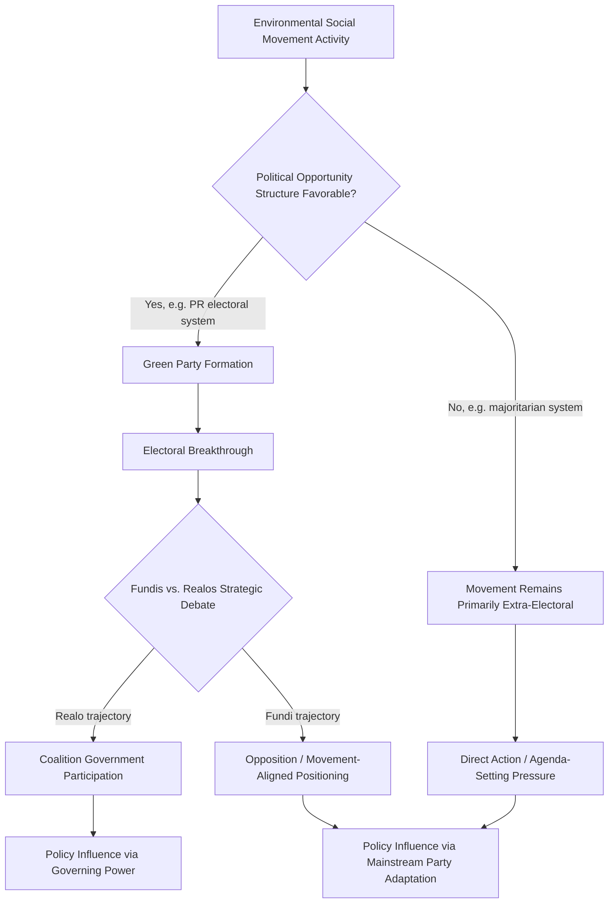

## Environmental Movements and Green Parties

### Definitional Framework

Environmental movements refer to organized collective action by citizens, advocacy organizations, and civil society actors seeking to influence environmental policy, corporate behavior, and public attitudes, operating primarily outside formal electoral and legislative institutions. Green parties refer to the subset of environmental movement activity that has been institutionalized into formal electoral political organizations competing for and holding elected office. The relationship between the two is historically and theoretically significant: green parties emerged substantially as an electoral extension of environmental social movements, and the movement-party relationship continues to shape green party strategy, internal organization, and policy positioning in ways distinct from more conventional party formation processes.

### Theoretical Frameworks for Environmental Movement Emergence

**New Social Movement Theory**

Environmental movements are frequently analyzed within the broader "new social movement" theoretical tradition (associated with scholars including Alberto Melucci, Claus Offe, and Alain Touraine), which distinguishes post-1960s movements (environmental, feminist, peace, LGBTQ+ rights) from earlier labor and class-based movements by their emphasis on identity, quality-of-life, and post-material values rather than primarily material/economic distributive claims, and by their tendency toward decentralized, non-hierarchical organizational forms rather than traditional hierarchical labor-union-style organization.

**Post-Materialism (Ronald Inglehart)**

Inglehart's influential post-materialist values thesis (developed from cross-national World Values Survey research beginning in the 1970s) argues that economic security in advanced industrial societies enables a generational values shift from materialist priorities (economic and physical security) toward post-materialist priorities (self-expression, quality of life, environmental protection), providing an influential explanatory account for why environmental movements and green parties emerged prominently first in wealthy, economically secure democracies. [Inference] This thesis has been influential but is not uncontested; critics note that environmental concern and mobilization also occurs in lower-income contexts (often connected more directly to immediate resource/livelihood concerns than abstract post-material quality-of-life values), suggesting post-materialism may better explain the specific form and framing of environmentalism in wealthy democracies than environmental concern's global distribution as such.

**Resource Mobilization Theory**

An alternative or complementary framework (associated with scholars including John McCarthy and Mayer Zald) emphasizing that movement emergence and success depend substantially on organizational resources, funding, leadership, and strategic capacity — rather than resulting automatically or directly from underlying grievance or value change — helping explain why environmental concern does not automatically translate into successful movement mobilization or electoral party formation without adequate organizational infrastructure.

**Political Opportunity Structure Theory**

A framework (associated with scholars including Sidney Tarrow and Doug McAdam) emphasizing that movement emergence and success depend on the broader political-institutional context — electoral system openness, allied elite presence, state repression capacity/willingness — helping explain comparative cross-national variation in environmental movement and green party success independent of underlying public environmental concern levels.

### Historical Development of the Environmental Movement

**First Wave: Conservation and Preservation (Late 19th–Early 20th Century)**

Institutionalized through organizations including the Sierra Club (founded 1892, associated with John Muir's preservationist tradition discussed under Environmental Political Theory) and early wildlife/wilderness protection advocacy, generally organized around elite and middle-class constituencies and focused on protected-area designation rather than broader industrial or economic-system critique.

**Second Wave: Modern Environmentalism (1960s–1970s)**

Catalyzed substantially by Rachel Carson's *Silent Spring* (1962), documenting pesticide (particularly DDT) ecological harms and galvanizing broader public environmental consciousness; marked institutionally by the first Earth Day (1970), the establishment of major environmental regulatory agencies in numerous developed democracies (including the U.S. EPA), and the founding of major contemporary environmental advocacy organizations (Friends of the Earth, Greenpeace, both founded early 1970s) employing more confrontational direct-action tactics than earlier conservation organizations.

**Third Wave: Environmental Justice and Diversification (1980s–1990s)**

The emergence of environmental justice organizing (discussed under Environmental Political Theory, catalyzed by the 1982 Warren County protests) diversified the movement's constituency and framing beyond the substantially white, middle-class base of earlier conservation and mainstream environmentalism, introducing explicit race and class distributive-justice framing into movement discourse and creating some documented internal movement tension between "mainstream" environmental organizations and environmental justice organizers over strategic priorities and framing.

**Fourth Wave: Climate-Centered Mobilization (2000s–present)**

Increasing movement consolidation around climate change specifically as the organizing issue, marked by developments including 350.org's international climate campaign network (founded 2008), the youth-led climate strike movement associated with Greta Thunberg and Fridays for Future (beginning 2018), and Extinction Rebellion's adoption of explicit civil-disobedience tactics (founded 2018) — with the youth-led and civil-disobedience-oriented strands generally representing a more confrontational and urgency-framed movement posture than earlier mainstream environmental advocacy organization strategies.

### Green Party Formation and Electoral Development

**Origins and Early Electoral Breakthroughs**

Green parties emerged substantially from the convergence of 1970s environmental movement activism with broader New Left and peace movement currents, with early formal party organization and electoral breakthrough occurring first and most prominently in West Germany (Die Grünen, founded 1980, entering the Bundestag in 1983) — a case frequently analyzed as the paradigmatic green party formation, reflecting Germany's proportional representation electoral system (lowering the barrier to new-party parliamentary entry relative to majoritarian systems) and strong pre-existing social movement infrastructure.

**"Fundis vs. Realos" Internal Debate**

A defining internal strategic and ideological tension within green party development, most extensively documented within Die Grünen but recurring across many green parties: the debate between "Fundis" (fundamentalists, favoring movement-style politics, coalition-avoidance, and uncompromising policy positions) and "Realos" (realists, favoring conventional coalition-participation and policy-compromise strategies to achieve incremental governing influence) — a tension reflecting the broader theoretical question of whether green parties should function primarily as movement-representation vehicles or as conventional governing-coalition-seeking parties, with most established green parties having gradually shifted toward Realo-oriented strategies as they matured electorally.

**Comparative Electoral Performance**

Green party electoral success varies substantially cross-nationally, with proportional representation systems generally associated with stronger green party electoral viability (consistent with Duverger's Law-style electoral system effects on multi-party viability) relative to majoritarian/plurality systems, where green parties have historically struggled to gain significant parliamentary representation (e.g., the U.S. Green Party's persistent electoral marginalization under the plurality/first-past-the-post system, occasionally functioning as a documented "spoiler" concern for major-party coalition-building rather than as a viable governing party in its own right).

**Green Parties in Government**

Several green parties have moved from purely opposition/movement-representation roles into formal governing coalition participation, with Germany's Die Grünen providing an extensively studied case (including coalition government participation at federal level under different coalition partners across multiple periods), generating substantial comparative research on how governing participation affects green party policy positioning, internal cohesion, and relationship to the broader environmental movement base that originally produced the party.

### Movement-Party Relationship Dynamics

**Institutionalization and Movement-Party Tension**

A recurring theoretical and empirical theme: as green parties professionalize and pursue conventional electoral and governing strategies, tension frequently emerges with the broader environmental movement's more radical or purist factions, who may view party governing compromises as inadequate or as representing co-optation of movement goals — a dynamic paralleling broader social-movement-theory findings about institutionalization's tendency to moderate movement goals and tactics over time (sometimes termed movement "domestication" in the broader social movement literature).

**Division of Labor Between Movement and Party Strategies**

Comparative research increasingly frames the environmental movement and green parties as occupying a complementary rather than strictly overlapping strategic space — movements retaining capacity for more radical framing, direct action, and agenda-setting pressure (exemplified by Extinction Rebellion's civil disobedience tactics), while green parties pursue institutional, legislative, and coalition-based policy influence — with some scholarship suggesting movement radical-flank pressure can indirectly strengthen more moderate green party negotiating position within governing coalitions (a "radical flank effect" documented more broadly in social movement theory).

**Mainstream Party Environmental Policy Adoption**

An important comparative pattern: in many democracies, green parties' most significant long-term policy impact may operate less through their own direct governing power (often limited, particularly in majoritarian systems) than through agenda-setting pressure that induces mainstream parties to adopt stronger environmental policy positions to compete for environmentally concerned voters — a dynamic studied within the broader comparative party competition literature on minor-party issue-ownership and mainstream-party policy adaptation.

### Comparative Table: Environmental Movement Waves

| Wave | Period | Primary Framing | Key Organizations/Events |
| --- | --- | --- | --- |
| **First wave** | Late 19th–early 20th c. | Conservation/preservation | Sierra Club |
| **Second wave** | 1960s–1970s | Pollution, ecological harm, regulatory reform | Silent Spring, Earth Day, Greenpeace, Friends of the Earth |
| **Third wave** | 1980s–1990s | Environmental justice, distributive equity | Warren County protests, environmental justice organizing |
| **Fourth wave** | 2000s–present | Climate urgency, youth mobilization, civil disobedience | 350.org, Fridays for Future, Extinction Rebellion |

### Extended Example: Applying the Frameworks to a Comparative Case

Consider a hypothetical comparison of green party electoral trajectories in a proportional-representation democracy versus a majoritarian democracy, both with comparable levels of underlying public environmental concern:

- **Political opportunity structure lens**: the proportional-representation system's lower parliamentary entry threshold provides a structural opening for green party electoral viability that the majoritarian system's higher effective threshold denies, predicting divergent electoral outcomes despite similar underlying public concern — consistent with the German vs. U.S. comparative pattern noted above
- **Resource mobilization lens**: even within the more favorable proportional-representation context, actual green party electoral success would still depend on organizational capacity, funding, and leadership development, rather than following automatically from favorable structural opportunity alone
- **Fundis/Realos dynamic**: as the PR-system green party grows electorally viable enough to plausibly enter governing coalitions, internal debate over coalition participation versus movement-purity positioning would be expected to intensify, following the documented Die Grünen historical pattern
- **Mainstream party adaptation**: independent of the green party's own direct electoral trajectory in either system, an analyst would also examine whether mainstream parties in both systems adjusted their own environmental policy positioning in response to green party agenda-setting pressure — a pathway of green political influence that operates somewhat independently of the green party's own direct electoral success level

### Diagram: Movement-to-Party Institutionalization Pathway

### Diagram: Four Waves of Environmental Movement Development (svg_diagram)

<svg xmlns="http://www.w3.org/2000/svg" viewBox="0 0 680 260">
<text x="340" y="26" text-anchor="middle" font-size="16" font-weight="bold" fill="#1a1a1a">Four Waves of Environmental Mobilization (svg_diagram)</text>
<line x1="60" y1="140" x2="620" y2="140" stroke="#495057" stroke-width="2" marker-end="url(#arrowW)" />
<circle cx="120" cy="140" r="8" fill="#3b5bdb" />
<text x="120" y="115" text-anchor="middle" font-size="11" font-weight="bold" fill="#1a1a1a">Conservation</text>
<text x="120" y="170" text-anchor="middle" font-size="9" fill="#495057">Sierra Club</text>
<text x="120" y="184" text-anchor="middle" font-size="9" fill="#495057">Late 1800s+</text>
<circle cx="280" cy="140" r="8" fill="#2f9e44" />
<text x="280" y="115" text-anchor="middle" font-size="11" font-weight="bold" fill="#1a1a1a">Modern Environmentalism</text>
<text x="280" y="170" text-anchor="middle" font-size="9" fill="#495057">Silent Spring, Earth Day</text>
<text x="280" y="184" text-anchor="middle" font-size="9" fill="#495057">1960s–70s</text>
<circle cx="440" cy="140" r="8" fill="#e8b339" />
<text x="440" y="115" text-anchor="middle" font-size="11" font-weight="bold" fill="#1a1a1a">Environmental Justice</text>
<text x="440" y="170" text-anchor="middle" font-size="9" fill="#495057">Warren County</text>
<text x="440" y="184" text-anchor="middle" font-size="9" fill="#495057">1980s–90s</text>
<circle cx="580" cy="140" r="8" fill="#c92a2a" />
<text x="580" y="115" text-anchor="middle" font-size="11" font-weight="bold" fill="#1a1a1a">Climate Mobilization</text>
<text x="580" y="170" text-anchor="middle" font-size="9" fill="#495057">Fridays for Future, XR</text>
<text x="580" y="184" text-anchor="middle" font-size="9" fill="#495057">2000s–present</text>
</svg>

### Key Points

- New social movement theory, post-materialism, resource mobilization theory, and political opportunity structure theory offer complementary rather than competing explanations for environmental movement and green party emergence
- The environmental movement's historical development is commonly periodized into four waves — conservation, modern environmentalism, environmental justice, and climate-centered mobilization — each with distinct framing, tactics, and constituency
- Germany's Die Grünen represents the paradigmatic green party formation case, with the "Fundis vs. Realos" internal debate over movement-purity versus coalition-participation strategy recurring across many subsequently formed green parties
- Proportional representation electoral systems are strongly associated with greater green party electoral viability relative to majoritarian systems, consistent with broader Duverger's-Law-style electoral system effects on minor-party viability
- Green parties' most significant long-term policy influence may operate as much through agenda-setting pressure inducing mainstream party environmental policy adaptation as through green parties' own direct governing power, particularly in majoritarian electoral contexts
- Movement institutionalization into electoral party form frequently generates internal tension between purist/radical movement factions and pragmatic/governing-oriented party factions, a pattern consistent with broader social movement theory findings about institutionalization's moderating effects

**Related Topics**

- Environmental Political Theory
- Comparative Environmental Policy
- Climate Justice and North-South Politics
- Social Movement Theory and Collective Action
- Comparative Party Systems and Electoral Rules
- Post-Materialism and Value Change
- Political Opportunity Structure and Protest Politics
- Environmental Justice and Distributive Politics
- Coalition Government Formation and Bargaining
- Civil Disobedience and Direct Action Politics