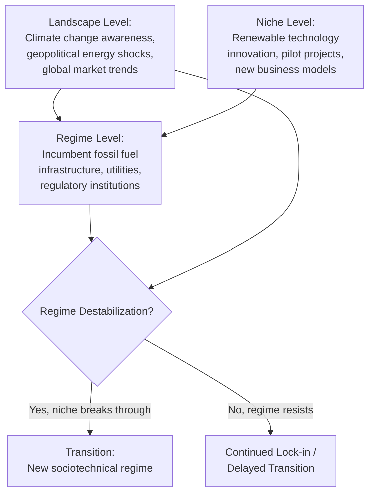

## The Politics of Energy Transition

### Definition and Scope

The politics of energy transition examines the political conflicts, institutional arrangements, and distributive struggles involved in shifting energy systems away from fossil fuels (coal, oil, natural gas) toward low-carbon alternatives (renewables, nuclear, and associated storage and grid technologies). Unlike purely technical or economic analyses of energy systems, this field treats energy transition as an inherently political process involving contested interests, path-dependent institutions, and unequal distribution of costs and benefits across social groups, regions, and generations.

Core analytical dimensions include:

- **Political economy of incumbency** — how established fossil fuel industries and their political coalitions shape (and often resist) transition policy
- **Multi-level governance** — the interaction of international, national, and subnational institutions in setting and implementing transition policy
- **Distributive justice** — who bears the costs and reaps the benefits of transition (just transition, energy poverty, stranded assets)
- **Policy instrument design** — the political viability and effects of carbon pricing, subsidies, mandates, and regulatory standards
- **Geopolitics of energy** — how transition reshapes international power relations tied to resource endowments and supply chains

### Theoretical Foundations

**Key Points**

- **Socio-technical transitions theory**, particularly the **Multi-Level Perspective (MLP)** developed by Frank Geels, models transitions as interactions among niche innovations (experimental technologies), the sociotechnical regime (dominant institutions, infrastructure, and practices), and the broader landscape (macro-trends such as climate change awareness or geopolitical shocks) — providing a widely used framework for explaining why energy transitions unfold unevenly and non-linearly.
- **Path dependency and carbon lock-in** (a concept developed by Gregory Unruh, 2000) describes how existing fossil-fuel-based infrastructure, institutions, and behavioral norms create self-reinforcing barriers to alternative technologies, even when those alternatives become cost-competitive.
- **Advocacy Coalition Framework** (Paul Sabatier and Hank Jenkins-Smith) is frequently applied to energy politics to explain how competing coalitions—organized around shared belief systems about energy security, environmental protection, or economic development—compete for influence over policy over extended time horizons (a decade or more).
- **Petro-politics / resource curse literature** (e.g., work associated with Terry Lynn Karl, Michael Ross) examines how fossil fuel dependence shapes domestic political institutions, often associated with weaker democratic accountability and rentier state dynamics, providing context for why fossil-fuel-dependent states face distinct transition political economies.
- [Inference] These frameworks are complementary rather than competing in most applied research; scholars frequently combine MLP's systemic account of change with advocacy-coalition or interest-group analysis of specific policy battles.

### Political Economy of Incumbency and Resistance

**Key Points**

- Fossil fuel industries historically have deployed sustained lobbying, public relations campaigns, and strategic litigation to slow or shape transition policy; documented historical examples include coordinated industry-funded efforts questioning climate science consensus from the late 20th century onward, subject to extensive investigative journalism and academic study (e.g., work associated with Naomi Oreskes and Erik Conway's *Merchants of Doubt*).
- "Stranded assets" — fossil fuel reserves, infrastructure, or capital investments that lose economic value as transition policy or market shifts render them uneconomical or unusable — create powerful incentives for incumbent industries and fossil-fuel-dependent regional economies to resist rapid transition timelines.
- Regional and occupational concentration of fossil fuel employment (e.g., coal-mining regions) generates concentrated political resistance disproportionate to the sector's national economic weight, a dynamic frequently cited to explain the political salience of coal transition debates in regions such as Germany's Ruhr/Lusatia coalfields, Appalachia in the United States, or Poland's Silesia region.
- [Inference] The relative political power of incumbent versus emerging (renewable) energy interests is shifting as renewable industries scale and develop their own lobbying capacity, though the pace and extent of this shift vary considerably by country and remain an active area of empirical study.

### Policy Instruments for Energy Transition

| Instrument | Mechanism | Political Characteristics |
| --- | --- | --- |
| Carbon pricing (tax or cap-and-trade) | Internalizes carbon externality cost | Economically efficient in theory; often politically difficult due to visible, concentrated costs (e.g., France's 2018 "gilets jaunes" protests, triggered partly by a proposed fuel tax increase) |
| Renewable subsidies (feed-in tariffs, tax credits) | Lowers cost of renewable deployment | Politically popular (diffuse, visible benefits) but can create fiscal burden and market distortion concerns |
| Renewable portfolio standards / mandates | Requires utilities to source a minimum share from renewables | Shifts compliance cost to utilities/ratepayers rather than general taxpayers; politically durable once enacted |
| Fossil fuel subsidy removal | Eliminates existing support for fossil fuel production/consumption | Highly contentious; can trigger acute public backlash, especially where subsidies lower consumer energy costs (documented in multiple developing-country contexts) |
| Just Transition programs | Worker retraining, community investment in fossil-fuel-dependent regions | Designed explicitly to build political coalitions supportive of transition by addressing distributive harms |

**Example**

France's 2018 fuel tax increase, intended to incentivize reduced fossil fuel consumption as part of climate policy, triggered the "gilets jaunes" (yellow vests) protest movement, illustrating the political vulnerability of carbon pricing instruments when perceived as regressive — falling disproportionately on lower-income, rural, and car-dependent populations relative to wealthier urban populations with greater access to public transit alternatives. [Unverified: specific policy design details and subsequent government concessions evolved over the course of the protests and should be checked against detailed case-study sources for precise sequencing.]

### Diagram: Multi-Level Perspective on Energy Transitions

### Just Transition and Distributive Justice

**Key Points**

- The concept of "just transition," originating in labor movement advocacy (associated with the Oil, Chemical and Atomic Workers union in the United States in the 1990s) and later adopted into international climate policy discourse (referenced in the Paris Agreement's preamble), emphasizes that transition policy should address the economic and social costs borne by workers and communities dependent on fossil fuel industries.
- Energy poverty and affordability concerns intersect with transition politics, since decarbonization policies affecting electricity or fuel prices can disproportionately burden lower-income households unless designed with compensatory mechanisms (rebates, targeted subsidies, progressive rate structures).
- International distributive justice debates concern differentiated responsibility between developed and developing countries, reflected in the UNFCCC principle of "common but differentiated responsibilities" and ongoing disputes over climate finance for developing-country transitions.
- [Inference] The practical design and adequacy of just transition programs varies enormously across cases; academic assessment of whether existing programs (e.g., Germany's coal phase-out compensation package) genuinely deliver adequate compensation to affected workers and communities remains contested and case-specific.

### Multi-Level Governance of Energy Transition

**International Level**

- The Paris Agreement (2015) establishes a framework of nationally determined contributions (NDCs) without directly mandating specific energy transition pathways, leaving substantial discretion to national governments.
- International Energy Agency (IEA) scenarios and reporting have become influential reference points in transition policy debates, including its widely cited 2021 Net Zero by 2050 roadmap.

**National Level**

- National governments set overarching regulatory frameworks, carbon pricing (where adopted), renewable energy targets, and industrial policy (e.g., subsidies for domestic renewable manufacturing, exemplified by the US Inflation Reduction Act of 2022's clean energy tax credit structure).
- Federal systems create additional complexity, as subnational units (US states, German Länder, Canadian provinces) often possess significant independent authority over electricity regulation and can accelerate or resist national transition trajectories.

**Subnational and Local Level**

- Cities and municipalities increasingly pursue independent climate and energy commitments (e.g., through networks such as C40 Cities), sometimes exceeding national ambition levels.
- Local political conflicts over siting of renewable infrastructure (wind farms, solar installations, transmission lines) — sometimes termed NIMBY ("not in my backyard") dynamics — represent a significant and empirically documented barrier to renewable deployment even in jurisdictions with strong national transition commitments.

### Geopolitics of Energy Transition

**Key Points**

- Transition away from fossil fuels alters the geopolitical significance of traditional oil- and gas-exporting states, with implications for their fiscal stability, domestic political arrangements, and international influence — a subject of extensive analysis in energy geopolitics literature.
- Critical mineral supply chains (lithium, cobalt, rare earth elements) essential for renewable and battery technologies introduce new geopolitical dependencies and supply concentration risks, with significant production and processing concentrated in a small number of countries (e.g., the Democratic Republic of Congo for cobalt, China for rare earth processing).
- [Unverified: current market share and production concentration figures for specific critical minerals shift with new investment and mining developments; specific percentage figures should be verified against current industry and government sources rather than treated as fixed.]
- Energy transition is increasingly framed as an industrial policy competition among major economies (the United States, European Union, and China) over manufacturing capacity for solar panels, batteries, and electric vehicles, with significant implications for trade policy and international economic relations.

### Comparative National Trajectories

| Country/Region | Notable Transition Feature | Political Dynamic |
| --- | --- | --- |
| Germany | *Energiewende* (energy transition) policy combining renewable expansion with nuclear phase-out | Strong coalition政治 support for renewables historically, contested by concerns over energy costs and coal-region impacts |
| China | Rapid renewable and EV manufacturing scale-up alongside continued coal capacity additions | State-directed industrial policy combined with energy security concerns given coal resource endowment |
| United States | Federalism-driven variation; significant recent federal investment via Inflation Reduction Act | Partisan polarization on climate policy; state-level divergence (e.g., California vs. Texas approaches) |
| Poland | High dependence on domestic coal for energy security and employment | Strong political resistance to EU-level decarbonization mandates, tied to regional employment concerns |
| Gulf states (e.g., UAE, Saudi Arabia) | Economic diversification efforts alongside continued oil export reliance | Balancing rentier-state fiscal dependence on oil revenue with long-term diversification strategy |

[Inference] The table reflects general, widely discussed patterns in comparative energy politics literature as of recent years; specific policy details in any of these cases continue to evolve and should be checked against current sources for up-to-date specifics.

### Applied Example: Coal Phase-Out Political Coalition Analysis

**Example**

Germany's coal phase-out process (formalized through the *Kohleausstiegsgesetz*, enacted 2020, following recommendations of the government-appointed Coal Commission) illustrates coalition-based transition politics: the process brought together representatives of environmental groups, labor unions, utility companies, and affected coal-region state governments in a structured negotiation, resulting in a phase-out timeline paired with substantial financial compensation for affected regions and workers. This corporatist, negotiated approach contrasts with more adversarial, court- or legislation-driven approaches to fossil fuel phase-out seen in other national contexts. [Unverified: precise compensation figures and final phase-out dates were subject to subsequent legislative and political adjustment; verify against current German energy policy sources for exact current status.]

### Common Pitfalls and Debates

**Key Points**

- Treating energy transition as a purely technical or economic optimization problem, when political feasibility, distributive impacts, and institutional path dependency are frequently the binding constraints on transition speed, not technology cost curves alone.
- Assuming uniform public support for climate action translates automatically into support for specific transition policy instruments; extensive survey research finds public support varies significantly depending on how costs are distributed and perceived (a key finding underlying the "gilets jaunes" and similar backlash episodes).
- Underestimating the political durability of fossil fuel-dependent regional economies and the coalitions built around them, even as national-level climate commitments become more ambitious.
- [Speculation] The long-term political economy effects of declining renewable costs — potentially reducing the political salience of transition costs over time as clean energy becomes cost-competitive without subsidy — is a subject of ongoing debate; whether cost trends alone will resolve political resistance or whether distributive and identity-based conflicts will persist independent of cost considerations remains unsettled in the literature.

### Related Topics

- Multi-Level Perspective (MLP) and socio-technical transitions theory (Frank Geels)
- Carbon lock-in and path dependency in energy infrastructure
- Just transition policy design and labor movement origins
- Advocacy Coalition Framework applied to energy and climate policy
- Resource curse and petro-state political economy
- Carbon pricing political feasibility and the "gilets jaunes" case
- Critical mineral supply chains and geopolitical dependency risk
- Federalism and subnational climate policy divergence (US states, German Länder)
- International climate finance and common but differentiated responsibilities
- Industrial policy competition in renewable manufacturing (US, EU, China)