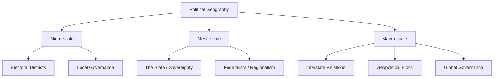

## Foundations of Political Geography

### Definition and Scope

Political geography is the subfield of human geography concerned with the spatial organization of political phenomena. It examines how power, territory, and governance interact across scales — from the local (municipal boundaries, electoral districts) to the global (state sovereignty, international borders, geopolitical blocs). Its central concern is the relationship between **space** and **power**: how political authority is territorially organized, contested, and legitimized.

Three organizing scales are conventionally distinguished:

- **Micro-scale**: electoral districts, local governance, neighborhood politics
- **Meso-scale**: the state as a territorial unit, sub-national regions, federalism
- **Macro-scale**: interstate relations, geopolitics, global governance structures

Political geography differs from political science proper in its emphasis on **spatiality** — it treats territory not as a passive backdrop for politics but as an active variable shaping political behavior and outcomes.

### Historical Development of the Field

**Friedrich Ratzel (1844–1904)** founded the discipline's modern study with his concept of the *state as a biological organism* that grows or shrinks in relation to its environment. His 1897 work *Politische Geographie* introduced the notion of **Lebensraum** ("living space"), arguing states require room to expand to remain healthy — an idea later distorted and weaponized by Nazi ideology.

**Rudolf Kjellén** (Swedish political scientist) coined the term **geopolitik** in 1899, building on Ratzel's organic state theory and framing the state as a spatial phenomenon subject to internal power struggles.

**Halford Mackinder (1861–1947)** proposed the **Heartland Theory** (1904), arguing that control of the Eurasian "Heartland" (roughly Central Asia/Eastern Europe) was the key to world dominance, encapsulated in his dictum: "Who rules East Europe commands the Heartland; who rules the Heartland commands the World-Island; who rules the World-Island commands the world."

**Nicholas Spykman (1893–1943)** countered with the **Rimland Theory**, contending that the coastal periphery ("Rimland") surrounding the Heartland — not the Heartland itself — was strategically decisive, since it controlled access to sea lanes and resources. This theory heavily influenced U.S. Cold War containment strategy.

**Alfred Thayer Mahan (1840–1914)** emphasized **sea power** as the determinant of great-power status, arguing naval control of key maritime chokepoints and trade routes was foundational to national strength.

The field experienced a **post-WWII decline** due to its association with Nazi geopolitics (*Geopolitik* under Karl Haushofer), before being revived in the 1970s–80s through a "critical turn" influenced by Marxist and constructivist approaches (e.g., Peter Taylor, John Agnew), which reframed territory as socially produced rather than naturally given.

### Core Concepts

**Territory and Territoriality**

Territory is a bounded, socially constructed space over which control is claimed and exercised. **Territoriality** (per geographer Robert Sack) is the strategy of using bounded space to affect, influence, or control people, resources, and relationships. Sack identifies territoriality as involving:

1. Classification of space (defining what is "inside" vs. "outside")
2. Communication of boundaries (markers, signage, legal codification)
3. Enforcement of control over that space

**Sovereignty**

Sovereignty is the supreme authority within a territory, encompassing both **internal sovereignty** (the state's monopoly on legitimate authority within its borders — after Max Weber's monopoly on legitimate violence) and **external sovereignty** (recognition by other states as an independent, equal actor in the international system). The **Westphalian model**, dating to the Peace of Westphalia (1648), established the norm of territorially bounded, mutually recognizing sovereign states as the basic unit of the international order.

**Boundaries and Frontiers**

- **Boundaries**: precise, legally defined lines separating sovereign territories
- **Frontiers**: historically, zones of transition or contact (often pre-modern, prior to boundary delimitation)

Boundaries are classified by genesis:

- **Antecedent**: drawn before an area is significantly settled
- **Subsequent**: drawn after settlement, often reflecting existing cultural/ethnic patterns
- **Superimposed**: imposed by external powers over existing cultural landscapes, disregarding local patterns (e.g., many African colonial boundaries)
- **Relic**: no longer functioning as an active boundary but still visible in the landscape (e.g., former Berlin Wall route)

Boundaries are also classified by morphology:

- **Geometric**: straight lines, often following latitude/longitude (e.g., much of the US-Canada border)
- **Physical/Natural**: following rivers, mountain ranges, or other landforms

**The State, Nation, and Nation-State**

- **State**: a legal-political entity with defined territory, population, government, and sovereignty (per the Montevideo Convention criteria, 1933)
- **Nation**: a group of people bound by shared identity — language, culture, history, ethnicity, or civic values
- **Nation-state**: a state whose territorial boundaries closely align with a nation's population (rare in pure form; most states are multi-national)
- **Stateless nation**: a nation without its own sovereign state (e.g., Kurds, Palestinians prior to statehood recognition debates)

**Core-Periphery Theory**

Adapted from world-systems theory (Immanuel Wallerstein), this framework describes uneven spatial development: **core** regions concentrate capital, political power, and technological advancement, while **periphery** regions supply raw materials/labor and remain economically dependent. A **semi-periphery** occupies an intermediate position. Applied at multiple scales — global (Global North/South), national (capital city vs. hinterland), and urban (downtown vs. exurbs).

**Geopolitics vs. Political Geography**

- **Political geography** is the broader academic discipline studying spatial dimensions of all political phenomena
- **Geopolitics** specifically examines the influence of geographic factors (location, resources, terrain) on interstate power relations and foreign policy strategy

### Diagram: Scales of Political Geography

### Key Theoretical Frameworks Compared

| Theory | Proponent | Core Claim | Strategic Implication |
| --- | --- | --- | --- |
| Heartland Theory | Mackinder (1904) | Control of Eurasian interior = world dominance | Contain land powers in Central Asia/E. Europe |
| Rimland Theory | Spykman (1942) | Coastal periphery is strategically decisive | Contain via encirclement (basis of NATO/SEATO logic) |
| Sea Power Theory | Mahan (1890) | Naval dominance determines great-power status | Build blue-water navies, control chokepoints |
| Organic State Theory | Ratzel (1897) | States behave like organisms needing space | Territorial expansion as national necessity |
| World-Systems/Core-Periphery | Wallerstein (1974) | Global economy structured into unequal zones | Explains persistent underdevelopment patterns |

### Illustration: Core-Periphery Spatial Model (svg_diagram)

<svg xmlns="http://www.w3.org/2000/svg" viewBox="0 0 500 300">
<rect width="500" height="300" fill="#ffffff" />
<text x="250" y="24" text-anchor="middle" font-size="16" font-weight="bold" font-family="sans-serif">Core-Periphery Spatial Model (svg_diagram)</text>
<circle cx="250" cy="170" r="110" fill="#dbe9f6" stroke="#2c5f8a" stroke-width="2" />
<circle cx="250" cy="170" r="70" fill="#a9cce8" stroke="#2c5f8a" stroke-width="2" />
<circle cx="250" cy="170" r="35" fill="#3f7cac" stroke="#1e3f5a" stroke-width="2" />
<text x="250" y="175" text-anchor="middle" font-size="12" fill="#ffffff" font-family="sans-serif">Core</text>
<text x="250" y="115" text-anchor="middle" font-size="12" fill="#1e3f5a" font-family="sans-serif">Semi-Periphery</text>
<text x="250" y="65" text-anchor="middle" font-size="12" fill="#1e3f5a" font-family="sans-serif">Periphery</text>
<text x="250 " y="290" text-anchor="middle" font-size="11" fill="#444444" font-family="sans-serif">Capital, power, and innovation concentrate at the core; resource/labor dependency increases outward</text>
</svg>

### Example: Applying These Concepts

Consider the boundary between Nigeria and Cameroon, formalized through 20th-century colonial agreements between Britain, France, and Germany. This is a **superimposed boundary** — drawn by external colonial powers with limited regard for existing ethnic and linguistic distributions (notably splitting Igbo, Hausa, and other ethnic populations across the line). This produced longstanding tension in the **Bakassi Peninsula**, resolved by the International Court of Justice in 2002, illustrating how colonial-era boundary-making generates persistent territorial disputes — a recurring pattern across post-colonial Africa and South Asia.

### [Inference] Contemporary Relevance

The classical geopolitical theories (Heartland/Rimland) remain influential in analyzing contemporary great-power competition — for instance, in framing discussions of Russian influence in Eastern Europe or Chinese Belt and Road infrastructure investment across Eurasia. However, whether these early-20th-century frameworks adequately capture cyber, economic, and non-state actor dimensions of 21st-century geopolitics is a matter of ongoing scholarly debate rather than settled consensus.

### Related Topics

- Geopolitical theories in depth (Heartland, Rimland, Domino Theory, Shatterbelt regions)
- Border disputes and irredentism
- Electoral geography and gerrymandering
- Federalism and territorial devolution
- Critical geopolitics and the constructivist turn
- Geopolitics of resources (oil, water, rare earth minerals)
- Enclaves, exclaves, and microstates
- The geography of nationalism and separatism