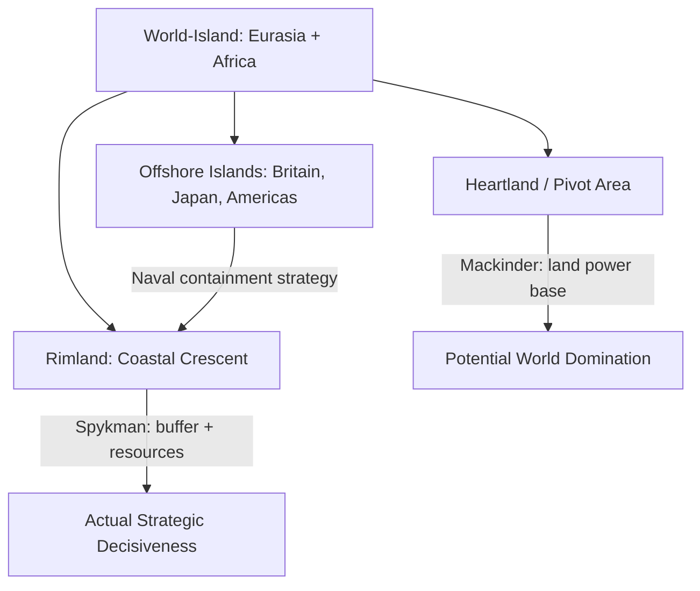

## Classical Geopolitical Theory

### Definition and Scope

Classical geopolitical theory refers to the body of thought developed primarily between the 1890s and 1940s that sought to explain and predict state power and interstate conflict through the lens of physical geography — location, terrain, resources, and spatial relationships. Unlike later "critical geopolitics," which treats geopolitical reasoning itself as a social construction to be interrogated, classical theory treated geography as an objective, largely deterministic factor shaping national strategy and destiny. It is distinguished from general political geography by its explicit focus on **great-power competition** and **grand strategy**.

### Intellectual Origins: Environmental Determinism

Classical geopolitics emerged from 19th-century **environmental (geographic) determinism**, the view that physical environment fundamentally shapes — and largely determines — human political, economic, and cultural development. This intellectual current, influenced by Darwinian evolutionary thought, framed states as organisms in a struggle for survival over territory and resources.

**Friedrich Ratzel** applied this organicist logic directly to states in *Politische Geographie* (1897), proposing that states, like living organisms, require **Lebensraum** ("living space") to grow and remain vigorous, and that a state's borders are merely a temporary marker of its organism's vital energy at a given moment — implying territorial expansion is a natural and legitimate expression of state health. This theory was later appropriated and radicalized by Nazi ideologues (notably Karl Haushofer) to justify German territorial expansion in the 1930s–40s, permanently associating the term "geopolitics" with imperialist aggression for decades.

**Rudolf Kjellén** coined "geopolitik" in 1899 and extended Ratzel's organicism, framing the state as engaged in a Darwinian struggle in which only the geographically and organizationally fittest states survive.

### Mackinder's Heartland Theory

**Sir Halford Mackinder** presented "The Geographical Pivot of History" to the Royal Geographical Society in 1904, later expanded in *Democratic Ideals and Reality* (1919). His core argument:

1. The Eurasian landmass constitutes a "World-Island" containing the majority of the world's population, resources, and landmass.
2. Within this World-Island lies the **Heartland** (Pivot Area) — roughly the interior of Russia/Central Asia — which is inaccessible to sea power and historically served as a base for nomadic invasions (Huns, Mongols).
3. Railways and industrialization had transformed the Heartland from a zone of vulnerability into a zone of potential dominance, since a land power controlling it could project power outward while remaining shielded from naval powers.

His famous formulation:

> "Who rules East Europe commands the Heartland: Who rules the Heartland commands the World-Island: Who rules the World-Island commands the World."

**Strategic implication**: Maritime/naval powers (like Britain, later the U.S.) must prevent any single power from consolidating control over Eastern Europe and the Heartland, since this would provide the resource base to eventually out-produce and challenge sea powers globally. This logic directly informed 20th-century concerns about a Germany-Russia alliance and later Cold War containment strategy.

### Spykman's Rimland Theory

**Nicholas Spykman**, writing in *America's Strategy in World Politics* (1942) and posthumously in *The Geography of the Peace* (1944), revised Mackinder's model by arguing that the **Rimland** — the coastal, densely populated crescent surrounding the Heartland (covering Western Europe, the Middle East, South Asia, and East Asia) — was strategically more decisive than the Heartland itself, since it possessed:

- Greater population and industrial capacity than the Heartland
- Access to sea lanes, enabling both land and maritime power projection
- Position as the buffer zone between land power (Heartland) and sea power

His counter-formulation:

> "Who controls the Rimland rules Eurasia; who rules Eurasia controls the destinies of the world."

**Strategic implication**: This theory provided the direct intellectual foundation for U.S. Cold War **containment policy** (George Kennan's 1947 "X Article" and the resulting NATO/SEATO/CENTO alliance network), which sought to contain Soviet (Heartland-based) power by controlling the Rimland states ringing Eurasia.

### Mahan's Sea Power Theory

**Alfred Thayer Mahan**, in *The Influence of Sea Power upon History, 1660–1783* (1890), argued that national greatness was historically determined by naval supremacy and control of maritime trade routes rather than land-based territorial control. Key elements of his framework:

- Control of strategic **chokepoints** (straits, canals) is decisive for global power projection
- A large merchant marine, supported by a strong navy and network of overseas coaling/naval stations, is essential to sustained great-power status
- Command of the sea enables both offensive power projection and economic strength through trade

Mahan's work directly influenced late-19th/early-20th century naval buildups, including the U.S. "Great White Fleet," Imperial German naval expansion under Tirpitz (contributing to Anglo-German rivalry before WWI), and Japanese naval strategy.

### Haushofer and the Nazi Distortion of Geopolitik

**Karl Haushofer**, a German general and geographer, founded the *Zeitschrift für Geopolitik* and synthesized Ratzel's and Kjellén's ideas into a doctrine that directly influenced Nazi expansionist ideology, providing pseudo-academic justification for Lebensraum-based territorial conquest in Eastern Europe. This association is the primary reason "geopolitics" as a term fell into academic disrepute after 1945, and why the field required a "critical turn" decades later to be rehabilitated as legitimate scholarship.

### Comparative Table of Classical Theories

| Theory | Key Thinker | Core Geographic Unit | Power Basis | Historical Application |
| --- | --- | --- | --- | --- |
| Organic State Theory | Ratzel (1897) | State as organism | Territorial expansion (Lebensraum) | Distorted into Nazi expansionism |
| Heartland Theory | Mackinder (1904/1919) | Eurasian interior (Pivot Area) | Land power, rail-based mobility | British imperial strategy; Cold War framing |
| Sea Power Theory | Mahan (1890) | Oceans, chokepoints | Naval dominance, trade routes | US/German/Japanese naval buildups |
| Rimland Theory | Spykman (1942/1944) | Eurasian coastal periphery | Combined land-sea access | US Cold War containment (NATO, SEATO) |
| Geopolitik | Haushofer (1920s–40s) | Living space (Lebensraum) | Territorial conquest | Nazi expansionist justification |

### Diagram: Mackinder–Spykman Spatial Logic

### Illustration: Concentric Geopolitical Zones (svg_diagram)

<svg xmlns="http://www.w3.org/2000/svg" viewBox="0 0 500 320">
<rect width="500" height="320" fill="#ffffff" />
<text x="250" y="24" text-anchor="middle" font-size="15" font-weight="bold" font-family="sans-serif">Heartland-Rimland Concentric Model (svg_diagram)</text>
<circle cx="250" cy="180" r="130" fill="#f6e9d8" stroke="#8a5a2c" stroke-width="2" />
<circle cx="250" cy="180" r="85" fill="#e8c9a0" stroke="#8a5a2c" stroke-width="2" />
<circle cx="250" cy="180" r="40" fill="#ac7c3f" stroke="#5a3a1e" stroke-width="2" />
<text x="250" y="185" text-anchor="middle" font-size="12" fill="#ffffff" font-family="sans-serif">Heartland</text>
<text x="250" y="120" text-anchor="middle" font-size="12" fill="#5a3a1e" font-family="sans-serif">Rimland</text>
<text x="250" y="65" text-anchor="middle" font-size="12" fill="#5a3a1e" font-family="sans-serif">Offshore / Insular Powers</text>
<text x="250" y="305" text-anchor="middle" font-size="11" fill="#444444" font-family="sans-serif">Mackinder emphasized the inner zone; Spykman emphasized the middle ring</text>
</svg>

### Example: Cold War Application

U.S. containment strategy (1947–1991) can be read as an applied synthesis of Spykman's Rimland logic: the network of alliances — NATO (Western Europe), CENTO (Middle East), SEATO (Southeast Asia) — formed a continuous ring along the Eurasian periphery, precisely the "Rimland" zone Spykman identified as decisive. The strategic aim was to prevent the Soviet Union (occupying the Heartland) from gaining access to and consolidating the resource-rich, populous Rimland states, which would have upset the global balance of power per Mackinder's original warning.

### [Inference] Critiques and Limitations

Classical geopolitical theory is now widely regarded within academic political geography as excessively deterministic, treating geography as destiny while downplaying human agency, technology, economic systems, and ideology. Its historical entanglement with imperialist and fascist projects (particularly via Haushofer) further undermines its claim to scientific objectivity. Whether its core spatial insights (e.g., the strategic value of controlling Eurasian rimlands) remain analytically useful today — as opposed to being supplanted by economic interdependence, cyber capabilities, and space/orbital competition — is a matter of ongoing debate rather than settled consensus.

### Related Topics

- Critical geopolitics and the constructivist critique of classical theory
- Domino Theory and Cold War containment doctrine
- Shatterbelt regions and buffer states
- The geopolitics of chokepoints (Strait of Hormuz, Malacca, Suez/Panama Canals)
- Air power theory (Giulio Douhet, Billy Mitchell) as a 20th-century addition to land/sea power frameworks
- Geoeconomics and the shift from territorial to economic geopolitical competition
- Contemporary applications: Arctic geopolitics, Belt and Road Initiative, Indo-Pacific strategy