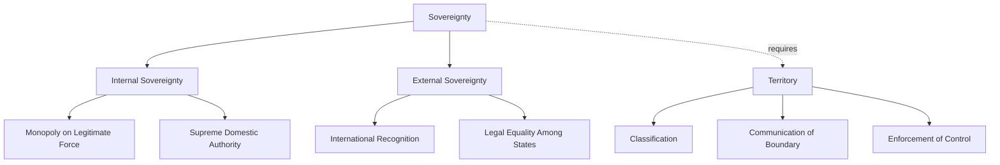

## Borders, Territory, and Sovereignty

### Definition and Scope

This topic addresses the three foundational spatial-legal concepts underpinning the modern territorial state system: **borders** (the lines delimiting sovereign space), **territory** (the bounded space itself, socially and politically constructed), and **sovereignty** (the supreme authority exercised within that space). Together they form the conceptual architecture of the Westphalian state system, which has governed international relations since 1648 and remains the dominant — though increasingly contested — organizing logic of world politics.

### Territory: Conceptual Foundations

Territory is not a natural, pre-given fact but a **socially and politically produced space**. Political geographers distinguish territory from mere "space" or "place" by its defining feature: **bounded control**. A territory exists when a bounded area is claimed and defended by an authority against rival claims.

**Robert Sack's theory of territoriality** (1986) identifies three components necessary for territorial control to function:

1. **Classification**: defining an area by its boundary rather than by the objects/people within it
2. **Communication**: signaling the boundary (through markers, maps, legal codes, signage)
3. **Enforcement**: the capacity to control access and behavior within the bounded area

Sack argued territoriality is a strategy — a means of exercising power — rather than an inherent human instinct, distinguishing this modern geographic view from earlier deterministic/biological interpretations (cf. Ratzel's organicism).

**Territoriality functions to**:

- Simplify what must be controlled (controlling access to an area rather than monitoring every individual)
- Displace attention from the relationship being controlled onto the territory itself (e.g., "trespassing" laws obscure that the underlying issue is social relations, not the land itself)
- Provide a container for the exercise and legitimation of power

### Borders and Boundaries: Typology

**Definitional distinction**: a **boundary** is the precise legal line; a **border** or **borderland** often refers more broadly to the zone around that line where its effects are felt (economically, culturally, socially).

**Classification by genesis (chronological relationship to settlement)**:

- **Antecedent boundaries**: established before an area is significantly populated (e.g., the 49th parallel boundary between the US and Canada across sparsely settled prairie regions)
- **Subsequent boundaries**: drawn after settlement, often adjusting to reflect existing ethnic, linguistic, or cultural patterns
- **Superimposed boundaries**: imposed by external/colonial powers over existing populations with disregard for pre-existing cultural or ethnic distributions (e.g., most African colonial borders drawn at the 1884–85 Berlin Conference)
- **Relict boundaries**: no longer function as active political boundaries but remain visible in the cultural or physical landscape (e.g., the former Iron Curtain route, or the East/West Berlin Wall line)

**Classification by morphology (physical form)**:

- **Geometric boundaries**: straight lines, typically following meridians/parallels of latitude-longitude (e.g., much of the western US-Canada border, many African and Middle Eastern colonial borders)
- **Physical/natural boundaries**: following landforms such as rivers (e.g., Rio Grande), mountain ranges (e.g., Andes along Chile-Argentina), or watersheds

**Functional classification**:

- **Definitional**: the legal treaty/agreement establishing the boundary's existence
- **Delimitation**: translating the legal definition onto a map
- **Demarcation**: physically marking the boundary on the ground (fences, pillars, walls)
- **Administration**: the ongoing management and maintenance of the boundary (checkpoints, customs)

### Border Disputes: Typology

Political geographers (following Alexander Murphy and others) classify interstate boundary disputes into distinct types:

1. **Positional/definitional disputes**: disagreement over the precise legal wording or location of a boundary line (e.g., ambiguous treaty language)
2. **Territorial disputes**: broader claims contesting sovereignty over an entire region, not merely a line's placement (e.g., Kashmir between India and Pakistan)
3. **Resource disputes**: conflicts over the allocation of resources that straddle or lie near a boundary (e.g., offshore oil/gas fields, shared river water rights)
4. **Functional disputes**: disagreements over the operation of a boundary rather than its location — cross-border migration policy, smuggling enforcement, or trade regulation

### Sovereignty: Core Concept

Sovereignty is the principle that a political authority holds **supreme, final, and exclusive** authority within a given territory, free from external interference. Two dimensions are typically distinguished:

- **Internal sovereignty**: supreme authority over the population and territory within the state, encompassing Max Weber's classical definition of the state as holding a "monopoly on the legitimate use of physical force" within its territory
- **External sovereignty**: recognition of the state's independence and formal equality by other states within the international system (juridical sovereignty)

**The Montevideo Convention (1933)** provides the conventional legal criteria for statehood, requiring:

1. A permanent population
2. A defined territory
3. A functioning government
4. Capacity to enter into relations with other states

**The Peace of Westphalia (1648)**, ending the Thirty Years' War, is conventionally treated as the founding moment of the modern sovereign state system, establishing the norms of:

- Territorial integrity of states
- Non-interference in the internal affairs of other sovereign states
- Legal equality between states regardless of size or power

### Contested and Complicated Sovereignty

Sovereignty in practice is rarely absolute. Political geographers identify several complicating patterns:

- **Quasi-states**: entities recognized as sovereign under international law but lacking substantial internal governing capacity (a concept developed by Robert Jackson to describe some post-colonial states)
- **De facto states**: territories exercising effective internal sovereignty but lacking widespread international recognition (e.g., Somaliland, Taiwan's contested status, Abkhazia)
- **Shared/pooled sovereignty**: states voluntarily ceding aspects of sovereignty to supranational bodies (e.g., EU member states and the European Court of Justice)
- **Stateless nations**: national groups without a corresponding sovereign state (e.g., Kurds across Turkey/Iraq/Syria/Iran)
- **Enclaves and exclaves**: an enclave is territory of one state entirely surrounded by another (e.g., Lesotho within South Africa); an exclave is a portion of a state's territory geographically separated from its main body (e.g., Kaliningrad, a Russian exclave between Poland and Lithuania)

### Comparative Table: Boundary Types

| Type | Basis of Classification | Example | Key Characteristic |
| --- | --- | --- | --- |
| Antecedent | Timing (before settlement) | US-Canada 49th parallel | Drawn on largely empty land |
| Subsequent | Timing (after settlement) | Many Western European borders | Reflects existing cultural patterns |
| Superimposed | Timing (external imposition) | Colonial African borders | Disregards ethnic/cultural distribution |
| Relict | Timing (defunct) | Former Berlin Wall route | No longer legally active |
| Geometric | Morphology | Egypt-Libya border | Straight line, arbitrary path |
| Physical/Natural | Morphology | Rio Grande (US-Mexico) | Follows landform |

### Diagram: Components of Territorial Sovereignty

### Illustration: Boundary Genesis Timeline (svg_diagram)

<svg xmlns="http://www.w3.org/2000/svg" viewBox="0 0 520 260">
<rect width="520" height="260" fill="#ffffff" />
<text x="260" y="24" text-anchor="middle" font-size="15" font-weight="bold" font-family="sans-serif">Boundary Genesis Timeline (svg_diagram)</text>
<line x1="60" y1="140" x2="460" y2="140" stroke="#333333" stroke-width="2" />
<circle cx="100" cy="140" r="8" fill="#3f7cac" />
<text x="100" y="170" text-anchor="middle" font-size="11" font-family="sans-serif">Antecedent</text>
<text x="100" y="185" text-anchor="middle" font-size="9" fill="#555555" font-family="sans-serif">before settlement</text>
<circle cx="230" cy="140" r="8" fill="#3f7cac" />
<text x="230" y="170" text-anchor="middle" font-size="11" font-family="sans-serif">Subsequent</text>
<text x="230" y="185" text-anchor="middle" font-size="9" fill="#555555" font-family="sans-serif">after settlement</text>
<circle cx="360" cy="140" r="8" fill="#3f7cac" />
<text x="360" y="170" text-anchor="middle" font-size="11" font-family="sans-serif">Superimposed</text>
<text x="360" y="185" text-anchor="middle" font-size="9" fill="#555555" font-family="sans-serif">externally imposed</text>
<circle cx="460" cy="140" r="8" fill="#999999" />
<text x="460" y="170" text-anchor="middle" font-size="11" font-family="sans-serif">Relict</text>
<text x="460" y="185" text-anchor="middle" font-size="9" fill="#555555" font-family="sans-serif">no longer active</text>
<path d="M60 140 L460 140" stroke="none" />
<text x="260" y="230" text-anchor="middle" font-size="10" fill="#444444" font-family="sans-serif">Boundaries evolve from formation to potential obsolescence over time</text>
</svg>

### Example: Applying These Concepts

The **India-Pakistan boundary in Kashmir** illustrates several concepts simultaneously. It originated as a **subsequent/superimposed hybrid** — the 1947 Partition boundary (Radcliffe Line) was drawn hastily by British authorities with limited attention to the region's complex religious and ethnic geography. The dispute itself is a **territorial dispute** (not merely positional), since both states claim sovereignty over the entire region rather than disputing a specific line segment. The **Line of Control (LoC)**, a de facto boundary established after the 1947–48 war, functions administratively as a border without being a formally demarcated international boundary — demonstrating how demarcation and legal definition can remain incomplete or contested indefinitely.

### [Inference] Contemporary Pressures on Sovereignty

Globalization, supranational integration (e.g., the EU), transnational corporations, cyberspace, and non-state actors (multinational corporations, terrorist networks, diaspora communities) are frequently argued to be eroding the classical Westphalian model of exclusive territorial sovereignty. Whether this represents a fundamental transformation of the state system or merely an adaptation within it remains an active and unresolved debate among international relations and political geography scholars, rather than a settled conclusion.

### Related Topics

- Colonial boundary-making and the Berlin Conference (1884–85)
- De facto states and contested sovereignty (Taiwan, Somaliland, Kosovo)
- The European Union as a case of pooled/shared sovereignty
- Maritime boundaries and the UN Convention on the Law of the Sea (UNCLOS)
- Irredentism and territorial revisionism
- Border walls and securitization of borders (post-9/11 trends)
- Enclaves, exclaves, and geopolitical anomalies