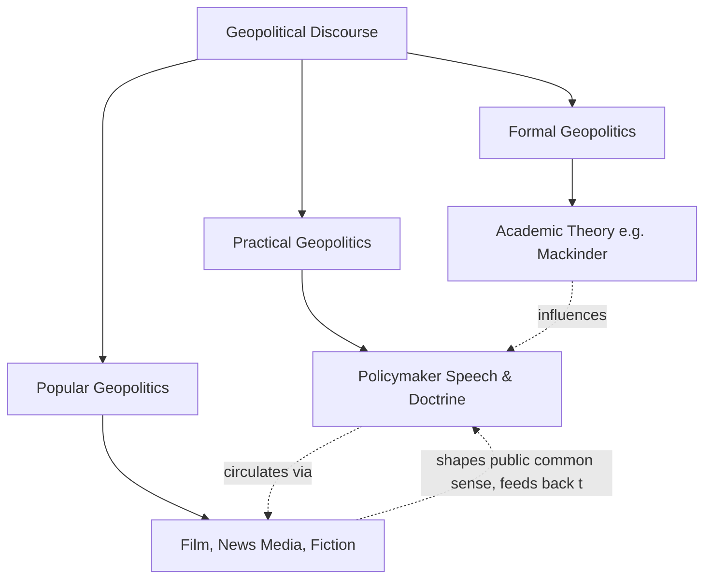

## Critical Geopolitics

### Definition and Scope

Critical geopolitics is a theoretical approach within political geography, emerging in the late 1980s–1990s, that treats geopolitical knowledge itself — rather than geography as an objective given — as the primary object of analysis. Where classical geopolitics (Mackinder, Spykman, Mahan) treated geographic facts as determining state strategy, critical geopolitics asks: **how are geopolitical "facts," maps, and spatial narratives constructed, and in whose interest?** It draws on post-structuralism, discourse analysis, and critical theory (particularly Foucault's work on power/knowledge) to "deconstruct" geopolitical reasoning as a form of political practice rather than neutral description.

### Intellectual Origins

Critical geopolitics emerged from the broader **"critical turn"** in human geography during the 1970s–80s, which challenged positivist and deterministic approaches across the discipline. Key influences include:

- **Post-structuralism**, especially **Michel Foucault's** concept of power/knowledge — the idea that knowledge production is never neutral but is entangled with the exercise of power, and that discourse actively constructs the reality it claims merely to describe
- **Edward Said's** *Orientalism* (1978), which demonstrated how Western scholarly and popular representations of the "Orient" constructed a discursive Other that legitimized colonial domination — a template critical geopolitics applied to geopolitical reasoning generally
- **Antonio Gramsci's** concept of hegemony, informing analysis of how geopolitical discourse secures popular consent for elite foreign policy agendas

The term and field were substantially established by **Gearóid Ó Tuathail (Gerard Toal)**, whose book *Critical Geopolitics: The Politics of Writing Global Space* (1996) is considered the field's foundational text, alongside contributions from **Simon Dalby**, **John Agnew**, and **Klaus Dodds**.

### Core Argument: The Critique of "Geopolitics" as Objective Science

Critical geopolitics rejects the classical premise that geography exerts a determinate, objective influence on state behavior. Instead, it argues:

1. **Geography is not "given" but "made."** What counts as strategically significant terrain, a "natural" boundary, or a civilizational "region" is the product of representational practices — maps, speeches, textbooks, media — not a pre-political fact.
2. **Geopolitical discourse serves power.** Framing a region as a "shatterbelt," an "arc of instability," or part of an "axis of evil" is not neutral description but a political act that shapes what policy responses appear natural or necessary.
3. **All geopolitical reasoning is situated.** There is no view from nowhere; analysts (including classical geopoliticians) write from particular national, institutional, and ideological positions that shape what they perceive as strategically relevant.

### Agnew's "Territorial Trap"

**John Agnew's** concept of the **territorial trap** (1994) is a central analytical tool in critical geopolitics, identifying three problematic assumptions embedded in conventional (and much of mainstream IR) thinking about states:

1. States are treated as fixed, bounded, unchanging territorial units
2. A rigid separation is assumed between the domestic (internal, orderly) sphere and the international (external, anarchic) sphere
3. The territorial state is treated as a pre-existing container of society, rather than something historically produced and contingent

Agnew argues this framing naturalizes the Westphalian state system, obscuring the historically specific and contested processes that produced it, and constraining analysis of trans-territorial phenomena (global capital flows, diaspora networks, environmental processes) that don't map neatly onto bounded state territory.

### Ó Tuathail's Three Geopolitical Discourses

Ó Tuathail and Dalby distinguish between three overlapping registers in which geopolitical knowledge is produced:

- **Formal geopolitics**: the abstract, theoretical, academic tradition (e.g., Mackinder, Spykman's writings)
- **Practical geopolitics**: the everyday reasoning of politicians, diplomats, and policymakers deploying geopolitical concepts in speeches and policy documents (e.g., a leader invoking "domino effects" or "rogue states")
- **Popular geopolitics**: the geopolitical assumptions embedded in mass culture — films, novels, news media, video games, cartoons — that shape public common sense about world regions and threats (e.g., Cold War spy fiction, post-9/11 action films)

This tripartite distinction allows critical geopolitics to trace how geopolitical framings circulate and reinforce one another across academic, governmental, and popular domains.

### Method: Discourse Analysis and Deconstruction

Critical geopolitics employs qualitative, interpretive methods rather than the quantitative or environmentally deterministic methods of classical geopolitics:

- **Textual/discourse analysis** of speeches, policy documents, maps, and media to identify recurring spatial metaphors and binary oppositions (e.g., civilized/barbaric, developed/backward, ally/rogue state)
- **Deconstruction** (following Jacques Derrida) of taken-for-granted geopolitical categories to expose their constructed, contingent nature
- Attention to **cartography as power**: maps are analyzed not as neutral representations but as political artifacts that naturalize particular spatial orderings (e.g., the ideological work performed by the Mercator projection in visually enlarging Europe/North America relative to the Global South)

### Feminist and Postcolonial Extensions

Critical geopolitics has been extended and complicated by adjacent critical approaches:

- **Feminist geopolitics** (e.g., Joni Seager, Jennifer Hyndman) critiques the masculinist framing of security in classical and even critical geopolitics, foregrounding embodied, everyday, and gendered experiences of geopolitical violence often excluded from state-centric analysis
- **Postcolonial geopolitics** examines how geopolitical knowledge production remains structured by colonial-era hierarchies and Eurocentric assumptions, even within academic critical theory itself
- **Anti-geopolitics** (Ó Tuathail, Routledge) studies how subaltern and grassroots movements resist and contest dominant geopolitical framings from below

### Comparative Table: Classical vs. Critical Geopolitics

| Dimension | Classical Geopolitics | Critical Geopolitics |
| --- | --- | --- |
| View of geography | Objective, determinate fact | Socially constructed discourse |
| Epistemology | Positivist/scientific | Post-structuralist/interpretive |
| Central question | What does geography dictate for strategy? | How is geopolitical knowledge produced and for whom? |
| Method | Environmental/strategic analysis | Discourse and textual analysis |
| Key figures | Mackinder, Spykman, Mahan | Ó Tuathail, Dalby, Agnew, Dodds |
| Treatment of the state | Fixed, natural container | Historically contingent, "territorial trap" |
| View of maps | Neutral representational tools | Political artifacts embedding power relations |

### Diagram: Ó Tuathail's Three Registers of Geopolitical Discourse

### Illustration: The Territorial Trap Concept (svg_diagram)

<svg xmlns="http://www.w3.org/2000/svg" viewBox="0 0 500 260">
<rect width="500" height="260" fill="#ffffff" />
<text x="250" y="24" text-anchor="middle" font-size="15" font-weight="bold" font-family="sans-serif">Agnew's Territorial Trap (svg_diagram)</text>
<rect x="60" y="60" width="380" height="160" fill="#f4f1e8" stroke="#7a6a4a" stroke-width="2" rx="6" />
<text x="250" y="90" text-anchor="middle" font-size="12" font-weight="bold" font-family="sans-serif">Three Naturalized Assumptions</text>
<text x="250" y="125" text-anchor="middle" font-size="11" font-family="sans-serif">1. States as fixed, bounded units</text>
<text x="250" y="150" text-anchor="middle" font-size="11" font-family="sans-serif">2. Domestic order vs. international anarchy</text>
<text x="250" y="175" text-anchor="middle" font-size="11" font-family="sans-serif">3. Territory as pre-existing container of society</text>
<text x="250" y="245" text-anchor="middle" font-size="10" fill="#444444" font-family="sans-serif">Critical geopolitics denaturalizes these assumptions as historically produced</text>
</svg>

### Example: Applying Critical Geopolitics

Consider the post-9/11 U.S. framing of an **"Axis of Evil"** (used by President George W. Bush in his 2002 State of the Union address, grouping Iraq, Iran, and North Korea). A critical geopolitics analysis would not ask whether these states are objectively threatening in a geographically determined sense, but instead examine:

- How this phrase functions as **practical geopolitics**, simplifying complex, distinct regional relationships into a single moralized spatial category
- How the label draws on **popular geopolitical** tropes (echoing WWII "Axis" imagery) to generate emotional resonance and public support for policy
- How the discourse constructs a binary opposition (good/evil, us/them) that forecloses alternative diplomatic framings, thereby making military or coercive responses appear as common sense rather than one policy option among many

This illustrates the field's central move: shifting analysis from "what geography dictates" to "what work geopolitical language is doing, and for whom."

### [Inference] Critiques of Critical Geopolitics Itself

Critical geopolitics has itself faced critique — notably that its heavy reliance on textual/discourse analysis of elite sources (speeches, official documents) can reproduce a state-centric, elite-focused bias despite its stated aim of denaturalizing state power, and that its abstract theoretical vocabulary can limit accessibility and real-world policy engagement compared to more empirically grounded approaches. Whether critical geopolitics has produced sufficient predictive or explanatory power relative to classical or realist approaches remains a matter of disciplinary debate rather than settled consensus.

### Related Topics

- Discourse analysis methodology in political science
- Edward Said's Orientalism and postcolonial theory
- Feminist international relations and geopolitics
- Cartography, map projections, and the politics of representation
- Securitization theory (Copenhagen School) as a related critical IR approach
- Anti-geopolitics and grassroots resistance movements
- Foucauldian power/knowledge in political analysis