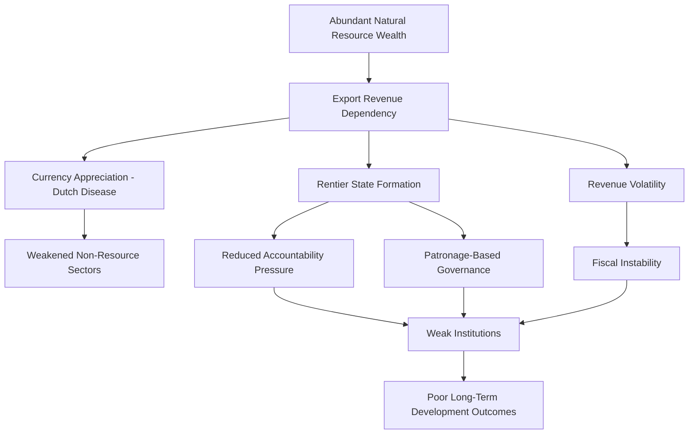

## Resource Politics

### Definition and Scope

Resource politics examines how the control, distribution, and exploitation of natural resources — energy, minerals, water, arable land, fisheries — shape political power at all scales, from local land conflicts to global geopolitical rivalry. It sits at the intersection of political geography, international political economy, and environmental politics, treating resources not as neutral economic inputs but as objects whose spatial distribution and control actively structure conflict, cooperation, state formation, and global inequality.

### Core Theoretical Frameworks

**Resource Curse (Paradox of Plenty)**

The resource curse thesis, developed by economists **Richard Auty** (who coined the term in 1993) and elaborated by **Jeffrey Sachs and Andrew Warner**, observes that countries richly endowed with natural resources — particularly oil, gas, and minerals — frequently exhibit *worse* long-term economic and political outcomes than resource-poor countries. Proposed causal mechanisms include:

- **Dutch Disease**: resource export revenues cause currency appreciation, undermining the competitiveness of other export sectors (manufacturing, agriculture)
- **Rentier state effects**: governments funded by resource revenues rather than broad-based taxation face weaker incentives for accountability and often develop patronage-based rather than representative governance (a concept closely tied to **Hazem Beblawi's** rentier state theory)
- **Volatility**: commodity price swings destabilize resource-dependent economies and government budgets
- **Conflict incentives**: resource wealth can finance armed factions and incentivize coups or civil war over control of extraction sites and revenue

**Rentier State Theory**

A **rentier state** derives a substantial portion of its national revenue from external rents (resource exports, foreign aid) rather than domestic taxation or productive economic activity. Because taxation historically drives demands for political representation ("no taxation without representation" in reverse), rentier states are theorized to face weaker pressure toward democratization, since citizens who are not taxed have less leverage to demand accountability — a pattern frequently applied to Gulf oil monarchies.

**Resource Wars Thesis**

Scholars including **Michael Klare** (*Resource Wars*, 2001) argue that as strategic resources — oil, water, minerals — grow scarcer relative to demand, interstate and intrastate conflict over their control becomes increasingly likely, positioning resource competition as a primary driver of 21st-century geopolitical conflict, distinct from ideological or purely territorial disputes.

**Greed vs. Grievance Debate**

In civil war studies, economists **Paul Collier and Anke Hoeffler** (2004) proposed that "greed" — the economic opportunity to capture resource rents — better predicts civil war onset than "grievance" (ethnic, political, or economic injustice), a controversial finding that reoriented much conflict scholarship toward examining resource-financed rebellion (e.g., "conflict diamonds" in Sierra Leone and Angola, "blood minerals" in the Democratic Republic of Congo).

### Energy Geopolitics

**Oil and Chokepoints**

Global oil trade depends on a small number of maritime **chokepoints**, whose control or disruption carries outsized strategic significance:

- **Strait of Hormuz** (between Iran and Oman/UAE): the single most important oil chokepoint globally, carrying a substantial share of seaborne oil exports
- **Strait of Malacca** (between Malaysia/Indonesia and Singapore): the primary corridor for oil shipments to East Asia
- **Suez Canal and Bab-el-Mandeb**: connecting Persian Gulf/Indian Ocean shipments to European markets

Control, monitoring, or the credible threat of blockade at these points gives outsized strategic leverage to states bordering them or navies capable of patrolling them — a direct legacy of Mahan's sea power theory applied to energy security.

**OPEC and Resource Cartels**

The **Organization of the Petroleum Exporting Countries (OPEC)**, founded in 1960, represents an attempt by resource-producing states to coordinate output and pricing to maximize collective bargaining power against resource-consuming states and international oil companies — illustrating how resource control can be organized collectively as a geopolitical instrument (most visibly during the 1973 oil embargo).

**Energy Dependency and Leverage**

Resource-importing states can face significant foreign policy constraints due to energy dependency, while resource-exporting states can wield energy exports as diplomatic leverage — a dynamic frequently cited in analyses of European dependency on Russian natural gas prior to the 2022 Russia-Ukraine war, and subsequent European efforts at energy diversification.

### Water Politics (Hydropolitics)

Water resource conflicts are distinct from other resource conflicts due to water's transboundary, flow-based nature — control upstream directly affects availability downstream, creating structurally asymmetric relationships between **upstream and downstream states**.

Key concepts:

- **Hydro-hegemony**: a framework (developed by Mark Zeitoun and Jeroen Warner) analyzing how power asymmetries between riparian states shape water-sharing outcomes, often favoring the more powerful state regardless of formal international water law
- **Transboundary river basins**: shared river systems (Nile, Mekong, Indus, Tigris-Euphrates) requiring cooperative management frameworks, frequently strained by unilateral dam-building
- Prominent case: the **Grand Ethiopian Renaissance Dam (GERD)** on the Blue Nile has generated sustained tension between Ethiopia (upstream, seeking hydropower development) and Egypt/Sudan (downstream, dependent on Nile flow for the majority of their freshwater)

### Mineral and Critical Resource Politics

**Conflict minerals**: minerals extracted in conflict zones whose trade finances armed groups, most prominently the "3TG" minerals (tin, tantalum, tungsten, gold) from the Democratic Congo region, prompting due-diligence regulation such as the U.S. Dodd-Frank Act Section 1502.

**Critical minerals and the green energy transition**: the shift toward renewable energy and electric vehicles has intensified geopolitical competition over minerals such as lithium, cobalt, nickel, and rare earth elements — inputs for batteries and clean energy technologies. This has generated new dependency concerns, particularly regarding the concentration of rare earth processing capacity, raising questions analogous to 20th-century oil dependency but centered on different minerals and supply chains.

**Arctic resource competition**: melting polar ice is opening new prospects for oil, gas, and mineral extraction alongside new shipping routes (Northern Sea Route, Northwest Passage), generating overlapping territorial claims among Arctic Council states (Russia, Canada, US, Norway, Denmark via Greenland) under UNCLOS continental shelf provisions.

### Comparative Table: Resource Conflict Types

| Resource Type | Primary Conflict Dynamic | Key Concept | Example Case |
| --- | --- | --- | --- |
| Oil/Gas | Export revenue dependency, chokepoint control | Resource curse, rentier state | Gulf monarchies, Nigeria |
| Water | Upstream/downstream asymmetry | Hydro-hegemony | Nile Basin (GERD dispute) |
| Diamonds/Gems | Financing armed conflict | Conflict/"blood" resources | Sierra Leone civil war |
| Rare Earths/Critical Minerals | Supply chain concentration | Green transition dependency | DRC cobalt, Chinese rare earth processing |
| Fisheries | Depletion, exclusive economic zones | Tragedy of the commons | South China Sea disputes |

### Diagram: Resource Curse Causal Pathway

### Illustration: Upstream-Downstream Hydropolitical Asymmetry (svg_diagram)

<svg xmlns="http://www.w3.org/2000/svg" viewBox="0 0 520 250">
<rect width="520" height="250" fill="#ffffff" />
<text x="260" y="24" text-anchor="middle" font-size="15" font-weight="bold" font-family="sans-serif">Upstream-Downstream River Dynamics (svg_diagram)</text>
<path d="M 60 60 Q 200 100 260 130 Q 340 160 460 200" stroke="#3f7cac" stroke-width="10" fill="none" />
<circle cx="90" cy="68" r="10" fill="#5a8a3f" />
<text x="90" y="100" text-anchor="middle" font-size="11" font-family="sans-serif">Upstream State</text>
<text x="90" y="115" text-anchor="middle" font-size="9" fill="#555555" font-family="sans-serif">(dam, diversion control)</text>
<circle cx="440" cy="192" r="10" fill="#ac3f3f" />
<text x="440" y="222" text-anchor="middle" font-size="11" font-family="sans-serif">Downstream State</text>
<text x="440" y="237" text-anchor="middle" font-size="9" fill="#555555" font-family="sans-serif">(flow-dependent)</text>
</svg>

### Example: Applying These Concepts

The **Grand Ethiopian Renaissance Dam** dispute illustrates hydro-hegemony theory directly. Ethiopia, as the upstream riparian, holds structural leverage over the Blue Nile's flow regardless of Egypt's historically dominant legal claims (rooted in colonial-era treaties from 1929 and 1959 that did not include Ethiopia as a signatory). Egypt, despite far greater military and diplomatic power historically, cannot fully translate that power into control over an upstream physical process, illustrating how hydro-hegemony analysis must account for both **geographic position** (upstream/downstream) and **relative power** (economic, military, diplomatic) rather than treating either factor as determinative alone.

### [Inference] Contemporary and Future Trajectories

The global transition toward renewable energy is likely to reconfigure — rather than eliminate — resource geopolitics, shifting strategic attention from oil-producing regions (Middle East, Russia) toward lithium, cobalt, and rare-earth-rich regions (parts of Latin America, Central Africa, China). Whether this transition will replicate historical patterns of resource-driven conflict and dependency, or produce meaningfully different political dynamics due to differences in resource distribution and extraction technology, remains a matter of active scholarly speculation rather than established consensus.

### Related Topics

- Dutch Disease and macroeconomic effects of resource dependency
- Conflict minerals regulation and supply chain due diligence
- Arctic geopolitics and UNCLOS continental shelf claims
- The South China Sea disputes as a fisheries/energy resource conflict
- Green transition geopolitics and critical mineral supply chains
- OPEC and cartel behavior in international political economy
- Environmental security and climate-induced resource scarcity