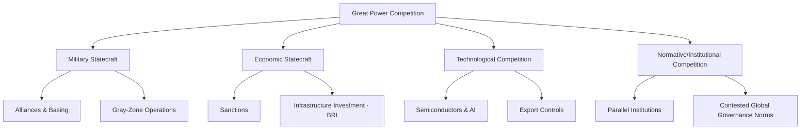

## Geopolitics of Great Power Competition

### Definition and Scope

Great power competition (GPC) refers to the sustained rivalry among the world's most powerful states for relative influence, security, resources, and normative/ideological primacy within the international system. It encompasses military balancing, economic statecraft, technological competition, alliance-building, and contests over the rules and institutions governing global order. Following a post-Cold War "unipolar moment," great power competition has re-emerged since roughly the mid-2010s as the dominant organizing framework for analyzing international relations among the United States, China, and Russia, alongside secondary poles such as the European Union and India.

### Theoretical Foundations

**Realism and the Balance of Power**

Classical and structural (neo)realist theory treats great power competition as a structural feature of an anarchic international system lacking a central authority to enforce order. **Kenneth Waltz's** structural realism (*Theory of International Politics*, 1979) argues that the distribution of capabilities among great powers — the system's **polarity** — fundamentally shapes state behavior, with states pursuing security through self-help mechanisms including alliance formation (balancing) and military buildup.

**Polarity typologies**:

- **Unipolarity**: one dominant power (arguably the US post-1991, though contested)
- **Bipolarity**: two dominant powers (US-USSR during the Cold War)
- **Multipolarity**: three or more comparable great powers (19th-century Concert of Europe; arguably the emerging contemporary order)

**John Mearsheimer's** offensive realism (*The Tragedy of Great Power Politics*, 2001) argues great powers inherently seek regional hegemony and will act to prevent rivals from achieving the same, generating persistent structural competition regardless of the specific ideologies or leaders involved — a framework frequently invoked in analyzing US-China dynamics.

**Power Transition Theory**

**A.F.K. Organski's** power transition theory (1958) and its elaboration through the **"Thucydides Trap"** concept (popularized by **Graham Allison**, drawing on Thucydides' account of the Peloponnesian War) argue that the most dangerous period in international relations occurs when a rising power approaches parity with an established hegemon, since the rising power seeks revised status/rules while the incumbent resists relative decline — a framework extensively applied to contemporary US-China relations, though its predictive validity remains debated.

**Liberal Institutionalist Counterpoint**

Liberal institutionalist scholars (e.g., **Robert Keohane**, **John Ikenberry**) argue that dense economic interdependence and international institutions can moderate great power rivalry by raising the costs of conflict and providing mechanisms for peaceful dispute resolution, offering a partial counter-framework to purely realist predictions of inevitable great-power conflict.

### Instruments of Great Power Competition

**Military Statecraft**

- **Alliance networks**: formal collective defense arrangements (NATO, US bilateral alliances with Japan/South Korea/Australia) versus looser strategic partnerships (Russia-China "no limits" partnership declared in 2022)
- **Forward basing and power projection**: military presence in strategically significant regions to deter rivals and reassure partners
- **Nuclear deterrence**: the persistence of nuclear arsenals among major powers as a structural feature constraining direct great-power military conflict (mutually assured destruction logic)
- **Gray-zone/hybrid warfare**: coercive activities below the threshold of open war — cyber operations, disinformation campaigns, proxy conflicts, maritime gray-zone activities (e.g., China's use of maritime militia in the South China Sea)

**Economic Statecraft**

- **Sanctions regimes**: economic coercion short of military force, prominently used against Russia following the 2022 invasion of Ukraine and against Iran/North Korea over proliferation concerns
- **Trade and technology restrictions**: export controls on strategically sensitive technology (e.g., US semiconductor export restrictions targeting China's advanced chip manufacturing capacity)
- **Infrastructure investment as geopolitical instrument**: China's **Belt and Road Initiative (BRI)**, launched in 2013, exemplifies the use of large-scale infrastructure financing to expand economic influence and strategic access across Eurasia, Africa, and Latin America
- **Currency and financial system competition**: efforts to reduce dependency on the US dollar-denominated international financial system (de-dollarization initiatives) as a means of insulating against sanctions leverage

**Technological Competition**

Advanced technology — semiconductors, artificial intelligence, quantum computing, 5G/6G telecommunications infrastructure — has become a central arena of great power competition, reflecting the view that technological leadership underpins both military capability and long-term economic competitiveness. This has generated policies of **techno-nationalism** and selective economic **decoupling**, particularly in the US-China relationship.

**Normative and Institutional Competition**

Great powers compete not only materially but over the rules and norms of the international order itself — contesting the legitimacy of existing multilateral institutions (UN Security Council structure, Bretton Woods institutions), and in some cases establishing parallel institutions (e.g., China-led Asian Infrastructure Investment Bank, BRICS New Development Bank) as alternatives to Western-dominated structures.

### Key Contemporary Arenas

**Indo-Pacific**

Widely regarded as the primary theater of contemporary great power competition, encompassing:

- Taiwan Strait tensions and the status of Taiwan
- South China Sea territorial and maritime disputes (competing claims among China, Vietnam, Philippines, Malaysia, Brunei)
- The **Quad** (US, Japan, India, Australia) and **AUKUS** (Australia, UK, US) as emerging minilateral security arrangements

**Eastern Europe**

Russia's 2022 invasion of Ukraine reactivated great power competition dynamics reminiscent of Cold War-era East-West confrontation, prompting substantial NATO expansion discourse (Finland's and Sweden's accession) and renewed emphasis on conventional deterrence in Europe.

**Arctic**

Melting ice is opening new resource extraction and shipping route possibilities, generating overlapping strategic interests among Arctic and near-Arctic states (Russia, US, Canada, Nordic states, and China's self-designated "near-Arctic state" status).

**Global South Alignment**

Great powers increasingly compete for influence among non-aligned and developing states through infrastructure financing, vaccine/health diplomacy, and diplomatic coalition-building (e.g., competing narratives at the UN and within groupings like the G77, BRICS+ expansion).

### Comparative Table: Great Power Competition Theoretical Lenses

| Theory | Core Claim | Key Proponent | Predicted Outcome |
| --- | --- | --- | --- |
| Structural Realism | Anarchy + polarity drive state behavior | Waltz | Persistent balancing among great powers |
| Offensive Realism | Great powers seek regional hegemony | Mearsheimer | Structural conflict is likely, near-inevitable |
| Power Transition Theory | Danger peaks as rising power nears parity | Organski / Allison | High risk of conflict during transition |
| Liberal Institutionalism | Interdependence/institutions moderate rivalry | Keohane, Ikenberry | Cooperation possible despite competition |

### Diagram: Domains of Great Power Competition

### Illustration: Power Transition Danger Zone (svg_diagram)

<svg xmlns="http://www.w3.org/2000/svg" viewBox="0 0 520 260">
<rect width="520" height="260" fill="#ffffff" />
<text x="260" y="24" text-anchor="middle" font-size="15" font-weight="bold" font-family="sans-serif">Power Transition Theory (svg_diagram)</text>
<line x1="60" y1="220" x2="460" y2="220" stroke="#333333" stroke-width="2" />
<line x1="60" y1="220" x2="60" y2="50" stroke="#333333" stroke-width="2" />
<path d="M 60 200 Q 250 190 460 100" stroke="#ac3f3f" stroke-width="3" fill="none" />
<path d="M 60 210 Q 250 140 460 70" stroke="#3f7cac" stroke-width="3" fill="none" />
<text x="470" y="103" font-size="10" fill="#ac3f3f" font-family="sans-serif">Incumbent</text>
<text x="470" y="73" font-size="10" fill="#3f7cac" font-family="sans-serif">Rising Power</text>
<ellipse cx="330" cy="150" rx="45" ry="35" fill="#e8c9a0" opacity="0.6" />
<text x="330" y="153" text-anchor="middle" font-size="10" font-family="sans-serif">Danger Zone</text>
<text x="260" y="245" text-anchor="middle" font-size="10" fill="#444444" font-family="sans-serif">Risk peaks as capability curves approach parity</text>
</svg>

### Example: Applying These Concepts

US semiconductor export controls targeting China (substantially expanded from 2022 onward) illustrate the convergence of multiple GPC instruments simultaneously. They function as **technological competition** (restricting Chinese access to advanced chip design/manufacturing capability with military and AI applications), **economic statecraft** (leveraging control over globally concentrated chip supply chains, particularly Taiwan-based manufacturing), and **normative competition** (framed by US officials in terms of protecting a "rules-based international order" against a strategic competitor). This single policy area demonstrates how contemporary great power competition operates simultaneously across the military, economic, and technological domains identified above, rather than through any single traditional instrument alone.

### [Inference] Assessing the Trajectory

Whether the current period constitutes an emerging bipolar (US-China) or multipolar (including the EU, India, and middle powers) order remains contested among international relations scholars, as does the question of whether structural realist predictions of near-inevitable great-power conflict will materialize or be moderated by economic interdependence, nuclear deterrence, and institutional constraints. These represent genuinely open empirical and theoretical questions rather than settled scholarly conclusions.

### Related Topics

- Thucydides Trap case studies (16 historical power transitions per Allison's study)
- The Belt and Road Initiative: architecture and criticisms
- Alliance theory and burden-sharing in collective defense
- Nuclear deterrence theory and strategic stability
- Middle power diplomacy and non-alignment strategies
- Techno-nationalism and semiconductor supply chain geopolitics
- BRICS+ expansion and parallel multilateral institutions