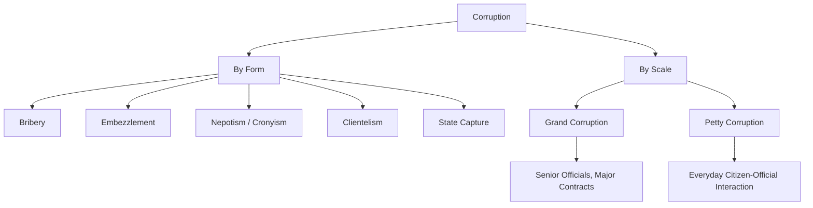

## Defining and Measuring Corruption

### Definition and Scope

Corruption, in political science, refers to the abuse of entrusted public power for private gain. This topic addresses two interrelated challenges: **conceptually defining** corruption in a way that is analytically useful across diverse political and cultural contexts, and **empirically measuring** it despite corruption's inherently clandestine, self-concealing nature. Both tasks are contested — definitional choices shape what gets measured, and measurement limitations in turn constrain what can be theorized and tested about corruption's causes and effects.

### Definitional Approaches

**The Standard/World Bank Definition**

The most widely used working definition, adopted by the World Bank and Transparency International, characterizes corruption as **"the abuse of public office for private gain."** This definition's appeal lies in its parsimony and cross-national applicability, but critics note it privileges a state-centric view and may not capture corruption within private-sector or hybrid public-private contexts.

**Legalistic (Public-Office-Centered) Definitions**

Following **Joseph Nye's** influential 1967 formulation, corruption is defined as behavior that deviates from the formal duties of a public role because of private-regarding (personal, close family, private clique) pecuniary or status gains, or that violates rules against the exercise of certain types of private-regarding influence. This approach anchors corruption to violations of codified legal/administrative rules, offering measurement tractability but struggling with cases where formal law diverges sharply from informal social norms (e.g., gift-giving practices with ambiguous legal status).

**Public-Interest Definitions**

An alternative tradition (associated with **Carl Friedrich**) defines corruption relative to a substantive conception of the public interest, treating any act that subordinates public welfare to private benefit as corrupt, regardless of its formal legality. This broadens the concept beyond bribery/embezzlement to include activities such as legal-but-ethically-questionable lobbying, but sacrifices some analytical precision since "public interest" itself is contested.

**Public-Opinion Definitions**

Some scholars argue corruption should be defined by prevailing public perceptions of what constitutes improper official behavior in a given society, since these social norms — not abstract legal codes — actually shape political legitimacy and public trust. This approach highlights that "corruption" is partly culturally and historically variable, but faces the circularity problem of relying on subjective judgment to define an ostensibly objective phenomenon.

### Typology of Corrupt Practices

Political science distinguishes corruption by **form**, **scale**, and **directionality**:

**By form**:

- **Bribery**: exchange of payment for favorable official action
- **Embezzlement**: theft of public funds or resources by officials entrusted with them
- **Nepotism/Cronyism**: favoritism in appointments or contracts based on personal relationships rather than merit
- **Patronage/Clientelism**: exchange of material benefits (jobs, favors) for political loyalty or votes
- **State capture**: a more systemic form in which private (often corporate) actors shape the formation of laws, regulations, and policies to serve their own interests — distinct from simple bribery in that it targets rule-making rather than rule-implementation
- **Extortion**: officials demanding payment under threat of withholding services or inflicting harm

**By scale**:

- **Grand corruption**: high-level, large-scale abuse involving senior officials and substantial resources, often connected to state capture and major public contracts
- **Petty corruption**: everyday, small-scale bribery in interactions between citizens and lower-level officials (e.g., bribing a traffic officer or municipal clerk)

**By directionality**:

- **Systemic/institutionalized corruption**: corruption embedded as a routine, expected feature of a political-administrative system
- **Sporadic/individual corruption**: isolated deviations from otherwise non-corrupt institutional norms

### Measurement Approaches

Because corrupt transactions are inherently concealed (both parties typically have incentive to hide them), direct measurement is impossible; political scientists rely on several indirect measurement strategies, each with distinct strengths and limitations.

**Perception-Based Indices**

- **Corruption Perceptions Index (CPI)**, published annually by **Transparency International** since 1995, aggregates expert assessments and business/citizen surveys into a composite score ranking countries by *perceived* public-sector corruption
- **Worldwide Governance Indicators (WGI) – Control of Corruption**, produced by the World Bank, similarly aggregates multiple perception-based data sources into a governance indicator

*Limitations*: perception indices measure subjective beliefs about corruption's prevalence rather than corruption itself, are vulnerable to reputational bias (countries with negative international press coverage may score worse independent of actual corruption levels), and their composite/aggregated methodology from disparate sources raises comparability concerns across years and countries.

**Experience-Based Surveys**

- **Global Corruption Barometer** (Transparency International) and similar household surveys ask respondents directly whether they have paid a bribe for a public service within a specified period, providing a behavioral rather than perceptual measure

*Limitations*: subject to social desirability bias (underreporting due to legal/social stigma), recall bias, and capture only petty/transactional corruption experienced directly by ordinary citizens — missing grand corruption and state capture, which citizens rarely observe directly.

**Objective/Indirect Proxy Measures**

- **Discrepancy methods**: comparing official government spending records against measurable outcomes (e.g., discrepancies between reported infrastructure spending and actual road quality) to infer resource diversion
- **Forensic economic methods**: analyzing statistical anomalies in trade data, procurement pricing, or asset declarations to detect likely corrupt diversion (e.g., comparing import/export mirror statistics for under/over-invoicing patterns)
- **Audit-based measures**: using randomized government audits (notably Brazil's federal anti-corruption audit program studied by economists Claudio Ferraz and Frederico Finan) to generate objective corruption incidence data, though typically limited to specific programs/jurisdictions rather than cross-nationally comparable

**Experimental and Behavioral Methods**

- **List experiments** and **randomized response techniques**: survey methods designed to elicit honest answers about sensitive/illegal behavior (including bribery) by preserving respondent anonymity through statistical inference rather than direct disclosure
- **Field experiments**: e.g., studies using fictitious company registrations or fake diplomatic parking violations (the well-known UN diplomatic parking-ticket study by Fisman and Miguel, which correlated diplomats' home-country corruption levels with their unpaid NYC parking violations) to generate behavioral corruption proxies

### Comparative Table: Measurement Approaches

| Method | Data Type | Captures | Key Limitation |
| --- | --- | --- | --- |
| Corruption Perceptions Index | Expert/elite perception | Perceived overall corruption | Subjective, reputational bias |
| Global Corruption Barometer | Citizen self-report | Direct bribery experience | Underreporting, petty corruption only |
| Discrepancy/forensic methods | Administrative/trade data | Inferred resource diversion | Requires reliable baseline data |
| Randomized audits | Objective program data | Actual detected diversion | Limited to audited programs/jurisdictions |
| List experiments | Anonymized survey response | Honest self-reported behavior | Statistical inference, not direct observation |

### Diagram: Corruption Typology by Form and Scale

### Illustration: Measurement Validity vs. Directness Trade-off (svg_diagram)

<svg xmlns="http://www.w3.org/2000/svg" viewBox="0 0 500 260">
<rect width="500" height="260" fill="#ffffff" />
<text x="250" y="24" text-anchor="middle" font-size="15" font-weight="bold" font-family="sans-serif">Corruption Measurement Spectrum (svg_diagram)</text>
<line x1="60" y1="180" x2="440" y2="180" stroke="#333333" stroke-width="2" />
<text x="60" y="200" font-size="10" font-family="sans-serif">Subjective</text>
<text x="380" y="200" font-size="10" font-family="sans-serif">Objective</text>
<circle cx="100" cy="180" r="8" fill="#ac3f3f" />
<text x="100" y="150" text-anchor="middle" font-size="10" font-family="sans-serif">CPI (perception)</text>
<circle cx="230" cy="180" r="8" fill="#c48a3f" />
<text x="230" y="150" text-anchor="middle" font-size="10" font-family="sans-serif">Barometer (self-report)</text>
<circle cx="360" cy="180" r="8" fill="#3f7cac" />
<text x="360" y="150" text-anchor="middle" font-size="10" font-family="sans-serif">Random Audits</text>
<text x="250" y="235" text-anchor="middle" font-size="10" fill="#444444" font-family="sans-serif">Greater objectivity often trades off against broader country/time coverage</text>
</svg>

### Example: Applying These Concepts

The **Fisman and Miguel diplomatic parking violations study** (2007) illustrates an ingenious indirect measurement strategy. Before 2002, UN diplomats in New York City were immune from parking enforcement, creating a natural experiment: diplomats could accumulate unpaid tickets without legal consequence, so the number of violations plausibly reflected internalized norms about rule-following rather than fear of punishment. The study found that diplomats from countries with **higher Corruption Perceptions Index scores** for corruption accumulated significantly more unpaid parking violations, providing convergent validity evidence for perception-based indices while also demonstrating how creative natural experiments can generate objective behavioral corruption proxies where direct measurement is impossible.

### [Inference] Ongoing Measurement Debates

Whether composite perception indices like the CPI adequately track actual changes in corruption over time — as opposed to changes in international media attention, methodology revisions, or reputational spillover from unrelated events — remains a genuinely contested methodological question among corruption researchers, rather than a settled matter. Similarly, whether "state capture" is best measured as a distinct phenomenon from traditional bribery-based corruption indices, given its focus on legal/regulatory influence rather than illegal transactions, is an active area of methodological development rather than resolved practice.

### Related Topics

- Transparency International's Corruption Perceptions Index methodology
- State capture and regulatory capture theory
- Clientelism and patronage politics
- Principal-agent theory applied to corruption
- Anti-corruption institutional design (independent commissions, ombudsmen)
- The resource curse and corruption in extractive economies
- Randomized controlled trials in governance research